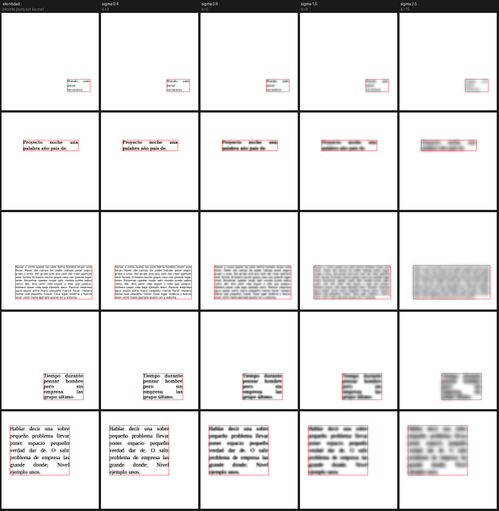

# `gauss-p` — elegir MIRANDO el sigma de la gaussiana

Una **app web** y una **figura** para ver qué le hace `gauss(k, sigma)` a las muestras del
banco de kernels **tal como las verá la red**, elegir un `sigma` con el ojo, y meter ese
kernel por la puerta del banco.



**Cada columna es un `sigma`; la caja roja es la etiqueta**, que es lo único que el banco
mide. La escala de gris es la misma en todas las columnas, así que se pueden comparar entre
sí. En `sigma` 2,5 se ve lo que importa: la tinta **se sale de la caja**.

## La sesión, de principio a fin

*Ejecutada el 2026-09-17. Las salidas están pegadas tal cual, salvo donde se marca.*

```
tú → /use gaussp
bot ← Sesión abierta con "gaussp".

tú → url
bot ← http://159.65.220.183:8030/?t=<el token de esta máquina>
```

Esa URL se abre en el móvil. Dentro se mueve `sigma`, se elige `k` y cada muestra sale dos
veces: **la identidad** (la línea base del banco) y **el filtro**.

Si no se llega, `estado` dice por qué — y pregunta al **socket** y al **cortafuegos**, no al
disco:

```
tú → estado
bot ← gauss-p · puerto 8030

      unidad     gauss-p: active
                 Result=success
                 NRestarts=0
      socket     LISTEN 0      5            0.0.0.0:8030      0.0.0.0:*
      cortafuegos abierto para el 8030
      token      sí

      ok  http://159.65.220.183:8030/?t=…

        ⚠ Lo unico que esto NO puede comprobar es la red de en medio.
```

Y el eje, que es la parte que no es obvia (**abreviado**: la salida real trae las nueve
columnas de `k`, de 3 a 19, y ocho filas de `sigma`; los números son los de verdad):

```
tú → forma
bot ← Que fraccion de la gaussiana CORTA la ventana de k x k

       sigma k=3         k=9         k=13        k=19
        1.50 5.21e-01    4.48e-03    2.06e-05    0.00e+00
        3.00 8.52e-01    2.46e-01    5.81e-02    2.93e-03
        5.00 9.44e-01    6.00e-01    3.49e-01    1.11e-01

        El `k` mas pequenyo que corta <= 1%:
         1.50          9    k/6 = 1.50
         3.00         17    k/6 = 2.83
         5.00    NINGUNO
```

Cuando ya está elegido, la app da el comando **(ejemplo, con `k`=11 y σ=1,8)**:

```sh
cd <la carpeta de banco-k>
../.venv/bin/python nn/kernels.py --gauss --k 11 --sigma 1.8 --guardar --esperado 2e31823b49ba225e
BANCOK_SECO=1 nn/lanzar.sh kernel kernels/gauss-k11-s1.8.npy
```

Y si no hay móvil a mano, la figura hace lo mismo sin puerto:

```sh
.venv/bin/python <esta carpeta>/nn/figura.py --sigmas 0.4,0.9,1.5,2.5
```

## Las cuatro cosas que hay que saber antes de elegir

**1. `k` casi no es un parámetro; el mando es `sigma`.** El banco descarta **9 px por lado
sea cual sea `k`** (§6.2), así que `k` no cambia cuánta imagen se ve: lo único que hace es
**truncar** la gaussiana. *Medido: a σ=1,0 los kernels de k=11, 15 y 19 son el mismo filtro
que el de k=9 hasta 5,6e-06.* Por eso la app enseña de `k` una sola cosa —cuánto está
cortando— y trae un botón que lo ajusta solo.

**2. El `k/6` del banco no lo eligió nadie: es la gaussiana más ancha que cabe.** *Medido:
para cada `k` del contrato, `sigma = k/6` es justo el borde por debajo del 1 % de
truncamiento.* O sea que el único punto gaussiano evaluado está pegado a un extremo del eje,
y **ensanchar más exige subir `k`**, que está topado en 19 (§5.2, congelado): σ ≈ 3,2 es el
techo real.

**3. Se ve lo que la red recibe, no una versión legible.** Kernel normalizado en L2 (§5.4),
convolución válida, recorte a 128 (§6.2) y estandarizado (§6.5). Importa porque la
gaussiana apaga el contraste **y el §6.5 lo devuelve entero**: un visor que enseñara la
imagen filtrada cruda mentiría justo en la dirección más fácil de creer.

**4. No hay ninguna puntuación en la pantalla, a propósito.** El criterio que declara es el
del banco (§2.1/§2.2), escrito desde antes. Una cifra de «calidad» aquí sería un criterio
escrito **después** de mirar. Lo que se enseña describe la **forma** del filtro; lo que hay
que juzgar está en `instrucciones/02-criterio.md`, escrito antes de abrir la app.

## ⚠ Lo que hay que saber del paso siguiente

**En este banco, hoy, no declara ningún kernel.** *Leído del disco el 2026-09-17:* de las
siete condiciones medidas con 10 semillas, la mejor es `esqk-k11` (IoU eval 0,8256) y
necesitaría **1,28×** su efecto para cruzar el margen del §2.1; el gauss vigente necesitaría
**3,47×**. No se arregla con más semillas —el margen es la desviación estándar, que converge
en vez de encoger— y está razonado en el commit `64b8fbb` de este repo.

Así que **elegir un `sigma` mejor puede no cambiar el veredicto**. La tabla y el criterio
para decidir si aun así merece la pena pagar los ~9 min de evaluación están en
`instrucciones/02-criterio.md`. Evaluarlo de todas formas es legítimo; lo que no vale es
leer un `NO DECLARA` previsto como una sorpresa.

## La reserva del §3.7 se cumple en código, no de memoria

`banco-k` reserva `LiberationMono` y el interlineado `[1.45, 1.60]` para uso exclusivo suyo,
y **elegir `sigma` mirando muestras es un procedimiento que produce kernels** — el §3.7 no
habla de cómo se elige, habla de qué datos se miran.

*Medido: de las 100 de `train`, **45 caen en la reserva y se descartan; quedan 55**, de las
que se enseñan 10.* La reserva se lee **del manifiesto del dataset**, no de una constante
tecleada aquí, y si el manifiesto no la declara el experimento **se niega** en vez de suponer
que no hay reserva.

## Lo que hace honesta la copia del pipeline

La regla del repo es que ningún experimento importa de otro: `nn/banco.py` es una **copia**
del §6 de `banco-k`. El riesgo es evidente —si la copia se desvía, se elige mirando una cosa
y se mide otra, en silencio— y por eso no se deja sola:

- **`nn/probar.py` importa el original y exige el mismo array bit a bit.** *Medido: idénticos
  en los 9 `k` del contrato y en 54 pares (k, sigma), diferencia máxima 0.*
- **La huella de `gauss(9, 1.5)` es `c5daea4e1e3c0099`, que es la del kernel que el banco
  YA evaluó** (`resultados/gauss-s3/config.json`). No es un acuerdo teórico: es el mismo
  fichero que produjo los números de la tabla de arriba.
- **Y el apretón de manos va en la puerta:** `kernels.py --gauss --esperado <huella>` **se
  niega** si el kernel que el banco genera no es el que la app enseñó.

## Si la máquina se rehace

⚠ **Este server es efímero y `experimentos-cnn` NO está entre los repos que clona un dev
nuevo** (`types/dev.json` del lanzador, *comprobado el 2026-09-17*). O sea que al rehacer la
máquina esto no existe, y una unidad de systemd hecha a mano no se reconstruye sola. Se repone
con tres comandos, y el tercero deja la app corriendo, habilitada al arranque y con el puerto
abierto en `ufw`:

```sh
git clone https://github.com/stalinbeltran/experimentos-cnn ~/src/experimentos-cnn
cd ~/src/experimentos-cnn && uv venv .venv && uv pip install --python .venv/bin/python numpy pillow
.venv/bin/python <esta carpeta>/nn/app.py instalar
```

## Comprobarlo

```sh
.venv/bin/python <esta carpeta>/nn/probar.py     # 59 comprobaciones
python3 comprobar.py                             # que el repo siga coherente
```

Las 59 cubren: el acuerdo con el banco, la reserva del §3.7 (incluido que se niegue si no la
puede leer), el apretón de manos en sus dos caminos, que la app **no sirva dato privado sin
token**, y que **sin dataset se niegue antes de abrir el puerto** (R2).

Y cuatro fallos que **existieron de verdad** el 2026-09-17 y ninguno gritaba:

- **`i=-1` devolvía 200 con OTRA muestra.** numpy indexa por el final, así que en vez de
  fallar enseñaba la última: en un visor cuyo único trabajo es enseñar lo que se pidió, eso
  es elegir un `sigma` mirando algo que no es lo que dice la cabecera. Ahora todo lo que
  entra por la URL se valida y lo malo da **400**, sin tumbar el servicio.
- **El comando que la app imprimía apuntaba a un script inexistente**, porque el manejador
  pisaba el bueno con una versión vieja.
- **El modo `forma` re-parseaba los argumentos** de la app entera y fallaba.
- **El limitador de reinicios estaba en `[Service]`**, donde systemd lo ignora.

## Qué no hace

- **No entrena, no mide y no gasta.** El paso que cuesta (~9 min de CPU, 0 $) es del banco y
  tiene su propio lanzador, con unidad de systemd, modo seco y aviso.
- **No escribe el `.npy`.** Lo escribe el banco con su propio código, porque un kernel que no
  se regenera desde código commiteado es un dato huérfano.
- **No commitea imágenes del dataset.** El dataset vive en un repo **privado** y éste es
  **público**: `nn/figura.py` escribe en `/tmp` por defecto, y dejar una figura elegida aquí
  es una decisión que hay que teclear.
