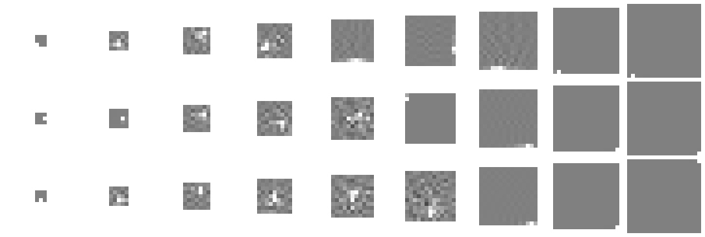

# `bor-ae` — informe (generado por `nn/informe.py`; no se transcribe nada a mano)

`λ` = 0.0 (del tanteo, `resultados/tanteo-lambda.json`). Sobre **`eval`**. Va al banco el brazo cuyo codificador **no** es una delta (`delta ≤ 0.5`).

| brazo | época | R² | delta | código activo | ¿al banco? |
|---|---:|---:|---:|---:|---|
| k03-s1 | 187 | 1.000 | 1.00 | 15.0 % | ✗ no (delta) |
| k03-s2 | 193 | 1.000 | 1.00 | 20.6 % | ✗ no (delta) |
| k03-s3 | 252 | 1.000 | 1.00 | 14.9 % | ✗ no (delta) |
| k05-s1 | 299 | 0.995 | 0.47 | 31.8 % | ✅ sí |
| k05-s2 | 236 | 1.000 | 0.98 | 32.0 % | ✗ no (delta) |
| k05-s3 | 203 | 0.990 | 0.43 | 31.5 % | ✅ sí |
| k07-s1 | 149 | 0.975 | 0.34 | 36.4 % | ✅ sí |
| k07-s2 | 300 | 0.993 | 0.43 | 36.4 % | ✅ sí |
| k07-s3 | 248 | 0.990 | 0.38 | 36.0 % | ✅ sí |
| k09-s1 | 219 | 0.992 | 0.22 | 40.4 % | ✅ sí |
| k09-s2 | 276 | 0.990 | 0.28 | 40.1 % | ✅ sí |
| k09-s3 | 297 | 0.993 | 0.20 | 39.9 % | ✅ sí |
| k11-s1 | 281 | 0.980 | 0.35 | 42.7 % | ✅ sí |
| k11-s2 | 271 | 0.983 | 0.18 | 42.9 % | ✅ sí |
| k11-s3 | 284 | 0.993 | 0.15 | 43.9 % | ✅ sí |
| k13-s1 | 300 | 0.994 | 0.63 | 44.8 % | ✗ no (delta) |
| k13-s2 | 157 | 1.000 | 0.93 | 23.4 % | ✗ no (delta) |
| k13-s3 | 296 | 0.984 | 0.14 | 46.6 % | ✅ sí |
| k15-s1 | 300 | 0.983 | 0.31 | 48.0 % | ✅ sí |
| k15-s2 | 293 | 0.993 | 0.60 | 46.0 % | ✗ no (delta) |
| k15-s3 | 293 | 0.996 | 0.68 | 47.1 % | ✗ no (delta) |
| k17-s1 | 270 | 1.000 | 0.99 | 25.7 % | ✗ no (delta) |
| k17-s2 | 156 | 1.000 | 1.00 | 23.3 % | ✗ no (delta) |
| k17-s3 | 223 | 1.000 | 1.00 | 25.1 % | ✗ no (delta) |
| k19-s1 | 272 | 1.000 | 1.00 | 24.8 % | ✗ no (delta) |
| k19-s2 | 243 | 1.000 | 1.00 | 18.5 % | ✗ no (delta) |
| k19-s3 | 253 | 1.000 | 1.00 | 24.3 % | ✗ no (delta) |

**13 de 27** brazos van al banco.

