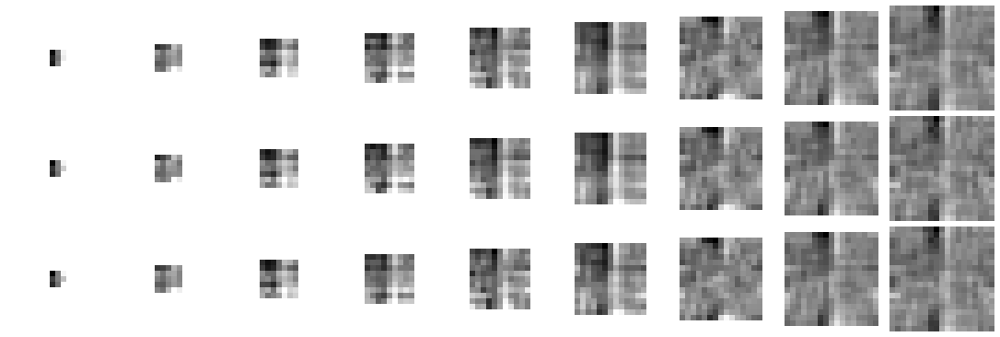

# `bor-k` — informe (generado por `nn/informe.py`; no se transcribe nada a mano)

Por borde, sobre **`eval`**, contra el **suelo trivial** (la coordenada mediana de `train`). Criterio escrito antes: `instrucciones/02-criterio.md`.

## Por `k` (3 semillas): ¿aprendió cada borde?

| `k` | izq | der | sup | inf |
|---:|---|---|---|---|
| 3 | ✅ aprendido | ✅ aprendido | ✗ no | ✗ no |
| 5 | ✅ aprendido | ✅ aprendido | ✗ no | ✅ aprendido |
| 7 | ✅ aprendido | ✅ aprendido | ✅ aprendido | ✅ aprendido |
| 9 | ✅ aprendido | ✅ aprendido | ✅ aprendido | ✅ aprendido |
| 11 | ✅ aprendido | ✅ aprendido | ✅ aprendido | ✅ aprendido |
| 13 | ✅ aprendido | ✅ aprendido | ✅ aprendido | ✅ aprendido |
| 15 | ✅ aprendido | ✅ aprendido | ✅ aprendido | ✅ aprendido |
| 17 | ✅ aprendido | ✅ aprendido | ✅ aprendido | ✅ aprendido |
| 19 | ✅ aprendido | ✅ aprendido | ✅ aprendido | ✅ aprendido |

## Por brazo: error medio en px (suelo entre paréntesis) y acierto ≤ 2 px

| brazo | época | izq | der | sup | inf |
|---|---:|---|---|---|---|
| k03-s1 | 95 | **0.77** (5.86) · 92 % | **4.16** (6.58) · 58 % | 7.93 (6.29) · 10 % | 7.35 (6.46) · 14 % |
| k03-s2 | 193 | **0.77** (5.86) · 92 % | **4.18** (6.58) · 57 % | 7.87 (6.29) · 10 % | 7.36 (6.46) · 14 % |
| k03-s3 | 260 | **0.78** (5.86) · 92 % | **4.16** (6.58) · 57 % | 7.91 (6.29) · 10 % | 7.34 (6.46) · 14 % |
| k05-s1 | 152 | **0.56** (5.86) · 99 % | **1.74** (6.58) · 90 % | 7.70 (6.29) · 31 % | **4.53** (6.46) · 56 % |
| k05-s2 | 257 | **0.58** (5.86) · 98 % | **1.59** (6.58) · 91 % | 7.86 (6.29) · 29 % | **4.65** (6.46) · 56 % |
| k05-s3 | 137 | **0.65** (5.86) · 98 % | **1.57** (6.58) · 91 % | 7.81 (6.29) · 29 % | **4.63** (6.46) · 55 % |
| k07-s1 | 77 | **0.52** (5.86) · 99 % | **1.64** (6.58) · 90 % | **5.11** (6.29) · 54 % | **3.94** (6.46) · 58 % |
| k07-s2 | 98 | **0.54** (5.86) · 99 % | **1.75** (6.58) · 90 % | **4.74** (6.29) · 58 % | **4.01** (6.46) · 57 % |
| k07-s3 | 174 | **0.52** (5.86) · 99 % | **1.76** (6.58) · 90 % | **4.84** (6.29) · 57 % | **4.05** (6.46) · 57 % |
| k09-s1 | 155 | **0.59** (5.86) · 99 % | **1.59** (6.58) · 91 % | **2.97** (6.29) · 78 % | **3.12** (6.46) · 65 % |
| k09-s2 | 162 | **0.56** (5.86) · 99 % | **1.62** (6.58) · 91 % | **3.24** (6.29) · 76 % | **3.07** (6.46) · 63 % |
| k09-s3 | 93 | **0.57** (5.86) · 99 % | **1.59** (6.58) · 91 % | **3.20** (6.29) · 75 % | **3.06** (6.46) · 66 % |
| k11-s1 | 112 | **0.65** (5.86) · 98 % | **1.61** (6.58) · 90 % | **1.46** (6.29) · 87 % | **2.88** (6.46) · 61 % |
| k11-s2 | 56 | **0.58** (5.86) · 98 % | **1.66** (6.58) · 90 % | **1.33** (6.29) · 89 % | **2.89** (6.46) · 61 % |
| k11-s3 | 175 | **0.60** (5.86) · 99 % | **1.69** (6.58) · 90 % | **1.28** (6.29) · 92 % | **2.94** (6.46) · 60 % |
| k13-s1 | 50 | **0.60** (5.86) · 98 % | **1.70** (6.58) · 89 % | **0.89** (6.29) · 93 % | **2.58** (6.46) · 64 % |
| k13-s2 | 44 | **0.62** (5.86) · 98 % | **1.68** (6.58) · 89 % | **0.90** (6.29) · 94 % | **2.59** (6.46) · 64 % |
| k13-s3 | 86 | **0.59** (5.86) · 98 % | **1.72** (6.58) · 89 % | **0.84** (6.29) · 94 % | **2.59** (6.46) · 64 % |
| k15-s1 | 154 | **0.53** (5.86) · 99 % | **1.77** (6.58) · 90 % | **0.82** (6.29) · 93 % | **2.56** (6.46) · 66 % |
| k15-s2 | 130 | **0.53** (5.86) · 99 % | **1.86** (6.58) · 89 % | **0.76** (6.29) · 95 % | **2.62** (6.46) · 66 % |
| k15-s3 | 240 | **0.63** (5.86) · 98 % | **1.62** (6.58) · 91 % | **0.92** (6.29) · 93 % | **2.54** (6.46) · 66 % |
| k17-s1 | 75 | **0.48** (5.86) · 98 % | **1.75** (6.58) · 90 % | **0.74** (6.29) · 96 % | **2.50** (6.46) · 65 % |
| k17-s2 | 114 | **0.48** (5.86) · 99 % | **1.81** (6.58) · 89 % | **0.68** (6.29) · 97 % | **2.52** (6.46) · 65 % |
| k17-s3 | 93 | **0.53** (5.86) · 98 % | **1.78** (6.58) · 90 % | **0.72** (6.29) · 96 % | **2.52** (6.46) · 66 % |
| k19-s1 | 106 | **0.52** (5.86) · 99 % | **1.94** (6.58) · 89 % | **0.67** (6.29) · 97 % | **2.48** (6.46) · 66 % |
| k19-s2 | 227 | **0.52** (5.86) · 99 % | **1.95** (6.58) · 89 % | **0.67** (6.29) · 97 % | **2.52** (6.46) · 67 % |
| k19-s3 | 153 | **0.53** (5.86) · 98 % | **1.95** (6.58) · 89 % | **0.67** (6.29) · 97 % | **2.53** (6.46) · 67 % |

En **negrita**, el borde que ese brazo aprendió (dif. pareada > 2·SE).

