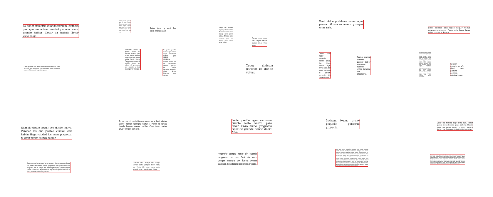

# `bor-p4` — las páginas de `bor-p` a la escala del banco

**Qué es:** el dato de entrada de `bor-k`, `bor-ae` y `bor-pca` (plan de kernels del
2026-10-01). Páginas limpias con 2–4 párrafos, rendidas a 1024 con la geometría ×4 y
guardadas reducidas /4 (256 × 256, suma del bloque 4×4: el método del banco), con la caja
de tinta de cada párrafo. Las condiciones y su porqué están en [`REGLAS.md`](REGLAS.md).

**Qué salió (2026-10-01):** publicado como `parrafos1000-pagina1024-r4-r20261001` en
`foveal-vision-data/experimentos-cnn/`, con `--comprobar` → «TODO CASA».

| | |
|---|---|
| páginas · párrafos | 331 · **1000** (108 páginas de 2, 108 de 3, 115 de 4) |
| reparto por página | train 232 (702 párrafos) · val 33 (97) · eval 66 (201) |
| separación mínima · margen mínimo | 40,05 · 52,0 px guardados (garantía: ≥ 19 · ≥ 9) |
| ventana limpia mínima | **79** px guardados |
| tinta fuera de las cajas | **0** bloques (122 sin la tolerancia de 1 bloque, por el redondeo de las cajas) |
| cuerpo por cuartos de [11, 30] | 253 · 255 · 239 · 253 (uniforme 250; χ² 0,66) |
| descartes | 40, de 742 renders; 0 páginas perdidas |
| tamaño | `paginas.npz` 2,0 MB |

⚠ **Es el SEGUNDO render.** El primero dio 977 párrafos y un 11 % menos de cuerpo grande del
que tocaba —el descarte hacía de sortear-y-rechazar— y no se publicó; su metadata quedó en el
almacén (`foveal-vision-data/temporal/dev/2026-10-01/bor-p4-primer-render/`).

Para repetirlo: el comando está en `REGLAS.md` § Scripts (va como unidad de systemd, ~24 min).
