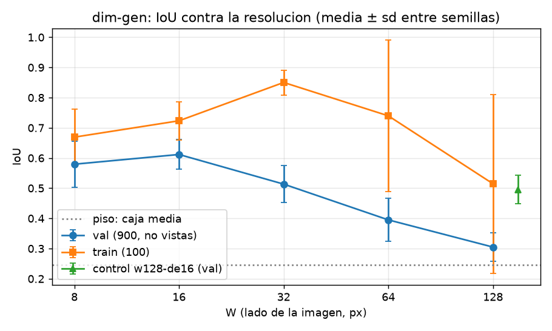
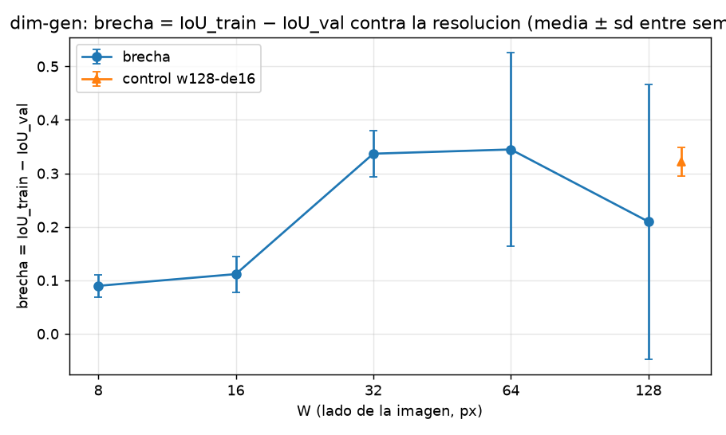

# Resultados de `dim-gen` — generado por `nn/informe.py` el 2026-10-02 06:25 UTC

**Generado del disco (`nn/pesos/*/summary.json`); no se edita a mano.** El criterio aplicado es el de `instrucciones/02-criterio.md`, escrito antes de entrenar.

Piso (caja media de train sobre las 900): **0.2464**. δ = 0.01. Umbral entre dos brazos = max(2·SE_dif, δ).

| brazo | W | n | parámetros | semillas | IoU val (media ± sd) | IoU train | brecha | ¿aprendió? | clasificación |
|---|---:|---:|---:|---:|---|---|---|---|---|
| `w128` | 128 | 32 | 205,348 | 5 (1,2,3,4,5) | 0.3049 ± 0.0474 | 0.5146 | +0.2097 ± 0.2570 | sí | mixta: cae train Y crece la brecha |
| `w064` | 64 | 16 | 51,748 | 5 (1,2,3,4,5) | 0.3950 ± 0.0715 | 0.7397 | +0.3447 ± 0.1805 | sí | (b) peor generalizacion — sin control: (b) o (c), sin cerrar |
| `w032` | 32 | 8 | 13,348 | 5 (1,2,3,4,5) | 0.5135 ± 0.0611 | 0.8503 | +0.3368 ± 0.0433 | sí | (b) peor generalizacion — sin control: (b) o (c), sin cerrar |
| `w016` | 16 | 4 | 3,748 | 5 (1,2,3,4,5) | 0.6117 ± 0.0494 | 0.7233 | +0.1116 ± 0.0335 | sí | W* |
| `w008` | 8 | 2 | 1,348 | 5 (1,2,3,4,5) | 0.5794 ± 0.0758 | 0.6691 | +0.0897 ± 0.0211 | sí | ninguna: dentro del umbral de W* |
| `w128-de16` | 128 | 32 | 205,348 | 5 (1,2,3,4,5) | 0.4955 ± 0.0469 | 0.8172 | +0.3217 ± 0.0274 | — | control |

## Las dos preguntas del encargo

- **W\*** (mayor IoU val): `w016`.
- **W mínimo suficiente**: `w008` (suficientes: w016, w008).
- **¿La resolución estorba?** **SÍ**: w128 queda por debajo de W* más del umbral.
- **¿La brecha crece con la resolución?** **SÍ** (brecha(128) − brecha(W mínimo suficiente) contra el umbral).

## El control `w128-de16` (parámetros de w128, información de w016)

- Lectura: **en medio: fraccion 0.38 del camino de w016 a w128 (se reporta, no se redondea)**.
- Brecha del control − brecha de w016: +0.2100 (umbral 0.0609): más parámetros a igual información memorizan MÁS.

## Figuras

## Por factor del generador (IoU val medio por brazo)

- `w128`: DejaVuSans 0.312 · DejaVuSerif 0.307 · LiberationMono 0.291 · LiberationSans 0.297 · LiberationSerif 0.318
- `w064`: DejaVuSans 0.400 · DejaVuSerif 0.393 · LiberationMono 0.383 · LiberationSans 0.394 · LiberationSerif 0.406
- `w032`: DejaVuSans 0.514 · DejaVuSerif 0.512 · LiberationMono 0.495 · LiberationSans 0.510 · LiberationSerif 0.537
- `w016`: DejaVuSans 0.617 · DejaVuSerif 0.612 · LiberationMono 0.577 · LiberationSans 0.623 · LiberationSerif 0.630
- `w008`: DejaVuSans 0.585 · DejaVuSerif 0.580 · LiberationMono 0.548 · LiberationSans 0.584 · LiberationSerif 0.600
- `w128-de16`: DejaVuSans 0.499 · DejaVuSerif 0.495 · LiberationMono 0.466 · LiberationSans 0.492 · LiberationSerif 0.526
