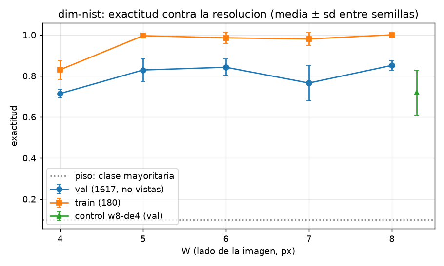
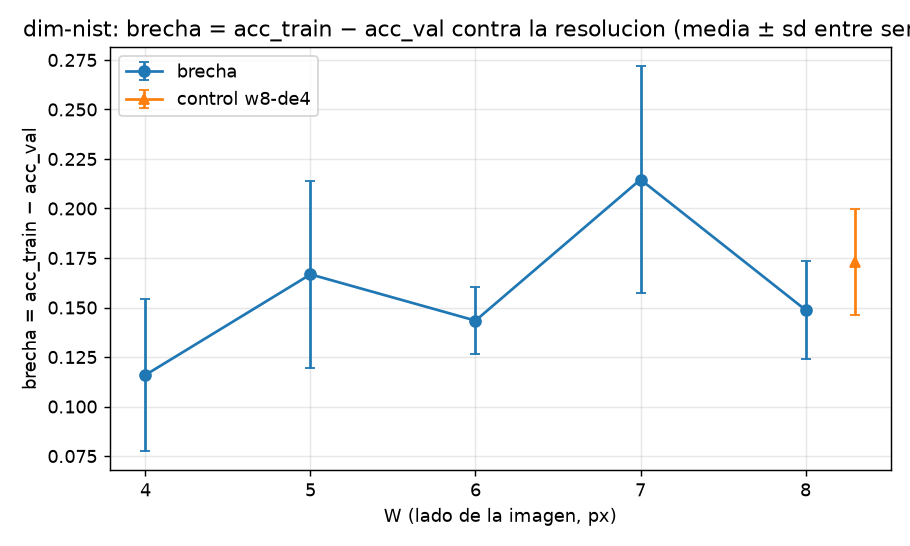

# Resultados de `dim-nist` — generado por `nn/informe.py` el 2026-10-02 16:58 UTC

**Generado del disco (`nn/pesos/*/summary.json`); no se edita a mano.** Criterio: `instrucciones/02-criterio.md`, escrito antes de entrenar.

Piso (clase mayoritaria de train sobre las 1617): **0.1000**. δ = 0.01. Umbral entre dos brazos = max(2·SE_dif, δ).

Descomposición (a)/(b) en **entropía cruzada** (la exactitud de train satura): δ_ce = 0.05 nats.

| brazo | W | n | parámetros | semillas | exactitud val (media ± sd) | exactitud train | brecha | CE train | CE val | atascadas | ¿aprendió? | clasificación |
|---|---:|---:|---:|---:|---|---|---|---|---|---|---|---|
| `w8` | 8 | 4 | 1,258 | 5 (1,2,3,4,5) | 0.8512 ± 0.0248 | 1.0000 | +0.1488 ± 0.0248 | 0.0042 | 0.9276 | — | sí | W* |
| `w7` | 7 | 4 | 1,258 | 5 (1,2,3,4,5) | 0.7654 ± 0.0866 | 0.9800 | +0.2146 ± 0.0571 | 0.0888 | 1.6143 | — | sí | (b) peor generalizacion — (b) o (c): lo separa el control, ver abajo |
| `w6` | 6 | 3 | 754 | 5 (1,2,3,4,5) | 0.8422 ± 0.0394 | 0.9856 | +0.1434 ± 0.0167 | 0.0762 | 0.7267 | — | sí | ninguna: dentro del umbral de W* |
| `w5` | 5 | 3 | 754 | 5 (1,2,3,4,5) | 0.8288 ± 0.0559 | 0.9956 | +0.1667 ± 0.0473 | 0.0265 | 1.0587 | — | sí | ninguna: dentro del umbral de W* |
| `w4` | 4 | 2 | 394 | 5 (1,2,3,4,5) | 0.7140 ± 0.0222 | 0.8300 | +0.1160 ± 0.0383 | 0.4877 | 0.9105 | — | sí | (a) menos informacion: train tambien cae, la brecha no crece |
| `w8-de4` | 8 | 4 | 1,258 | 5 (1,2,3,4,5) | 0.7182 ± 0.1103 | 0.8911 | +0.1729 ± 0.0267 | 0.2990 | 1.1155 | — | — | control |

## Las dos preguntas del encargo

- **W\*** (mayor exactitud val): `w8`.
- **W mínimo suficiente**: `w5` (suficientes: w8, w6, w5).
- **¿La resolución estorba?** no.
- **¿La brecha crece con la resolución?** no (en entropía cruzada: brecha_ce(8) − brecha_ce(W mín. suficiente) contra el umbral).

## El control `w8-de4` (parámetros de w8, información de w4)

- Lectura: **≈ w4: los parametros NO explican w8 − w4; es INFORMACION**.
- Brecha (CE) del control − brecha (CE) de w4: +0.3938 (umbral 0.2761): más parámetros a igual información memorizan MÁS.

## Figuras

## Por dígito (exactitud val media entre semillas)

- `w8`: 0 0.961 · 1 0.762 · 2 0.874 · 3 0.835 · 4 0.772 · 5 0.843 · 6 0.909 · 7 0.906 · 8 0.765 · 9 0.885
- `w7`: 0 0.875 · 1 0.645 · 2 0.820 · 3 0.735 · 4 0.772 · 5 0.779 · 6 0.886 · 7 0.811 · 8 0.633 · 9 0.696
- `w6`: 0 0.985 · 1 0.748 · 2 0.896 · 3 0.834 · 4 0.720 · 5 0.851 · 6 0.879 · 7 0.929 · 8 0.741 · 9 0.841
- `w5`: 0 0.949 · 1 0.693 · 2 0.857 · 3 0.770 · 4 0.806 · 5 0.883 · 6 0.888 · 7 0.873 · 8 0.676 · 9 0.893
- `w4`: 0 0.656 · 1 0.434 · 2 0.667 · 3 0.812 · 4 0.815 · 5 0.771 · 6 0.951 · 7 0.860 · 8 0.432 · 9 0.731
- `w8-de4`: 0 0.731 · 1 0.516 · 2 0.733 · 3 0.795 · 4 0.832 · 5 0.706 · 6 0.790 · 7 0.866 · 8 0.471 · 9 0.735
