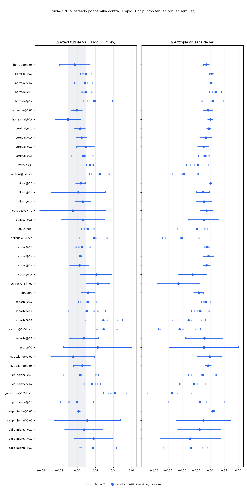
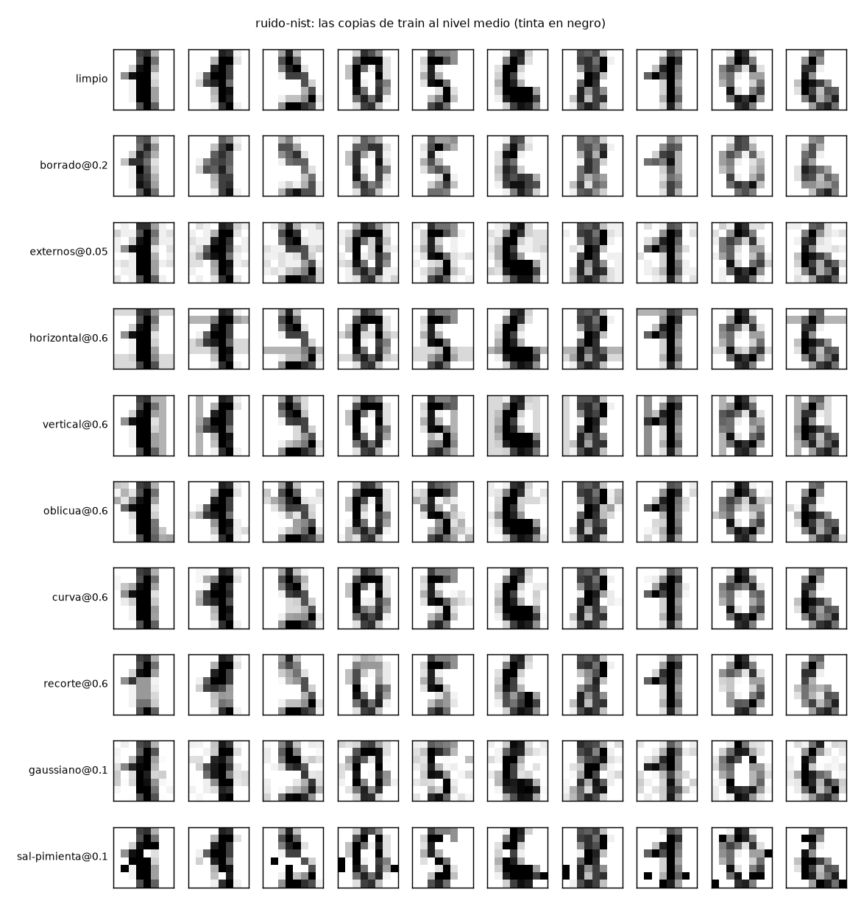

# Resultados de `ruido-nist` — generado por `nn/informe.py` el 2026-10-03 05:27 UTC

**Generado del disco (`nn/pesos/*/summary.json`); no se edita a mano.** Criterio: `instrucciones/02-criterio.md`, escrito antes de entrenar.

Δ = medida(ruido, s) − medida(`limpio`, s), **pareado por semilla** (mismos pesos iniciales, mismo orden de lotes), media de las semillas y SE = sd/√n. Umbral = max(2·SE, δ) con δ = 0.01 en exactitud; mecanismo leído en la entropía cruzada de las 180 de train limpias con δ_ce = 0.05 nats.

**Base `limpio`** (semillas [1, 2, 3]): exactitud val **0.8703 ± 0.0317**, CE val 1.0372, exactitud train (180) 1.0000, CE train 0.0006.

| escenario | tipo | nivel | n | acc val | **Δ acc val** ± SE | umbral | Δ CE val | Δ acc train | Δ CE train | veredicto | mecanismo |
|---|---|---:|---:|---|---|---|---|---|---|---|---|
| `borrado@0.05` | borrado | 0.05 | 3 | 0.8677 ± 0.0461 | **-0.0027** ± 0.0083 | 0.0166 | -0.0700 | +0.0000 | +0.0006 | **indistinguible** | train limpio sin cambio distinguible |
| `borrado@0.1` | borrado | 0.1 | 3 | 0.8798 ± 0.0267 | **+0.0095** ± 0.0030 | 0.0100 | +0.0227 | +0.0000 | -0.0001 | **indistinguible** | train limpio sin cambio distinguible |
| `borrado@0.2` | borrado | 0.2 | 3 | 0.8788 ± 0.0269 | **+0.0084** ± 0.0057 | 0.0114 | +0.0160 | +0.0000 | -0.0003 | **indistinguible** | train limpio sin cambio distinguible |
| `borrado@0.3` | borrado | 0.3 | 3 | 0.8794 ± 0.0256 | **+0.0091** ± 0.0035 | 0.0100 | +0.0941 | +0.0000 | -0.0002 | **indistinguible** | train limpio sin cambio distinguible |
| `borrado@0.4` | borrado | 0.4 | 3 | 0.8893 ± 0.0143 | **+0.0190** ± 0.0101 | 0.0202 | +0.0434 | +0.0000 | -0.0004 | **indistinguible** | train limpio sin cambio distinguible |
| `externos@0.05` | externos | 0.05 | 3 | 0.8699 ± 0.0347 | **-0.0004** ± 0.0030 | 0.0100 | -0.0380 | +0.0000 | -0.0000 | **indistinguible** | train limpio sin cambio distinguible |
| `horizontal@0.6` | horizontal | 0.6 | 3 | 0.8600 ± 0.0436 | **-0.0103** ± 0.0071 | 0.0143 | +0.0031 | +0.0000 | +0.0005 | **indistinguible** | train limpio sin cambio distinguible |
| `vertical@0.2` | vertical | 0.2 | 3 | 0.8734 ± 0.0339 | **+0.0031** ± 0.0029 | 0.0100 | -0.0234 | +0.0000 | +0.0009 | **indistinguible** | train limpio sin cambio distinguible |
| `vertical@0.4` | vertical | 0.4 | 3 | 0.8753 ± 0.0270 | **+0.0049** ± 0.0031 | 0.0100 | -0.0780 | +0.0000 | +0.0001 | **indistinguible** | train limpio sin cambio distinguible |
| `vertical@0.6` | vertical | 0.6 | 3 | 0.8798 ± 0.0301 | **+0.0095** ± 0.0051 | 0.0101 | -0.1202 | +0.0000 | +0.0001 | **indistinguible** | train limpio sin cambio distinguible |
| `vertical@0.8` | vertical | 0.8 | 3 | 0.8771 ± 0.0257 | **+0.0068** ± 0.0069 | 0.0138 | -0.0987 | -0.0037 | +0.0124 | **indistinguible** | train limpio sin cambio distinguible |
| `vertical@1-linea` | vertical | 1 | 3 | 0.8953 ± 0.0395 | **+0.0249** ± 0.0057 | 0.0115 | -0.4697 | +0.0000 | +0.0028 | **ayuda** | train limpio sin cambio distinguible |
| `vertical@1` | vertical | 1 | 3 | 0.8846 ± 0.0308 | **+0.0142** ± 0.0020 | 0.0100 | -0.2215 | +0.0000 | +0.0002 | **ayuda** | train limpio sin cambio distinguible |
| `oblicua@0.2` | oblicua | 0.2 | 3 | 0.8743 ± 0.0289 | **+0.0039** ± 0.0027 | 0.0100 | +0.0074 | +0.0000 | -0.0003 | **indistinguible** | train limpio sin cambio distinguible |
| `oblicua@0.4` | oblicua | 0.4 | 3 | 0.8714 ± 0.0579 | **+0.0010** ± 0.0151 | 0.0303 | -0.1286 | +0.0000 | +0.0045 | **indistinguible** | train limpio sin cambio distinguible |
| `oblicua@0.6` | oblicua | 0.6 | 3 | 0.8765 ± 0.0272 | **+0.0062** ± 0.0043 | 0.0100 | -0.1093 | +0.0000 | +0.0001 | **indistinguible** | train limpio sin cambio distinguible |
| `oblicua@0.6-r2` | oblicua | 0.6 | 3 | 0.8654 ± 0.0630 | **-0.0049** ± 0.0182 | 0.0365 | -0.0601 | +0.0000 | +0.0005 | **indistinguible** | train limpio sin cambio distinguible |
| `oblicua@0.8` | oblicua | 0.8 | 3 | 0.8765 ± 0.0154 | **+0.0062** ± 0.0122 | 0.0244 | -0.1166 | +0.0000 | +0.0004 | **indistinguible** | train limpio sin cambio distinguible |
| `oblicua@1-linea` | oblicua | 1 | 3 | 0.8889 ± 0.0312 | **+0.0185** ± 0.0088 | 0.0176 | -0.5087 | -0.0019 | +0.0051 | **ayuda** | train limpio sin cambio distinguible |
| `oblicua@1` | oblicua | 1 | 3 | 0.8819 ± 0.0257 | **+0.0115** ± 0.0035 | 0.0100 | -0.2429 | -0.0056 | +0.0136 | **ayuda** | train limpio sin cambio distinguible |
| `curva@0.2` | curva | 0.2 | 3 | 0.8753 ± 0.0242 | **+0.0049** ± 0.0047 | 0.0100 | -0.0642 | +0.0000 | -0.0002 | **indistinguible** | train limpio sin cambio distinguible |
| `curva@0.4` | curva | 0.4 | 3 | 0.8738 ± 0.0321 | **+0.0035** ± 0.0004 | 0.0100 | -0.0301 | +0.0000 | -0.0001 | **indistinguible** | train limpio sin cambio distinguible |
| `curva@0.6` | curva | 0.6 | 3 | 0.8730 ± 0.0408 | **+0.0027** ± 0.0054 | 0.0107 | -0.0622 | +0.0000 | +0.0000 | **indistinguible** | train limpio sin cambio distinguible |
| `curva@0.8-linea` | curva | 0.8 | 3 | 0.8932 ± 0.0324 | **+0.0229** ± 0.0066 | 0.0132 | -0.5674 | +0.0000 | +0.0081 | **ayuda** | train limpio sin cambio distinguible |
| `curva@0.8` | curva | 0.8 | 3 | 0.8912 ± 0.0183 | **+0.0208** ± 0.0086 | 0.0171 | -0.3116 | +0.0000 | -0.0000 | **ayuda** | train limpio sin cambio distinguible |
| `curva@1` | curva | 1 | 3 | 0.8823 ± 0.0379 | **+0.0120** ± 0.0039 | 0.0100 | -0.2037 | +0.0000 | +0.0016 | **ayuda** | train limpio sin cambio distinguible |
| `recorte@0.2` | recorte | 0.2 | 3 | 0.8821 ± 0.0248 | **+0.0118** ± 0.0050 | 0.0101 | -0.0776 | +0.0000 | +0.0000 | **ayuda** | train limpio sin cambio distinguible |
| `recorte@0.4` | recorte | 0.4 | 3 | 0.8809 ± 0.0490 | **+0.0105** ± 0.0103 | 0.0206 | -0.1780 | +0.0000 | +0.0037 | **indistinguible** | train limpio sin cambio distinguible |
| `recorte@0.6-linea` | recorte | 0.6 | 3 | 0.8994 ± 0.0191 | **+0.0291** ± 0.0074 | 0.0148 | -0.5469 | +0.0000 | +0.0042 | **ayuda** | train limpio sin cambio distinguible |
| `recorte@0.6` | recorte | 0.6 | 3 | 0.8992 ± 0.0250 | **+0.0289** ± 0.0106 | 0.0212 | -0.3865 | -0.0037 | +0.0103 | **ayuda** | train limpio sin cambio distinguible |
| `recorte@0.8` | recorte | 0.8 | 3 | 0.8775 ± 0.0220 | **+0.0072** ± 0.0081 | 0.0161 | -0.1030 | +0.0000 | +0.0003 | **indistinguible** | train limpio sin cambio distinguible |
| `recorte@1` | recorte | 1 | 3 | 0.8930 ± 0.0122 | **+0.0227** ± 0.0189 | 0.0379 | -0.1139 | +0.0000 | +0.0006 | **indistinguible** | train limpio sin cambio distinguible |
| `gaussiano@0.02` | gaussiano | 0.02 | 3 | 0.8656 ± 0.0521 | **-0.0047** ± 0.0119 | 0.0237 | -0.0102 | +0.0000 | +0.0002 | **indistinguible** | train limpio sin cambio distinguible |
| `gaussiano@0.05` | gaussiano | 0.05 | 3 | 0.8759 ± 0.0277 | **+0.0056** ± 0.0048 | 0.0100 | -0.0375 | +0.0000 | +0.0000 | **indistinguible** | train limpio sin cambio distinguible |
| `gaussiano@0.1` | gaussiano | 0.1 | 3 | 0.8736 ± 0.0470 | **+0.0033** ± 0.0102 | 0.0204 | -0.1359 | +0.0000 | +0.0020 | **indistinguible** | train limpio sin cambio distinguible |
| `gaussiano@0.2-linea` | gaussiano | 0.2 | 3 | 0.9122 ± 0.0207 | **+0.0418** ± 0.0064 | 0.0127 | -0.6780 | +0.0000 | +0.0110 | **ayuda** | train limpio sin cambio distinguible |
| `gaussiano@0.2` | gaussiano | 0.2 | 3 | 0.8868 ± 0.0286 | **+0.0165** ± 0.0046 | 0.0100 | -0.2870 | +0.0000 | +0.0017 | **ayuda** | train limpio sin cambio distinguible |
| `gaussiano@0.3` | gaussiano | 0.3 | 3 | 0.8701 ± 0.0395 | **-0.0002** ± 0.0091 | 0.0182 | -0.1844 | -0.0074 | +0.0261 | **indistinguible** | train limpio sin cambio distinguible |
| `sal-pimienta@0.02` | sal-pimienta | 0.02 | 3 | 0.8718 ± 0.0303 | **+0.0014** ± 0.0008 | 0.0100 | +0.0476 | +0.0000 | -0.0002 | **indistinguible** | train limpio sin cambio distinguible |
| `sal-pimienta@0.05` | sal-pimienta | 0.05 | 3 | 0.8815 ± 0.0022 | **+0.0111** ± 0.0184 | 0.0369 | -0.1183 | -0.0093 | +0.0226 | **indistinguible** | train limpio sin cambio distinguible |
| `sal-pimienta@0.1` | sal-pimienta | 0.1 | 3 | 0.8778 ± 0.0305 | **+0.0074** ± 0.0105 | 0.0210 | -0.1896 | +0.0000 | +0.0015 | **indistinguible** | train limpio sin cambio distinguible |
| `sal-pimienta@0.2` | sal-pimienta | 0.2 | 3 | 0.8885 ± 0.0134 | **+0.0181** ± 0.0105 | 0.0211 | -0.3584 | +0.0000 | +0.0032 | **indistinguible** | train limpio sin cambio distinguible |
| `sal-pimienta@0.3` | sal-pimienta | 0.3 | 3 | 0.8874 ± 0.0106 | **+0.0171** ± 0.0131 | 0.0262 | -0.3420 | +0.0000 | +0.0059 | **indistinguible** | train limpio sin cambio distinguible |

## Lo que dice el criterio

- **Ayudan** (media Δ > umbral): `curva@0.8-linea` (+0.0229), `curva@0.8` (+0.0208), `curva@1` (+0.0120), `gaussiano@0.2-linea` (+0.0418), `gaussiano@0.2` (+0.0165), `oblicua@1-linea` (+0.0185), `oblicua@1` (+0.0115), `recorte@0.2` (+0.0118), `recorte@0.6-linea` (+0.0291), `recorte@0.6` (+0.0289), `vertical@1-linea` (+0.0249), `vertical@1` (+0.0142).
- **Perjudican**: ninguno.
- **Pasan a la fase 2** (ayuda, o indistinguible con media > 0, al nivel medio): `borrado`, `vertical`, `oblicua`, `curva`, `recorte`, `gaussiano`, `sal-pimienta`.

## Fase 2: la intensidad dentro de cada tipo (Δ exactitud de val, pareado)

| tipo | niveles → Δ | mejor | forma |
|---|---|---|---|
| `borrado` | 0.05: -0.0027 · 0.1: +0.0095 · 0.2: +0.0084 · 0.3: +0.0091 · 0.4: +0.0190 | `borrado@0.4` (+0.0190, **indistinguible**) | sube con la intensidad: el mejor es el más fuerte (el eje no está acotado por arriba); amplitud 0.0216 |
| `vertical` | 0.2: +0.0031 · 0.4: +0.0049 · 0.6: +0.0095 · 0.8: +0.0068 · 1: +0.0142* | `vertical@1` (+0.0142, **ayuda**) | sube con la intensidad: el mejor es el más fuerte (el eje no está acotado por arriba); amplitud 0.0111 |
| `oblicua` | 0.2: +0.0039 · 0.4: +0.0010 · 0.6: +0.0062 · 0.8: +0.0062 · 1: +0.0115* | `oblicua@1` (+0.0115, **ayuda**) | sube con la intensidad: el mejor es el más fuerte (el eje no está acotado por arriba); amplitud 0.0105 |
| `curva` | 0.2: +0.0049 · 0.4: +0.0035 · 0.6: +0.0027 · 0.8: +0.0208* · 1: +0.0120* | `curva@0.8` (+0.0208, **ayuda**) | pico interior; amplitud 0.0181 |
| `recorte` | 0.2: +0.0118* · 0.4: +0.0105 · 0.6: +0.0289* · 0.8: +0.0072 · 1: +0.0227 | `recorte@0.6` (+0.0289, **ayuda**) | pico interior; amplitud 0.0216 |
| `gaussiano` | 0.02: -0.0047 · 0.05: +0.0056 · 0.1: +0.0033 · 0.2: +0.0165* · 0.3: -0.0002 | `gaussiano@0.2` (+0.0165, **ayuda**) | pico interior; amplitud 0.0212 |
| `sal-pimienta` | 0.02: +0.0014 · 0.05: +0.0111 · 0.1: +0.0074 · 0.2: +0.0181 · 0.3: +0.0171 | `sal-pimienta@0.2` (+0.0181, **indistinguible**) | pico interior; amplitud 0.0167 |

\* ayuda · † perjudica (por el umbral de cada escenario). «Mejor» es la mayor media; si no es «ayuda», no se distingue de `limpio`.

- **Tipos con algún nivel que ayuda**: `vertical@1` (+0.0142), `oblicua@1` (+0.0115), `curva@0.8` (+0.0208), `recorte@0.6` (+0.0289), `gaussiano@0.2` (+0.0165).

## Fase 3: ruido EN LÍNEA (una copia nueva por época) contra la copia fija, pareado

| escenario | Δ acc val vs `limpio` | veredicto vs `limpio` | **Δ acc val vs copia fija** ± SE | umbral | Δ CE val vs fija | lectura |
|---|---|---|---|---|---|---|
| `curva@0.8-linea` | +0.0229 | ayuda | **+0.0021** ± 0.0119 | 0.0238 | -0.2559 | indistinguible de la copia fija |
| `gaussiano@0.2-linea` | +0.0418 | ayuda | **+0.0254** ± 0.0056 | 0.0112 | -0.3910 | en línea MEJOR que la copia fija |
| `oblicua@1-linea` | +0.0185 | ayuda | **+0.0070** ± 0.0091 | 0.0182 | -0.2658 | indistinguible de la copia fija |
| `recorte@0.6-linea` | +0.0291 | ayuda | **+0.0002** ± 0.0072 | 0.0143 | -0.1604 | indistinguible de la copia fija |
| `vertical@1-linea` | +0.0249 | ayuda | **+0.0107** ± 0.0052 | 0.0104 | -0.2483 | en línea MEJOR que la copia fija |

- **En línea mejor que fija**: `gaussiano@0.2-linea`, `vertical@1-linea` · **peor**: ninguno.
- **La realización** (`oblicua@0.6-r2` contra `oblicua@0.6`): Δ = -0.0111 ± 0.0218 (umbral 0.0437; amplitud de las medias entre tipos 0.0392) → la realización no se distingue (|Δ| dentro del umbral): una copia fija sirve para esta fase.

## Figuras

## Por dígito (exactitud val media entre semillas; Δ respecto de limpio)

- `limpio`: 0 0.948 · 1 0.783 · 2 0.920 · 3 0.873 · 4 0.783 · 5 0.880 · 6 0.912 · 7 0.946 · 8 0.759 · 9 0.899
- `borrado@0.05`: 0 +0.017 · 1 +0.026 · 2 +0.023 · 3 -0.006 · 4 -0.057 · 5 +0.002 · 6 +0.020 · 7 -0.027 · 8 -0.006 · 9 -0.019
- `borrado@0.1`: 0 +0.006 · 1 +0.024 · 2 -0.015 · 3 -0.012 · 4 +0.004 · 5 +0.008 · 6 +0.035 · 7 -0.000 · 8 +0.013 · 9 +0.031
- `borrado@0.2`: 0 +0.029 · 1 +0.000 · 2 +0.006 · 3 -0.014 · 4 -0.014 · 5 +0.016 · 6 +0.022 · 7 -0.010 · 8 +0.038 · 9 +0.012
- `borrado@0.3`: 0 +0.029 · 1 +0.047 · 2 -0.023 · 3 -0.024 · 4 +0.006 · 5 +0.006 · 6 +0.031 · 7 +0.002 · 8 -0.024 · 9 +0.039
- `borrado@0.4`: 0 +0.046 · 1 +0.035 · 2 +0.013 · 3 -0.006 · 4 +0.027 · 5 +0.004 · 6 +0.045 · 7 +0.006 · 8 +0.024 · 9 -0.002
- `externos@0.05`: 0 +0.000 · 1 -0.006 · 2 -0.006 · 3 -0.008 · 4 -0.008 · 5 +0.016 · 6 +0.018 · 7 -0.010 · 8 -0.009 · 9 +0.008
- `horizontal@0.6`: 0 +0.029 · 1 +0.045 · 2 +0.021 · 3 -0.002 · 4 -0.055 · 5 +0.004 · 6 +0.008 · 7 -0.048 · 8 -0.062 · 9 -0.045
- `vertical@0.2`: 0 +0.008 · 1 -0.016 · 2 -0.000 · 3 +0.000 · 4 -0.000 · 5 +0.006 · 6 +0.014 · 7 -0.008 · 8 +0.017 · 9 +0.010
- `vertical@0.4`: 0 +0.013 · 1 +0.002 · 2 +0.006 · 3 -0.004 · 4 +0.002 · 5 +0.024 · 6 +0.014 · 7 +0.002 · 8 -0.021 · 9 +0.010
- `vertical@0.6`: 0 +0.006 · 1 +0.016 · 2 +0.004 · 3 -0.004 · 4 +0.029 · 5 +0.024 · 6 +0.022 · 7 -0.002 · 8 -0.002 · 9 -0.000
- `vertical@0.8`: 0 +0.004 · 1 -0.022 · 2 +0.019 · 3 -0.008 · 4 +0.008 · 5 +0.051 · 6 +0.025 · 7 -0.012 · 8 +0.028 · 9 -0.023
- `vertical@1-linea`: 0 +0.023 · 1 +0.061 · 2 -0.000 · 3 +0.010 · 4 +0.102 · 5 +0.055 · 6 +0.049 · 7 +0.010 · 8 -0.038 · 9 -0.027
- `vertical@1`: 0 +0.025 · 1 +0.000 · 2 +0.025 · 3 +0.002 · 4 +0.031 · 5 +0.053 · 6 +0.033 · 7 +0.021 · 8 -0.009 · 9 -0.039
- `oblicua@0.2`: 0 +0.029 · 1 -0.008 · 2 -0.015 · 3 +0.000 · 4 -0.020 · 5 +0.022 · 6 +0.018 · 7 +0.002 · 8 +0.002 · 9 +0.008
- `oblicua@0.4`: 0 +0.002 · 1 +0.061 · 2 +0.044 · 3 +0.006 · 4 -0.037 · 5 -0.006 · 6 +0.014 · 7 -0.029 · 8 -0.036 · 9 -0.010
- `oblicua@0.6`: 0 +0.008 · 1 +0.012 · 2 +0.006 · 3 +0.012 · 4 +0.006 · 5 +0.035 · 6 +0.012 · 7 -0.002 · 8 -0.034 · 9 +0.004
- `oblicua@0.6-r2`: 0 +0.029 · 1 +0.037 · 2 +0.029 · 3 +0.002 · 4 -0.045 · 5 -0.016 · 6 +0.014 · 7 -0.006 · 8 -0.081 · 9 -0.014
- `oblicua@0.8`: 0 +0.017 · 1 +0.006 · 2 +0.021 · 3 -0.014 · 4 +0.025 · 5 +0.039 · 6 +0.027 · 7 -0.025 · 8 -0.006 · 9 -0.027
- `oblicua@1-linea`: 0 +0.040 · 1 -0.006 · 2 +0.044 · 3 +0.028 · 4 +0.014 · 5 +0.045 · 6 +0.051 · 7 -0.012 · 8 -0.015 · 9 -0.004
- `oblicua@1`: 0 +0.027 · 1 -0.016 · 2 +0.048 · 3 +0.010 · 4 +0.045 · 5 +0.022 · 6 +0.004 · 7 +0.014 · 8 -0.047 · 9 +0.006
- `curva@0.2`: 0 +0.013 · 1 -0.008 · 2 -0.006 · 3 -0.010 · 4 +0.008 · 5 +0.010 · 6 +0.010 · 7 -0.012 · 8 +0.024 · 9 +0.023
- `curva@0.4`: 0 +0.021 · 1 -0.033 · 2 -0.002 · 3 -0.012 · 4 +0.012 · 5 +0.026 · 6 +0.020 · 7 -0.004 · 8 +0.011 · 9 -0.004
- `curva@0.6`: 0 +0.046 · 1 +0.037 · 2 +0.031 · 3 +0.000 · 4 -0.039 · 5 +0.016 · 6 +0.039 · 7 -0.012 · 8 -0.047 · 9 -0.045
- `curva@0.8-linea`: 0 +0.017 · 1 +0.012 · 2 +0.010 · 3 +0.067 · 4 +0.098 · 5 +0.045 · 6 +0.051 · 7 +0.014 · 8 -0.060 · 9 -0.031
- `curva@0.8`: 0 +0.035 · 1 +0.012 · 2 +0.019 · 3 +0.030 · 4 +0.031 · 5 +0.047 · 6 +0.039 · 7 +0.017 · 8 +0.006 · 9 -0.029
- `curva@1`: 0 +0.044 · 1 +0.008 · 2 +0.010 · 3 +0.022 · 4 -0.002 · 5 +0.028 · 6 +0.029 · 7 +0.006 · 8 -0.028 · 9 +0.000
- `recorte@0.2`: 0 +0.029 · 1 -0.002 · 2 +0.010 · 3 -0.018 · 4 -0.000 · 5 +0.008 · 6 +0.041 · 7 +0.010 · 8 +0.009 · 9 +0.031
- `recorte@0.4`: 0 +0.029 · 1 +0.012 · 2 -0.010 · 3 +0.002 · 4 -0.006 · 5 +0.006 · 6 +0.035 · 7 -0.037 · 8 +0.098 · 9 -0.021
- `recorte@0.6-linea`: 0 +0.046 · 1 +0.079 · 2 +0.010 · 3 -0.028 · 4 +0.037 · 5 -0.008 · 6 +0.041 · 7 -0.025 · 8 +0.124 · 9 +0.019
- `recorte@0.6`: 0 +0.025 · 1 +0.098 · 2 +0.017 · 3 -0.020 · 4 +0.063 · 5 -0.008 · 6 +0.055 · 7 -0.014 · 8 +0.068 · 9 +0.006
- `recorte@0.8`: 0 +0.048 · 1 +0.018 · 2 +0.015 · 3 -0.081 · 4 +0.053 · 5 -0.037 · 6 +0.059 · 7 -0.075 · 8 +0.068 · 9 +0.006
- `recorte@1`: 0 +0.048 · 1 +0.030 · 2 -0.090 · 3 -0.042 · 4 +0.100 · 5 +0.012 · 6 +0.049 · 7 -0.008 · 8 +0.100 · 9 +0.029
- `gaussiano@0.02`: 0 +0.033 · 1 +0.026 · 2 +0.004 · 3 -0.018 · 4 -0.014 · 5 -0.004 · 6 +0.022 · 7 -0.025 · 8 -0.047 · 9 -0.027
- `gaussiano@0.05`: 0 +0.019 · 1 +0.012 · 2 +0.004 · 3 +0.002 · 4 +0.006 · 5 +0.010 · 6 +0.022 · 7 -0.010 · 8 -0.019 · 9 +0.008
- `gaussiano@0.1`: 0 +0.021 · 1 +0.043 · 2 +0.010 · 3 -0.008 · 4 +0.029 · 5 +0.008 · 6 +0.020 · 7 -0.027 · 8 -0.030 · 9 -0.035
- `gaussiano@0.2-linea`: 0 +0.048 · 1 +0.144 · 2 +0.023 · 3 +0.034 · 4 +0.096 · 5 +0.012 · 6 +0.061 · 7 +0.025 · 8 +0.011 · 9 -0.039
- `gaussiano@0.2`: 0 +0.023 · 1 +0.018 · 2 +0.027 · 3 -0.014 · 4 +0.059 · 5 +0.000 · 6 +0.053 · 7 +0.000 · 8 +0.047 · 9 -0.047
- `gaussiano@0.3`: 0 +0.019 · 1 +0.079 · 2 -0.002 · 3 -0.008 · 4 -0.063 · 5 +0.000 · 6 +0.049 · 7 -0.006 · 8 -0.013 · 9 -0.058
- `sal-pimienta@0.02`: 0 +0.040 · 1 +0.010 · 2 +0.025 · 3 -0.020 · 4 -0.039 · 5 +0.028 · 6 +0.006 · 7 -0.008 · 8 -0.034 · 9 +0.006
- `sal-pimienta@0.05`: 0 +0.029 · 1 +0.087 · 2 +0.004 · 3 -0.016 · 4 -0.006 · 5 -0.065 · 6 +0.035 · 7 +0.014 · 8 +0.013 · 9 +0.016
- `sal-pimienta@0.1`: 0 +0.029 · 1 +0.022 · 2 +0.008 · 3 -0.008 · 4 +0.006 · 5 +0.053 · 6 +0.018 · 7 -0.025 · 8 -0.011 · 9 -0.021
- `sal-pimienta@0.2`: 0 +0.033 · 1 +0.010 · 2 -0.042 · 3 +0.030 · 4 +0.051 · 5 +0.004 · 6 +0.063 · 7 +0.002 · 8 +0.009 · 9 +0.019
- `sal-pimienta@0.3`: 0 +0.035 · 1 +0.059 · 2 +0.023 · 3 +0.006 · 4 +0.049 · 5 +0.004 · 6 +0.059 · 7 +0.014 · 8 -0.051 · 9 -0.031
