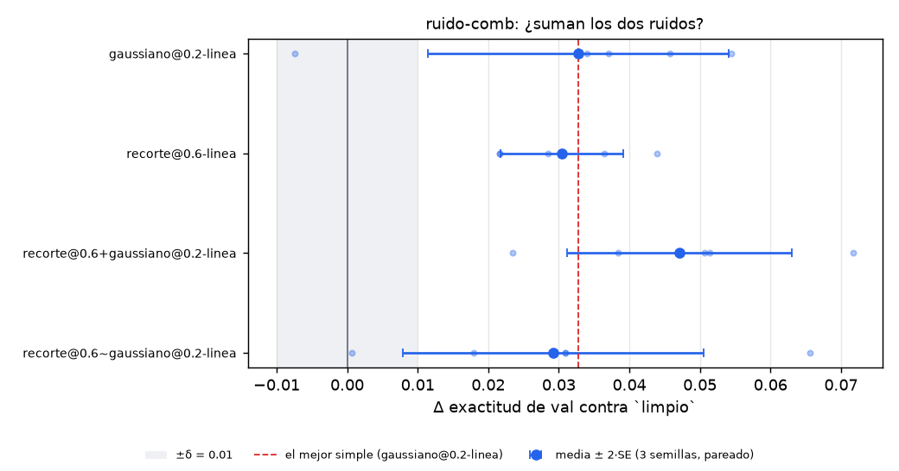
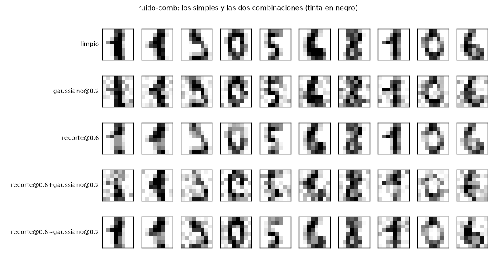

# Resultados de `ruido-comb` — generado por `nn/informe.py` el 2026-10-03 07:43 UTC

**Generado del disco; no se edita a mano.** Criterio: `instrucciones/02-criterio.md`, escrito antes. Δ pareado por semilla; umbral = max(2·SE, 0,01).

| escenario | n | acc val (media ± sd) | CE val | acc train | **Δ vs `limpio`** ± SE | umbral | veredicto | **Δ vs mejor simple** ± SE | umbral | ¿suman? |
|---|---:|---|---|---|---|---|---|---|---|---|
| `limpio` | 5 | 0.8690 ± 0.0241 | 1.0168 | 1.0000 | — | — | base | — | — | — |
| `gaussiano@0.2-linea` | 5 | 0.9018 ± 0.0343 | 0.3945 | 0.9944 | **+0.0328** ± 0.0107 | 0.0213 | ayuda | referencia | — | — |
| `recorte@0.6-linea` | 5 | 0.8994 ± 0.0148 | 0.5079 | 1.0000 | **+0.0304** ± 0.0043 | 0.0100 | ayuda | **-0.0023** ± 0.0116 | 0.0232 | indistinguible |
| `recorte@0.6+gaussiano@0.2-linea` | 5 | 0.9161 ± 0.0118 | 0.2973 | 0.9989 | **+0.0471** ± 0.0080 | 0.0159 | ayuda | **+0.0143** ± 0.0123 | 0.0246 | indistinguible |
| `recorte@0.6~gaussiano@0.2-linea` | 5 | 0.8982 ± 0.0207 | 0.4025 | 0.9989 | **+0.0292** ± 0.0107 | 0.0213 | ayuda | **-0.0036** ± 0.0106 | 0.0213 | indistinguible |

## Lo que dice el criterio

- **`recorte@0.6+gaussiano@0.2-linea`** (secuencial) contra `gaussiano@0.2-linea`: Δ = +0.0143 ± 0.0123 (umbral 0.0246; CE val -0.0972) → **indistinguible**.
- **`recorte@0.6~gaussiano@0.2-linea`** (mezcla) contra `gaussiano@0.2-linea`: Δ = -0.0036 ± 0.0106 (umbral 0.0213; CE val +0.0080) → **indistinguible**.
- **La forma más cerca de sumar**: `recorte@0.6+gaussiano@0.2-linea` (+0.0143); veredicto indistinguible.
- `recorte@0.6+gaussiano@0.2-linea` contra `recorte@0.6-linea`: Δ = +0.0167 ± 0.0053 (umbral 0.0106).
- `recorte@0.6~gaussiano@0.2-linea` contra `recorte@0.6-linea`: Δ = -0.0012 ± 0.0082 (umbral 0.0164).

## Figuras

