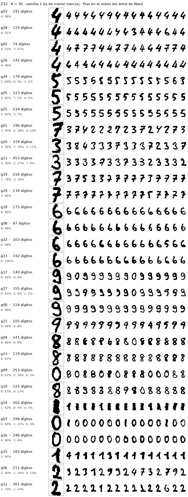
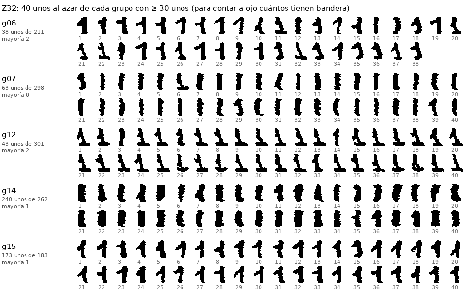
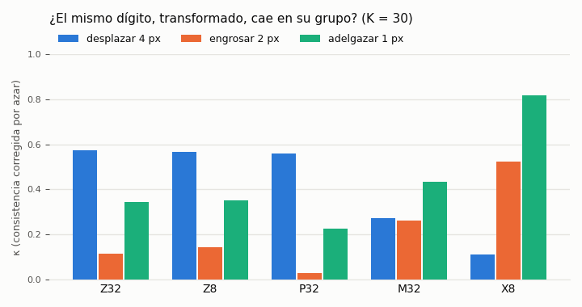

# `feat-agr` — qué salió (2026-10-05)

Los 5620 dígitos de NIST (32×32) agrupados **sin leer la etiqueta**, por **qué detector de hoy se enciende y en qué zona**
(13 features × 9 zonas), y leídos con la etiqueta **después**. Plan en `REGLAS.md`, criterio escrito antes de calcular ningún
grupo en `instrucciones/02-criterio.md`. Opciones por defecto, aprobadas por el dueño («Si»): los dos bancos de detectores
como principales (Z32: los de 32×32 de `feat-ind32`; Z8: los `fino` de 8×8 de `feat-ind`), parecido continuo (k-means), y la
lectura L6 dentro.

**0 $, todo en el dev, medido:** representar 127 s · los 190 k-means 33 s · la lectura 72 s · las figuras ~15 s. La
estimación era ≤ 15 min. `nn/datos.py --comprobar`, `nn/detectores.py --comprobar` y `nn/metricas.py --comprobar` pasan.

## Lo primero que se mira: los 30 grupos de Z32

Cada fila es un grupo, en el orden del árbol de Ward (`resultados/arbol-Z32-K30.png`): lo parecido queda junto. Lo mismo para
el banco de 8×8 y para los píxeles en `grupos-Z8-K30.png` y `grupos-X8-K30.png`, y qué enciende cada grupo en
`enciende-Z32-K30.png`.

## Tu ejemplo: el 1 recto y el 1 con un trazo inclinado arriba

**A ojo** (contado por Claude, aproximado ±3; la figura de arriba es para comprobarlo), los 1 de Z32 caen en cinco grupos:

| grupo | qué es | 1 con bandera, de 40 al azar |
|---|---|---:|
| g15 · 173 unos (95 % de 1) | **el 1 con bandera** | ~38 |
| g14 · 240 unos (92 % de 1) | barra gruesa recta | ~6, y pequeña |
| g07 · 63 unos, en un grupo de **mayoría 0** (69 %) | barra fina recta, junto a los 0 | ~2 |
| g06 · 38 unos, en un grupo de **mayoría 2** (40 %) | 1 con bandera, a menudo con pie | ~30 de 38 (a ojo: los detectores no les encienden el «/») |
| g12 · 43 unos, en un grupo de **mayoría 2** (79 %) | 1 con pie ancho (enciende «└» abajo en el 56 %) | muchos, casi todos con pie |

Lo que se enciende en g15 es literalmente la descripción del dueño: recta vertical en el centro **+ «/» arriba a la izquierda
(en el 63–69 % de sus miembros, contra ≤ 10 % en los otros grupos del 1) y «┐» arriba (62–65 %, contra ≤ 28 %)**
(`grupos-Z32-K30.json`, `enciende-Z32-K30.png`). Y en el árbol, **g15 se une antes a los 2 (g06, g12) que a los otros 1**: en esta
descripción, un 1 con bandera se parece más a un 2 que a un 1 recto.

⚠ **Pero el criterio no lo certifica, y no por los grupos: por el instrumento.** H1 pedía que un índice de píxeles, sin
detectores, separase los dos lados del corte con AUC ≥ 0,80 mejor que el grosor y la inclinación. Ese índice (`bandera`) no
mide la bandera en estos 1: en un 1 inclinado como «/», la bandera arranca a la derecha del tallo central y el índice la
subestima. g15 tiene bandera media **−2,2** con casi todos sus 1 abanderados. Se probó a posteriori un índice corregido
(contra el borde del tallo extrapolado), y **tampoco sirve**: una bandera larga baja hasta la zona del tallo y tuerce la
recta. Sus 40 «más abanderados» son sobre todo barras gruesas de g14 (`los-1.png`). La refutación de H1 dice que **el
testigo no valía**, no que el corte no exista.

Y el corte de la bandera **no es exclusivo de las features**: a ojo, los píxeles (X8 g28, g10) y el banco de 8×8 (Z8 g09)
también tienen su grupo de 1 abanderados (`los-1.png`). Lo que sí es de Z32 es juntar con los 2 a parte de los 1 con bandera o con pie (g06, g12).

## Contra el criterio (escrito antes)

| | Z32 (banco 32×32) | Z8 (banco 8×8) | control X8 (píxeles) |
|---|---|---|---|
| **C1** copias = las de hoy (firma exacta, huella de las particiones) | ✅ | ✅ | — |
| **C2** NMI(K = 30) ≥ 10 × azar (0,008) | ✅ 0,585 | ✅ 0,677 | 0,716 |
| **H0** ¿más cerca de las etiquetas que los píxeles? (NMI, K = 10 y 30) | **más lejos** (−0,13 y −0,13) | **empate** (−0,00 y −0,04) | — |
| **H1** el 1 se parte por la bandera | ❌ los cortes que persisten los explica el **grosor** (AUC 0,94 contra 0,50 de la bandera) — ver arriba: el testigo no valía | ❌ ídem (grosor) | ❌ ídem |
| **H2** ≥ 4 clases con un corte de forma (persiste con K = 20 y 50, no es grosor ni inclinación) | ✅ 7 clases | ✅ 8 | 8 (sin umbral) |
| **H3** los fallos de C se concentran en los grupos mezclados (≥ 2×, ≥ 5, más que X8) | ❌ 1,13× | ✅ **2,61×** (16 de 67) | 1,54× |
| **H4** agrupa por forma, no por grosor (κ al engrosar y adelgazar, frente a X8) | ❌ −0,41 y −0,47 | ❌ −0,38 y −0,47 | — |
| **H5** estable: semillas ≥ 0,60 · escritores nuevos ≥ 0,8× · ≥ 24 grupos | ❌ semillas 0,573 (escritores 0,91×, 30 grupos) | ❌ escritores 0,789× (semillas 0,632, 30 grupos) | 0,644 · 0,83× · 30 |
| **H6** los medoides eligen mejor qué etiquetar que los de X8 (+2) y que el azar (+3) | ❌ sólo en K = 20 | ❌ en ninguno | — |

**Lo más importante, y es lo que el criterio señaló como «lo que más probablemente salga mal»: el grosor manda sobre la
forma.** Engrosar un dígito 2 px lo saca de su grupo el 82–85 % de las veces con las features (Z8 y Z32), y el 46 % con los
píxeles. Adelgazarlo 1 px, el 63 % contra el 18 %:

| κ (consistencia corregida por azar, K = 30) | Z32 | Z8 | P32 | M32 | X8 |
|---|---:|---:|---:|---:|---:|
| desplazar 4 px | **0,574** | **0,566** | 0,559 | 0,271 | 0,113 |
| engrosar 2 px | 0,114 | 0,144 | 0,029 | 0,263 | **0,525** |
| adelgazar 1 px | 0,345 | 0,350 | 0,225 | 0,434 | **0,816** |

Las zonas hacen lo que se diseñó que hicieran: toleran el desplazamiento (0,57 contra 0,27 del mapa entero y 0,11 de los
píxeles). Pero los detectores vieron trazos de 2–4 px, y los 1 de NIST a 32×32 tienen de 8 a 13 px de tinta por fila (`grosor` de
los grupos del 1). Un cambio de grosor les cambia lo que ven. Es el 1↔8 de `feat-ind` por otra puerta: en Z32, los 1 finos caen con los 0
(g07), porque los dos encienden los arcos «(» y «)» a los lados del trazo.

## Las demás lecturas

**L1 · cuánto coinciden con las etiquetas** (partición principal; el azar de la pureza con K = 30 es 0,136):

| | pureza K = 10 | NMI K = 10 | pureza K = 30 | NMI K = 30 |
|---|---:|---:|---:|---:|
| Z32 | 0,670 | 0,623 | 0,787 | 0,585 |
| Z8 | 0,849 | 0,754 | 0,897 | 0,677 |
| P32 (presencia, sin dónde) | 0,618 | 0,485 | 0,623 | 0,418 |
| M32 (mapa entero) | 0,797 | 0,725 | 0,903 | 0,684 |
| **X8 (píxeles)** | 0,802 | **0,758** | **0,931** | **0,716** |

Sin el «dónde» (P32) se pierde un tercio de la coincidencia. Y con tantos grupos como etiquetas (K = 10), cada descripción
junta dígitos distintos a su manera: **Z32 junta el 0 con el 1** (un grupo de 46 % 0 y 44 % 1) y el 3 con el 7. Z8 también
junta 0 y 1, y 8 con 0. **Los píxeles juntan el 1 con el 9 y el 3 con el 9.**

**L3 · formas compartidas (K = 30).** Z32 tiene 7 grupos mezclados con el 33 % de los dígitos (7/2/4, 4/7, 2/1/3, 0/1, 8/0,
3/2/7, 3/7/2): demasiado anchos para señalar nada, y por eso no explican los errores de C. Z8 tiene 3, con el 9 %: 1/2/3, 7/2/3
y **8/1 (67 % y 26 %)**. Ese último es el error número uno de C (8→1), y los fallos de C caen ahí 2,6 veces más de lo
esperable. Tiene sentido: C se ajustó **desde estos mismos detectores de 8×8**. Los píxeles, uno solo (9/5/3).

**L5 · de quién son los grupos.** Ningún grupo sale de un solo bloque de `windep` (posible formulario de una persona) en
ningún brazo, así que no hay grupos de «un escritor». Los 30 grupos de los 3823 de 30 escritores aparecen todos en los 13
escritores nuevos. ARI entre brazos 0,16–0,38: cada descripción agrupa distinto.

**L6 · elegir qué etiquetar** (acierto en los 1797 de `windep` del compositor lineal sobre los mapas de 32×32, entrenado
sólo con los K etiquetados):

| K | medoides Z32 | medoides Z8 | medoides X8 | azar | azar estratificado |
|---:|---:|---:|---:|---:|---:|
| 10 | 0,735 | 0,597 | **0,740** | 0,425 | 0,628 |
| 20 | **0,854** | 0,808 | 0,831 | 0,634 | 0,751 |
| 30 | 0,876 | 0,840 | **0,913** | 0,701 | 0,829 |
| 50 | 0,892 | 0,866 | **0,897** | 0,795 | 0,866 |
| 100 | 0,893 | 0,893 | **0,923** | 0,905 | 0,902 |

Etiquetar los medoides de un agrupamiento gana mucho al azar con pocas etiquetas (+0,14 a +0,22 con K = 20–30), **con
cualquier descripción**: los píxeles eligen tan bien o mejor que las features. Con 100 etiquetas, la ventaja desaparece.

**L7 · qué manda en los grupos.** Z32: lazo 17 %, recta vertical 16 %, arco «(» 15 %, arco «)» 12 % (los 4 arcos, 38 %).
Z8: lazo 16 %, «(» 11 %, recta vertical 10 %, «┐» 10 % (arcos, 34 %). Por zonas, el centro, arriba y abajo (C, N, S). Los arcos no
pasaron de la mitad, así que la regla de Z−a (repetir sin arcos) **no se disparó**.

## Lectura

1. **Agrupar por las features sí da familias de formas legibles.** El 1 con bandera, el 1 grueso y el 1 fino quedan
   separados, parte de los 1 con bandera o con pie se va con los 2, y un grupo junta 4 y 7 casi a medias (g02: 53 % y
   47 %). Y se puede decir **por qué** un
   grupo es como es (`enciende-*.png`), cosa que los píxeles no dan.
2. **Pero esa descripción está dominada por el grosor del trazo**, no por la forma (H4), y coincide con las etiquetas
   **menos** que los píxeles (H0). Ni la estabilidad (H5) ni elegir qué etiquetar (H6) son mejores que con píxeles.
3. **Los dos bancos no son iguales.** El de 8×8 sigue mejor a las etiquetas, y sus confusiones son las de C (H3). El de
   32×32 confunde más: su arco se enciende en los 1 y los junta con los 0.
4. **El ejemplo del dueño se ve, pero no quedó medido.** El testigo escrito antes no medía la bandera, y el a posteriori
   tampoco. Lo que hay es una cuenta a ojo con su figura.

## Lo que queda pendiente

- **Un testigo de la bandera que funcione.** Opciones: que el dueño marque ~100 unos (bandera sí/no) desde el móvil, que
  es la vara de medir más fiable; o un índice sobre el **esqueleto** del dígito (¿el punto más alto es un extremo o una
  esquina?). Sin probar ninguno.
- **Quitar el grosor antes de describir**: esqueletizar los dígitos o llevarlos a un grosor fijo antes de pasarles los
  detectores, o añadir el banco `grueso` (corrida 4 de `feat-ind`). Es el ataque directo a H4.
- **Un banco aprendido de los dígitos sin etiquetas** (`cae3` de `feat-ind`) como tercera descripción independiente (lo
  propuso el revisor).
- **Usar los grupos como etiquetas nuevas** (forma → dígito, la lectura por prototipos de `feat-pos` §5).
- 5 semillas de k-means; K fijo. Sin repetir con otras inicializaciones ni otros K principales.
