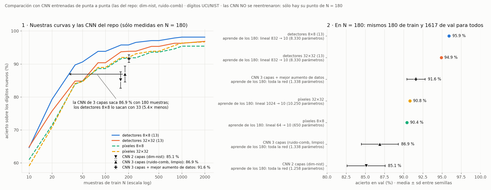
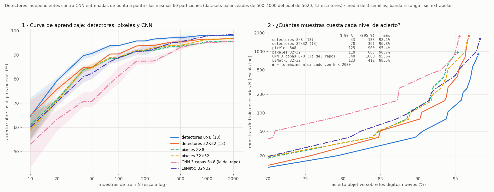
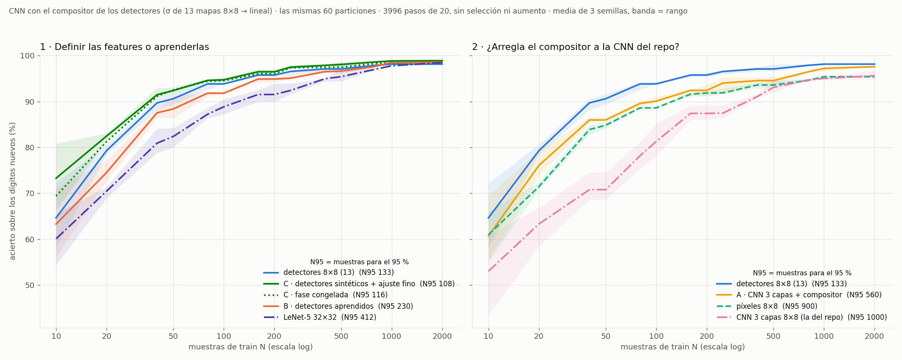
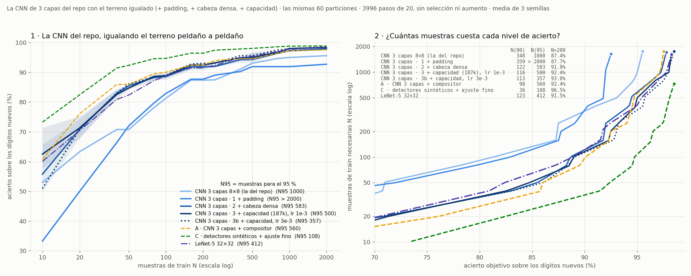
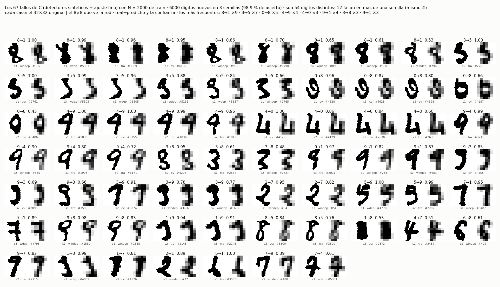

# `feat-ind32` — qué salió (2026-10-05)

`feat-ind` repetido con la entrada **sin reducir** (bitmap 32×32 de NIST) y el mapa de salida en 8×8. Mismos dígitos,
mismo reparto, mismo compositor, mismo vocabulario sintético (comprobado bit a bit: `nn/datos.py --comprobar`).
Plan en `REGLAS.md`, criterio escrito antes en `instrucciones/02-criterio.md`.

## C3 — los 13 detectores, a la vez en una máquina de Vast

Unidad `expc-fi32-detectores`, 2026-10-05 12:44 → 13:00 UTC. 1 instancia (Xeon E5-2680 v4, 28 vCPU, 31 GB, 0,066 $/h),
**15,5 min, 0,0172 $**, rc 0, destruida. ~355 s por detector, los 13 en paralelo. Libro en `resultados/vast/detectores/`.

| detector | 8×8 (feat-ind, corrida 2) | **32×32** | F1 | P | R | pos ≤ 1 |
|---|---|---|---:|---:|---:|---:|
| arco-E / W / S | no aprendió (0,70–0,74) | **a medias** | 0,862 / 0,882 / 0,890 | 0,88–0,90 | 0,83–0,89 | 0,96–0,98 |
| arco-N | a medias (0,757) | a medias | 0,897 | 0,92 | 0,87 | 0,96 |
| esquina-NE / NW / SE / SW | no aprendió (0,70–0,74) | **a medias** | 0,890 / 0,879 / 0,883 / 0,884 | 0,88–0,90 | 0,86–0,89 | 1,00 |
| recta-V / H / S / B | a medias (0,85–0,88) | **aprendió** | 0,970 / 0,965 / 0,971 / 0,967 | 0,97–0,98 | 0,96–0,97 | 0,98–1,00 |
| lazo | aprendió (0,906) | aprendió | 0,962 | 0,95 | 0,98 | 1,00 |

La **precisión** —lo que fallaba a 8×8 (0,61–0,67 en arcos y esquinas)— sube a 0,88–0,98.

## C4–C6 — sobre los dígitos (`nn/aplicar.py` + `nn/componer.py`, en el dev)

| | 8×8 (`feat-ind`, banco fino) | **32×32** |
|---|---:|---:|
| presencia, 180/1617 | 0,718 | 0,686 ± 0,005 |
| **posicional, 180/1617** | **0,959** | **0,949 ± 0,000** |
| 1↔8 / 4→1 (posicional, semilla 1) | 22 / 1–3 | **5 / 4** |
| curva N = 180 / 900 (test 717) | *fino+grueso* 0,974 / 0,992 | 0,942 / 0,975 |
| con los 3823 de otros escritores (solos / + 1080) | — | 0,964 / 0,973 |
| test · G1 · G2 · desplazado (A) | 0,964 · 0,036 · 0,844 · 0,577 | 0,942 · 0,058 · 0,814 · 0,608 |
| desplazado con B (máx 3×3) | — | **0,733** (+0,125 sobre A) |
| píxeles crudos (test 717) | 0,890 (8×8) | 0,896 (32×32) |

## Contra el criterio

- **H1 ✅** — los **7** «no aprendió» de 8×8 suben a «a medias» (el criterio decía «6 de 8»: eran 7, contados mal al
  escribirlo; el umbral se cumple igual). Las 4 rectas pasan a «aprendió». Ninguna esquina por debajo de 0,75.
- **H2 ≈ empate en el borde inferior** — 0,9491, apenas dentro de (0,949, 0,969). **Mejores detectores no dan mejor
  compositor.** Es lo que §E daba como «lo que más probablemente salga mal»: la transferencia sintético → manuscrito.
- **H4 ✅** — 1↔8 de 22 a **5**, y 4→1 en 4 (tope 5): lo que la corrida 4 arregló con un banco grueso, aquí lo da la
  resolución sin pagar el 4→1.
- **H3 ❌** — 0,975 con N = 900, lejos de 0,992 (y < 0,985). 13 detectores a 32×32 no sustituyen a los 26 de 8×8.
- **H5 ✅** — B sube el desplazado +0,125 (0,608 → 0,733).

**Lectura:** subir la resolución arregla **los detectores** (precisión de arcos y esquinas, el par 1↔8) pero **no** el
resultado neto: el compositor a 32×32 queda 0,01 por debajo del de 8×8 y la curva de datos se aplana antes. A 8×8 el
conteo 4×4 suavizaba el trazo manuscrito hasta parecerse al sintético; a 32×32 esa diferencia la ve el detector.

## La comparación justa: 13 detectores a 8×8 contra 13 a 32×32 (2026-10-05)

H3 comparaba contra el banco fino+grueso (26). El dueño pidió el 8×8 con sólo los 13 del banco fino: es la corrida 14
de `feat-ind` (`resultados/curva-fino.json` allí), mismo test de 717 y mismo compositor.

| N train | 36 | 90 | 180 | 360 | 540 | 900 | 1080 | otros escritores | 1080 + otros | desplazado con B |
|---|---:|---:|---:|---:|---:|---:|---:|---:|---:|---:|
| fino 8×8 | **0,831** | **0,943** | **0,964** | **0,972** | **0,975** | **0,983** | **0,985** | **0,975** | **0,982** | **0,774** |
| **fino 32×32** | 0,792 | 0,893 | 0,942 | 0,964 | 0,960 | 0,975 | 0,974 | 0,964 | 0,973 | 0,733 |

**Con el mismo banco, 8×8 gana en TODOS los puntos**: −0,04/−0,05 con pocos datos, −0,01 con muchos. Así que la
conclusión de arriba se refuerza: a 32×32 los detectores son mejores en lo sintético y peores como entrada del
compositor de dígitos.

## Factor de generalización F(N) (2026-10-05)

**F(N) = dígitos NO vistos bien reconocidos ÷ N dígitos de train del compositor.** «No vistos» = los 717 de test +
los 3823 de otros 30 escritores (4540; nunca entran en el train). Compositor posicional, 3 semillas.
`nn/factor.py` aquí y en `feat-ind` (8×8; los de otros escritores reducidos 4×4), `nn/figura_factor.py` la figura.

| N | 36 | 180 | 1080 |
|---|---:|---:|---:|
| detectores 8×8 (13) | **104,7** (83,0 %) | **24,1** (95,4 %) | **4,1** (97,3 %) |
| detectores 32×32 (13) | 100,2 (79,5 %) | 23,4 (92,8 %) | 4,0 (96,0 %) |
| píxeles 8×8 | 94,6 (75,0 %) | 22,9 (90,7 %) | 4,0 (94,3 %) |
| píxeles 32×32 | 93,9 (74,4 %) | 23,0 (91,3 %) | 4,0 (95,1 %) |

Con 36 dígitos de train (3,6 por clase), cada uno «sirve» para acertar ~105 nuevos con los detectores de 8×8, frente a
~94 con los píxeles. F cae casi como 1/N (el acierto satura), así que las diferencias entre representaciones se leen
en el panel derecho. ⚠ F depende del tamaño del conjunto de no vistos: compara representaciones entre sí, no es una
propiedad absoluta.

## Ganancia G = ((val − errores)/val) ÷ (train/(train + val)) (2026-10-05)

**Definición del dueño, corregida ese mismo día:** G = acierto en val ÷ p, con p = train/(train + val) la fracción del
dataset que se usa para entrenar. Una primera versión usaba «aciertos ÷ T entre N ÷ T» (= aciertos/N), que era un
error de definición; queda en `resultados/ganancia.json` como `aciertos_por_muestra`. La conclusión no cambió.

Un dataset de T dígitos (balanceado, T/10 por clase, del pool de 5620 de 43 escritores); train = N = p·T, val = el
resto. T ∈ {500, 1000, 2000, 4000} y p ∈ {2, 4, 10, 20, 50} % (p·T/10 entero en todos: el % de train es EXACTO), 3
semillas. `nn/ganancia.py` aquí y en `feat-ind` (las mismas particiones: misma huella), `nn/figura_ganancia.py`.

**Qué es G:**
- **G = 1** ⇔ el modelo acierta en lo no visto la misma fracción que la fracción que vio; **G = 47** con p = 2 % es
  «viendo el 2 % del dataset, acierta el 95 % del resto».
- **Techo 1/p** (acierto 100 %) y **azar 1/(10·p)**: G ÷ techo = acierto. Entre representaciones, G sólo varía lo
  que varía el acierto, y la curva la dibuja el 1/p.
- **No depende de un conjunto de evaluación arbitrario** (val es el resto del dataset), que era el problema de F.

**Pero no es independiente del tamaño del dataset, y por los DOS lados** (detectores 8×8, medido):

| | T = 500 | T = 2000 | T = 4000 |
|---|---:|---:|---:|
| **mismo p = 2 %** → train | 10 muestras · acierto 64,7 % · **G 32,3** | — | 80 muestras · acierto 94,8 % · **G 47,4** (1,47×) |
| **mismo train = 80 muestras** → p | — | 4 % · acierto 93,0 % · **G 23,3** | 2 % · acierto 94,8 % · **G 47,4** (2,04×) |

- **A p fijo**, G cambia con T porque el acierto depende de cuántas muestras se ven, y el 2 % de 500 no son las mismas
  que el 2 % de 4000 (panel 2: las curvas sólo se juntan desde el 10–20 %, donde todas están en el techo).
- **A train fijo**, G se dobla cuando se dobla el dataset, con casi el mismo acierto: el denominador es la fracción, y
  80 muestras son la mitad de fracción en un dataset del doble.
- **Panel 3, el control:** contra N (muestras), los cuatro tamaños casi coinciden (≤ 2 puntos a igual N, frente a 30 a
  igual %). Lo que no depende del tamaño del dataset es el acierto en función de N.
- **Panel 1:** con T = 4000 y 2 % de train, G = 47,4 (detectores 8×8) · 45,4 (32×32) · 44,5 / 44,6 (píxeles 8×8 /
  32×32), o sea los aciertos 94,8 · 90,9 · 88,9 · 89,2 % divididos por 0,02.

**Para qué sirve, entonces:** para comparar representaciones **con el mismo T y el mismo p**, diciendo siempre T. Si se
quiere un número que no dependa del tamaño del dataset, el denominador tiene que ser N (o N por clase), no p.

## Muestras necesarias N(ε) y su inversa, la curva de aprendizaje (2026-10-05)

**N(ε) = muestras de train necesarias para llegar a un acierto ε sobre los dígitos nuevos.** Es la alternativa D del
análisis de ese día, pedida por el dueño tras ver que G depende del tamaño del dataset. ε es una **tasa** (95 % = 950
aciertos de cada 1000): un recuento de aciertos dependería de cuántos dígitos se evalúan. `nn/muestras_necesarias.py`
sale de los mismos 240 entrenamientos de la ganancia (no se entrena nada): curva acierto(N) con los cuatro tamaños de
dataset juntos (N de 10 a 2000), monótona por regresión isotónica, invertida interpolando en log N. **Sin extrapolar**:
«> 2000» es que no se alcanza con lo medido. Entre paréntesis, el rango de las 3 semillas: el valor central sale de la
curva **conjunta** (las tres juntas) y el rango de la curva de **cada** semilla, así que no tiene por qué contenerlo (683
frente a 500–675).

| | N(80 %) | N(90 %) | N(95 %) | N(97 %) | N(98 %) | máximo con N ≤ 2000 |
|---|---:|---:|---:|---:|---:|---:|
| **detectores 8×8 (13)** | **21** | **43** (39–55) | **133** (126–138) | **374** | **894** | **98,1 %** |
| detectores 32×32 (13) | 28 | 78 (77–79) | 361 (361–531) | > 2000 | > 2000 | 96,9 % |
| píxeles 32×32 | 32 | 118 (111–123) | 683 (500–675) | > 2000 | > 2000 | 96,7 % |
| píxeles 8×8 | 32 | 125 (122–129) | 900 (797–929) | > 2000 | > 2000 | 95,4 % |

**Cuántas veces menos muestras que los píxeles de 32×32** (el dato crudo a su resolución nativa), para 80 / 90 / 95 %:
detectores 8×8 **1,5× / 2,7× / 5,1×** · detectores 32×32 1,2× / 1,5× / 1,9× · píxeles 8×8 1,0× / 0,95× / 0,76×. La
ventaja de los detectores 8×8 **crece con la exigencia**, y sólo ellos pasan del 97 % en la curva conjunta (una semilla
suelta de detectores 32×32 y otra de píxeles 32×32 lo rozan con N ≈ 1700–1900).

**El panel 2 es el mismo dato con los ejes intercambiados**: la curva de aprendizaje (acierto según N). N(ε) no añade
información; cambia la pregunta («¿cuántas muestras para llegar a ε?» en vez de «¿qué acierto con N?») y la dirección en
que se compara. El mismo ejemplo, leído de las dos formas:

| lectura | se compara | detectores 8×8 | píxeles 32×32 | diferencia |
|---|---|---:|---:|---:|
| horizontal (panel 1, y la flecha ↔ del 2) | muestras para el mismo 95 % | 133 | 683 | **5,1×** |
| vertical (la flecha ↕ del panel 2) | acierto con las mismas 133 muestras | 95,0 % | 90,8 % | **4,2 puntos** |

Cerca del techo, una distancia vertical pequeña es una horizontal grande: cuando lo caro son los datos, la que importa
es la horizontal, y por eso N(ε) separa las representaciones mucho más que el acierto a N fijo.

**Y es independiente del tamaño del dataset**, que es lo que G no cumplía (panel 3). Detectores 8×8, cada dataset por
separado:

| | T = 500 | T = 1000 | T = 2000 | T = 4000 |
|---|---:|---:|---:|---:|
| N(90 %) | 48 | 47 | ≤ 40 | ≤ 80 |
| N(92,5 %) | 78 | 77 | 70 | ≤ 80 |
| N(95 %) | 155 | 147 | 179 | 89 |

(≤: el nivel ya se pasa con el N más pequeño de ese dataset.) No hay tendencia con T. El 89 de T = 4000 es ruido: con un
mismo T = 1000 las tres semillas dan 93, 129 y 303, y en T = 2000 una semilla sacó 90,6 % con 80 muestras frente a 94,2–94,4
de las otras.

⚠ **Cerca del techo N(ε) amplifica el ruido**: la curva es casi plana, y un punto de acierto son el doble de muestras.
Con un solo dataset de 5 puntos y 3 semillas el factor de incertidumbre al 95 % llega a ~3; con los cuatro tamaños juntos,
a ~1,5 (los rangos de la tabla).

## Comparación con CNN entrenadas de punta a punta (2026-10-05)

Pedida por el dueño: comparar con modelos «tradicionales», con lo que ya hubiera en los repos. **No se entrenó ninguna
CNN**: `nn/comparar_cnn.py` lee las de `dim-nist` y `ruido-comb` (por su id), que usan **exactamente el mismo dato** que la
corrida 2 de `feat-ind` y la C4 de aquí —`uci-optdigits-8px-r20261002`, 180 de train y 1617 de val— y comprueba que es
así. Lo único calculado es la regresión logística sobre píxeles con ese mismo reparto.

**En N = 180, el mismo train y la misma val para todos:**

| | acierto val | qué aprende de los 180 dígitos |
|---|---:|---|
| **detectores 8×8 (13) + compositor** | **95,9 ± 0,1 %** | un lineal 832 → 10 (8.330 parámetros); los detectores, de 32.400 sintéticos |
| detectores 32×32 (13) + compositor | 94,9 ± 0,0 % | ídem |
| CNN 3 capas + el mejor aumento de datos (`ruido-comb`) | 91,6 ± 1,2 % | toda la red (1.338 parámetros) |
| logística sobre píxeles 32×32 | 90,8 % | un lineal 1024 → 10 |
| logística sobre píxeles 8×8 | 90,4 % | un lineal 64 → 10 |
| CNN 3 capas, sin aumento (`ruido-comb`, 5 semillas) | 86,9 ± 2,4 % | toda la red (1.338 parámetros) |
| CNN 2 capas (`dim-nist`, brazo w8) | 85,1 ± 2,5 % | toda la red (1.258 parámetros) |

**Muestras equivalentes** (las curvas de la ganancia): para el 86,9 % de la CNN de 3 capas, los detectores 8×8 necesitan
**33 muestras (5,4× menos que 180)**, los de 32×32 60 y los píxeles ~65; para el 91,6 % de la CNN con aumento, 58 (3,1×),
119 y 151–163.

⚠ **Tres cosas para leerlo bien:**
1. **Estas CNN son diminutas** (~1.300 parámetros), diseñadas para otras preguntas, y con 180 muestras sobreajustan (train
   100 %, val 87 %): sin aumento de datos quedan **por debajo de una regresión logística sobre píxeles**. No son «la mejor
   CNN posible». Una CNN estándar mayor —p. ej. LeNet-5 sobre 32×32, el formato para el que se diseñó— **no está medida**.
2. **Los detectores no aprenden de los 180**: aprendieron de 32.400 dibujos sintéticos, y sólo el compositor aprende de los
   dígitos. La comparación es «conocimiento previo sintético + un lineal» contra «aprenderlo todo de 180», que es justo la
   pregunta del experimento — pero hay que decirlo.
3. **Las muestras equivalentes cruzan dos protocolos**: las curvas son de los datasets mezclados (43 escritores) y las CNN,
   de los 1797 de 13 escritores. En N = 180 los dos casi coinciden para los detectores 8×8 (95,9 % aquí, ~95,8 % en la
   curva), así que la cuenta es razonable, no exacta.

## Curvas de CNN: detectores contra CNN entrenadas de punta a punta (2026-10-05)

Las dos CNN de `nn/cnn.py` —la **CNN de 3 capas** del repo (la de `ruido-nist`, 1.338 parámetros, 8×8) y una **LeNet-5**
sobre 32×32 (61.706 parámetros)— entrenadas sobre **las mismas 60 particiones** que la ganancia (comprobado por huella):
3996 pasos de 20, Adam, sin selección ni aumento. 120 entrenamientos a la vez en una máquina de Vast (`nn/vast.sh cnn`):
2026-10-05 18:03 → 18:08 UTC, 1 instancia (Xeon E5-2680 v4, 28 vCPU), **5,1 min, 0,0056 $**, rc 0, destruida. Criterio en
`instrucciones/02-criterio.md` § «Curvas de CNN», escrito antes. `nn/curvas_cnn.py --resumen` y `nn/figura_curvas_cnn.py`.

| acierto (%) con N = | 10 | 40 | 100 | 200 | 500 | 1000 | 2000 | N(90 %) | N(95 %) | N(98 %) |
|---|---:|---:|---:|---:|---:|---:|---:|---:|---:|---:|
| **detectores 8×8 (13)** | **64,6** | **89,7** | **93,8** | **95,8** | **97,1** | **98,1** | 98,1 | **43** | **133** | **894** |
| LeNet-5 32×32 | 60,1 | 80,9 | 88,8 | 91,5 | 95,4 | 97,8 | **98,5** | 123 | 412 | 1260 |
| detectores 32×32 (13) | 64,8 | 84,8 | 90,4 | 93,8 | 95,3 | 96,3 | 96,9 | 78 | 361 | > 2000 |
| píxeles 32×32 (lineal) | 59,0 | 84,1 | 88,9 | 92,0 | 93,8 | 96,3 | 96,7 | 118 | 683 | > 2000 |
| píxeles 8×8 (lineal) | 61,0 | 83,9 | 88,6 | 91,9 | 93,6 | 95,4 | 95,4 | 125 | 900 | > 2000 |
| CNN 3 capas 8×8 (la del repo) | 53,0 | 70,8 | 81,3 | 87,4 | 93,1 | 95,0 | 95,6 | 348 | 1000 | > 2000 |

**Contra el criterio (escrito antes):**
1. ❌ **El cruce detectores 8×8 – LeNet-5 llega más tarde de lo previsto: en N ≈ 1440** (se predijo 200–1000). Hasta ahí
   los detectores ganan en todo N; con 2000 muestras LeNet-5 los pasa (98,5 contra 98,1 %), porque sigue subiendo
   mientras los detectores se quedan en el techo de su compositor lineal (98,1 % desde N = 1000).
2. ✅ **N(95 %) de LeNet-5 = 412** (predicción 250–500): **3,1× las muestras** de los detectores (133). Para el 90 %, 2,9×
   (123 contra 43); para el 98 %, 1,4× (1260 contra 894). La ventaja de los detectores es mayor con pocos datos.
3. ❌ **La CNN de 3 capas queda por debajo de la logística sobre píxeles hasta N ≈ 1550** (se predijo ~500): entre 8 y 14
   puntos por debajo con 10–100 muestras. Con 2000 apenas pasa a los píxeles de 8×8 (95,6 contra 95,4 %) y sigue por
   debajo de los de 32×32 (96,7 %). Es la peor de las seis en todo el rango.
4. ✅ **Coherente con lo medido en N = 180 / 1617**: la curva da 87,4 % en N = 160–200, contra 86,9 ± 2,4 % de `ruido-comb`
   (0,5 puntos). El protocolo mezclado (43 escritores) no mueve la cifra.

**Lectura:** frente a una CNN estándar entrenada de punta a punta (LeNet-5), los detectores sintéticos + un compositor
lineal necesitan **unas 3 veces menos muestras** para el 90–95 % y ganan en todo N hasta ~1440; a partir de ahí, la CNN
—que aprende toda su representación de los dígitos— los supera por poco. La CNN diminuta del repo no es una referencia
útil: con 1.338 parámetros y sin aumento de datos, ni siquiera alcanza a una regresión logística sobre píxeles.

⚠ **Lo que no está medido:** LeNet-5 con aumento de datos o con selección por validación (aquí, la red del último paso), y
otros pasos de entrenamiento (los mismos 3996 para todo N: con N = 10 son ~4000 épocas, con N = 2000, 40).

## CNN con el compositor de los detectores: A, B y C (2026-10-05)

Pregunta del dueño: ¿se puede entrenar la CNN de 3 capas con un compositor como el de los detectores? Sí: el compositor
(σ de 13 mapas 8×8 → lineal) es derivable entero —el umbral y el argmax de la lectura de un detector no intervienen—. Tres
variantes (`nn/cnn.py`), las mismas 60 particiones (comprobado por huella), 3996 pasos de 20, Adam, sin selección ni
aumento. Dos máquinas de Vast a la vez (`nn/vast.sh compositor`), 2026-10-05 19:31 → 19:38 UTC: B en una (AMD EPYC 7502,
32 vCPU, 6,8 min, 0,0157 $) y C + A en otra (EPYC 7763, 32 vCPU, 4,8 min, 0,0111 $) — **0,0268 $** en total, rc 0, destruidas.

- **A · `cnn3pos`**: la CNN de 3 capas con padding, 13 mapas y el compositor en vez del promedio global (9.943 parámetros).
- **B · `aprendidos13`**: la arquitectura de los 13 detectores + compositor, de punta a punta **desde cero**.
- **C · `ajuste13`**: los **detectores sintéticos** de `feat-ind` + compositor: 1998 pasos sólo el compositor (fase
  congelada, que se mide aparte) y 1998 todo, con los detectores a un lr 10× menor.

| acierto (%) con N = | 10 | 40 | 100 | 200 | 500 | 1000 | 2000 | N(90 %) | N(95 %) |
|---|---:|---:|---:|---:|---:|---:|---:|---:|---:|
| **C · sintéticos + ajuste fino** | **73,3** | **91,5** | **94,7** | **96,5** | **98,1** | **98,8** | **98,9** | **36** | **108** |
| C · su fase congelada | 69,4 | 91,1 | 94,5 | 96,0 | 97,5 | 98,4 | 98,6 | 37 | 116 |
| detectores 8×8 congelados (la ganancia) | 64,6 | 89,7 | 93,8 | 95,8 | 97,1 | 98,1 | 98,1 | 43 | 133 |
| B · detectores aprendidos | 63,3 | 87,5 | 91,8 | 94,9 | 96,6 | 98,5 | 98,6 | 63 | 230 |
| LeNet-5 32×32 | 60,1 | 80,9 | 88,8 | 91,5 | 95,4 | 97,8 | 98,5 | 123 | 412 |
| A · CNN 3 capas + compositor | 60,7 | 86,0 | 90,1 | 92,4 | 94,5 | 97,2 | 97,6 | 98 | 560 |
| CNN 3 capas (la del repo) | 53,0 | 70,8 | 81,3 | 87,4 | 93,1 | 95,0 | 95,6 | 348 | 1000 |

**Contra el criterio (escrito antes): los cuatro se cumplen.**
1. ✅ **A mejora a la CNN del repo en todo N**: +5,0 puntos en N = 160–200 (predicción +4 a +8), hasta +15 con 40–50
   muestras, y supera a la mejor logística sobre píxeles desde N = 20 (se predijo ~80). El promedio global SÍ era buena
   parte del problema. A gana incluso a LeNet-5 (6× más parámetros) hasta N ≈ 300.
2. ✅ **B (aprender las features) queda por debajo de los detectores sintéticos hasta N ≈ 800** (entre 0,2 y 4,8 puntos) y
   apenas por encima desde 1000 (+0,4): definir las features ayuda cuando faltan datos; con muchos, aprenderlas da lo
   mismo. Para el 95 %, B necesita 230 muestras contra 133.
3. ✅ **C es la mejor en todo N**: nunca por debajo de los detectores congelados, por encima de B con pocos datos (+10 puntos
   con N = 10) y **por encima de LeNet-5 en todo el rango, también con 2000** (98,9 contra 98,5). Para el 95 %, 108 muestras:
   **3,8× menos que LeNet-5**.
4. ✅ **La fase congelada de C ya queda por encima de la curva de los detectores** (+0,3 a +4,8 puntos): es el **protocolo del
   compositor** (Adam en minilotes, sin L2) frente al de siempre (L2 1e-3, 300 épocas a lote completo). El ajuste fino
   propiamente dicho añade poco: +0,1 a +0,6 puntos con N ≥ 40, y +1,2 a +3,9 con 10–20 muestras.

**Lectura:** las features definidas de antemano son el mejor **punto de partida**, no un techo: ajustarlas con los dígitos
(C) las mantiene por delante de todo lo demás en cualquier N. Aprender la misma arquitectura desde cero (B) cuesta ~1,7×
más muestras para el 95 %, y una CNN estándar (LeNet-5) ~3,8×. Y una parte de lo que se atribuía a los detectores era del
compositor: entrenado de otra forma, el mismo banco congelado sube hasta 4,8 puntos con pocos datos.

⚠ **Lo que no está medido:** C sin la fase congelada (su motivo es razonamiento, no medida); con aumento de datos o con
selección por validación; y cuánto de la mejora del compositor viene de quitar el L2 y cuánto del minilote.

## La CNN del repo con el terreno igualado (2026-10-05)

Observación del dueño: la CNN del repo tenía un serio hándicap por la enorme reducción de sus salidas (8 → 6 → 4 → 2 sin
padding). Se le quitó una desventaja por peldaño (`CNN3Igualada` en `nn/cnn.py`; sin σ: CNN tradicional), sobre las mismas
60 particiones y el mismo protocolo. Dos máquinas de Vast a la vez (`nn/vast.sh igualada`), 2026-10-05 20:11 → 20:16 UTC,
AMD EPYC 7C13 y 7B13 (32–37 vCPU), **0,0174 $**, rc 0, destruidas. El control 3b (la ancha con el lr de la del repo) se
añadió antes de correr, a raíz del revisor, para que el peldaño 3 no cambiara dos cosas a la vez.

| acierto (%) con N = | 10 | 40 | 200 | 2000 | N(90 %) | N(95 %) |
|---|---:|---:|---:|---:|---:|---:|
| CNN 3 capas del repo (sin padding, promedio global) | 53,0 | 70,8 | 87,4 | 95,6 | 348 | 1000 |
| 1 · + padding | 33,3 | 66,4 | 87,7 | 92,7 | 359 | > 2000 |
| 2 · + cabeza densa (aplanar → lineal) | 55,8 | 83,0 | 91,9 | 97,9 | 122 | 583 |
| 3 · + capacidad (186.538 parámetros), lr 1e-3 | 62,5 | 82,5 | 92,4 | 98,3 | 116 | 500 |
| 3b · ídem con lr 3e-3 | 51,0 | 83,1 | 93,0 | 98,6 | 113 | 357 |
| *A · CNN 3 capas + compositor* | 60,7 | 86,0 | 92,4 | 97,6 | 98 | 560 |
| *LeNet-5 32×32* | 60,1 | 80,9 | 91,5 | 98,5 | 123 | 412 |
| ***C · detectores sintéticos + ajuste fino*** | **73,3** | **91,5** | **96,5** | **98,9** | **36** | **108** |

**Contra el criterio (escrito antes):**
1. ✅ **El padding solo no cambia casi nada** en N = 160–200 (+0,3 puntos, dentro de ±3) — y **empeora en los extremos**: −20
   puntos con 10 muestras y −3 con 800 o más. La hipótesis de que la reducción era el hándicap principal **no se sostiene**:
   con padding el promedio global junta 64 celdas en vez de 4, y la red queda todavía más ciega a la posición.
2. ❌ **La cabeza densa es el salto grande, pero algo menor de lo previsto**: +4,2 puntos sobre el peldaño 1 en N = 160–200 (se
   predijo ≥ +5) —+4,5 sobre la del repo, y +12 con 40 muestras—. Queda a ≤ 2 puntos de A desde N = 50, pero 3–5 por debajo
   con 10–40 muestras: con pocos datos, la σ y los 13 mapas de A ayudan.
3. ⚠ **La capacidad añade poco**: entre +0,3 y +1,2 puntos sobre el peldaño 2 (no llega al +1 previsto en todo N ≥ 400). ✅
   parecida a B desde N = 1000 (a menos de 1 punto) y ✅ por debajo de C en todo N, por 9–11 puntos con N ≤ 40.
4. ⚠ **N(95 %)**: ✅ peldaño 2 = 583 (400–700); ❌ peldaño 3 = 500 (se predijo 200–400) — pero ✅ **3b = 357**: el lr explicaba
   parte de lo que quedaba (aunque con lr 3e-3 la red es inestable con 10 muestras: 51,0 % contra 62,5). ✅ **C (108)
   necesita 3,3× menos muestras que el mejor peldaño** (357).

**Lectura:** el hándicap de la CNN del repo **no era la reducción sino la cabeza**: el promedio global tira la posición, y el
padding solo lo empeora. Con el terreno igualado —padding, cabeza densa y la misma capacidad que el banco de detectores— la
CNN tradicional llega a lo que da LeNet-5 (N(95 %) 357–583 contra 412) y a B con muchos datos (98,3–98,6 % con 2000), pero
**C sigue ganando en todo N** (de 0,6 puntos con 2000 muestras a 11 con 20) y necesita **3,3–5,4× menos muestras** para el
95 %: la ventaja de las features definidas no era un artefacto de comparar contra una CNN coja.

## Los dígitos que falla C (2026-10-05)

Pedido del dueño. En Vast sólo se guardó el resumen de cada entrenamiento, así que `nn/errores_c.py` **reentrena C aquí** con
el mismo código y las mismas semillas (`curvas_cnn.entrenar_red`), para el modelo final —T = 4000, 50 % de train: N = 2000
y 2000 dígitos nuevos por semilla—. **Las tres semillas dan exactamente el acierto de Vast** (0,9895 · 0,9875 · 0,9895): son
los mismos modelos. 0 $, ~4,5 min en el dev. Datos por dígito en `resultados/errores-c.json`.

- **67 fallos en 6000 = 54 dígitos distintos**: cada semilla saca su dataset del mismo pool, y **12 dígitos fallan en más de
  una semilla** (casi siempre en todas las que los tenían en el test): son dígitos difíciles, no ruido del entrenamiento.
- **Pares, contando cada dígito una vez**: 8→1 ×7 · 3→5 ×5 · 9→4 ×4 · 0→8 ×3 · 3→8 ×3 · 4→9 ×3 · 9→1 ×3 · 9→3 ×3.
- **Fallos seguros**: 28 de los 67 con confianza ≥ 0,9, y sólo 6 por debajo de 0,6.
- **Repartidos entre escritores**: por grupo, en la misma proporción que el pool (`tra` 36 % de los fallos contra 34 % del
  pool, `windep` 30 / 32, `cv` 19 / 17, `wdep` 15 / 17): ningún grupo de escritores concentra los errores.

**Lo que se ve, a ojo (descripción, no medida):**
- **8→1**: casi todos son **8 muy gruesos**, con los lazos rellenos: en el 8×8 quedan como una columna sólida. Es el problema
  del grosor que ya señaló la atribución del error de `feat-ind`.
- **3→5**: 3 con el trazo de arriba plano o anguloso; un par se leen como 5 también a simple vista (#2761).
- **0→8**: 0 con un trazo o lazo dentro (#4628, fallado en las tres semillas).
- **4↔9**: 4 con la parte de arriba cerrada (parecen 9) y 9 con el lazo abierto.
- **4→0**: dos 4 del mismo estilo, en forma de «L4» con el travesaño bajo, cada uno fallado dos veces.
- Algunos son dudosos también para una persona (#2872, «1→8», es una mancha rellena): posible **ruido de etiqueta**, no
  comprobado.

## Lo que queda pendiente

- Que el gap es de transferencia y no de capacidad del compositor, **no está medido**. Lo directo: entrenar los
  detectores con el ruido de grosor/irregularidad del manuscrito, o un banco grueso a 32×32 (la corrida 4 de feat-ind).
- 1 semilla de detectores; el compositor sí lleva 3.
- La opción B (mapa 32×32) del plan, sin correr.
- N(ε) cerca del techo, con 3 semillas: rango de hasta ~1,5× al 95 %. Más semillas lo afinan (local, minutos, 0 $).
- ~~Curvas completas de CNN~~: hechas (§ «Curvas de CNN»). Falta LeNet-5 con aumento de datos y con selección por validación.
- C sin fase congelada; y separar en el compositor el efecto del L2 y el del minilote (la fase congelada de C subió hasta 4,8 puntos sobre el de siempre).
