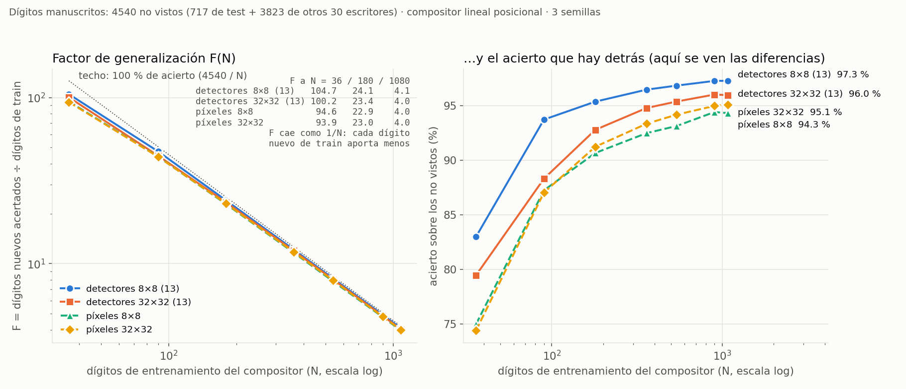
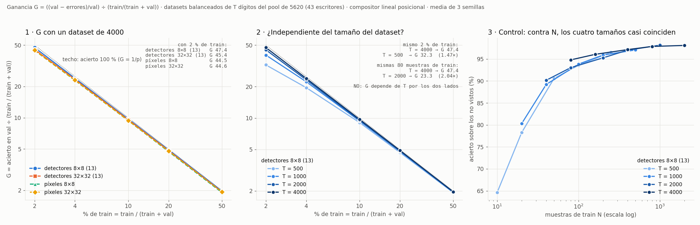
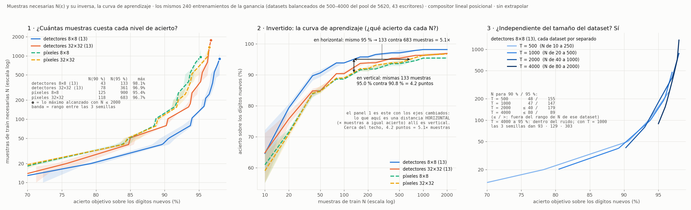

# `feat-ind32` — qué salió (2026-10-05)

`feat-ind` repetido con la entrada **sin reducir** (bitmap 32×32 de NIST) y el mapa de salida en 8×8. Mismos dígitos,
mismo reparto, mismo compositor, mismo vocabulario sintético (comprobado bit a bit: `nn/datos.py --comprobar`).
Plan en `REGLAS.md`, criterio escrito antes en `instrucciones/02-criterio.md`.

## C3 — los 13 detectores, a la vez en una máquina de Vast

Unidad `expc-fi32-detectores`, 2026-10-05 12:44 → 13:00 UTC. 1 instancia (Xeon E5-2680 v4, 28 vCPU, 31 GB, 0,066 $/h),
**15,5 min, 0,0172 $**, rc 0, destruida. ~355 s por detector, los 13 en paralelo. Libro en `resultados/vast/detectores/`.

| detector | 8×8 (feat-ind, corrida 2) | **32×32** | F1 | P | R | pos ≤ 1 |
|---|---|---|---:|---:|---:|---:|
| arco-E / W / S | no aprendió (0,70–0,74) | **a medias** | 0,862 / 0,882 / 0,890 | 0,88–0,90 | 0,83–0,89 | 0,96–0,98 |
| arco-N | a medias (0,757) | a medias | 0,897 | 0,92 | 0,87 | 0,96 |
| esquina-NE / NW / SE / SW | no aprendió (0,70–0,74) | **a medias** | 0,890 / 0,879 / 0,883 / 0,884 | 0,88–0,90 | 0,86–0,89 | 1,00 |
| recta-V / H / S / B | a medias (0,85–0,88) | **aprendió** | 0,970 / 0,965 / 0,971 / 0,967 | 0,97–0,98 | 0,96–0,97 | 0,98–1,00 |
| lazo | aprendió (0,906) | aprendió | 0,962 | 0,95 | 0,98 | 1,00 |

La **precisión** —lo que fallaba a 8×8 (0,61–0,67 en arcos y esquinas)— sube a 0,88–0,98.

## C4–C6 — sobre los dígitos (`nn/aplicar.py` + `nn/componer.py`, en el dev)

| | 8×8 (`feat-ind`, banco fino) | **32×32** |
|---|---:|---:|
| presencia, 180/1617 | 0,718 | 0,686 ± 0,005 |
| **posicional, 180/1617** | **0,959** | **0,949 ± 0,000** |
| 1↔8 / 4→1 (posicional, semilla 1) | 22 / 1–3 | **5 / 4** |
| curva N = 180 / 900 (test 717) | *fino+grueso* 0,974 / 0,992 | 0,942 / 0,975 |
| con los 3823 de otros escritores (solos / + 1080) | — | 0,964 / 0,973 |
| test · G1 · G2 · desplazado (A) | 0,964 · 0,036 · 0,844 · 0,577 | 0,942 · 0,058 · 0,814 · 0,608 |
| desplazado con B (máx 3×3) | — | **0,733** (+0,125 sobre A) |
| píxeles crudos (test 717) | 0,890 (8×8) | 0,896 (32×32) |

## Contra el criterio

- **H1 ✅** — los **7** «no aprendió» de 8×8 suben a «a medias» (el criterio decía «6 de 8»: eran 7, contados mal al
  escribirlo; el umbral se cumple igual). Las 4 rectas pasan a «aprendió». Ninguna esquina por debajo de 0,75.
- **H2 ≈ empate en el borde inferior** — 0,9491, apenas dentro de (0,949, 0,969). **Mejores detectores no dan mejor
  compositor.** Es lo que §E daba como «lo que más probablemente salga mal»: la transferencia sintético → manuscrito.
- **H4 ✅** — 1↔8 de 22 a **5**, y 4→1 en 4 (tope 5): lo que la corrida 4 arregló con un banco grueso, aquí lo da la
  resolución sin pagar el 4→1.
- **H3 ❌** — 0,975 con N = 900, lejos de 0,992 (y < 0,985). 13 detectores a 32×32 no sustituyen a los 26 de 8×8.
- **H5 ✅** — B sube el desplazado +0,125 (0,608 → 0,733).

**Lectura:** subir la resolución arregla **los detectores** (precisión de arcos y esquinas, el par 1↔8) pero **no** el
resultado neto: el compositor a 32×32 queda 0,01 por debajo del de 8×8 y la curva de datos se aplana antes. A 8×8 el
conteo 4×4 suavizaba el trazo manuscrito hasta parecerse al sintético; a 32×32 esa diferencia la ve el detector.

## La comparación justa: 13 detectores a 8×8 contra 13 a 32×32 (2026-10-05)

H3 comparaba contra el banco fino+grueso (26). El dueño pidió el 8×8 con sólo los 13 del banco fino: es la corrida 14
de `feat-ind` (`resultados/curva-fino.json` allí), mismo test de 717 y mismo compositor.

| N train | 36 | 90 | 180 | 360 | 540 | 900 | 1080 | otros escritores | 1080 + otros | desplazado con B |
|---|---:|---:|---:|---:|---:|---:|---:|---:|---:|---:|
| fino 8×8 | **0,831** | **0,943** | **0,964** | **0,972** | **0,975** | **0,983** | **0,985** | **0,975** | **0,982** | **0,774** |
| **fino 32×32** | 0,792 | 0,893 | 0,942 | 0,964 | 0,960 | 0,975 | 0,974 | 0,964 | 0,973 | 0,733 |

**Con el mismo banco, 8×8 gana en TODOS los puntos**: −0,04/−0,05 con pocos datos, −0,01 con muchos. Así que la
conclusión de arriba se refuerza: a 32×32 los detectores son mejores en lo sintético y peores como entrada del
compositor de dígitos.

## Factor de generalización F(N) (2026-10-05)

**F(N) = dígitos NO vistos bien reconocidos ÷ N dígitos de train del compositor.** «No vistos» = los 717 de test +
los 3823 de otros 30 escritores (4540; nunca entran en el train). Compositor posicional, 3 semillas.
`nn/factor.py` aquí y en `feat-ind` (8×8; los de otros escritores reducidos 4×4), `nn/figura_factor.py` la figura.

| N | 36 | 180 | 1080 |
|---|---:|---:|---:|
| detectores 8×8 (13) | **104,7** (83,0 %) | **24,1** (95,4 %) | **4,1** (97,3 %) |
| detectores 32×32 (13) | 100,2 (79,5 %) | 23,4 (92,8 %) | 4,0 (96,0 %) |
| píxeles 8×8 | 94,6 (75,0 %) | 22,9 (90,7 %) | 4,0 (94,3 %) |
| píxeles 32×32 | 93,9 (74,4 %) | 23,0 (91,3 %) | 4,0 (95,1 %) |

Con 36 dígitos de train (3,6 por clase), cada uno «sirve» para acertar ~105 nuevos con los detectores de 8×8, frente a
~94 con los píxeles. F cae casi como 1/N (el acierto satura), así que las diferencias entre representaciones se leen
en el panel derecho. ⚠ F depende del tamaño del conjunto de no vistos: compara representaciones entre sí, no es una
propiedad absoluta.

## Ganancia G = ((val − errores)/val) ÷ (train/(train + val)) (2026-10-05)

**Definición del dueño, corregida ese mismo día:** G = acierto en val ÷ p, con p = train/(train + val) la fracción del
dataset que se usa para entrenar. Una primera versión usaba «aciertos ÷ T entre N ÷ T» (= aciertos/N), que era un
error de definición; queda en `resultados/ganancia.json` como `aciertos_por_muestra`. La conclusión no cambió.

Un dataset de T dígitos (balanceado, T/10 por clase, del pool de 5620 de 43 escritores); train = N = p·T, val = el
resto. T ∈ {500, 1000, 2000, 4000} y p ∈ {2, 4, 10, 20, 50} % (p·T/10 entero en todos: el % de train es EXACTO), 3
semillas. `nn/ganancia.py` aquí y en `feat-ind` (las mismas particiones: misma huella), `nn/figura_ganancia.py`.

**Qué es G:**
- **G = 1** ⇔ el modelo acierta en lo no visto la misma fracción que la fracción que vio; **G = 47** con p = 2 % es
  «viendo el 2 % del dataset, acierta el 95 % del resto».
- **Techo 1/p** (acierto 100 %) y **azar 1/(10·p)**: G ÷ techo = acierto. Entre representaciones, G sólo varía lo
  que varía el acierto, y la curva la dibuja el 1/p.
- **No depende de un conjunto de evaluación arbitrario** (val es el resto del dataset), que era el problema de F.

**Pero no es independiente del tamaño del dataset, y por los DOS lados** (detectores 8×8, medido):

| | T = 500 | T = 2000 | T = 4000 |
|---|---:|---:|---:|
| **mismo p = 2 %** → train | 10 muestras · acierto 64,7 % · **G 32,3** | — | 80 muestras · acierto 94,8 % · **G 47,4** (1,47×) |
| **mismo train = 80 muestras** → p | — | 4 % · acierto 93,0 % · **G 23,3** | 2 % · acierto 94,8 % · **G 47,4** (2,04×) |

- **A p fijo**, G cambia con T porque el acierto depende de cuántas muestras se ven, y el 2 % de 500 no son las mismas
  que el 2 % de 4000 (panel 2: las curvas sólo se juntan desde el 10–20 %, donde todas están en el techo).
- **A train fijo**, G se dobla cuando se dobla el dataset, con casi el mismo acierto: el denominador es la fracción, y
  80 muestras son la mitad de fracción en un dataset del doble.
- **Panel 3, el control:** contra N (muestras), los cuatro tamaños casi coinciden (≤ 2 puntos a igual N, frente a 30 a
  igual %). Lo que no depende del tamaño del dataset es el acierto en función de N.
- **Panel 1:** con T = 4000 y 2 % de train, G = 47,4 (detectores 8×8) · 45,4 (32×32) · 44,5 / 44,6 (píxeles 8×8 /
  32×32), o sea los aciertos 94,8 · 90,9 · 88,9 · 89,2 % divididos por 0,02.

**Para qué sirve, entonces:** para comparar representaciones **con el mismo T y el mismo p**, diciendo siempre T. Si se
quiere un número que no dependa del tamaño del dataset, el denominador tiene que ser N (o N por clase), no p.

## Muestras necesarias N(ε) y su inversa, la curva de aprendizaje (2026-10-05)

**N(ε) = muestras de train necesarias para llegar a un acierto ε sobre los dígitos nuevos.** Es la alternativa D del
análisis de ese día, pedida por el dueño tras ver que G depende del tamaño del dataset. ε es una **tasa** (95 % = 950
aciertos de cada 1000): un recuento de aciertos dependería de cuántos dígitos se evalúan. `nn/muestras_necesarias.py`
sale de los mismos 240 entrenamientos de la ganancia (no se entrena nada): curva acierto(N) con los cuatro tamaños de
dataset juntos (N de 10 a 2000), monótona por regresión isotónica, invertida interpolando en log N. **Sin extrapolar**:
«> 2000» es que no se alcanza con lo medido. Entre paréntesis, el rango de las 3 semillas: el valor central sale de la
curva **conjunta** (las tres juntas) y el rango de la curva de **cada** semilla, así que no tiene por qué contenerlo (683
frente a 500–675).

| | N(80 %) | N(90 %) | N(95 %) | N(97 %) | N(98 %) | máximo con N ≤ 2000 |
|---|---:|---:|---:|---:|---:|---:|
| **detectores 8×8 (13)** | **21** | **43** (39–55) | **133** (126–138) | **374** | **894** | **98,1 %** |
| detectores 32×32 (13) | 28 | 78 (77–79) | 361 (361–531) | > 2000 | > 2000 | 96,9 % |
| píxeles 32×32 | 32 | 118 (111–123) | 683 (500–675) | > 2000 | > 2000 | 96,7 % |
| píxeles 8×8 | 32 | 125 (122–129) | 900 (797–929) | > 2000 | > 2000 | 95,4 % |

**Cuántas veces menos muestras que los píxeles de 32×32** (el dato crudo a su resolución nativa), para 80 / 90 / 95 %:
detectores 8×8 **1,5× / 2,7× / 5,1×** · detectores 32×32 1,2× / 1,5× / 1,9× · píxeles 8×8 1,0× / 0,95× / 0,76×. La
ventaja de los detectores 8×8 **crece con la exigencia**, y sólo ellos pasan del 97 % en la curva conjunta (una semilla
suelta de detectores 32×32 y otra de píxeles 32×32 lo rozan con N ≈ 1700–1900).

**El panel 2 es el mismo dato con los ejes intercambiados**: la curva de aprendizaje (acierto según N). N(ε) no añade
información; cambia la pregunta («¿cuántas muestras para llegar a ε?» en vez de «¿qué acierto con N?») y la dirección en
que se compara. El mismo ejemplo, leído de las dos formas:

| lectura | se compara | detectores 8×8 | píxeles 32×32 | diferencia |
|---|---|---:|---:|---:|
| horizontal (panel 1, y la flecha ↔ del 2) | muestras para el mismo 95 % | 133 | 683 | **5,1×** |
| vertical (la flecha ↕ del panel 2) | acierto con las mismas 133 muestras | 95,0 % | 90,8 % | **4,2 puntos** |

Cerca del techo, una distancia vertical pequeña es una horizontal grande: cuando lo caro son los datos, la que importa
es la horizontal, y por eso N(ε) separa las representaciones mucho más que el acierto a N fijo.

**Y es independiente del tamaño del dataset**, que es lo que G no cumplía (panel 3). Detectores 8×8, cada dataset por
separado:

| | T = 500 | T = 1000 | T = 2000 | T = 4000 |
|---|---:|---:|---:|---:|
| N(90 %) | 48 | 47 | ≤ 40 | ≤ 80 |
| N(92,5 %) | 78 | 77 | 70 | ≤ 80 |
| N(95 %) | 155 | 147 | 179 | 89 |

(≤: el nivel ya se pasa con el N más pequeño de ese dataset.) No hay tendencia con T. El 89 de T = 4000 es ruido: con un
mismo T = 1000 las tres semillas dan 93, 129 y 303, y en T = 2000 una semilla sacó 90,6 % con 80 muestras frente a 94,2–94,4
de las otras.

⚠ **Cerca del techo N(ε) amplifica el ruido**: la curva es casi plana, y un punto de acierto son el doble de muestras.
Con un solo dataset de 5 puntos y 3 semillas el factor de incertidumbre al 95 % llega a ~3; con los cuatro tamaños juntos,
a ~1,5 (los rangos de la tabla).

## Lo que queda pendiente

- Que el gap es de transferencia y no de capacidad del compositor, **no está medido**. Lo directo: entrenar los
  detectores con el ruido de grosor/irregularidad del manuscrito, o un banco grueso a 32×32 (la corrida 4 de feat-ind).
- 1 semilla de detectores; el compositor sí lleva 3.
- La opción B (mapa 32×32) del plan, sin correr.
- N(ε) cerca del techo, con 3 semillas: rango de hasta ~1,5× al 95 %. Más semillas lo afinan (local, minutos, 0 $).
