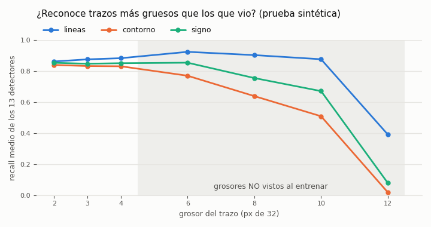
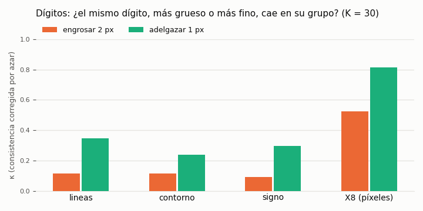

# `feat-bor` — qué salió (2026-10-06)

Los 13 detectores de `feat-ind32`, entrenados con la misma receta pero viendo el **borde** de la tinta en vez de la tinta, en
dos variantes: el **contorno** (1 canal, lo pedido literalmente) y el **borde con signo** (4 canales: un lado por canal). Plan
en `REGLAS.md`, criterio escrito antes de entrenar en `instrucciones/02-criterio.md`, encargo literal en
`instrucciones/01-encargo.md`.

**Vast, medido:** una máquina de 28 vCPU (Xeon E5-2680 v4, 0,0956 $/h), 26 procesos a la vez, **69 min y 0,1098 $**, y se
destruyó sola (`resultados/vast/detectores/detectores.json`). La estimación era 20–30 min y 0,02–0,05 $: cada proceso (1 hilo) tardó 46–50 s por época, contra 8,7–10 s de uno de 2 hilos en el dev: ~5 veces más lento por proceso y ~2,5 por hilo
(de los `summary.json`). La evaluación, en el dev (~6 min).

## La respuesta corta: el borde NO quita el problema del grosor

La idea era buena y la sonda lo dejó ver antes de gastar: **la cantidad** de borde casi no cambia con el grosor (47 → 64 px de
3 a 12 px, contra 74 → 291 del trazo). Pero un trazo tiene **dos** bordes, y al engrosarlo **se separan**. El detector aprendió
con trazos de 2–4 px, donde los dos bordes casi coinciden, y lo que reconoce es «dos bordes pegados»: en un trazo de 8 px ve
dos líneas sueltas, y **deja de encenderse**.

| prueba sintética (2–4 px vistos → 6–12 px no vistos; media de los 12 detectores con positivos en los dos tramos: el lazo no tiene trazos de 6–12 px) | líneas (lo de antes) | contorno | borde con signo |
|---|---:|---:|---:|
| recall | 0,863 → **0,865** | 0,824 → **0,634** | 0,842 → **0,733** |
| falsos positivos | 0,030 → **0,126** | 0,016 → 0,067 | 0,019 → 0,074 |
| F1 | 0,795 → 0,567 | 0,822 → 0,548 | 0,818 → 0,585 |

O sea que los dos fallan **al revés**: las líneas siguen viendo el trazo grueso pero **ven de más** (un trazo grueso enciende
arcos y esquinas que no están), y los bordes **ven de menos**. Ninguno de los dos aguanta el grosor.

## En los dígitos

| | líneas | contorno | borde con signo |
|---|---:|---:|---:|
| compositor (180 de train, 1617 de val, 3 semillas) | **0,949** | 0,805 | 0,865 |
| arcos en los 1 (arco-E / arco-W) | 0,76 / 0,70 | 0,09 / 0,03 | **0,02 / 0,08** |
| κ al engrosar 2 px / al adelgazar 1 px | 0,114 / 0,345 | 0,114 / 0,237 | 0,092 / 0,296 |

El borde con signo **arregla el síntoma** —un 1 grueso deja de encender arcos—, pero **pierde 8 puntos** leyendo dígitos, y los
grupos no se vuelven más estables al engrosar o adelgazar el dígito (κ igual o peor).

## Contra el criterio (escrito antes)

| | contorno | borde con signo |
|---|---|---|
| **H1** aprenden (≥ 11/13 a medias, F1 medio a ≤ 0,05 del de las líneas, 0,916) | ✅ 13/13, F1 0,897 | ✅ 13/13, F1 0,915 |
| **H2** el grosor deja de confundir (FP sube ≤ 0,048 · recall baja ≤ 0,05 · F1 6–12 px ≥ 0,567) | ❌ FP +0,051 · recall −0,190 · F1 0,548 | ❌ FP +0,055 · recall −0,109 · F1 0,585 (sólo cumple el 3.º) |
| **H3** arcos en los 1 ≤ 30 % | — | ✅ 2 % y 8 % |
| **H4** κ ≥ líneas + 0,20 (≥ 0,314 y ≥ 0,545) | ❌ 0,114 / 0,237 | ❌ 0,092 / 0,296 |
| **H5** compositor ≥ líneas − 0,03 (≥ 0,919) | ❌ 0,805 | ❌ 0,865 |

**Lo que esperaba y no pasó:** que el borde con signo mejorase κ y perdiese sólo 0,01–0,03 en el compositor; perdió 0,084. Y
que el contorno perdiese 0,02–0,05; perdió 0,144. Acerté en H1, en H2 contorno (no) y en H3 (sí).

## ⏳ PENDIENTE (lo pidió el dueño): ¿se distinguen las curvas de las rectas?

**Anotado el 2026-10-06, al terminar este entrenamiento:** hay que verificar si los detectores de **curva** se pueden
diferenciar correctamente de los de **recta** —el problema que salió aquí y en `feat-agr`: un 1, que es una recta, enciende
arcos—.

**La primera medida ya está hecha, en `feat-fallos`** (`../2026-10-06-por-que-fallan/nn/curvas_rectas.py`), con los detectores
de líneas: con trazo **fino** sí se distinguen (en una recta fina se enciende algún detector de arco el 0,0 % de las veces, y
en un arco fino algún detector de recta el 0,7 %); con trazo **grueso** (6–12 px) **no** (algún arco se enciende en el 45 % de
las rectas gruesas y alguna recta en el 20 % de los arcos gruesos; en los dígitos, algún arco en el 89 % de los 1).
O sea que el problema no es la forma: es el **grosor**. Lo que queda por cerrar, y el detalle de las variantes de borde, en el
README de `feat-fallos`.

## Lo que quedó pendiente

1. **Curvas contra rectas** — arriba.
2. **Bordes entrenados con trazos gruesos.** El borde falla porque nunca vio dos bordes separados; entrenarlo con 2–12 px es lo
   que `feat-fallos` (S2) hace con las líneas. Si allí funciona, el borde sobra; si no, éste es el siguiente paso.
3. **Una sola semilla** por detector, y con `signo` la primera convolución tiene 4 canales: el efecto de la representación no
   se separa del de la inicialización.

## Ficheros

| | |
|---|---|
| `nn/pesos-contorno/<f>/`, `nn/pesos-signo/<f>/` | los 26 detectores (`best.pt`, `config.json`, `summary.json`) |
| `resultados/evaluacion.json` | §A, §B, §C, el criterio y las huellas de los pesos |
| `resultados/sonda-grosor.json` | la sonda sin entrenar que decidió entrenar las dos variantes |
| `resultados/referencia-lineas.json` | las líneas por esta misma evaluación, antes de entrenar |
| `resultados/vast/detectores/` | el libro de la máquina alquilada |

Reporte en el repo central: [`estudios-redes-neuronales` #34](https://github.com/stalinbeltran/estudios-redes-neuronales/blob/main/reportes/estudios/2026/10-octubre/2026-10-06-feat-bor-detectores-de-borde.md).
