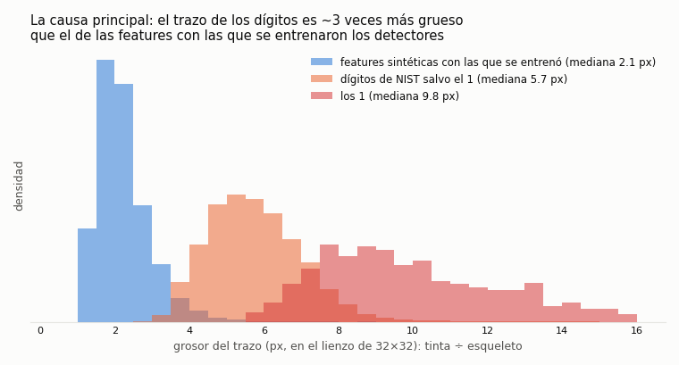
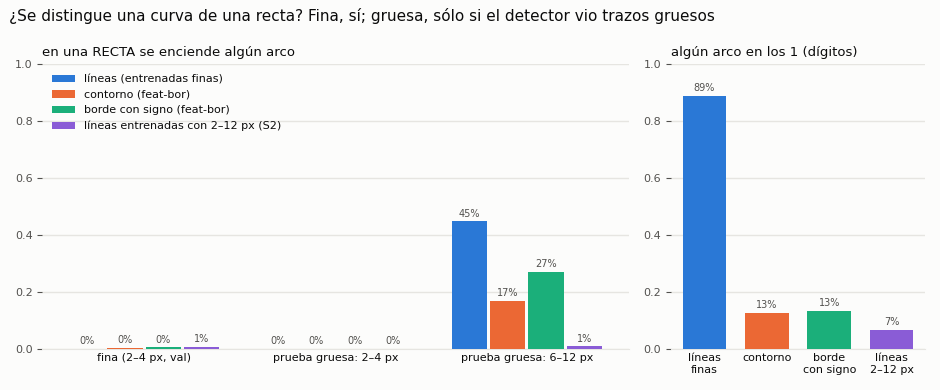
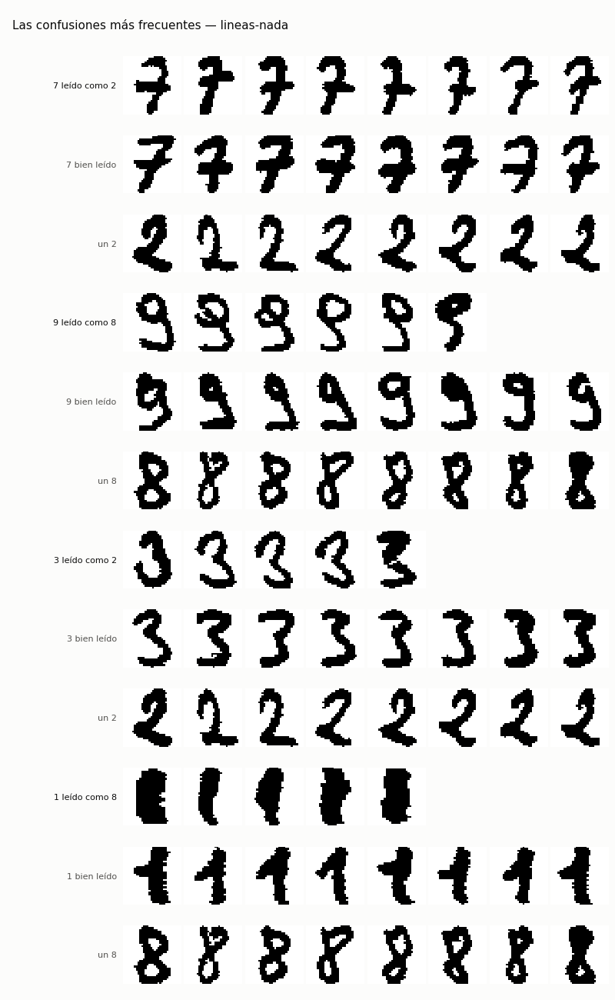
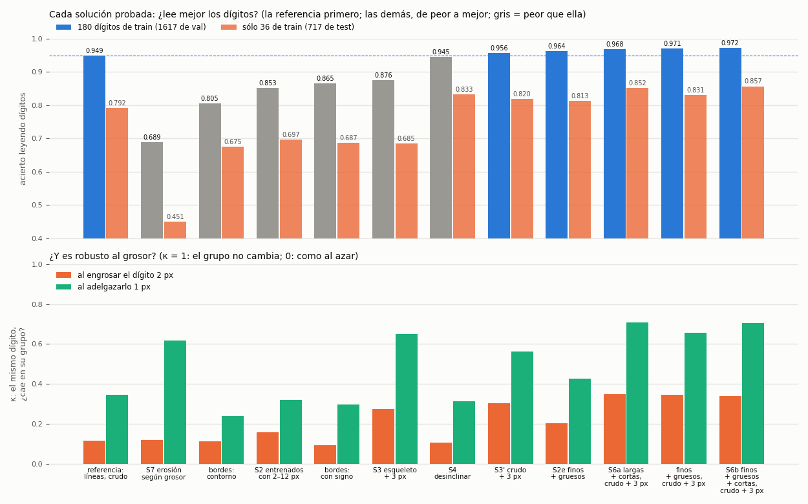
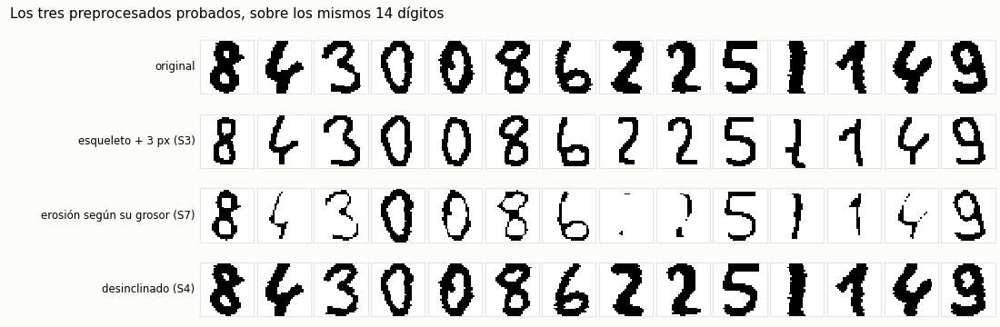
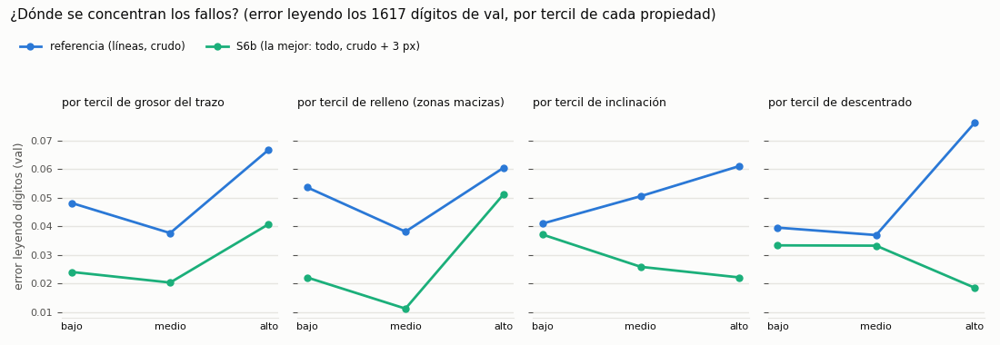
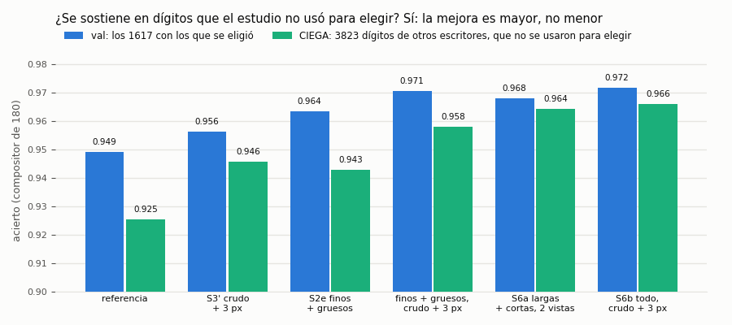

# `feat-fallos` — por qué fallan los detectores al leer dígitos, y qué lo arregla (2026-10-06)

El encargo, literal (`instrucciones/01-encargo.md`): *«realiza un estudio minucioso de las razones por las que fallan al
detectar dígitos, propón soluciones y ponlas a prueba. No me pidas opiniones, usa tu criterio, ponlo a prueba y corrige, y
lo vuelves a poner a prueba»*.

**Qué falla:** los 13 detectores de features de `feat-ind32` (arcos, rectas, lazo y esquinas, entrenados con trazos
sintéticos de 2–4 px) leen los dígitos de NIST con un compositor lineal posicional: **0,949** con 180 dígitos de
entrenamiento. Y tienen síntomas raros: encienden arcos en los 1 (76 %), y los grupos de `feat-agr` se rompen al cambiar el
grosor del dígito.

**Cómo se hizo:** por **iteraciones**. Cada una, con su criterio escrito **antes** de medirla; su resultado, debajo; y la
siguiente, salida del diagnóstico de la anterior (`instrucciones/02-criterio.md`). ⚠ **Desde la iteración 3 el criterio se
commiteó antes de medirse** (el hash va en cada cabecera); la 1 y la 2 se escribieron antes pero entraron en git **junto**
con su resultado (`444fdc1`, 01:46), así que para ellas sólo queda la hora escrita a mano. Y las horas de cabecera de la 3 a
la 7 se escribieron **por delante** del commit y se corrigieron después a la del commit (los umbrales no se tocaron).
Siete iteraciones y **21 combinaciones** banco × preprocesado (30 evaluaciones contando las 3 del compositor tolerante y las
6 de la confirmación ciega), con las métricas de `nn/evaluar.py`: compositor, curva, firma y κ siempre; la prueba gruesa
sintética, sólo con un banco y una vista; y con varios bancos, la firma es la del primero.

**Coste:** 0,0303 $ (S2: 13 detectores en una máquina de Vast, 19 min, destruida sola). Más los bancos que se leen de otros
experimentos: `feat-bor` (bordes, 0,1098 $) y `feat-cortas` (rectas y curvas cortas, 0,0145 $). Todo lo demás, en el dev.

## La respuesta corta

1. **La causa principal es el GROSOR.** El trazo de los dígitos es ~2,8 veces el de las features de entrenamiento (mediana
   5,8 px contra 2,1; los 1, 9,8 px). Con trazo grueso, un detector entrenado fino **ve de más**: una recta gruesa enciende
   arcos.
2. **¿Se distinguen las curvas de las rectas?** (lo que pidió el dueño) **Sí, si el detector ha visto ese grosor.** Finas, todos
   los bancos (≤ 1 % de confusión); gruesas, sólo el entrenado con trazos gruesos (0,7 %, contra el 45 % del fino).
3. **Quitar el grosor de la IMAGEN no sirve**: el esqueleto pierde lo relleno (0,876) y la erosión pierde lo fino (0,689). Los
   bordes, tampoco (0,805 / 0,865). Y entrenar sólo con gruesos arregla el síntoma pero lee peor (0,853).
4. **Lo que funciona es dárselo TODO al compositor**: detectores finos + gruesos + cortos, sobre el dígito crudo y sobre el
   normalizado: **0,9716** (−44 % de errores), y además mucho más estable al cambiar el grosor (κ al adelgazar 0,706 contra
   0,345). Cada versión ve lo que la otra no, y el compositor aprende de cuál fiarse en cada sitio. Con sólo **36** dígitos
   de entrenamiento y el compositor tolerante a la posición, **0,893** (la referencia, 0,792).
5. **Y se sostiene a ciegas**: en 3823 dígitos de otros escritores que el estudio no usó para elegir, **0,966 contra 0,925**
   (−54 % de errores).
6. **Lo que queda** son los dígitos con **zonas macizas** (4 cerrados con el triángulo relleno, 8 gruesos): el grosor en su
   forma más difícil.

## 1. Por qué fallan: las causas, medidas

### 1.1 El grosor

Medido con `nn/medir_grosor.py` (tinta ÷ esqueleto): los dígitos, **5,8 px** de mediana (p5 4,0 · p95 10,3); los 1, **9,8**;
las features con que se entrenaron, **2,1** (p95 3,5). Los dos rangos casi no se solapan. Y el error se concentra en el tercil
más grueso: **0,067** contra 0,048 y 0,038 (`nn/diagnostico.py`, 3 semillas). Hasta un clasificador de píxeles lo sufre
(0,119 contra 0,093 y 0,064).

### 1.2 Con trazo grueso, una recta parece una curva — la pregunta del dueño

`nn/curvas_rectas.py`, sobre imágenes con una sola feature: en qué fracción de las **rectas** se enciende algún detector de
**arco**.

| banco | fina (2–4 px) | gruesa (6–12 px) | en los 1 (dígitos) |
|---|---:|---:|---:|
| líneas, entrenadas finas (`feat-ind32`) | 0,000 | **0,447** | **0,89** |
| contorno (`feat-bor`) | 0,001 | 0,167 | 0,13 |
| borde con signo (`feat-bor`) | 0,004 | 0,270 | 0,13 |
| **líneas entrenadas con 2–12 px (S2, aquí)** | 0,006 | **0,007** | **0,07** |

Y al revés (alguna recta en un arco), con las finas: 0,007 finos y 0,200 gruesos. Las **cortas** de `feat-cortas` también se
distinguen, finas: 1,2 % y 1,5 %. **No es la forma: es el grosor que el detector no ha visto.**

### 1.3 Los fallos concretos

`nn/pares.py` mira, en cada confusión, qué detectores empujan al compositor hacia la clase equivocada:

- **7 → 2** (17 % de los errores): casi todos los 7 de este dataset llevan **travesaño**; en los que se leen como 2, `arco-W` se
  enciende en el **79 %** (en los 7 bien leídos, 47 %). Es la curva que aparece donde hay una recta.
- **1 → 8**: son **1 macizos** (13,6 px de grosor, contra 10,0 de los 1 bien leídos); el `lazo` se enciende en el 60 % (17 %).
- **9 → 8**: 9 con la cola cerrada en bucle; les falta la `recta-V` (0 % contra 50 %).
- **3 → 2**: no se enciende el arco de abajo (`arco-S`, 20 % contra 68 %).

### 1.4 Lo que pesa menos: inclinación, posición, topología, tamaño

| propiedad (tercil bajo · medio · alto) | error de la referencia |
|---|---|
| inclinación | 0,041 · 0,051 · 0,061 |
| descentrado (centro de masas contra centro del lienzo) | 0,040 · 0,037 · **0,076** |
| relleno (zonas macizas) | 0,054 · 0,038 · 0,061 |

Y la **topología**: el 10,8 % de los dígitos tiene un número de huecos distinto del de su clase (un 8 con un solo hueco porque
el grosor cerró el otro, un 0 abierto), y ahí está el **26 %** de los errores (error 0,120 contra 0,042). El **tamaño** no
cuenta: NIST ya lo normalizó (el 96 % mide 32 px de alto).

### 1.5 Los detectores sí aportan

El mismo compositor sobre los **píxeles** lee **0,908** (sobre píxeles promediados a 8×8, 0,904). Los detectores suman +0,04;
lo que falla no es la idea, es el grosor.

## 2. Las soluciones, probadas y corregidas

| it. | solución | resultado | criterio |
|---|---|---|---|
| — | **referencia**: líneas, dígito crudo | **0,949** · curva 0,792 / 0,942 / 0,974 · κ 0,114 / 0,345 · arcos en los 1: 76 % | — |
| 1 | **S3** esqueleto + 3 px | 0,876 · arcos en los 1: 12 % · κ 0,275 / 0,649 | síntoma ✅ robustez ✅ **acierto ❌** |
| 2 | **S3'** las dos vistas (cruda + 3 px) | 0,956 · curva 0,820 / 0,955 / 0,986 · κ 0,303 / 0,562 | empata (+0,007) · robustez ✅ |
| 2 | bordes (`feat-bor`): contorno · con signo | 0,805 · 0,865 | ❌ (#34) |
| 3 | **S2** detectores entrenados con 2–12 px | 0,853 · arcos en los 1: 3 % · F1 sintético 6–12 px 0,895 | síntoma ✅ sintético ✅ **acierto ❌** |
| 3 | **S2e** finos + gruesos (26 mapas) | **0,9635** · curva 0,813 / 0,969 / 0,978 | ✅ |
| 4 | **S4** desinclinar · con las dos vistas | 0,945 · 0,949 (con 36 de train, 0,833 y 0,843: ayuda) | ❌ (los inclinados sí: −26 %) |
| 4 | **S5** compositor tolerante (`max3`) | con 36: +0,025 · con 180: −0,009 en la referencia, +0,006 con dos vistas | con pocos ejemplos ✅ |
| 5 | **S6a** largas + cortas, crudo + 3 px (42 mapas) | **0,9678** · curva 0,852 / 0,971 / 0,989 · κ 0,349 / **0,707** | ✅ |
| 5 | finos + gruesos, crudo + 3 px (52 mapas) | **0,9705** · curva 0,831 / 0,968 / 0,988 | (sin criterio propio) |
| 5 | **S6b** finos + gruesos + cortas, crudo + 3 px (68 mapas) | **0,9716** · curva 0,857 / 0,965 / 0,992 · κ 0,340 / 0,706 | ✅ **la mejor** |
| 5 | **S6c** S6b + compositor tolerante | 0,9718 · curva **0,893** / 0,968 / 0,989 | ✅ |
| 6 | **S7** erosionar según el grosor de cada dígito | 0,689 · con las dos vistas 0,947 | ❌ |
| 7 | **confirmación ciega**: S6b en 3823 dígitos de otros escritores | **0,966** contra 0,925 de la referencia | ✅ (−54 % de errores) |

(compositor de 180 sobre los 1617 de val, 3 semillas · curva con 36 / 180 / 1080 de train sobre el test de 717 · κ al engrosar
2 px / al adelgazar 1 px)

### Lo que no funciona, y por qué

- **Quitar el grosor de la imagen.** El grosor **no es uniforme dentro de un dígito**: el esqueleto convierte el cuerpo macizo
  de un 4 en un palo (4 → 1), y la erosión borra los trazos finos de un dígito con partes gruesas (varios 2 quedan en unos
  puntos). Los dos arreglan el síntoma (arcos en los 1: 12 % y 4 %) y los dos leen peor.
- **Los bordes** (#34): un trazo grueso tiene dos bordes separados, y el detector sólo vio bordes pegados: deja de encenderse.
- **Entrenar sólo con trazos gruesos** (S2): es lo único que distingue curva de recta a cualquier grosor, pero se vuelve
  menos selectivo con la forma — la recta vertical gruesa se enciende en el cuerpo de **todos** los 4 que lee como 1
  (`resultados/pares-lineas-grueso-nada.png`).
- **Desinclinar** (S4): **arregla los inclinados** —el error del tercil más inclinado baja de 0,061 a 0,045 (−26 %, S4b ✅)—
  pero **estropea los demás**: los 8 pasan de 6 % a 16 % de error (aparece un 6 ↔ 8 que no estaba). Con pocos ejemplos (36)
  compensa; con 180, no.

### Lo que funciona: dárselo todo al compositor

Ninguna versión sola gana a la referencia por mucho; **juntas, sí**. Lo crudo conserva lo relleno, lo normalizado quita el
grosor; el detector fino ve la forma, el grueso no se deja engañar por el grosor; las cortas son mejores piezas de trazo que
las largas (`feat-cortas`) y las largas traen el lazo y las esquinas. El compositor es lineal y elige, celda a celda, de cuál
fiarse. De 0,949 a **0,9716**: de 82 errores en 1617 a ~46.

## 3. Lo que todavía falla

Con S6b, de **82 errores a 46** (semilla 1, en los 1617 de val), y el **7 → 2** pasa de 14 a 3. Lo que queda
(`nn/pares.py`, `resultados/pares-lineas+lineas-grueso+cortas-nada+norm3.png`):

- **4 → 1** (14, el 30 % de lo que queda): son los 4 **cerrados**, con el triángulo de arriba **macizo** —los bien leídos son
  casi todos abiertos—. Más gruesos (7,4 px contra 6,3) y con la recta vertical encendida en el 93 % (en el 25 % de los bien
  leídos): el triángulo relleno hace de «bandera» y el 4 se parece a los 1 de este dataset, que la llevan.
- **8 → 9** (9, el 20 %): también **más gruesos** (5,3 px contra 4,4): el bucle de abajo sale pequeño o relleno.

O sea que **la frontera sigue siendo el grosor**, ahora en su forma más difícil: las **zonas macizas**. En la figura de
arriba se ve: con S6b el error **ya no crece** con la inclinación ni con el descentrado (baja), y se concentra en el tercil
de más **relleno** (0,051, contra 0,011 del medio).

### La confirmación ciega (iteración 7): ¿no será suerte de haber elegido sobre el mismo val?

Todas las combinaciones se compararon sobre los mismos 1617 dígitos, y S6b salió la más alta de entre muchas. Para
descartar que fuese suerte, se escribió antes un criterio (`nn/confirmar.py`) y se midieron las seis finalistas en **3823
dígitos de otros 30 escritores** (`origen` tra · cv · wdep), cuyo acierto **ningún** paso anterior había mirado, con el
compositor entrenado igual (los mismos 180):

| | val (1617) | **ciega (3823)** |
|---|---:|---:|
| referencia | 0,949 | **0,925** |
| S6b (todo, dos vistas) | 0,972 | **0,966** |

**Se sostiene, y con más margen**: +0,041 en vez de +0,023, y quita el **54 %** de los errores en vez del 44 % (C1 ✅ y C2 ✅).
Y las **cortas** son lo que mejor aguanta el cambio de escritor: sin ellas, finos + gruesos en dos vistas cae de 0,971 a
0,958; con ellas apenas se mueve (0,968 → 0,964 y 0,972 → 0,966).

## 4. Lo que quedó pendiente

1. **Las zonas macizas.** Es lo que queda (4 → 1, 8 → 9). Ninguna transformación de la imagen lo arregla sin romper otra
   cosa; lo que falta probar es un detector que las **vea** (una feature «zona rellena») o entrenar los 13 con dígitos de trazo
   macizo, no sólo con trazos gruesos.
2. **El compositor no lineal.** El lineal no puede construir un lazo juntando arcos (lo midió `feat-cortas`); con 180 ejemplos y
   68 mapas (4352 entradas) es arriesgado, y no se probó.
3. **Una sola semilla por detector**, en los tres bancos entrenados (líneas, gruesos, cortas): la ventaja de S6b no está
   separada de la suerte de inicialización.
4. **Coste**: S6b corre 34 detectores sobre dos vistas, 68 pasadas de detector contra 13 (~5 veces, *estimado por el número
   de pasadas*, más el esqueleto). No se midió el tiempo de
   inferencia.
5. **Finos + gruesos en dos vistas** (0,9705) estaba en la cuadrícula pero sin criterio propio: se reporta, no se declara.

## Ficheros y scripts

| | |
|---|---|
| `instrucciones/02-criterio.md` | **las siete iteraciones**, cada una escrita antes, con su resultado debajo |
| `resultados/combos/<banco>-<preprocesado>.json` | cada combinación: compositor, curva, firma, κ y prueba gruesa |
| `resultados/curvas-rectas/`, `diagnostico.json`, `errores.json`, `pares.json`, `tolerante.json`, `confirmacion.json` | los diagnósticos |
| `resultados/*.png` | las figuras de arriba |
| `nn/pesos-lineas-grueso/<f>/` | los 13 detectores de S2 (`best.pt`, `config.json`, `summary.json`) |
| `nn/evaluar.py` | una combinación: `python nn/evaluar.py lineas+lineas-grueso+cortas nada+norm3` |
| `nn/normalizar.py` | esqueleto, `norm3`, `desinclinar`, `adelgazar_segun_grosor` (`python nn/normalizar.py` comprueba los siete casos) |
| `nn/diagnostico.py`, `errores.py`, `pares.py`, `curvas_rectas.py`, `tolerante.py`, `confirmar.py`, `figuras.py` | los diagnósticos y las figuras |

Reporte en el repo central: [`estudios-redes-neuronales` #35](https://github.com/stalinbeltran/estudios-redes-neuronales/blob/main/reportes/estudios/2026/10-octubre/2026-10-06-feat-fallos-por-que-fallan.md).
