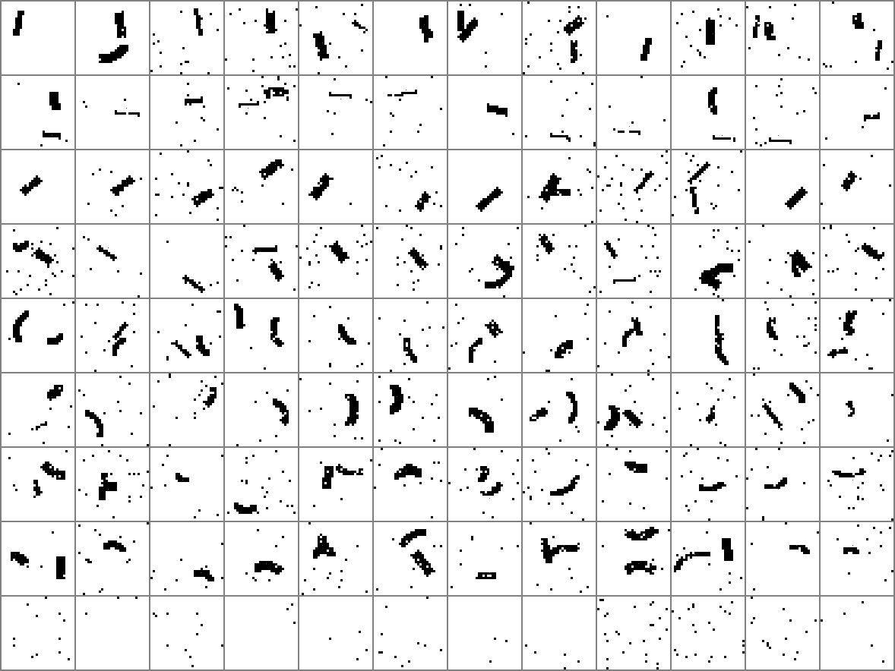
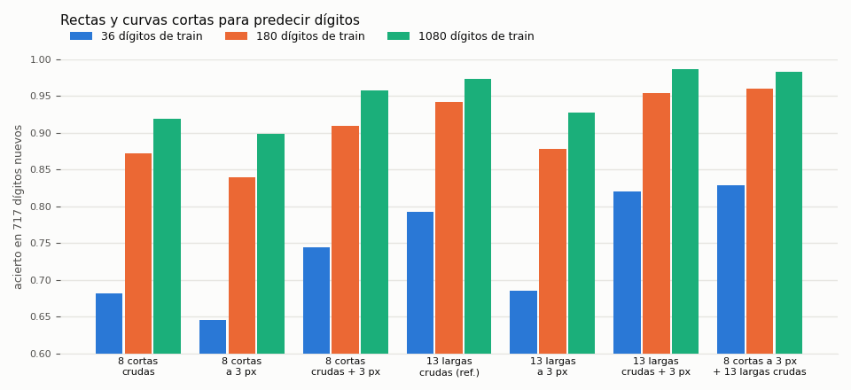

# `feat-cortas` — qué salió (2026-10-06)

El encargo, literal (`instrucciones/01-encargo.md`): *«en otro experimento entrena con rectas y curvas cortas, y úsalas para
predecir»*. Se entrenaron **8 detectores** —4 rectas cortas (6–12 px: `corta-V`, `corta-H`, `corta-S` /, `corta-B` \) y 4
curvas cortas (radio 5–10 px, apertura 60–100°: `curva-E/W/N/S`)— con la red y la receta de `feat-ind32` sin tocar, y se
usaron para leer los dígitos de NIST con el mismo compositor posicional. Criterio escrito antes de entrenar, con una
enmienda antes de lanzar, en `instrucciones/02-criterio.md`.

**Vast, medido:** una máquina de 18 vCPU (Xeon E5-2686 v4, 0,0551 $/h), los 8 a la vez, **15,8 min y 0,0145 $** (9 de esos
minutos, esperando a que la máquina arrancase); se destruyó sola (`resultados/vast/detectores/detectores.json`). La
evaluación, en el dev (~11 min).

## 1. Los aprenden, y distinguen la curva de la recta

| detector | veredicto | F1 | precisión | recall | posición ≤ 1 celda |
|---|---|---:|---:|---:|---:|
| `corta-V` | a medias | 0,858 | 0,835 | 0,882 | 0,997 |
| `corta-H` | a medias | 0,899 | 0,935 | 0,865 | 0,997 |
| `corta-S` | **aprendió** | 0,952 | 0,962 | 0,943 | 1,000 |
| `corta-B` | **aprendió** | 0,939 | 0,971 | 0,910 | 0,997 |
| `curva-E` | a medias | 0,856 | 0,898 | 0,818 | 1,000 |
| `curva-W` | a medias | 0,870 | 0,915 | 0,830 | 0,997 |
| `curva-N` | a medias | 0,879 | 0,925 | 0,838 | 1,000 |
| `curva-S` | a medias | 0,876 | 0,906 | 0,848 | 0,997 |

**¿Se distingue una curva corta de una recta corta?** (la pregunta del dueño, en su versión más difícil: una curva de radio 10
y 60° casi no tiene flecha). **Sí**: los detectores de curva se encienden en el **1,2 %** de las rectas cortas, y los de recta
en el **1,5 %** de las curvas cortas. El que más se confunde es `corta-V`, que se enciende en el 6,7 % de las `curva-E` y el
5,6 % de las `curva-W` (un arco que se abre hacia un lado es casi vertical). Esperaba lo contrario (0,10–0,25): me equivoqué.

⚠ Esto es con trazo **fino** (2–4 px, el del entrenamiento). Con trazo grueso la respuesta cambia (`nn/prueba_rectas.py`):
una recta horizontal de 8 px enciende `curva-N`, y una vertical de 8 × 20 px, `curva-W`. Es el mismo problema de grosor que
estudia `feat-fallos`.

## 2. Para predecir dígitos, solas pierden; junto a las largas, suman

| compositor de 180 (1617 de val, 3 semillas) · curva 36 / 180 / 1080 (test de 717) | cortas | 13 largas (`feat-ind32`) |
|---|---|---|
| dígito crudo | 0,880 · 0,682 / 0,872 / 0,920 | **0,949** · 0,792 / 0,942 / 0,974 |
| normalizado a 3 px (`norm3`) | 0,837 · 0,646 / 0,839 / 0,899 | 0,876 · 0,685 / 0,878 / 0,928 |
| las dos vistas | 0,915 · 0,744 / 0,909 / 0,958 | 0,956 · 0,820 / 0,954 / 0,986 |
| **cortas a 3 px + 13 largas crudas** (21 mapas) | **0,9606** · 0,829 / 0,960 / 0,983 | |

## 3. Por qué pierden solas: no es el largo, es el VOCABULARIO

Escrito antes de medirlo (criterio, commit `a72db38`, 02:46 UTC) y medido con `nn/vocabulario.py` (compositor de 180, crudo):

| banco | mapas | compositor |
|---|---:|---:|
| 8 largas que son **trazos** (4 arcos + 4 rectas) | 8 | 0,843 |
| **8 cortas** | 8 | **0,880** |
| 5 que **no** son trazos (lazo + 4 esquinas), solas | 5 | 0,798 |
| 13 largas | 13 | 0,949 |
| **8 cortas + lazo + 4 esquinas** | 13 | **0,945** |

Como piezas de trazo, **las cortas valen más que las largas** (+0,037). Lo que les falta es lo que no es un trazo: el **lazo**
(0, 6, 8, 9) y las **esquinas** (4, 5, 7). El compositor es lineal y posicional: suma evidencias celda a celda, y no puede
construir un lazo **juntando** arcos (eso sería un «y», y un lineal no lo hace). Con el lazo y las esquinas prestados de las
largas, las cortas quedan a 0,004 de las 13 largas.

Y una cosa que se descartó por el camino (`nn/prueba_rectas.py`, rectas dibujadas sin ruido de 2–4 px de grosor): la recta
corta horizontal **sí** se enciende sobre rectas largas, aunque con menos fuerza (0,92–1,00 con 10 px, 0,73–0,84 con 20 px,
contra un umbral de 0,85 elegido en el entrenamiento). Por eso en `nn/firma.py` sale
«encendida» sólo en el 4 % de los dígitos; pero el compositor lee el mapa continuo, no el umbral, así que eso no explica la
pérdida.

## Contra el criterio (escrito antes; enmendado antes de lanzar)

| | resultado | esperaba |
|---|---|---|
| **H1** ≥ 6 de 8 al menos «a medias» | ✅ 8 de 8 | sí |
| **H1-cv** curva/recta corta se distinguen (las dos medias ≤ 0,10) | ✅ 0,012 y 0,015 | **no** (0,10–0,25) |
| **H2** cortas contra largas en la misma vista (gana ≥ +0,01 · empata ± 0,01) | ❌ **pierde** en las tres: −0,069 · −0,039 · −0,041 | 0,93–0,95 |
| **H3** cortas (3 px) + largas (crudas) ≥ largas en las dos vistas + 0,01 = 0,966 | ❌ 0,9606 | sí, 0,96–0,97 |

H3 cae por 0,006, pero esa combinación es **la más alta medida hasta ese momento** en los dígitos (+0,0115 sobre la
referencia, +0,004 sobre las largas en dos vistas). Al juntarla con más cosas, en `feat-fallos`, llegó a **0,972** (S6b).

## Lo que quedó pendiente

1. ~~Las cortas en las dos vistas y con todo lo demás~~ — **hecho en `feat-fallos`** (que lee estos detectores por su id y su
   huella, `resultados/huellas.json`): largas + cortas en dos vistas, **0,968** (S6a ✅); con los gruesos, **0,972** (S6b ✅). Y
   a ciegas, en 3823 dígitos de otros escritores, las cortas son **lo que mejor aguanta el cambio de escritor**: sin ellas, de
   0,971 a 0,958; con ellas, de 0,972 a 0,966.
2. **Cortas entrenadas con trazo grueso**: una recta gruesa enciende curvas cortas (lo de arriba). Es el mismo arreglo que
   S2 de `feat-fallos`, y allí salió que el grueso arregla el síntoma pero lee peor.
3. **Una sola semilla** por detector.

## Ficheros

| | |
|---|---|
| `nn/pesos/<f>/` | los 8 detectores (`best.pt`, `config.json`, `summary.json`) |
| `resultados/evaluacion.json` | §A, H1-cv, §B y el criterio |
| `resultados/vocabulario.json` · `firma.json` · `huellas.json` | el diagnóstico, en qué clases se enciende cada uno, las huellas |
| `resultados/vast/detectores/` | el libro de la máquina alquilada |

Reporte en el repo central: [`estudios-redes-neuronales` #36](https://github.com/stalinbeltran/estudios-redes-neuronales/blob/main/reportes/estudios/2026/10-octubre/2026-10-06-feat-cortas-rectas-curvas-cortas.md).
