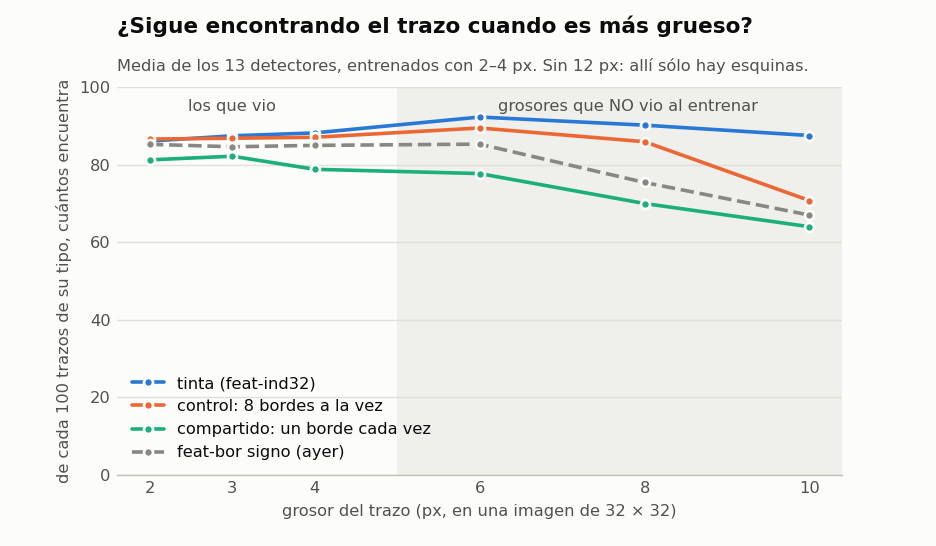
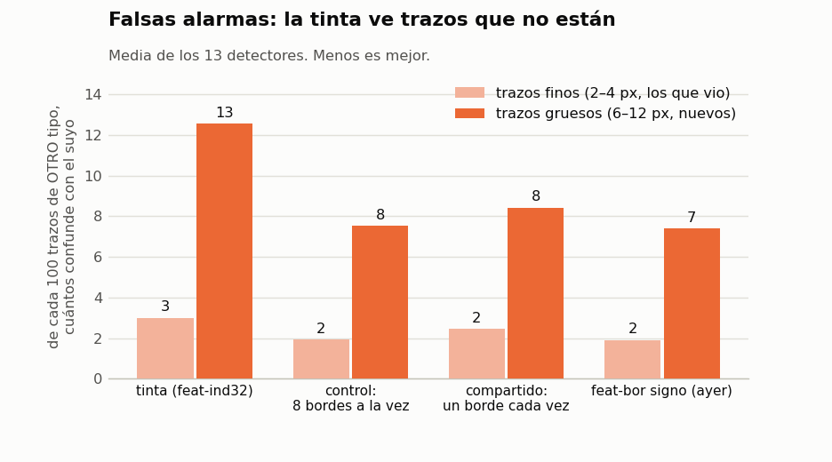
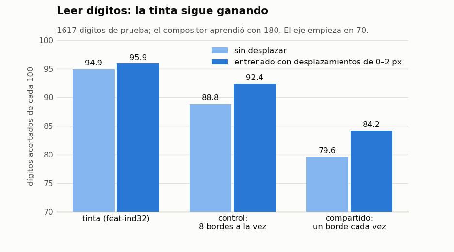
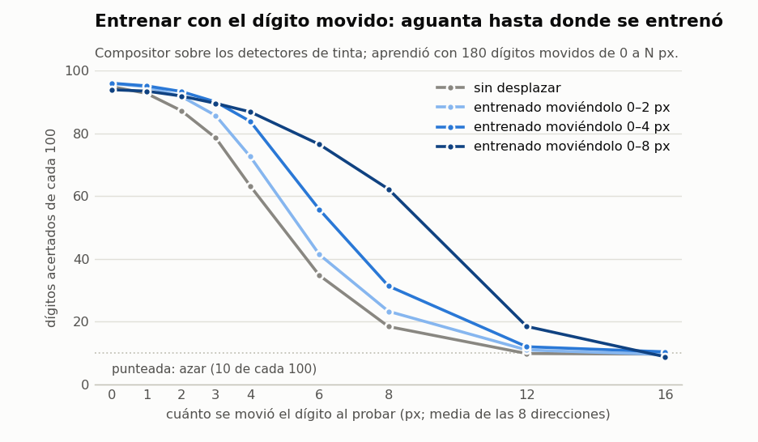
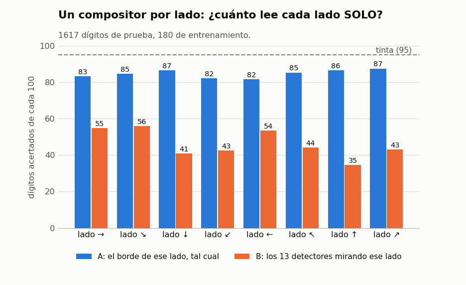
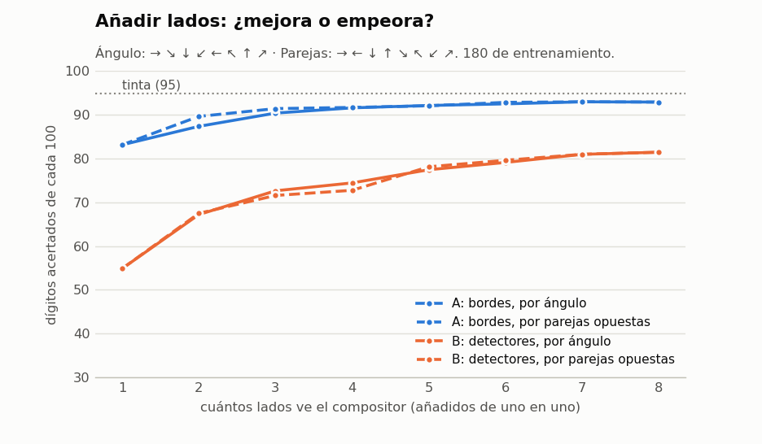
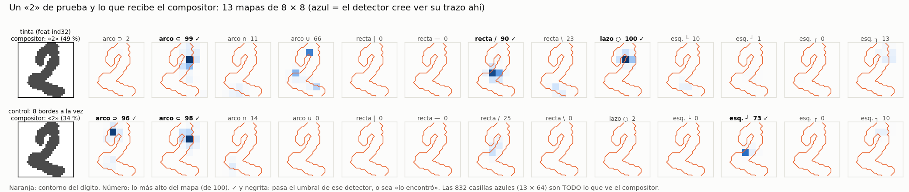
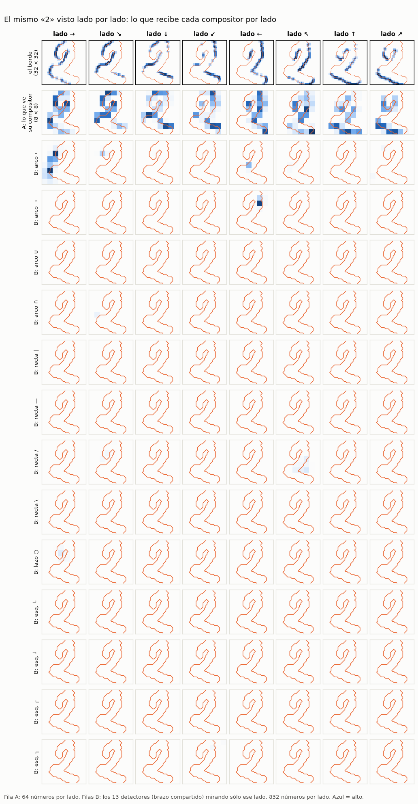

# `feat-1lado` — qué salió (2026-10-07)

Sale del boceto `docs/bocetos/2026-10-07-borde-de-un-lado/`. El único pre-proceso son **8 bordes de un solo lado**, como
primera capa FIJA del modelo. Dos brazos de 13 detectores de features: **control**, que mira los 8 canales a la vez, y
**compartido**, que aplica el mismo detector a cada canal por separado y se queda con el máximo. Después, un compositor de
dígitos entrenado con la entrada desplazada, y la curva de desplazamiento que pidió el dueño. Plan en `REGLAS.md`, criterio
escrito antes de entrenar en `instrucciones/02-criterio.md`, encargo literal en `instrucciones/01-encargo.md`.

**Vast, medido** (de los libros `resultados/vast/`): dos máquinas, las dos de 28 vCPU (Xeon E5-2660 v4, 31 GB, Vietnam,
0,0948 $/h), 13 procesos × 2 hilos, destruidas solas.

| brazo | UTC | s/época | coste |
|---|---|---:|---:|
| control | 16:53 → 17:10 (16,3 min) | 8,1 | 0,0257 $ |
| compartido | 17:42 → 19:31 (108,6 min) | 58–64 | 0,1716 $ |
| **total** | | | **0,1973 $** |

El compositor y la evaluación, en el dev (0 $; el compositor del compartido, ~2 h).

## Las gráficas (`nn/graficas.py`, pedidas por el dueño el 2026-10-08)

## La respuesta corta: mirar un canal cada vez NO arregla el grosor, y cuesta acierto

El compartido era la hipótesis: si cada detector ve un lado del trazo cada vez, la distancia entre lados (el grosor) no
debería llegarle. **No se cumple en ninguna de las tres condiciones**, y es el que más recall pierde de todos los medidos.
El control —los 8 canales juntos— sale mejor en todo.

| prueba sintética (2–4 px vistos → 6–12 px no vistos) | líneas (`feat-ind32`) | **control** | **compartido** | `feat-bor` signo |
|---|---:|---:|---:|---:|
| F1 medio en val (2–4 px) | 0,916 | **0,924** | 0,872 | 0,915 |
| F1 visto → no visto | 0,795 → 0,567 | 0,827 → **0,627** | 0,773 → 0,560 | 0,818 → 0,585 |
| recall visto → no visto | 0,863 → 0,865 | 0,861 → 0,781 | 0,807 → **0,675** | 0,842 → 0,733 |
| falsos positivos visto → no visto | 0,030 → 0,126 | 0,019 → 0,075 | 0,025 → 0,084 | 0,019 → 0,074 |
| arcos en los 1 (arco-E / arco-W) | 0,76 / 0,70 | 0,04 / 0,36 | **0,16 / 0,04** | 0,02 / 0,08 |

**El compartido no degeneró** en un detector de un solo lado (sólo el lazo pasa del 90 % en un canal), pero tampoco aprendió
«la forma vista desde un lado»: casi todos reparten entre **dos canales opuestos** (arco-W: → 38 %, ← 57 %; arco-N: ↓ 43 %,
↑ 54 %), o sea los dos lados del trazo, que es exactamente lo que se separa al engrosar. *Explicación probable, no
comprobada*: el ancla del sintético es la línea media del trazo, y cada lado queda a medio grosor de ella; con trazos de
2–4 px los dos lados casi coinciden con el ancla, y el detector aprende a encenderse en los dos.

## En los dígitos (180 de train, 1617 de val, 3 semillas)

| compositor | líneas | control | compartido |
|---|---:|---:|---:|
| sin desplazar (C1) | **0,949** | 0,889 | 0,796 |
| entrenado con desplazamientos 0–2 px (C2, el elegido) | **0,959** | 0,924 | 0,842 |
| … su acierto en los gruesos reales (cuartil con más tinta) | **0,969** | 0,939 | 0,851 |
| con los 3823 de otros escritores, sin / con 0–2 px | 0,968 / 0,965 | 0,926 / 0,930 | 0,875 / 0,863 |

Los bordes de un lado **pierden** frente a la tinta al leer dígitos: 6 puntos el control, 15 el compartido. El compositor
con desplazamientos **suma en los tres** (+1,0 / +3,6 / +4,6 con 180 de train), y más cuanto peor es el banco.

## La curva de desplazamiento (lo que pidió el dueño)

Acierto medio de las 8 direcciones con el dígito desplazado *d* px; compositor entrenado con 180 dígitos. Las líneas, que
son el mejor banco (la tabla entera de los tres, en `resultados/componer.txt`):

| entrenado con | d=0 | d=1 | d=2 | d=3 | d=4 | d=6 | d=8 | d=12 | d=16 |
|---|---:|---:|---:|---:|---:|---:|---:|---:|---:|
| sin desplazar | 0,949 | 0,928 | 0,873 | 0,786 | 0,633 | 0,348 | 0,185 | 0,099 | 0,097 |
| sólo 2 px | 0,955 | 0,945 | 0,918 | 0,863 | 0,743 | 0,434 | 0,250 | 0,114 | 0,104 |
| sólo 6 px | 0,721 | 0,715 | 0,739 | 0,773 | 0,812 | 0,802 | 0,609 | 0,178 | 0,094 |
| sólo 8 px | 0,353 | 0,356 | 0,392 | 0,442 | 0,516 | 0,702 | 0,773 | 0,350 | 0,108 |
| 0–2 px (gradual) | 0,959 | 0,949 | 0,918 | 0,857 | 0,726 | 0,414 | 0,233 | 0,110 | 0,095 |
| 0–4 px | 0,960 | 0,952 | 0,934 | 0,901 | 0,839 | 0,558 | 0,314 | 0,120 | 0,104 |
| 0–8 px | 0,939 | 0,935 | 0,919 | 0,896 | 0,869 | 0,765 | 0,623 | 0,185 | 0,089 |

1. **Gradual = resistente hasta donde se entrenó**, como decía el dueño: 0–4 px no pierde nada en d = 0 (0,960) y aguanta
   0,84 en d = 4, donde el compositor sin desplazar ya está en 0,63. Más allá (0–8) empieza a costar en d = 0 (0,939).
2. **Por separado, aprende el desplazamiento que vio, no a resistirlo**: «sólo 8 px» tiene su pico en d = 8 (0,773) y en
   d = 0 acierta 0,353.
3. **Perder capacidad por salir del campo de visión**: con detectores entrenados, el pico de «sólo 8» (0,773) ya está por
   debajo del de «sólo 2» (0,955), así que a 8 px sí se pierde información, no sólo posición. En el boceto (kernels fijos,
   3823 de train) se midió más lejos: «sólo 12 px» acierta 0,846 en d = 12 y «sólo 16 px» 0,773 en d = 16, con media
   cifra fuera del lienzo. **La caída de un compositor sin desplazar es mucho más rápida que la pérdida de información**: a
   d = 8 está en el azar con el dígito casi entero dentro.
4. **H6 refutada en los tres bancos, también en las líneas**: el compositor 0–2 px pierde 0,04 en d = 2 (el umbral era
   0,03). En el boceto perdía 0,016; la diferencia es el entrenamiento (180 dígitos aquí, 3823 allí) y los mapas 8×8 de los
   detectores, más gruesos que los Sobel. Con 0–4 px las líneas sí cumplirían el umbral (−0,026 en d = 2); con 0–3, todavía
   no (−0,033).

## Compositores POR LADO (`nn/lados.py`, 2026-10-08) — lo que el dueño pidió de verdad

El dueño aclaró el 2026-10-08 que el brazo `compartido` (un detector que mira cada lado y se queda con el MÁXIMO) **no era lo
pedido**: era una lectura mía de la propuesta del boceto. Lo pedido son **compositores** entrenados con cada lado por
separado, con los 8, y gradualmente con 1, 2, 3 … 8 lados. Se midió sin entrenar nada nuevo (0 $, ~10 min en el dev), con el
compositor de siempre (180 de train, 1617 de val, 3 semillas), y con dos fuentes de «lado»:

- **A, bordes:** el borde de ese lado tal cual (la capa fija), reducido a 8×8 — 64 números por lado.
- **B, detectores:** los 13 detectores ya entrenados del brazo `compartido`, aplicados a ese lado solo (sin el máximo) — 832
  números por lado.

| | un lado solo (rango de los 8) | 2 lados | 4 lados | 8 lados |
|---|---:|---:|---:|---:|
| A bordes, por ángulo (→ ↘ ↓ ↙ ← ↖ ↑ ↗) | 0,815–0,874 | 0,874 | 0,916 | **0,929** |
| A bordes, por parejas opuestas (→ ← ↓ ↑ …) | | 0,896 | 0,917 | 0,929 |
| B detectores, por ángulo | 0,346–0,558 | 0,672 | 0,744 | 0,815 |
| B detectores, por parejas opuestas | | 0,675 | 0,728 | 0,815 |
| con 3823 de train: A / B, 8 lados | | | | 0,964 / 0,894 |

1. **Añadir lados SIEMPRE mejora**, en las dos fuentes y en los dos órdenes, y con rendimiento decreciente: en A, de 1 a 3
   lados se ganan 7–8 puntos y de 4 a 8 sólo 1. Nunca empeora.
2. **Un lado solo ya lee mucho** (A: 82–87 de cada 100), y los mejores son los de arriba/abajo y diagonales (↗ 0,874, ↓ y ↑
   0,865); los más flojos, → y ← (0,815–0,831).
3. **El orden importa poco al final** y algo al principio: con 2 lados, la pareja opuesta (→ ←) lee mejor que dos vecinos
   (→ ↘): 0,896 contra 0,874. Ver los dos lados de un trazo aporta más que dos ángulos parecidos.
4. **Con ningún número de lados se llega a la tinta** (0,949 con 180; con 3823, A llega a 0,964 contra 0,968 de la tinta).
5. ⚠ **B es más bajo por cómo se entrenaron esos detectores, no por los lados**: aprendieron con el MÁXIMO de los 8, o sea
   nunca a funcionar con un lado solo. La prueba limpia de «detectores por lado» pide entrenar detectores con UN lado cada
   uno — eso ya es Vast, y no se ha hecho.

### Lo que ve el compositor, para un dígito (`nn/ver_entradas.py`, 2026-10-08)

Un «2» de prueba. Con la tinta se encienden arco ⊂, recta / y **lazo** (el rizo de arriba); con el control, los dos arcos y
la esquina ┘ de abajo. Los dos compositores aciertan, con poca seguridad (49 % y 34 %). Por lado (B), los detectores del
brazo compartido apenas se encienden mirando un lado solo: por eso sus compositores por lado leen tan poco.

### Por qué no se detectan las rectas del «2» (pregunta del dueño, 2026-10-08; medido en el dev)

La base de ese «2» mide **16,6°** de inclinación, **6,8 px** de grosor y 19,5 px de largo (PCA de sus píxeles). Con una recta
dibujada a medida en ese sitio, el detector `recta —` (tinta y control dan lo mismo):

| recta dibujada (largo 18) | grosor 3 px | grosor 6 px |
|---|---:|---:|
| 0° | 100 ✓ | 100 ✓ |
| 12° | 100 ✓ | **4** |
| 25° | **0** | **0** |
| 45° (la ve `recta \`) | 100 ✓ | 98 ✓ |

y la base del «2» **aislada** (sin el resto del dígito) tampoco la enciende (1 y 5): no es el contexto. **Es el vocabulario**:
`features.py` define cuatro rectas a 0°, 45°, 90° y 135° con ±12° de margen, así que entre 12° y 33° **no hay ninguna
clase**, y en el borde del margen el grosor que no vio (6 px contra 2–4) la acaba de apagar. En toda la prueba, `recta —` se
enciende en el 6 % de los «2», el 19 % de los «7» y el 20 % de los «5» (tinta).

## Contra el criterio (escrito antes)

| | control | compartido |
|---|---|---|
| **H1** aprenden (≥ 11/13, F1 ≥ 0,866) | ✅ 13/13, 0,924 | ✅ 13/13, 0,872 (por 0,006) |
| **H2** el grosor deja de confundir (FP ≤ +0,048 · recall ≤ −0,05 · F1 6–12 ≥ 0,567) | ❌ +0,056 · −0,079 · 0,627 ✅ | ❌ +0,060 · −0,132 · 0,560 |
| **H3** arcos en los 1 ≤ 0,30 | ❌ 0,04 / 0,36 | ✅ 0,16 / 0,04 |
| degeneración del compartido (> 6 detectores con un canal > 90 %) | — | no (sólo el lazo) |
| **H5** compositor ≥ 0,919 | ❌ 0,889 | ❌ 0,796 |
| **H6** el compositor 0–2 px pierde ≤ 0,03 en d = 1 y 2 | ❌ −0,037 en d = 2 | ❌ −0,047 en d = 2 |
| **H7** gruesos reales ≥ líneas (0,969) | ❌ 0,939 | ❌ 0,851 |

**Lo que esperaba y no pasó:** H2 compartido «a medias» (recall aguantando); perdió más recall que nadie. H5 del compartido
en 0,90–0,94; dio 0,796. H6 sí; no en ningún banco. **Acerté** en H1, en H2 control (no) y en que no degeneraría.

## Lo que queda pendiente

1. **Por qué el compartido pierde recall con el grosor**: la explicación del ancla (arriba) no está comprobada. Se mira
   barato con los pesos que ya hay: recall por grosor separando el canal que gana.
2. **El compositor con 0–4 px** como elegido (en la curva aguanta 2 px dentro del umbral y no pierde en d = 0): es una
   relectura de `componer.json`, 0 $, y se decide con el dueño.
3. Una semilla por detector; el control y el compartido tienen inicializaciones distintas (8 canales contra 1).
