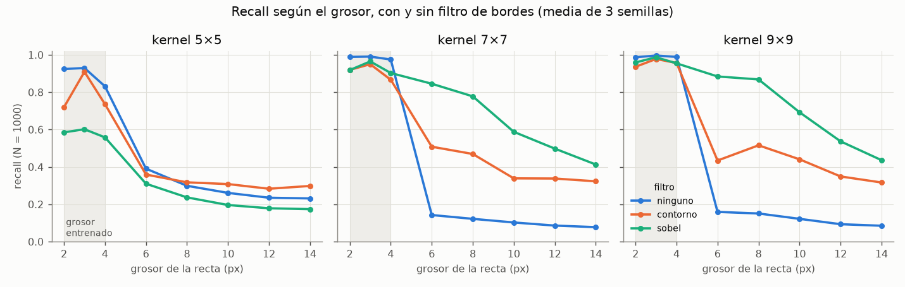
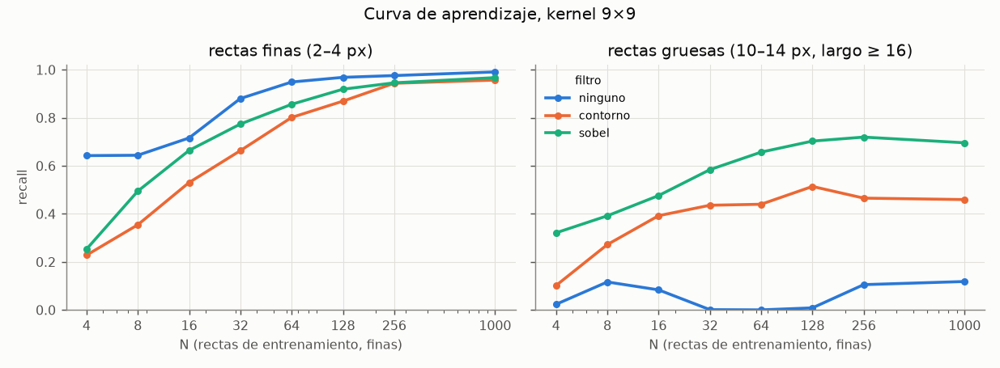
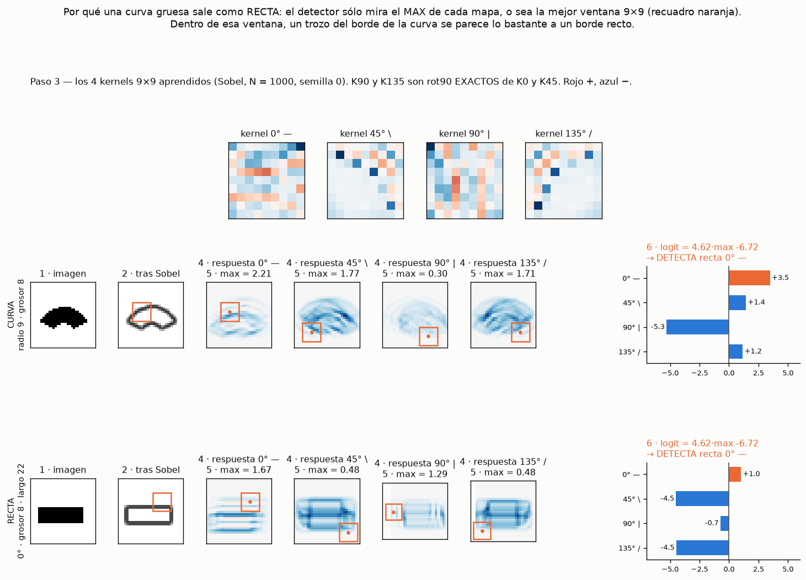
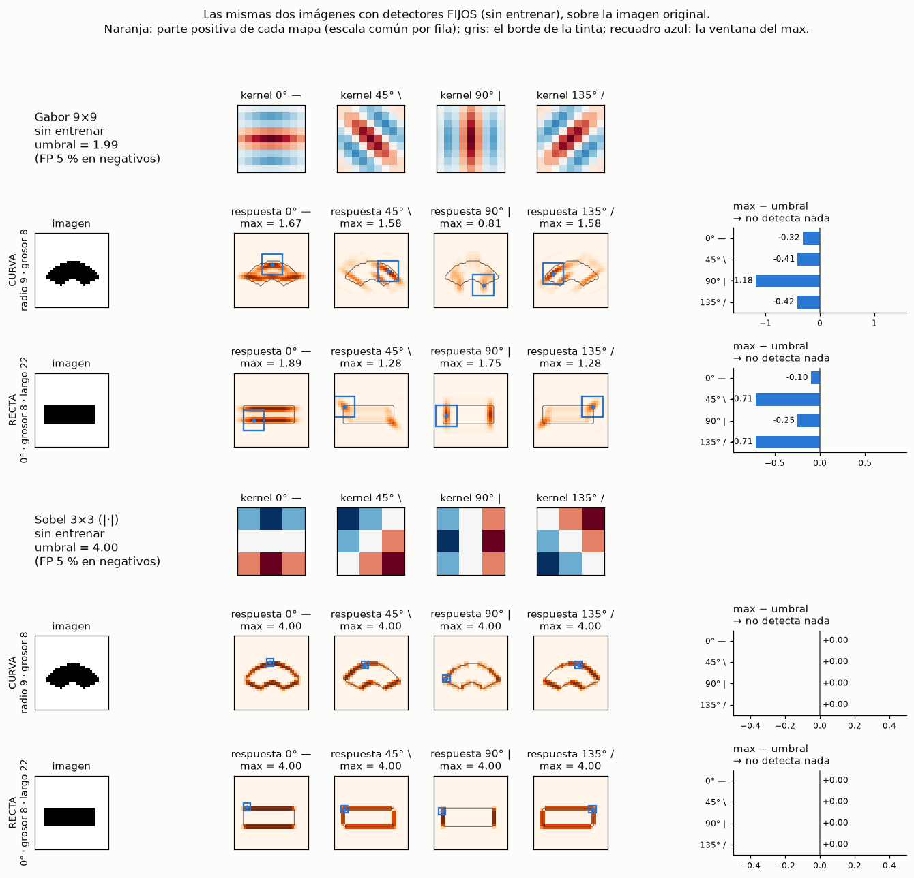
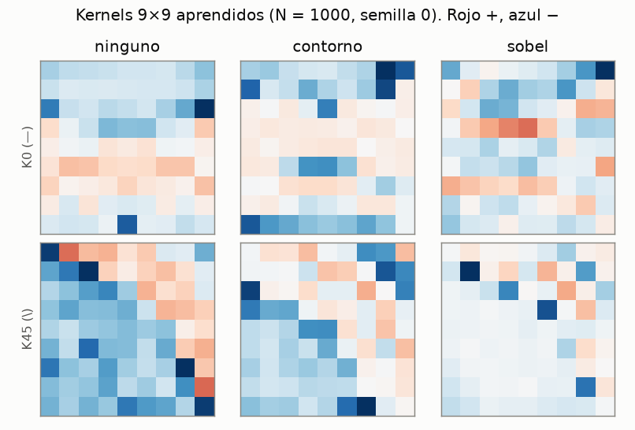

# `rect-bor` — el grosor de las rectas con un FILTRO DE BORDES antes del kernel lineal

**Pregunta** (pendiente 2 de `rect-lin`, el dueño): si un filtro de bordes convierte el trazo grueso en dos bordes finos,
¿el kernel lineal de `rect-lin` entrenado con rectas finas detecta también las gruesas, sin perder las finas, sin subir los
falsos positivos y sin más muestras? Reglas en [`REGLAS.md`](REGLAS.md); criterio escrito antes de medir en
[`instrucciones/02-criterio.md`](instrucciones/02-criterio.md) (commit `580f96e`).

## Resultado en una frase

**Sobel ayuda mucho, pero no llega.** Con el kernel 9×9, las rectas gruesas (10–14 px, largo ≥ 16) pasan de **0,12** a
**0,70** de recall. Las de 6–8 px pasan de 0,16 a **0,88**. Las finas apenas pierden (0,99 → 0,97) y los falsos positivos
siguen en 0,3 %. El criterio pedía 0,80 en las gruesas: **4 de 7**. El contorno (x − erosión), que se predijo mejor,
**queda por debajo** de Sobel con 7×7 y 9×9.

## Contra el criterio

«La mejor» = Sobel, 9×9 (la de más recall grueso-largo entre las que no pierden las finas).

| | hipótesis | resultado | |
|---|---|---|---|
| **G1** | recall grueso-largo ≥ 0,80 | **0,696** (control sin filtro 0,118) | ❌ |
| **G2** | fino ≥ control − 0,03 | 0,967 (control 0,991) | ✅ |
| **G3** | FP ≤ 0,05 | **0,003** (manchas 0,002; la predicción de que el anillo encendería, **no** pasó con Sobel) | ✅ |
| **G4** | N90 ≤ control | 128 (control 64): hacen falta el doble de ejemplos | ❌ |
| **G5** | medio (6–8 px) ≥ 0,85 | **0,876** | ✅ |
| **G6** | contorno ≥ Sobel | sólo con 5×5; con 7×7 y 9×9 Sobel gana (0,58 y 0,70 contra 0,36 y 0,46) | ❌ |
| **G7** | el Gabor sin entrenar, con Sobel, ≥ 0,70 | 0,539, y pierde las finas (0,13): el Gabor de `rect-lin` está hecho para trazo macizo | ❌ |

## Recall según el grosor



| N = 1000, 9×9 | 2 | 3 | 4 | 6 | 8 | 10 | 12 | 14 | FP |
|---|---:|---:|---:|---:|---:|---:|---:|---:|---:|
| sin filtro (`rect-lin`) | 0,99 | 1,00 | 0,99 | 0,16 | 0,15 | 0,12 | 0,09 | 0,09 | 0,001 |
| contorno | 0,94 | 0,98 | 0,96 | 0,43 | 0,52 | 0,44 | 0,35 | 0,32 | 0,006 |
| **Sobel** | **0,96** | **0,99** | **0,95** | **0,88** | **0,87** | **0,69** | **0,54** | **0,44** | **0,003** |

**Lo que se ve:** con Sobel el detector aguanta bien hasta 8 px y luego **cae con el grosor** (0,69 → 0,44 de 10 a 14 px).
Una hipótesis, **no comprobada**: entrenado sólo con trazos finos, lo que aprende es «dos bordes muy juntos» (los dos lados
de un trazo de 2–4 px), no «un borde recto». Cuando el trazo engorda, los dos bordes se separan más que lo que cubre el
kernel y cada uno queda solo, que no es lo que aprendió. Se comprobaría entrenando con un poco de grosor, o mirando el
mapa de respuesta sobre un borde aislado.

## Curva de aprendizaje (9×9)



El filtro **cuesta muestras**: con pocos ejemplos el detector con bordes va claramente por detrás en las finas (N = 4:
0,25 contra 0,64; N = 32: 0,77 contra 0,88) y alcanza al control hacia N = 256. N90: 128 contra 64.

## Curvas gruesas (efecto secundario, no estaba en el criterio)

Con Sobel, el 9×9 detecta como recta el **100 %** de las curvas de 8 px de grosor, de cualquier radio (sin filtro, 10–26 %).
O sea: el filtro trae las gruesas **todas**, curvas incluidas. Para «recta más fuerte que curva» (H8 de `rect-lin`) esto no
mejora nada.

### Un ejemplo, paso a paso (añadido después, a pedido del dueño)



`python nn/ejemplo_curva.py`: una curva del banco (radio 9, grosor 8) y una recta del mismo grosor, por el brazo Sobel ·
9×9 · N = 1000 · semilla 0. **Cuatro cosas que se ven, y ninguna estaba en el criterio:**

1. **El detector sólo mira el MAX de cada mapa**, o sea la mejor ventana 9×9 (recuadro naranja). En la curva, esa ventana
   cae sobre el **lomo de arriba**, la parte más plana de su borde, y eso basta para «recta 0°».
2. **La curva responde MÁS que la recta**: logit +3,5 contra +1,0. O sea que aquí no hay ni «recta débil en la curva».
3. ⚠ **El kernel responde DESPLAZADO del borde, en zonas sin tinta** (visto por el dueño en la figura; medido después). En
   el rectángulo, el mapa de 0° no se enciende SOBRE los bordes de arriba y abajo sino en bandas paralelas a 1–3 px de
   ellos, también dentro del rectángulo, donde no hay nada. Fuera de ±4 px de un borde el mapa vale exactamente 0 (es una
   convolución 9×9), así que no hay respuesta «de la nada»; lo que falla es DÓNDE dentro de la ventana. Y el kernel de 0°
   da más en la esquina (1,67) y en la curva (2,21) que a lo largo del borde recto (1,49). La causa más probable, **sin
   comprobar**: el entrenamiento sólo dice «hay una recta EN ALGUNA PARTE de la imagen» (se toma el max), nunca DÓNDE, así
   que nada obliga al kernel a centrar su respuesta en la línea.
   (La primera versión de esta figura pintaba los valores negativos en azul y estiraba los ejes con los recuadros del
   margen, y eso exageraba la «nube»: está corregida.)
4. ⚠ **La «curva» de radio 9 y grosor 8 del banco es casi una mancha** (un creciente macizo; el hueco del arco queda
   tapado por el grosor). Es el mismo defecto de diseño que la «recta» de 10 × 14 px: con trazo grueso, la figura deja de
   ser lo que dice su etiqueta. Parte del «100 % de curvas gruesas detectadas» es esto, y no se ha separado cuánto.

### Las mismas dos imágenes con detectores FIJOS (añadido después, a pedido del dueño)



`python nn/ejemplo_fijos.py`: Gabor 9×9 a mano y Sobel 3×3 orientado (en valor absoluto), SIN entrenar, sobre la imagen
original; umbral a 5 % de FP sobre los negativos de entrenamiento.

- **Los mapas de los dos filtros fijos están donde deben**: pegados a la tinta, y cada orientación sobre su borde (en el
  rectángulo, 0° en los lados largos y 90° en los cortos). No hay bandas desplazadas como en el kernel aprendido: **el
  desplazamiento era del aprendizaje, no de la convolución**.
- **Gabor ordena bien**: con el kernel de 0°, la recta (1,89) da más que la curva (1,67). Pero ninguno pasa el umbral
  (1,99): está hecho para un trazo de ~3 px, y en uno de 8 px sólo encaja con un borde a la vez. ⚠ «No detecta» quiere
  decir sólo eso: el MAX no pasa el umbral, aunque el MAPA sí muestra la recta. El umbral lo fijan las **manchas** del
  entrenamiento (discos de radio 2–5: mediana 1,55, p95 2,09), y el 31 % de ellas da más que este rectángulo (1,89). Las
  rectas finas dan 2,8–3,3, muy por encima.
- **Sobel 3×3 se SATURA**: en una imagen binaria, cualquier píxel de borde (recto, curvo o esquina) da el máximo posible,
  4,0, en las cuatro orientaciones, y el umbral también es 4,0 (lo alcanzan las manchas y los puntos). Su MAPA es correcto,
  pero su MAX no dice nada: con 3×3 no hay largo de recta que medir.
- La lección común: **la información está en el mapa, y el max de la imagen la tira**. Es el pendiente «el mapa, no el
  max» de `rect-lin`.

### Tanteo: un compositor de dígitos con el Gabor fijo (2026-10-09, pedido del dueño; NO es parte del criterio)

`python nn/prueba_digitos.py` (20 s en el dev). El Gabor 9×9 FIJO, sin entrenar nada, conservando el MAPA (sin max de la
imagen): max en celdas 4×4 → 8×8 por orientación. El compositor y el reparto de los `feat-*` (lineal, 180 train / 1617 val,
3 semillas; a ciegas, 3823 de otros escritores).

| detector | características | val (1617) | a ciegas (3823) |
|---|---:|---:|---:|
| píxeles 8×8 | 64 | 0,892 | 0,895 |
| píxeles 32×32 | 1024 | 0,894 | 0,909 |
| A · Gabor, su mapa | 256 | 0,941 | 0,928 |
| B · A integrado a lo largo de su orientación (15 px) | 256 | 0,944 | 0,933 |
| **C · B en 2 escalas** | 512 | **0,955** | **0,947** |
| *`feat-ind32`: 13 detectores CNN entrenados* | 832 | *0,949* | — |

**La predicción escrita antes falló a favor**: decía que ninguno llegaría a 0,949, por faltar arcos, lazo y esquinas. Con 4
kernels fijos y sólo rectas, C lee 0,955. ⚠ Es un tanteo: 0,006 sobre la referencia, 3 semillas que sólo cambian la
inicialización del compositor, y el protocolo de las referencias no se ha re-ejecutado (lo verificó el agente
`verificador` leyendo los documentos). Para declarar algo, haría falta un experimento propio con su criterio.

## Los kernels



Ninguno de los tres se parece a una línea limpia (como ya pasaba en `rect-lin`).

## Coste y control

- **Vast:** AMD EPYC 7702, 32 vCPU, Noruega, 0,110 $/h; 144 brazos en 12 trozos, **389 s de reloj**, 8,8 min en total con
  arranque, **0,0162 $** (del libro). En el dev habrían sido ~80 min *(estimado)*.
- **El control no se re-entrenó**: son los brazos «continua, 1 escala» de `rect-lin`, re-evaluados aquí con sus kernels
  guardados para tener la métrica nueva. ⚠ Los kernels se guardaron con 4 decimales, y por eso la re-evaluación difiere de
  lo medido allí en hasta **0,028** (máximo sobre los 72 brazos y tres métricas). No cambia ninguna lectura.

## Cómo se repite

```bash
python nn/prepro.py                       # los filtros, en ASCII
python nn/evaluar.py --referencias        # Gabor por filtro
nn/vast.sh rejilla                        # 144 brazos en Vast (o python nn/entrenar_local.py, ~80 min en el dev)
python nn/evaluar.py --tablas --figuras
```

## Lo que queda pendiente

⚠ La lista completa y ordenada de la línea de rectas (incluido lo que salió después de cerrar esto) vive en el
`CLAUDE.md` del repo, § «PENDIENTE (2026-10-09): la línea de RECTAS». Lo de abajo es lo que quedó al cerrar.

1. **Entrenar con algo de grosor** (p. ej. 2–8 px) con Sobel delante, para ver si aprende «un borde» y no «dos bordes
   juntos», y así pasar de 0,70 en lo grueso. Es la prueba directa de la hipótesis de arriba.
2. **El mapa, no el max** (pendiente 1 de `rect-lin`): con bordes, una recta gruesa debería dar DOS detecciones paralelas;
   eso sólo se ve en el mapa.
3. **Bordes de un solo lado** (el candidato vigente del repo): no se probó porque da 8 canales; necesitaría un detector de
   varios canales.
4. Las curvas gruesas pasan a detectarse como rectas: si se quiere distinguir recta de curva, el filtro no ayuda.
