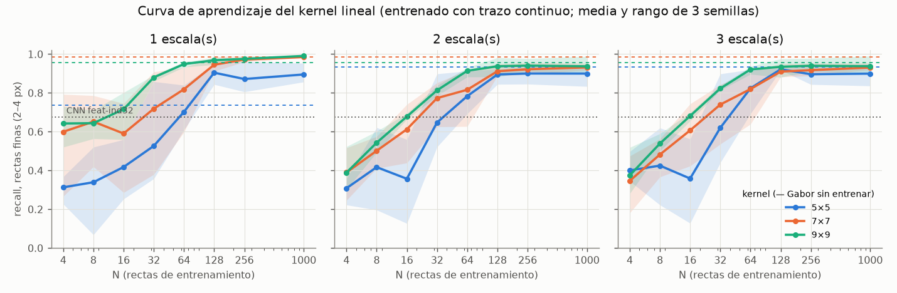
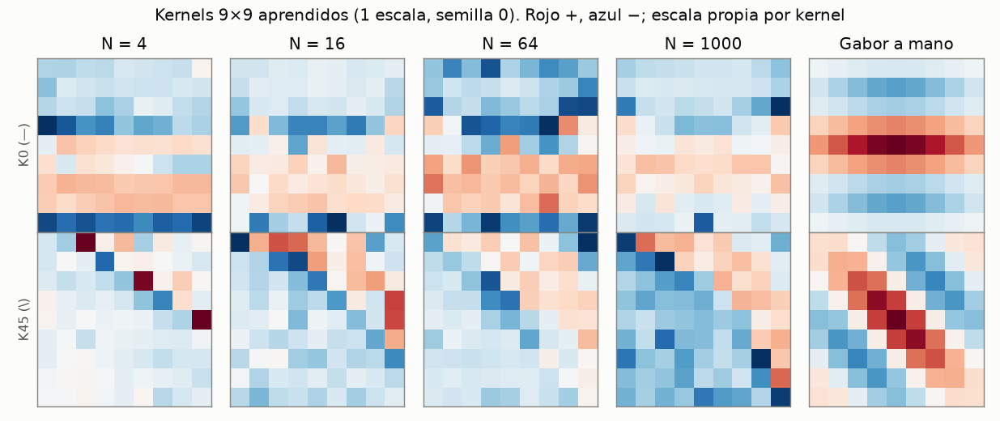
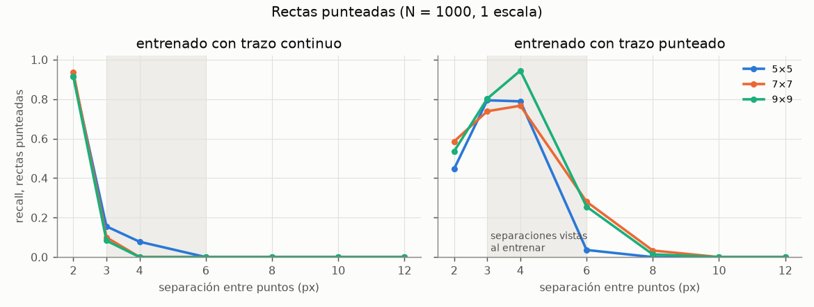
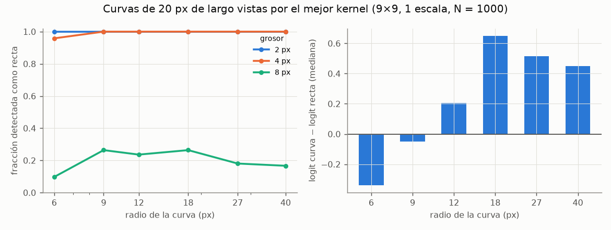

# `rect-lin` — el detector de rectas como un kernel LINEAL (célula simple de V1)

**Pregunta** (el dueño, 2026-10-08): ¿un detector de rectas que es un solo kernel lineal aprendido —52 a 164 parámetros—
aprende con POCAS muestras, generaliza a rectas punteadas, y responde más fuerte a una recta que a una curva? ¿Cómo queda
frente al detector CNN de `feat-ind32`? Se evalúa **el detector solo**, sin compositor ni dígitos. Reglas en
[`REGLAS.md`](REGLAS.md); criterio escrito antes de medir en [`instrucciones/02-criterio.md`](instrucciones/02-criterio.md)
(commit `b8590bb`, antes de la rejilla).

## Resultado en una frase

**Para rectas finas, un kernel lineal de 9×9 (164 parámetros) es un detector casi perfecto —recall 0,99 en cualquier
ángulo, 0,07 % de falsos positivos— y llega al 0,95 con 64 ejemplos; la CNN de `feat-ind32` (167.300 parámetros) se queda
en 0,67.** Pero aprender aporta poco sobre un Gabor puesto a mano (0,96–0,98 sin ver una sola recta), las escalas no
arreglan el grosor en el kernel aprendido, las punteadas no se generalizan en ningún sentido, y una curva de 20 px se
detecta como recta casi siempre. 2 de 9 hipótesis.

## Contra el criterio (escrito antes)

| | hipótesis | resultado | |
|---|---|---|---|
| **H1** | algún kernel aprende las finas (recall ≥ 0,90, FP ≤ 0,05) | 9×9, 1 escala: **0,991**, FP **0,0007** | ✅ |
| **H2** | ésa necesita pocas: N90 ≤ 32 | **N90 = 64** (con 32: 0,88; hacía falta 0,89) | ❌ por poco |
| **H3** | aprender supera al Gabor a mano en ≥ 0,05 | +0,033 (0,991 contra 0,957), con FP 0,0007 contra 0,039 | ❌ |
| **H4** | 3 escalas suben el recall grueso ≥ 0,20 (7×7) | 0,087 → 0,104 (+0,017) | ❌ |
| **H5** | con 3 escalas, 7≈9 y 5 detrás | recall total 0,55 / 0,50 / 0,47: **el 5×5 va delante** (porque ve algo del grueso) | ❌ |
| **H6** | entrenado con continuas, punteadas a ≤ 4 px ≥ 0,70 | 0,35 / 0,33: sólo a 2 px (puntos que casi se tocan) | ❌ |
| **H6b** | las escalas alargan el alcance a 10–12 px | +0,00: nadie ve nada a 10–12 px | ❌ |
| **H7** | entrenado con punteadas, ve continuas ≥ 0,85 y FP en puntos sueltos ≤ 0,15 | continuas **0,25** como mucho; FP en puntos sueltos **0,47–0,61** | ❌ |
| **H8** | recta > curva: la detección baja con el radio y R ≤ 9 se detecta ≤ ½ | monótona sí, pero R ≤ 9 se detecta **0,75** (límite 0,50) | ❌ |
| **H9** | contra la CNN: fino ≥ CNN − 0,05 y grueso > CNN | fino **0,99 contra 0,67** ✅; grueso 0,10 contra 0,45 ❌ | ❌ |

⚠ **Con el pendiente del dueño delante** (REGLAS.md: «las líneas gruesas no me preocupan… pueden eliminarse mediante
filtros de bordes»): H4 y la mitad «grueso» de H9 pesan poco. Leído así, **contra la CNN el kernel gana en lo que importa**.

## La curva de aprendizaje (lo que el dueño pidió medir)



Recall en rectas finas (2–4 px), media de 3 semillas, entrenado con trazo continuo:

| kernel | parámetros | N = 4 | 8 | 16 | 32 | 64 | 128 | 256 | 1000 | N90 | Gabor (N = 0) |
|---|---:|---:|---:|---:|---:|---:|---:|---:|---:|---:|---:|
| 5×5, 1 escala | 52 | 0,31 | 0,34 | 0,42 | 0,53 | 0,70 | 0,90 | 0,87 | 0,90 | 256 | 0,74 |
| 7×7, 1 escala | 100 | 0,60 | 0,65 | 0,59 | 0,72 | 0,82 | 0,95 | 0,97 | 0,98 | 128 | 0,98 |
| **9×9, 1 escala** | **164** | **0,64** | **0,64** | **0,72** | **0,88** | **0,95** | **0,97** | **0,98** | **0,99** | **64** | 0,96 |
| 9×9, 2 escalas | 164 | 0,39 | 0,54 | 0,68 | 0,81 | 0,91 | 0,94 | 0,94 | 0,94 | 64 | 0,96 |
| 9×9, 3 escalas | 164 | 0,37 | 0,54 | 0,68 | 0,82 | 0,92 | 0,93 | 0,94 | 0,94 | 64 | 0,96 |

(La tabla entera, con FP y los 9 tamaños × escalas, en `resultados/analisis.json` → `tabla`.)

**Cómo leerla:**
1. **Cuanto más grande el kernel, menos muestras necesita** (N90 de 256 → 128 → 64), al revés de lo que suele pasar con más
   parámetros: un kernel grande ve más largo de recta, y el largo es la señal.
2. **Añadir escalas a un kernel APRENDIDO empeora lo fino** (0,99 → 0,94): el mismo kernel tiene que servir en tres
   resoluciones a la vez y se queda en un compromiso. Al Gabor no le pasa (es el mismo en las tres).
3. **El ángulo no es problema**: el 9×9 ve igual una recta en el centro de su orientación (1,00) que a 15–22,5° de él
   (0,98). La CNN cae a **0,30** en ese tramo y a 0,49 con rectas de 10 px: entrenada con ±12°, no ve lo de en medio. Es el
   pendiente 1 de `feat-1lado`, y queda medido: con 4 orientaciones y un kernel lineal **sobra** para el ángulo.

## Los kernels aprendidos



⚠ **No se parecen al Gabor.** El aprendido es una banda positiva tenue con negativos en los bordes y puntos fuertes sueltos;
el de 45° casi no tiene diagonal. Detecta las finas igual de bien que el Gabor y con muchos menos falsos positivos, pero
**no es «la célula simple de libro»**. Explicación no comprobada: con max sobre posiciones y un umbral, basta con no
responder a manchas, ruido y puntos para que la frontera quede donde quiere; nada le pide parecerse a una línea. Una
consecuencia sí está medida, abajo: responde a las curvas al menos tanto como a las rectas.

## Punteadas: no se generaliza en ningún sentido



- **Entrenado con continuas**, ve punteadas sólo a 2 px de separación (0,91–0,96), que con discos de 2 px es casi una
  recta continua. A 3 px ya cae a ≤ 0,25, y a 4 px o más, nada.
- **Entrenado con punteadas**, ve las de la separación que vio (3–4 px: 0,74–0,94), cae a 6 px y desaparece a 8. Y
  **no ve las continuas** (≤ 0,25) y se enciende con **la mitad de los puntos SUELTOS** (FP 0,47–0,61): aprendió «hay
  puntos» más que «están alineados».
- **Las escalas no lo arreglan** (H6b: +0,00 a 10–12 px).

Lectura: un único kernel lineal no hace la agrupación que hace la vista con puntos separados. Es exactamente la segunda
etapa del pendiente (agrupar detecciones), no algo que se consiga con otro kernel.

## Curvas: se detectan como rectas, casi siempre



Curvas de 20 px, mejor configuración (9×9, 1 escala). Con 2–4 px de grosor **se detectan el 96–100 %** de las curvas de
**cualquier** radio, incluso R = 6 (un arco de ~190°). La fuerza sólo es menor que la de una recta en las más cerradas
(R = 6: −0,34 en logit; R = 9: −0,05); de R = 12 en adelante **la curva responde más que la recta** (+0,2 a +0,65).

- El dueño aceptó «una recta débil en una curva, siempre que salga menos fuerte»: **se cumple sólo para R ≤ 9**.
- Es coherente con la idea del pendiente («una curva es una colección de rectas cortas»): el max espacial encuentra el
  trozo más recto de la curva dentro de su ventana de 9×9. Para que eso sirva de base a un detector de curvas haría falta
  el **mapa** de detecciones (dónde y con qué orientación), no el max de la imagen, que es lo que se midió aquí.

## La CNN de referencia y el Gabor

| | parámetros | fino | medio (6–8) | grueso (10–14) | FP |
|---|---:|---:|---:|---:|---:|
| kernel 9×9, 1 escala, N = 1000 | 164 | **0,991** | 0,155 | 0,101 | **0,0007** |
| Gabor 7×7, 1 escala (sin entrenar) | 0 (+ umbral) | 0,984 | 0,000 | 0,000 | 0,036 |
| Gabor 7×7, 2 escalas (sin entrenar) | 0 (+ umbral) | 0,984 | **0,885** | 0,000 | 0,038 |
| CNN `feat-ind32` (4 detectores) | 167.300 | 0,674 | 0,708 | **0,455** | 0,000 |

El Gabor de 2 escalas es lo mejor medido en grosor medio (0,88): la pirámide **sí** funciona con un kernel fijo; lo que
no funciona es aprender UN kernel para todas las escalas a la vez.

## Velocidad: ¿acelera contratar? (pregunta del dueño)

| | Vast: Xeon E5-2682 v4, 32 vCPU, Noruega | dev: 2 vCPU |
|---|---|---|
| reloj de la rejilla (432 brazos) | **24,6 min** (31,8 con arranque y recogida) | ~4 h 20 min *(estimado: 3,6 h de proceso para 381)* |
| s por brazo, relativo | 1,21× (mediana; un proceso de 2 hilos va algo más lento) | 1× |
| coste | **0,0688 $** (del libro) | 0 $ |

**Sí: ~8× en reloj por 7 céntimos**, por paralelismo (14 trozos × 2 hilos), no por velocidad por proceso.
**Y reproducible**: los 381 brazos hechos en las dos máquinas dan métricas **y kernels idénticos bit a bit**.

## Cómo se repite

```bash
python nn/datos.py --comprobar            # los dos datasets, por huella
python nn/modelo.py --comprobar           # rot90 exacto, pirámide, Gabor orienta bien
python nn/referencia_cnn.py --comprobar   # la CNN de feat-ind32, por id + huella
nn/vast.sh rejilla                        # la rejilla en Vast (o: sh nn/lanzar.sh, en el dev, ~4 h)
python nn/evaluar.py --referencias --tablas --figuras
```

## Lo que queda pendiente

1. **El mapa, no el max.** Para la segunda etapa (curvas como cadenas de rectas cortas, y agrupar puntos separados) hace
   falta dónde y con qué orientación responde el kernel, no el max de la imagen. Es la pregunta natural siguiente.
2. **Grosor vía filtro de bordes** (el dueño): pasar el trazo grueso por un filtro de bordes y dárselo al detector fino.
3. **Gabor de 2 escalas como detector «de serie»**: sin entrenar ya da 0,98 fino y 0,88 medio. Falta ver si, ajustando
   sólo su umbral o su λ, baja los FP al nivel del aprendido.
4. **Por qué el kernel aprendido no se parece a una línea** (arriba): no comprobado. Se podría probar con una
   regularización que lo empuje hacia la forma (suavidad, media cero) y ver si así distingue mejor recta de curva.
5. **Una cosa de método**: N90 mezcla «aprende» con «ve las 4 orientaciones»; con N = 4 hay orientaciones sin ningún
   ejemplo (los N primeros, al azar). Un N equilibrado por orientación daría una curva más limpia en N pequeño.

## Qué se cambió después de escribir el criterio (y por qué)

Antes de la rejilla, al comprobar el mecanismo: se quitó el umbral dentro de la ReLU y se cambió BCE por entropía cruzada
de 5 clases (los dos hacían que no aprendiera nada; REGLAS.md lo cuenta). En esas pruebas se vieron: 7×7 1 escala con
N = 128 → 0,99 fino; Gabor 0,98. El criterio no se tocó.
