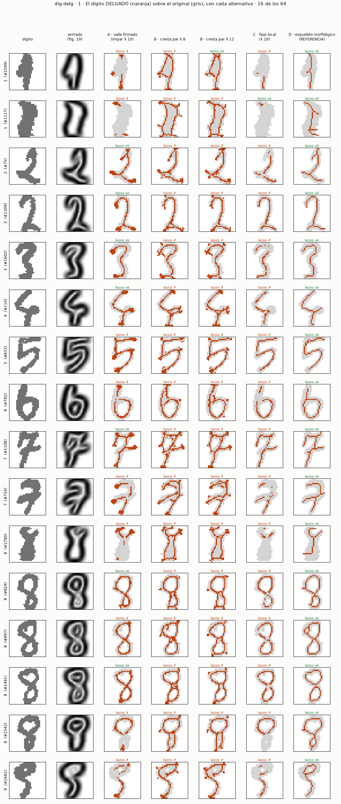
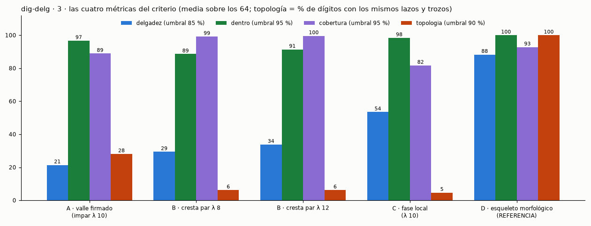

# `dig-delg` — el dígito DELGADO a partir de las respuestas de Gabor (2026-10-10)

**Pregunta** (`experimento.json`): ¿se puede obtener el mismo dígito pero delgado (trazo de ~1 px, centrado, sin perder
ni añadir lazos) aprovechando las respuestas del Gabor impar de la figura 19 del boceto `curvas-gabor`, en vez de un
esqueleto morfológico, y qué alternativa lo hace mejor? El encargo literal, en `instrucciones/01-encargo.md`; el
criterio, escrito y commiteado **antes** de medir (`f97b42f`), en `instrucciones/02-criterio.md`.

**Primera vuelta: ninguna alternativa pasa los cuatro umbrales, tampoco la referencia morfológica.** 0 $, ~20 s en el
dev: `python nn/delgado.py` → `resultados/`.

## Los brazos

| brazo | qué hace |
|---|---|
| **A · valle firmado** | la línea clara de la figura 19: donde la respuesta del Gabor impar (λ 10, 9×9, 8 orientaciones) **cambia de signo** a lo largo de su normal con la polaridad de un **trazo** (borde de subida y luego de bajada, no la de un hueco entre trazos) **y** \|o\| es mínimo ahí; fuerza del cambio > 0,2 |
| **B · cresta par λ 8 / λ 12** | un Gabor **par** del ancho del trazo responde máximo en su centro: se toma la cresta (máximo a lo largo de su normal) |
| **C · fase local** | par e impar de la misma escala (λ 10): cresta del par donde la fase \|o\|/e es < 30° (centro de trazo) |
| *D · esqueleto morfológico* | *`skimage.skeletonize` sobre el dígito binario. **Sólo referencia**: es morfología* |

## Lo que salió (los 64 dígitos de la figura 19)

| brazo | delgadez (≥ 85) | dentro de la tinta (≥ 95) | cobertura (≥ 95) | topología igual (≥ 90 % de dígitos) |
|---|---:|---:|---:|---:|
| A · valle firmado | 21,4 | **96,7** ✓ | 88,9 | 28,1 |
| B · cresta par λ 8 | 29,4 | 88,6 | **99,2** ✓ | 6,2 |
| B · cresta par λ 12 | 33,8 | 91,4 | **99,6** ✓ | 6,2 |
| C · fase local | 53,5 | **98,4** ✓ | 81,7 | 4,7 |
| *D · esqueleto (referencia)* | ***88,3*** ✓ | ***100*** ✓ | *92,8* | ***100*** ✓ |

Cada brazo sobre los 64: `resultados/2-A.png`, `2-B8.png`, `2-B12.png`, `2-C.png`, `2-D.png`.

**Lo que se ve en las figuras** (mirado, no medido aparte):

- **Las tres alternativas de Gabor encuentran el centro del trazo** (A y C caen dentro de la tinta en el 97–98 %), y en
  dígitos como el 2, el 4, el 5 y el 6 dibujan casi el mismo dígito delgado que la referencia.
- **Pero no salen de 1 px**: las líneas son escaleras de 2 px y tienen **manchas en los extremos** del trazo (A), donde el
  Gabor ve el final como un borde más.
- **B traza DOS líneas en los trazos muy anchos** (los 1 de UCI, casi un bloque): el Gabor par de λ 8–12 es más estrecho
  que el trazo y responde en sus dos bordes, no en el centro. Y añade **ramitas** en los cruces.
- **A y C se ROMPEN** donde ninguna orientación ve un trazo limpio (cruces, lazos pequeños, el centro de los 1 anchos):
  de ahí su cobertura baja y su topología.
- **La topología es la métrica más dura**: basta un hueco de un píxel o una mancha suelta para fallarla, y por eso las
  cuatro alternativas se quedan en 5–28 %.

**La predicción, contra lo medido**: acerté que A sale centrado y se rompe (no pasa cobertura ni topología), que B es
el más continuo (pasa cobertura) y que ninguna de Gabor pasa los cuatro. Fallé en que B pasaría «dentro» (88–91 %, por
las ramitas y las dos líneas) y en que **D pasaría los cuatro**: se queda en 92,8 % de cobertura.

⚠ **Los umbrales internos de cada brazo** (fuerza del valle de A 0,2 · cresta de B y C 0,3 del máximo · fase de C < 30°)
se fijaron al escribir `nn/delgado.py`, antes de su primera ejecución, y no se han tocado; pero **no están en el commit
del criterio** (`f97b42f`), así que «antes de mirar» no se puede probar para ellos (lo señaló el `verificador`). Lo que
sí está probado antes de mirar son las cuatro métricas y sus umbrales.

**Verificado ejecutando** (agente `verificador`, 2026-10-10): reproduce las 20 cifras de la tabla, los 8 ficheros de
`resultados/` salen idénticos byte a byte, los 64 índices son los de la figura 19 y en el orden de ésta, y el criterio
se commiteó antes que el código. Las observaciones sobre las figuras son de mirarlas, no medidas.

## ⚠ Dos defectos del criterio, que se dicen y no se arreglan aquí (R13)

1. **La cobertura de ≤ 3 px es demasiado estricta para estos dígitos**: ni la referencia la pasa (92,8 %), porque los
   trazos de estos 64 dígitos llegan a **8,4 px de ancho máximo en la mediana (6–14 px)**, aunque el ancho típico de un
   píxel de tinta es 4 px (medido con la distancia al borde, 2 × su máximo y 2 × su mediana): en las partes más gruesas
   —los 1 casi bloque— el borde queda a más de 3 px del centro. Un umbral relativo al ancho del trazo sería lo justo.
2. **La delgadez castiga las escaleras de 4-conexión**: el codo de una línea de 1 px en escalera tiene 4 píxeles en su
   3×3 y cuenta como «grueso». Penaliza a todas las alternativas por igual, pero infla la distancia a D.

Cambiarlos ahora sería ajustar el criterio después de mirar. Si el dueño quiere, van como **criterio de la segunda
vuelta**, escrito antes de correrla.

## Alternativas para la segunda vuelta (para elegir)

| | idea | qué arreglaría | qué cuesta |
|---|---|---|---|
| **1** | **A + supresión de no-máximos de verdad** (quedarse con UN píxel a lo largo de la normal, el de \|o\| mínimo, sin empate) | la escalera de 2 px → 1 px | poco; sigue siendo Gabor |
| **2** | **Unir por histéresis** (como Canny): umbral alto para empezar una línea, bajo para continuarla siguiendo su orientación | las roturas de A y C en cruces y lazos | poco; usa la orientación que el Gabor ya da |
| **3** | **Escala adaptativa** en B: λ_p por píxel según el ancho local del trazo (el mejor de varias escalas) | las dos líneas de los trazos anchos | medio: varias escalas por dígito |
| **4** | **Combinar**: el centro de A (preciso) donde existe, y B (continuo) donde A se rompe | precisión de A + continuidad de B | medio |
| **5** | **Aprendido**: una red pequeña que va de las respuestas de Gabor al dígito delgado, con D como **maestro** sólo para entrenar | todo a la vez, si generaliza | hay que entrenar; usa la morfología como profesor (decisión del dueño) |
| **6** | **Aceptar D** (el esqueleto morfológico) para el adelgazamiento | ya pasa delgadez, dentro y topología | contradice el espíritu de la regla del 2026-10-10 (Gabor, no morfología): decisión del dueño |

Lo que haría yo primero: **1 + 2** sobre A (siguen siendo sólo Gabor y atacan sus dos defectos medidos), y en paralelo
**3** sobre B.
