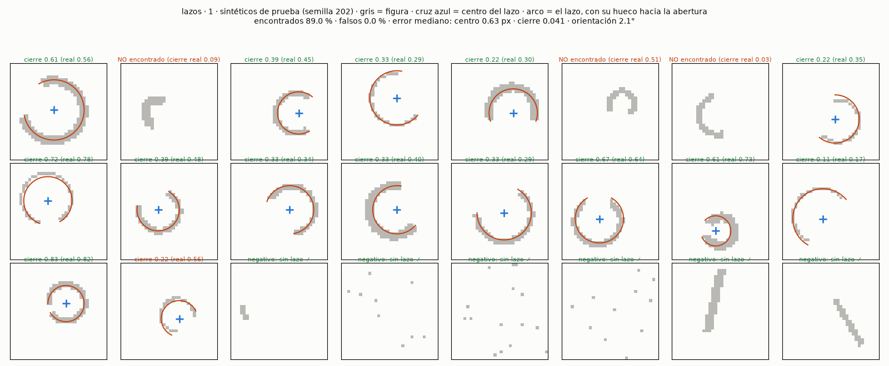
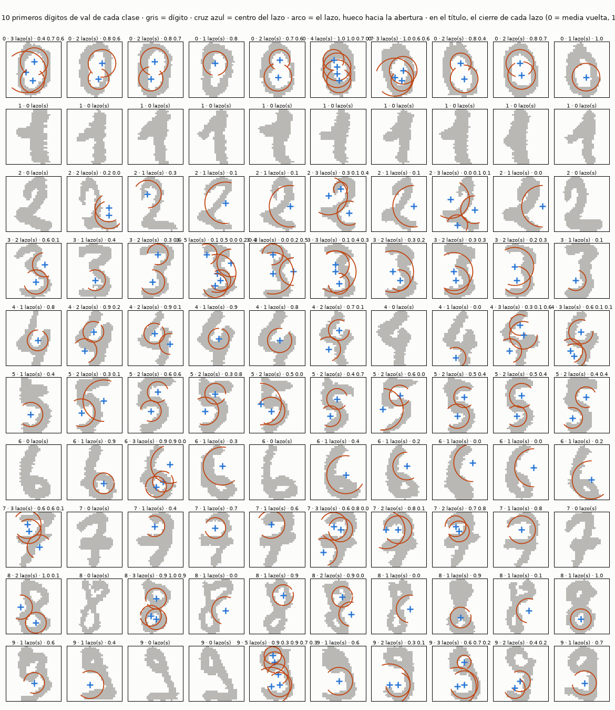
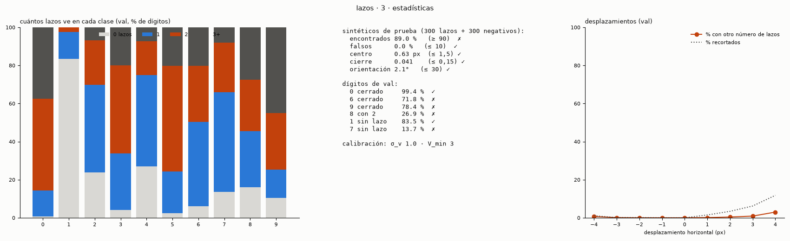
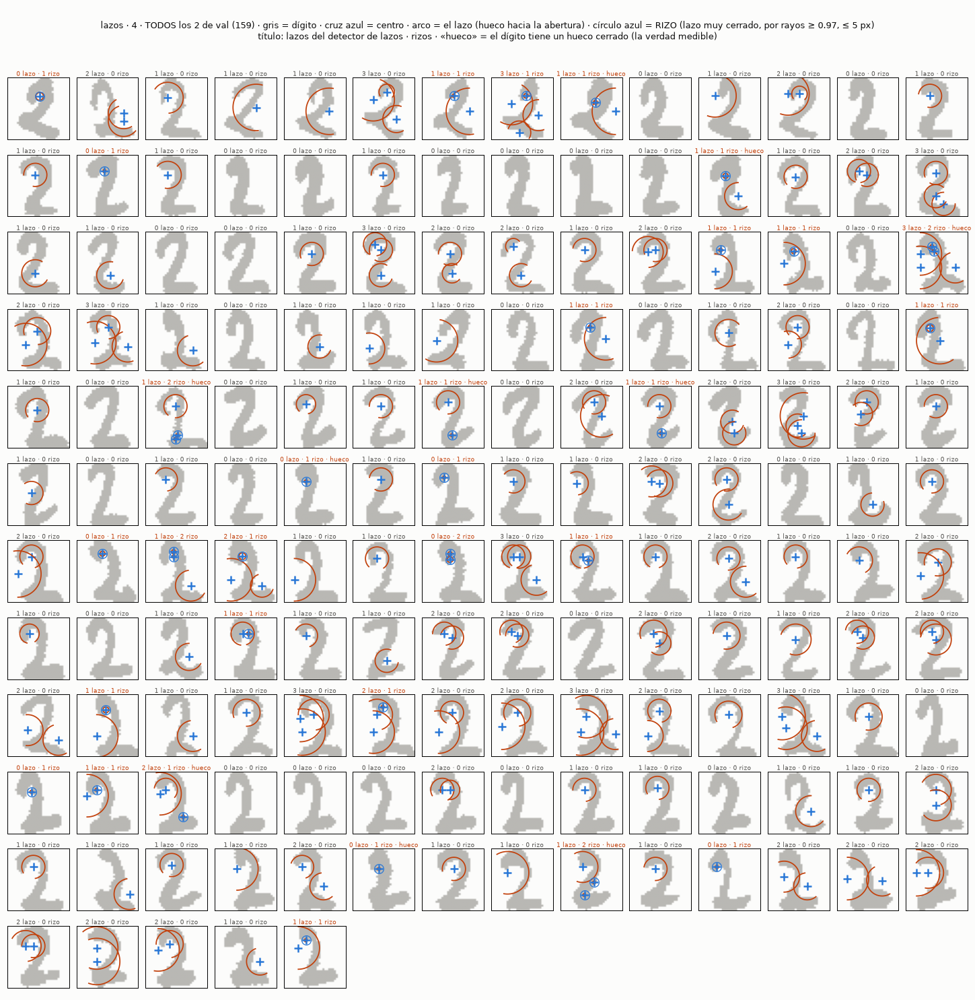
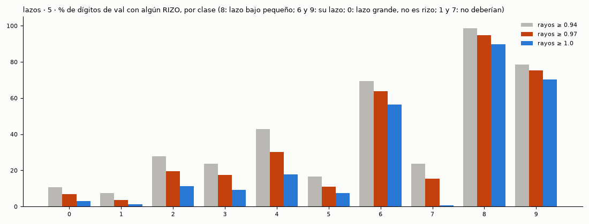

# `lazos` — detector de LAZOS con grado de cierre, centro y orientación (2026-10-11)

**Pregunta** (`experimento.json`): ¿puede un detector de lazos construido sobre el detector de curvas delgado (cada
píxel curvo vota por su centro de curvatura) encontrar los lazos de los dígitos con su centro, su grado de cierre (0 =
media vuelta, abierto; 1 = vuelta completa) y la dirección de su abertura? Encargo en `instrucciones/01-encargo.md`;
criterio, escrito y commiteado **antes** de medir (`50a5196`), en `instrucciones/02-criterio.md`.

**Primera vuelta: el detector funciona en lazos sintéticos limpios y falla en los dígitos.** 0 $, ~80 s en el dev:
`python nn/lazos.py` → `resultados/`.

## El detector

    imagen ─► detector de curvas delgado (copiado del boceto curvas-gabor: 12 Gabor par λ 6, TAU 0,6, giro κ)
           ─► cada píxel con |κ| ≥ 2 °/px vota en su centro de curvatura (p + 57,3/|κ| en la dirección de κ·(−sin θ, cos θ))
           ─► votos suavizados (σ_v 1) · máximos con ≥ 3 votos y fuera de la tinta = candidatos
           ─► radio = la corona (2–12 px) con más tinta por perímetro · cobertura = fracción de 36 sectores de 10° con
              tinta en [0,6 R, 1,4 R] · cierre = (cobertura − 0,5)/0,5 · orientación = centro del hueco mayor

Calibración (σ_v, V_min) elegida con 150 lazos y 150 negativos sintéticos (semilla 101): **σ_v 1 · V_min 3**. El
detector de curvas copiado da **exactamente** el mismo giro que el del boceto (comprobado en 50 dígitos, diferencia 0).

## Lo que salió

| criterio | umbral | medido | |
|---|---|---:|---|
| 1 · lazos sintéticos encontrados | ≥ 90 % | 89,0 % | ✗ (por 1 punto) |
| 2 · negativos con lazo (falsos) | ≤ 10 % | **0 %** | ✓ |
| 3 · error del centro, mediana | ≤ 1,5 px | **0,63 px** | ✓ |
| 4 · error del cierre, mediana | ≤ 0,15 | **0,04** | ✓ |
| 5 · error de la orientación, mediana | ≤ 30° | **2,1°** | ✓ |
| 6 · 0 / 6 / 9 con un lazo de cierre ≥ 0,5 | ≥ 80 % | **99,4** / 71,8 / 78,4 | ✓ / ✗ / ✗ |
| 7 · 8 con dos lazos | ≥ 60 % | 26,9 % | ✗ |
| 8 · 1 / 7 sin lazos | ≥ 80 % | **83,5** / 13,7 | ✓ / ✗ |

Número de lazos por clase (val, %; 0 · 1 · 2 · 3+): 0: 1 · 14 · 48 · 38 — 1: 84 · 14 · 2 · 0 — 6: 6 · 44 · 29 · 20 —
7: 14 · 52 · 26 · 8 — 8: 16 · 30 · 27 · 28 — 9: 10 · 15 · 30 · 45 (todas en `resultados/metricas.json`).

**Desplazamientos** (horizontal, ±4 px): el número de lazos cambia en ≤ 3 % de los dígitos (y ese 3 % coincide con el
12 % de recortados en +4) y el centro del lazo principal se mueve **exactamente** d (error 0). Plana, como se esperaba por
construcción.

**Predicción, contra lo medido**: acerté que el 8 no llega (27 % contra 60) y que el 7 falla (su codo atrae votos); fallé
en el cierre de los sintéticos (esperaba que fallara en los gruesos: error 0,04) y en el 6, que esperaba que pasara (72 %).

## Por qué falla en los dígitos (mirado en la figura 2; no medido aparte)

1. **Varios lazos por lazo.** El 0 es un óvalo: sus centros de curvatura no caen en un punto sino a lo largo de su eje
   largo (la «evoluta» de una elipse), así que los votos forman una nube alargada con **varios máximos**, y cada uno pasa
   como lazo. Quitar duplicados por distancia (< R/2) no basta.
2. **Lazos que no existen.** Con trazos de 4 px, la corona [0,6 R, 1,4 R] es ancha y la tinta de trazos **vecinos** llena
   sectores: el codo del 7 o la panza del 5 dan cobertura ≥ 0,5 sin que haya un lazo. Y la corona puede crecer hasta
   12 px y abarcar medio dígito (arcos más grandes que el dígito en la figura).
3. **El 8**: sus dos lazos se tocan; los votos de los dos se mezclan en el centro y gana un solo lazo grande.

## Lo que lo arreglaría (segunda vuelta, sin probar)

| | idea | ataca |
|---|---|---|
| 1 | **explicar la tinta**: tras aceptar un lazo, quitar los votos (y la tinta) que ese lazo ya explica, y buscar el siguiente | duplicados del 0, el 8 |
| 2 | **corona estrecha y radio coherente**: exigir tinta a un radio constante (± 1,5 px), no en una corona del 40 % | falsos del 7 y del 5 |
| 3 | **hueco en el centro**: un lazo deja vacío su interior (sin tinta a < 0,5 R) | falsos en trazos gruesos |
| 4 | **radio máximo relativo al dígito** (≤ la mitad de su alto) | los arcos enormes |

## Verificación (agente `verificador`, 2026-10-11)

Reproducido en una copia: `metricas.json` idéntico y las tres figuras con el mismo md5; el detector de curvas copiado
da el mismo giro que el del boceto en 200 dígitos (diferencia máxima 0); el criterio se commiteó antes que el código;
la orientación detectada en lazos sintéticos de abertura conocida se desvía ≤ 5° (sesgo de los sectores de 10°).
**Lo que no estaba en el criterio y se añadió al escribir el código**, sin tocar umbrales: el radio se elige por tinta
**por perímetro** (para no premiar coronas grandes), los candidatos a menos de R/2 se funden, los máximos son locales en
3×3, y la orientación sólo se omite con el lazo **cerrado del todo** (36/36 sectores), no desde cierre 0,95 como decía el
criterio — la evaluación de orientación usa cierre < 0,9, así que no cambia ninguna cifra.

## Sondeo: los lazos MUY CERRADOS de radio pequeño (los rizos de los 2) — 2026-10-11, pedido del dueño

*«Veo curvas de radio pequeño perderse. Tal vez esperamos una curva demasiado redonda. Checa si se pueden incluir estos
lazos muy cerrados. Toma unos 2 como ejemplo.»* **Sondeo, no vuelta del criterio**: los números de abajo no pasan ni
fallan nada; sirven para decidir la segunda vuelta. [`nn/rizos.py`](nn/rizos.py) (4 min, 0 $;
[`resultados/rizos.json`](resultados/rizos.json)).

**Por qué se pierden.** El detector de lazos vota con el giro κ, y el giro se mide comparando la orientación a ±4 px: una
orientación sólo gira ±90° sin ambigüedad, así que κ ≤ 11,25 °/px y **el radio mínimo que ve es ≈ 5,1 px**. Un rizo de
un 2 es un trazo de 4 px alrededor de un hueco de 1–4 px: radio ~2–3. De los 159 doses de val, 10 tienen hueco cerrado
(12 huecos), y el detector de lazos **no encuentra ninguno**.

**Medir el giro más cerca no lo arregla:**

| giro a | huecos de los 2 | lazos sintéticos pequeños (R 2–4,5) | 1 sin lazo |
|---|---:|---:|---:|
| ±4 (el de ahora) | 0/12 | 0 % | 83,5 % |
| ±3 y ±4 | 1/12 | 20,5 % | 61,0 % |
| ±2 y ±4 | 1/12 | 46,5 % | 45,1 % |

Ayuda en sintéticos finos, pero no en los rizos reales (en un trazo grueso enrollado el campo de orientación no tiene
dirección clara) y mete lazos falsos en los 1.

**Una señal directa sí lo hace: RAYOS.** Un píxel de fondo es centro de un rizo si casi todos los 36 rayos que salen de él
chocan con tinta antes de 5 px. Los que lo cumplen se agrupan y cada grupo es un rizo, con centro, radio (distancia al
choque), cierre (rayos que chocan) y orientación (los que no). Sin Gabor y sin morfología: una medida geométrica sobre la
tinta.

| rayos que chocan | huecos de los 2 | sintéticos pequeños muy cerrados | falsos (sintéticos) | % con rizo: 1 · 7 · 2 · 6 · 8 · 9 · 0 |
|---|---:|---:|---:|---|
| ≥ 0,94 | 11/12 | 95,8 % | 0 % | 7 · 24 · 28 · 69 · 99 · 78 · 11 |
| **≥ 0,97** | **11/12** | **87,5 %** | 0 % | 4 · 16 · 20 · 64 · 95 · 75 · 7 |
| = 1,0 | 7/12 | 70,8 % | 0 % | 1 · 1 · 11 · 56 · 90 · 70 · 3 |

- **Sí se pueden incluir**, pero **no con el mecanismo de las curvas**: hace falta esta segunda señal. Con 0,97 encuentra
  11 de los 12 huecos de los 2, el lazo bajo pequeño de casi todos los 8 (95 %) y el de la mayoría de 6 y 9; el 0 casi
  no (su lazo es grande: no es un rizo, y lo sigue viendo el detector de lazos).
- **El coste**: rizos en el 16 % de los 7 y el 18 % de los 3 con 0,97 (con 1,0 caen a 1 % y 9 %, pero se pierden huecos).
  En los 2 marca rizos también arriba, donde la cabeza se enrolla apretada (figura 4).
- ⚠ **0,97 y 5 px se eligieron mirando este sondeo** (los mismos 2 y los mismos sintéticos): para la segunda vuelta van
  en un criterio escrito antes, y con otros datos para comprobar.
