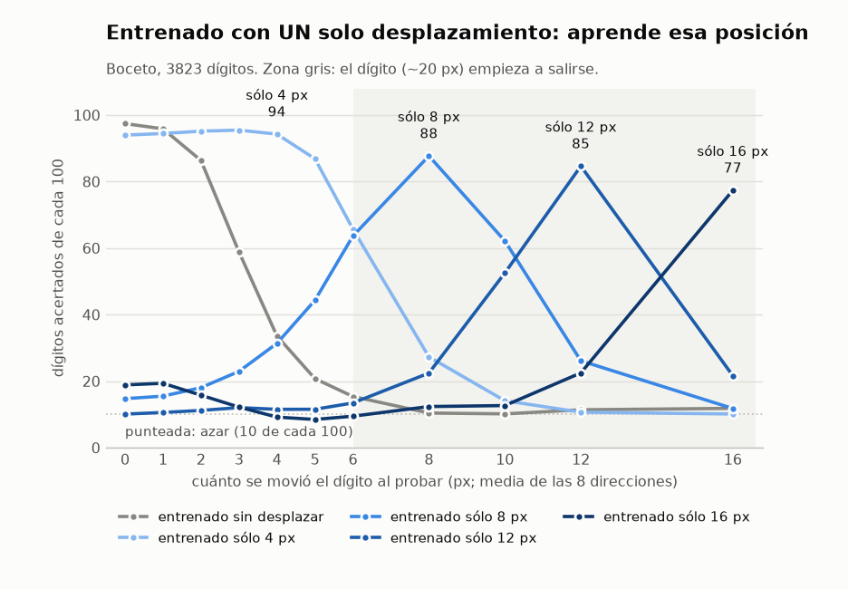

# Boceto — detectores de borde DE UN SOLO LADO, como primera capa (2026-10-07)

**No es un experimento**: no entrena nada ni gasta nada. Es la ilustración que pidió el dueño para decidir si
vale la pena montar uno. Las imágenes salen de `ver_proceso.py` sobre `uci-optdigits-orig-32px-r20261005`, con
kernels FIJOS (Sobel orientado) para enseñar el mecanismo.

## Regla del dueño de este día

*«Al menos por ahora, no se aplica pre-proceso a ningún dígito antes del detector de features.»* El código de
pre-proceso de `feat-bor` (`nn/bordes.py`) y de `feat-fallos` (esqueleto, erosión) se queda, pero no se usa. Aquí
el borde no es un script delante de la red: es su **primera capa** (un kernel + ReLU), y entra la tinta tal cual.

## La idea

Un detector = un kernel 3×3 + ReLU. El kernel del detector θ es la derivada en la dirección θ, así que con ReLU
sólo responde donde la tinta **aumenta** al avanzar en θ: «blanco → negro yendo hacia θ». «Negro → blanco hacia θ»
no es una familia aparte: es el detector de θ + 180°. Con 8 direcciones están los dos tipos.

**Por qué ve un solo borde:** recorrido en θ, un trazo tiene un borde de entrada (+) y uno de salida (−). ReLU
deja pasar uno. La distancia entre los dos (el grosor) deja de importar: el detector `→` dibuja sólo el lado
izquierdo de cada trazo, mida 2 px o 12. Lo enseña `imagenes/1-concepto-barra.png`.

**Y en un 8 grueso:** el contorno exterior sigue entero en los detectores. El hueco que se cierra sólo quita los
bordes del hueco, que además salen en los detectores **opuestos** (el lado izquierdo de un hueco es negro→blanco
yendo a la derecha, o sea `←`). Fila 2 y 4 de `imagenes/3-ochos-fino-a-grueso.png`.

## Lo que se ve y no es bonito (para el criterio, si se monta el experimento)

1. **Los diagonales salen a trozos** en UCI: a 32 px el dígito es una escalera de píxeles, y un 3×3 ve escalones.
   Un kernel 5×5, o un poco de suavizado DENTRO de la red (otra capa, no pre-proceso), lo arreglaría; no medido.
2. **Un trazo de 1 px**: los dos bordes caen a 1 px uno del otro; con ReLU cada detector se queda con uno, pero
   desplazado medio píxel. Comprobado sólo a ojo.
3. **Lo que esto NO resuelve**: en `feat-bor` el borde con signo (4 canales, por pre-proceso) dio el mismo mapa que
   esta capa daría con kernels fijos, y los detectores de features **entrenados con trazos de 2–4 px** perdieron
   recall en trazos de 6–12 px (0,84 → 0,73). El borde de un lado quita el «dos líneas» de cada canal, pero los
   bordes de los OTROS lados se separan con el grosor. La pregunta del experimento sería si los detectores de
   features, entrenados sobre estos canales, aprenden la forma de UN canal.

## Cómo se entrenaría (opciones, de más barata a más libre)

- **A. Kernels fijos** (Sobel orientado, lo de las imágenes). 0 parámetros, no hay nada que entrenar.
- **B. Fijos al arrancar y aprendibles**, con la misma red de features detrás.
- **C. Aprendidos desde cero contra un objetivo sintético**: en los dibujos sintéticos se conoce la geometría, así
  que la etiqueta «aquí empieza la tinta yendo hacia θ» se calcula del dibujo. Es la que más cuesta y la única que
  dice si una red encuentra sola este detector.

    /tmp/vizenv/bin/python ver_proceso.py --datos <dir con datos.npz>   # numpy, scipy, matplotlib

## Segunda parte (pedida el mismo día): usar estos bordes como el ÚNICO pre-proceso, delante de los detectores

Propuesta del dueño: aplicar estos 8 (o 4) detectores de un lado como pre-proceso único a todos los dígitos, y
entrenar los detectores de verdad (rectas, curvas…) sobre su salida. La regla se reescribe en consecuencia (ver
`CLAUDE.md` de la raíz).

### Lo que ya está medido y hay que tener delante

`feat-bor` (2026-10-06) **ya probó casi esto**: su representación `signo` son los 4 canales de un lado (→ ↓ ← ↑),
calculados por pre-proceso. Resultado: con trazos gruesos el recall cayó (0,84 → 0,73) y en los dígitos el compositor
bajó de **0,949 a 0,865**. O sea que «poner los bordes delante» a secas ya se pagó y salió peor.

### Por qué falló, y qué cambia aquí — `imagenes/5-un-canal-contra-todos.png`

En `feat-bor` **cada detector miraba los 4 canales a la vez** (la primera convolución tenía 4 canales de entrada).
La figura 5 enseña el problema: **dentro de UN canal** el contorno exterior es el mismo a 2, 6 y 12 px (canal →: el
arco izquierdo, idéntico); **entre canales**, la distancia del lado → al lado ← es justo el grosor. Un detector que
mira los 4 juntos vuelve a ver el grosor — la columna «los 4 juntos» es otra vez el trazo doble.

**El aporte, por tanto: que cada detector de features mire UN canal**, con los mismos pesos para los 4 (u 8)
canales (rotados o compartidos), y que se combine **después** (máximo o suma de sus respuestas). Esto no se probó en
`feat-bor`.

### Lo que la figura también enseña, y no es tan bonito

Cada canal tiene dos clases de borde: el del **contorno exterior** del dígito (no cambia con el grosor) y el del
**hueco** (el borde interior del trazo, que encoge o desaparece al engrosar: fila de 12 px, canales ↓ y ←). Para tu
caso del 8 eso es justo lo que querías — el contorno exterior sobrevive aunque el trazo tape el hueco —, pero un
detector de «curva» verá curvas distintas según lo grueso que sea el trazo **por dentro**. El vocabulario de features
probablemente haya que redefinirlo **por canal** («curva vista desde la izquierda»), no reutilizar el de `feat-ind32`.

### Propuesta concreta (no lanzada; criterio por escribir antes de entrenar)

1. Pre-proceso fijo: los 4 canales de un lado (kernels de la figura 2), igual para entrenamiento, prueba gruesa y
   dígitos UCI.
2. Brazos: (a) un detector por feature mirando los 4 canales a la vez — la réplica de `feat-bor signo`, como
   control —, (b) el mismo detector compartido aplicado a cada canal por separado, y max entre canales.
3. Medidas: recall en la prueba gruesa (6–12 px no vistos) y el compositor en los dígitos, contra 0,949 (tinta) y
   0,865 (`signo`).
4. Coste: del orden de `feat-bor` (1 máquina Vast, ~1 h, ~0,1 $) — estimado por comparación, no medido.

## Tercera parte: prueba rápida de vistas y «compositor de compositores» (medido 2026-10-07, 0 $, 1 min en el dev)

`prueba_vistas.py` → `resultados-vistas.txt` / `.json`. Detectores = los kernels FIJOS (no los de features);
compositor = regresión logística sobre cada vista reducida a 8×8. Mide la información que queda en cada vista, no lo
que haría la red de verdad. Prueba: los 1617 dígitos de `val`, tal cual, engrosados artificialmente (+1/+2 px de
dilatación, estímulo de prueba) y el cuartil con más tinta de cada clase («gruesos reales»).

Lo que sale (entrenado con 3823 dígitos de otros escritores; con 180, el mismo patrón un escalón más abajo):

| | normal | +1 px | +2 px | gruesos reales |
|---|---:|---:|---:|---:|
| tinta | 0,951 | **0,913** | **0,740** | 0,959 |
| 1 vista (rango de las 8) | 0,889–0,910 | 0,71–0,79 | 0,29–0,43 | 0,89–0,93 |
| 2 vistas → ↓ juntas | 0,958 | 0,868 | 0,425 | 0,964 |
| 8 vistas juntas | **0,973** | 0,892 | 0,416 | **0,971** |
| 8 vistas, compositor de compositores | 0,964 | 0,907 | 0,480 | 0,966 |

1. **Una vista sola pierde**: 4–6 puntos por debajo de la tinta con trazo normal.
2. **Dos vistas ya igualan a la tinta** y ocho la superan (0,973 contra 0,951): juntas tienen más información útil.
3. **El compositor de compositores no mejora al que ve todo junto** con trazo normal (0,964 contra 0,973), pero
   **resiste algo mejor el engrosamiento** (+1 px: 0,907 contra 0,892; +2 px: 0,480 contra 0,416). Con pocos datos
   (180) empata con el de todo junto en normal.
4. ⚠ **Contra la hipótesis: con engrosamiento ARTIFICIAL, los bordes caen MUCHO más que la tinta** (+2 px: 0,42
   contra 0,74). Los gruesos REALES no muestran esa caída (las vistas empatan o ganan a la tinta). Lo más probable
   *(no comprobado)*: al dilatar, el contorno se mueve 2 px hacia fuera —media celda del 8×8— y el compositor lineal
   es posicional; la tinta media cambia menos. O sea que **la invariancia al grosor de cada vista no llega al
   compositor si éste compara posiciones finas**, que es el problema 1 de antes visto desde el otro lado. Pide
   pooling (máximo 3×3) o un compositor menos posicional antes de cualquier experimento de pago.

### Y con pooling tolerante al desplazamiento (medido 2026-10-07, mismo guion, `--pool max5` y `--pool max-bloque`)

| entrenado con 3823 | normal | +1 px | +2 px | gruesos reales |
|---|---:|---:|---:|---:|
| tinta · media (lo de arriba) | 0,951 | 0,913 | 0,740 | 0,959 |
| tinta · max5 | 0,907 | 0,783 | 0,440 | 0,887 |
| 8 vistas juntas · media | 0,973 | 0,892 | 0,416 | 0,971 |
| 8 vistas juntas · max5 | **0,977** | **0,919** | 0,448 | **0,983** |
| 8 vistas juntas · max-bloque | 0,967 | 0,900 | 0,503 | 0,978 |
| 8 vistas compositor de compositores · max5 | 0,963 | 0,906 | 0,480 | 0,964 |

**La explicación de arriba («es el desplazamiento») NO queda confirmada.** El pooling mejora un poco las vistas
(lo mejor medido: 8 vistas + max5, 0,977 normal y 0,983 en gruesos reales), pero **no rescata el +2 px** (0,45–0,50),
y a la tinta la hunde. Otra explicación, también sin comprobar: una dilatación de 5×5 cierra huecos y funde trazos
vecinos —cambia la forma, no sólo el grosor—, y la tinta media la tolera porque sólo se oscurece. Los gruesos
**reales** no muestran nada de eso: ahí las vistas ganan. O sea que el +2 px artificial puede no ser un buen modelo
de un trazo grueso real; hace falta una prueba de grosor mejor antes de concluir nada.

## Cuarta parte: qué compositor aguanta grosor y desplazamiento (medido 2026-10-07 por la tarde, 0 $, ~50 min en el dev)

`prueba_compositores.py` → `resultados-compositores.txt` / `.json`. Mismos kernels fijos y misma regresión logística
que la tercera parte; lo único que cambia es **cómo ve la posición el compositor**. Pedido del dueño: un compositor
**sin máximo** (la posición tal cual) y otro entrenado con **su misma entrada desplazada 1, 2, 3 y 4**, para que sea
«ligeramente resistente al desplazamiento». Se midió en las dos unidades posibles:

- `desp≤k`: la entrada **8×8** desplazada 1..k **celdas** (una celda = **4 px** de la imagen);
- `px≤k`: la **imagen** desplazada 1..k **píxeles** antes de detectar (por la equivariancia de la convolución, es
  desplazar los mapas de las vistas antes de reducir: el detector no cambia, sólo lo que aprende el compositor).

En los dos casos, 8 direcciones por desplazamiento (1 + 8k copias) y prueba **sin** desplazar. Corrió como unidad
`borde-compositores` (`Result=success`, `NRestarts=0`). Se añadió una prueba más: `val` **desplazado 2 px** en una
dirección al azar por dígito, que es lo que un compositor resistente debería aguantar.

### A · dígitos UCI, entrenado con 3823 (los 1617 de `val`; «gruesos reales» = el cuartil con más tinta, 415)

| compositor | normal | +1 px | +2 px | gruesos reales | desplazado 2 px |
|---|---:|---:|---:|---:|---:|
| tinta · pos | 0,950 | 0,913 | **0,741** | 0,957 | 0,806 |
| tinta · pos + px≤1 | 0,959 | 0,921 | **0,798** | 0,964 | 0,858 |
| 8 vistas · pos (el de ayer) | 0,974 | 0,891 | 0,413 | 0,971 | 0,873 |
| 8 vistas · max5 (el candidato de ayer) | 0,978 | 0,918 | 0,430 | 0,983 | 0,903 |
| 8 vistas · pos + desp≤1 celda | 0,968 | 0,865 | 0,525 | 0,966 | 0,962 |
| 8 vistas · pos + desp≤2 celdas | 0,887 | 0,755 | 0,399 | 0,896 | 0,897 |
| 8 vistas · pos + desp≤4 celdas | 0,802 | 0,641 | 0,325 | 0,829 | 0,812 |
| **8 vistas · pos + px≤2** | **0,989** | 0,931 | 0,587 | 0,986 | 0,969 |
| 8 vistas · pos + px≤3 | 0,983 | 0,925 | 0,588 | 0,986 | **0,978** |
| 8 vistas · max5 + px≤2 | **0,989** | 0,943 | 0,595 | 0,988 | 0,975 |
| 8 vistas · max5 + px≤3 | 0,985 | **0,951** | 0,576 | **0,990** | 0,976 |

Con **180** de entrenamiento, el mismo orden y más ganancia: 8 vistas · pos 0,930 → **0,970** con px≤2 (normal) y
0,759 → 0,928 desplazado 2 px; max5 + px≤2, 0,969.

1. **La idea del dueño funciona, en píxeles.** Entrenar el compositor con su entrada desplazada 1–2 px es lo mejor
   medido en todo el boceto: **0,989** con trazo normal (ayer, 0,974 sin desplazar y 0,978 con max5) y 0,986 en los
   gruesos reales, contra 0,950/0,957 de la tinta. Y aguanta un dígito desplazado 2 px: 0,873 → 0,969.
2. **En celdas del 8×8, no: es demasiado grueso.** Una celda ya son 4 px. Con `desp≤1` gana resistencia (0,962 desplazado)
   pero pierde en normal (0,968), y desde 2 celdas se hunde (0,887 → 0,802). Para un compositor lineal, desplazar
   media cara del dígito es borrar la posición, que es justo lo que distingue un 6 de un 9.
3. **El máximo 5×5 ya sobra.** Sobre `px≤2` aporta poco (+1 px: 0,943 contra 0,931; normal, igual). El compositor más
   simple —**posición tal cual + aumentación de 1–2 px**— hace casi todo el trabajo.
4. **El +2 px artificial sigue sin rescatarse** (0,64 como mucho, con 2 vistas; la tinta, 0,80). Que la aumentación mejore el
   desplazamiento y no esto es otra señal de que dilatar 2 px **cambia la forma** y no sólo el grosor: con los gruesos
   reales las vistas ganan siempre. **Se deja de usar como prueba de grosor.**

### B · trazos sintéticos `feat-bor-sinteticas-grueso-32px-r20261006` (entrena con 2318 de 2–4 px)

⚠ **No son dígitos**: es clasificar la FAMILIA de una feature (13 + vacío) **en cualquier posición** del 32×32, y para
un compositor lineal es una tarea mucho más difícil (≈0,5 con el grosor visto). ⚠ Y **la mezcla de familias cambia con
el grosor** (a 10 px casi no quedan arcos; a 12 px **sólo hay esquinas**), así que **las columnas no se comparan entre
sí**: sólo los compositores dentro de una columna.

| compositor | 2–4 px (val) | 6 px | 8 px | 10 px | 12 px |
|---|---:|---:|---:|---:|---:|
| tinta · pos | 0,265 | 0,208 | 0,249 | 0,282 | 0,108 |
| 8 vistas · pos | 0,502 | 0,446 | 0,381 | 0,289 | 0,004 |
| 8 vistas · pos + px≤2 | 0,566 | 0,512 | 0,439 | 0,285 | 0,004 |
| 8 vistas · pos + px≤4 | 0,618 | 0,567 | 0,480 | 0,324 | 0,009 |
| 8 vistas · pos + desp≤1 celda | **0,622** | **0,594** | 0,504 | 0,346 | 0,004 |
| 8 vistas · pos + desp≤4 celdas | 0,541 | 0,576 | **0,548** | **0,454** | 0,086 |

5. **Aquí las vistas doblan a la tinta** en el grosor visto (0,50 contra 0,27) y siguen por delante a 6 y 8 px.
6. **Aquí sí ayuda desplazar celdas enteras**, al revés que con los dígitos, y es lo esperable: la feature puede estar
   en cualquier sitio, así que la posición no informa. La aumentación hay que elegirla según si la posición es parte
   de la clase (dígito: sí) o no (feature: no).
7. **12 px no lo clasifica nadie** (todo ≈0). Con sólo esquinas, a ese grosor en 32 px son manchas. No se lee más.

### Qué decide esto para el experimento

- **Prueba de grosor:** los **gruesos reales de UCI** para el acierto en dígitos, y el sintético `…-grueso-32px` para
  los **detectores** (que es para lo que se generó en `feat-bor`). El +2 px por dilatación, fuera.
- **Compositor:** 8 vistas juntas, **posición tal cual**, entrenado con la entrada desplazada **1–2 px**
  (8 direcciones). El max5 no se lleva: lo que añade no paga la pieza extra.
- ⚠ **Pregunta para el dueño antes de escribir el `REGLAS.md`:** la aumentación por desplazamiento toca sólo el
  **entrenamiento del compositor**; los detectores ven lo mismo (la convolución es equivariante) y la prueba va sin
  desplazar. Creo que **no** es un segundo pre-proceso en el sentido de la regla «un solo pre-proceso, igual para
  todos los dígitos», pero la regla es suya y lo tiene que decir él.

## Quinta parte: la CURVA de desplazamiento (medido 2026-10-07, 0 $, en el dev)

`prueba_desplazamiento.py` → `resultados-desplazamiento.txt` / `.json`. Pedido del dueño: entrenar el compositor con varios
desplazamientos de su entrada, **cada uno por separado** y **añadiéndolos gradualmente**, y ver que resiste un desplazamiento
ligero y pierde capacidad cuando el dígito sale de su campo de visión. Kernels fijos, regresión logística, 3823 de
entrenamiento; prueba: los 1617 de `val` desplazados *d* px, media de las 8 direcciones. 8 vistas (la tinta, en el txt):

| entrenado con | d=0 | d=1 | d=2 | d=3 | d=4 | d=6 | d=8 | d=12 | d=16 |
|---|---:|---:|---:|---:|---:|---:|---:|---:|---:|
| sin desplazar | 0,974 | 0,958 | 0,863 | 0,588 | 0,336 | 0,154 | 0,104 | 0,114 | 0,118 |
| sólo 2 px | 0,986 | 0,984 | 0,974 | 0,927 | 0,719 | 0,310 | 0,165 | 0,110 | 0,105 |
| sólo 8 px | 0,147 | 0,155 | 0,180 | 0,229 | 0,314 | 0,636 | **0,877** | 0,261 | 0,118 |
| sólo 12 px | 0,101 | 0,106 | 0,112 | 0,120 | 0,115 | 0,134 | 0,224 | **0,846** | 0,216 |
| sólo 16 px | 0,189 | 0,193 | 0,158 | 0,122 | 0,092 | 0,095 | 0,123 | 0,225 | **0,773** |
| 0–2 px | **0,989** | 0,984 | 0,973 | 0,919 | 0,704 | 0,298 | 0,163 | 0,109 | 0,106 |
| 0–4 px | 0,980 | 0,980 | 0,976 | 0,965 | 0,935 | 0,605 | 0,240 | 0,107 | 0,106 |
| 0–8 px | 0,933 | 0,939 | 0,938 | 0,931 | 0,915 | 0,868 | 0,778 | 0,175 | 0,102 |

1. **Gradual: resistente hasta donde se entrenó**, y cuanto más rango, más cuesta en el centro (0,989 → 0,933 de 0–2 a 0–8).
2. **Por separado: aprende ESE desplazamiento**, no a resistirlo (sólo 8 px: 0,877 en d = 8, 0,147 en el centro).
3. **El campo de visión pesa mucho menos que la posición no vista.** Un dígito UCI mide ~20 px de ancho con ~6 px de margen
   (medido en `val`): con d = 16 media cifra está fuera, y aun así «sólo 16 px» acierta 0,773. El compositor sin desplazar
   está en el azar ya en d = 8, con el dígito casi entero dentro.

⚠ Se cortó una vez: el OOM killer lo mató en «0–6» (tres trabajos a la vez en un dev de 3,9 GB) y systemd lo relanzó desde
cero. Se paró y se terminó por planes (`--planes`), con los mapas en float32. Los números de los planes repetidos coinciden
al bit (es determinista).

 (`graficas_desplazamiento.py`)

**Con detectores ENTRENADOS** (`feat-1lado`, 180 de entrenamiento) la curva tiene la misma forma; ver su README.

## ⏳ PENDIENTE (escrito 2026-10-07; puntos 1–3 cerrados ese día: el 3 es `feat-1lado`)

Estado: **nada lanzado en Vast, nada pagado**. Todo es boceto con kernels fijos y regresión logística.

1. ✅ **Qué es «grueso»**: los gruesos reales de UCI para los dígitos, y el sintético `…-grueso-32px-r20261006` para
   los detectores. El +2 px por dilatación se deja de usar.
2. ✅ **Compositor**: 8 vistas juntas, posición tal cual, entrenado con la entrada desplazada 1–2 px. Sin max5.
3. ✅ **Hecho: `feat-1lado`** (0,197 $; resultado en su README y en `estudios-redes-neuronales` #37). Lo que se planeó:
   **montar el experimento de verdad** (con su `experimento.json`, `REGLAS.md` y criterio escrito ANTES de entrenar):
   detectores de features entrenados por vista (mismos pesos para todas), etiquetas definidas por vista, el compositor
   del punto 2, y comparar contra 0,949 (tinta, `feat-ind32`) y 0,865 (`feat-bor signo`). Estimado ~0,1 $ / ~1 h en
   Vast (por comparación con `feat-bor`, no medido). **Pedir permiso antes de alquilar.**
   ⚠ Antes, el dueño decide si la aumentación por desplazamiento del compositor cuenta como pre-proceso (§ «Qué decide
   esto para el experimento»).
4. Regla vigente: un solo pre-proceso, el mismo para todos los dígitos (`CLAUDE.md` de la raíz).
5. Para repetir estas pruebas: los datasets salen del almacén (en `foveal-vision-data`,
   `git show origin/main:experimentos-cnn/uci-optdigits-orig-32px-r20261005/datos.npz` y
   `…/feat-bor-sinteticas-grueso-32px-r20261006/datos.npz`, cada uno a su directorio), y el entorno es
   `uv venv /tmp/vizenv && uv pip install --python /tmp/vizenv numpy scipy matplotlib scikit-learn`.
   `prueba_compositores.py` tarda ~50 min en un dev de 2 vCPU: **lánzalo como unidad**
   (`desacoplar-persistente.sh`), no en segundo plano del harness, que lo corta a los 10 min (pasó).
