# Boceto — un detector de CURVAS con un banco de Gabor FIJO como entrada (2026-10-09)

**No es un experimento**: no entrena nada ni gasta nada (0 $, ~25 s en el dev). Es el **plan** que pidió el dueño
—*«empleando Gabor como entrada, prepara un detector de curvas; muéstrame lo planificado con imágenes aplicadas
sobre curvas, rectas y otras formas»*— montado entero y aplicado, para decidir si merece un experimento con criterio.
Es el pendiente 3 de la línea de rectas (`CLAUDE.md` del repo): *«una curva = cadena de detecciones de rectas cortas
cuya orientación gira»* (el dueño, 2026-10-08). Todo sale de [`curvas.py`](curvas.py); los números de este
documento están en [`resultados.json`](resultados.json) y [`resultados-banco.txt`](resultados-banco.txt).

> ⚠⚠ **Y desde el mismo 2026-10-10, el borde se saca con un GABOR IMPAR, nunca con morfología** (regla del dueño, en
> el `CLAUDE.md` del repo; § «El borde con GABOR», al final). Todo lo de §§ «Sobre los BORDES» … «Suavizar» usó el
> borde morfológico (`x AND NOT erosión`), ya retirado.
>
> ⚠ **La idea del dueño, desde el 2026-10-10: el detector trabaja SÓLO sobre los BORDES de la imagen real**, no sobre el
> trazo relleno. Un trazo grueso son dos curvas paralelas (su contorno de fuera, de radio R + g/2, y el de dentro,
> R − g/2), y lo que se busca son ésas. Lo que hay más abajo hasta § «Galería» es la versión anterior, sobre el trazo, y
> se conserva para comparar. La versión sobre bordes es [`bordes.py`](bordes.py), en § «Sobre los BORDES».

## El plan, en cuatro pasos

```
imagen 32×32 ──► 1 BANCO     12 Gabor pares 9×9 (λ = 6 px, el de rect-lin) cada 15°   r_i = ReLU(G_i ⋆ x)
              ──► 2 CAMPO     orientación LOCAL por píxel (media vectorial en ángulo doble)  θ(p), coherencia c(p)
              ──► 3 GIRO      κ(p) = [θ(p + d·u) − θ(p − d·u)] / 2d     (u = tangente en p, d = 4 px)   → R ≈ 57,3 / |κ|
              ──► 4 VEREDICTO por componente conexa, con tres números: c · giro total Δθ · κ mediana
```

| veredicto | regla | qué significa |
|---|---|---|
| **mancha** | c mediana < 0,35 | responden todas las orientaciones por igual: no hay trazo con dirección |
| **corto** | menos de 4 px donde κ se puede medir | hay trazo, pero no da para saber si gira (≈ 2·d + 4 px útiles) |
| **recta** | Δθ < 12° | la orientación no cambia a lo largo |
| **esquina** | Δθ ≥ 12° pero κ mediana < 1 °/px, o el giro está en pocos píxeles (p90 ≥ 3 × mediana) | gira **en total**, no **en los píxeles**: el giro es de golpe. Un cruce cae aquí también |
| **curva** | lo demás | gira poco a poco; su radio es 57,3 / κ |

Y cada componente trae además sus **trozos**: cuántos tramos rectos (|κ| < 1 °/px) y cuántos curvos, que es la
salida que necesitaría una segunda etapa (pendiente 2, «segmentos»).

**Qué es «Gabor como entrada» aquí:** el banco es FIJO y es el mismo kernel que en `rect-lin`/`rect-bor` (par, λ = 6,
hecho para trazo de ~3 px), sólo que con 12 orientaciones en vez de 4, porque para medir un giro hace falta resolver la
orientación mejor que a 45°. La orientación continua sale de la **media vectorial** de las 12 respuestas (ángulo doble,
porque una línea de 170° y una de 10° son casi la misma), y la **coherencia** —cuánto manda una sola orientación— es lo
que separa trazo de mancha. Lo único que se ajustó a mano son los umbrales de la tabla, **sobre estas mismas 32 figuras,
no calibrados contra nada** (regla 2 de escritura: son elegidos, no medidos).

Tres decisiones que salieron de medir, no de pensar (las tres tienen su número en `curvas.py`):

1. **El campo se suaviza (σ = 1 px) antes de leer la orientación.** Sin eso una recta a 30° es una escalera y su
   orientación local oscila a lo largo: κ mediana **1,25 °/px en una recta** (medido con σ = 0), lo mismo que un arco
   de radio 45. Con σ = 1 y d = 4, las rectas dan 0,02–0,27 (0,75 a 60°).
2. **Sólo cuentan los píxeles del LOMO del trazo y a ≥ d px de sus extremos.** El kernel 9×9 enciende una franja
   alrededor de la línea, y en los últimos píxeles de un trazo la orientación se tuerce (recta de 30°: θ = 28–30° en
   el cuerpo, 16° y 44° en las puntas). Sin esta exclusión, el 69 % de las rectas de 10 px del banco salían «curva» y
   el radio de un arco de 27 se estimaba en 48.
3. **El signo de κ no se usa.** La tangente está definida módulo 180°, así que el signo se da la vuelta donde θ cruza
   0°/180°: distinguir una S de una C pide recorrer la cadena con un sentido, y eso es la segunda etapa, no ésta.

## Lo que se ve, figura a figura

### 1 · El banco y lo que entra al campo

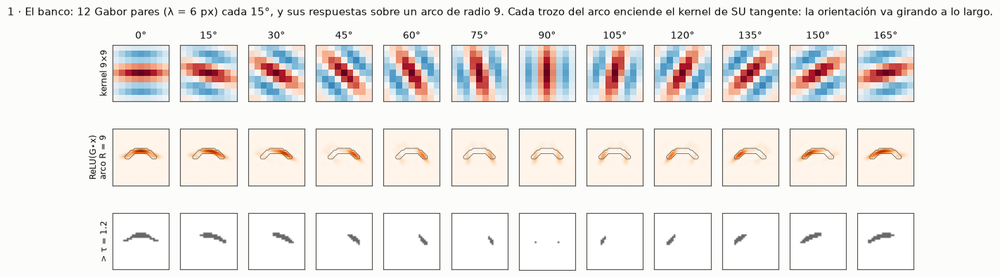

Cada trozo del arco enciende el kernel de **su** tangente: la fila de abajo (respuesta > τ) va girando de 0° a 165°
a lo largo del arco. Eso es la «cadena de rectas cortas cuya orientación gira», leída directamente del banco.

### 2 · Rectas y curvas sintéticas — 12 de 14 como se esperaba

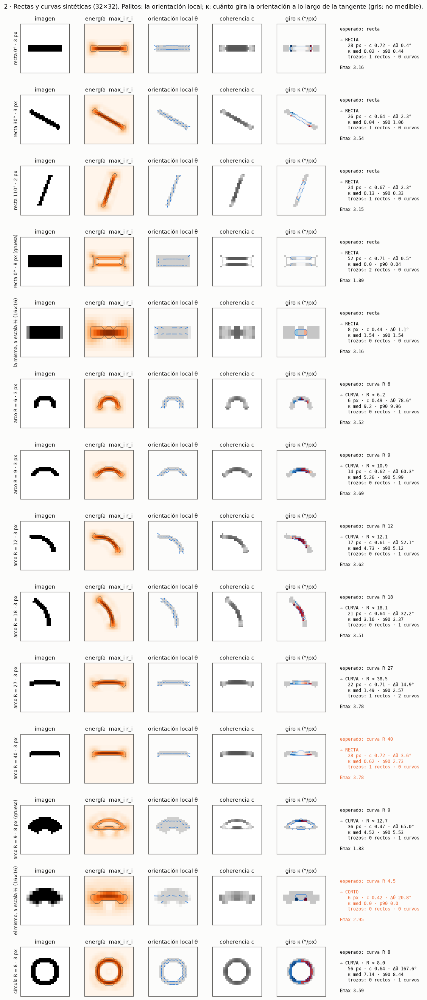

| forma | veredicto | R estimado (real) | |
|---|---|---:|---|
| rectas de 3 px a 0°, 30°, 110° | recta | — | Δθ 0,4–2,3°, κ 0,02–0,13 |
| recta de 8 px (gruesa) | recta | — | el Gabor de λ = 6 ve sus **dos bordes** como dos rectas paralelas (2 trozos rectos), como ya pasó en `rect-bor` |
| arcos de 3 px, R = 6 · 9 · 12 · 18 | curva | 6,2 (6) · 10,9 (9) · 12,1 (12) · 18,1 (18) | |
| arco R = 27 | curva | 38,5 (27) | sobreestima: con 20 px de largo sólo quedan 12 medibles |
| arco R = 40 | **recta** ✗ | — | Δθ 3,6°: a 32×32 un arco de R = 40 y 20 px gira 28° y **no se resuelve** |
| arco R = 9 de 8 px (grueso) | curva | 12,7 (9) | |
| el mismo a escala ½ | **corto** ✗ | — | a 16×16 quedan 6 px útiles: el remedio del grosor **no cabe** en un trazo de 20 px |
| círculo R = 8 | curva | 8,0 (8) | Δθ 168°: da la vuelta entera |

### 3 · Otras formas — las esquinas son el punto débil

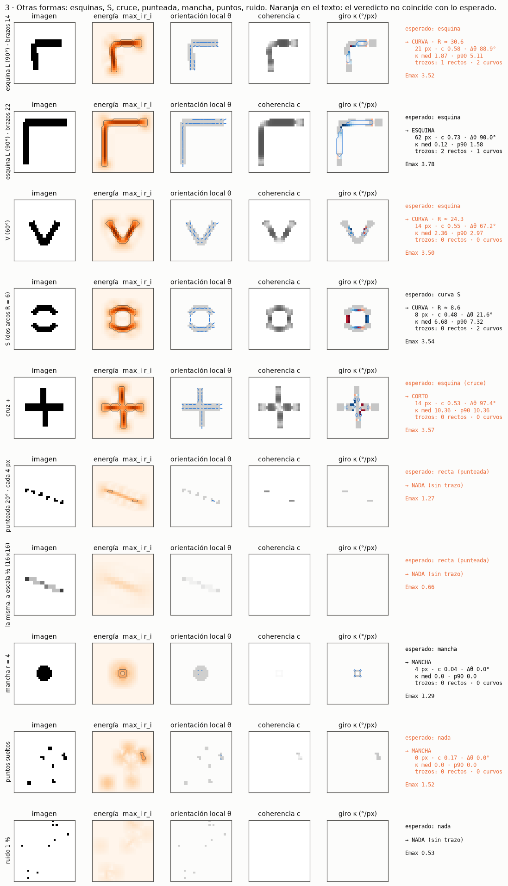

| forma | veredicto | |
|---|---|---|
| **L de brazos 22 px** | esquina ✅ | Δθ 90° y κ mediana 0,12: gira en total y no en los píxeles. 2 trozos rectos |
| **L de brazos 14 px** | curva R ≈ 31 ✗ | el 9×9 + σ = 1 redondea la esquina en un arco de ~8 px, y con brazos cortos ese arco es la mitad de lo medible |
| **V de 60°** | curva R ≈ 24 ✗ | lo mismo |
| S de dos arcos R = 6 | curva R ≈ 8,6 ✅ | 2 trozos curvos; que sean de giro contrario **no se sabe** (decisión 3) |
| cruz + | corto ✗ | el centro tiene coherencia baja y se excluye; los 4 brazos de 10 px no dan para medir |
| punteada cada 4 px | nada ✗ | Emax 1,27, justo sobre τ: el Gabor de 3 px **no une puntos** (ya lo dijo `rect-lin`), ni a escala ½ |
| mancha r = 4 | mancha ✅ | c = 0,04 |
| puntos sueltos | mancha ✗ (esperaba «nada») | un disco de 2 px responde 1,52 > τ = 1,2 y se lee como mancha pequeña |
| ruido 1 % | nada ✅ | |

**La regla que sale de aquí:** una esquina se distingue de una curva cerrada **sólo si sus brazos son largos** (≥ ~20 px
con este kernel). Con brazos de 14 px, esquina y arco de R ≈ 8 son lo mismo para un 9×9 suavizado. Si el experimento
necesita esquinas, el detector de esquina tiene que ser **otro** (la caída de coherencia en el vértice, o los
detectores de `esq-k`), no este.

### 4 · Dígitos reales (uci-optdigits, 32×32), el mismo detector sin tocar

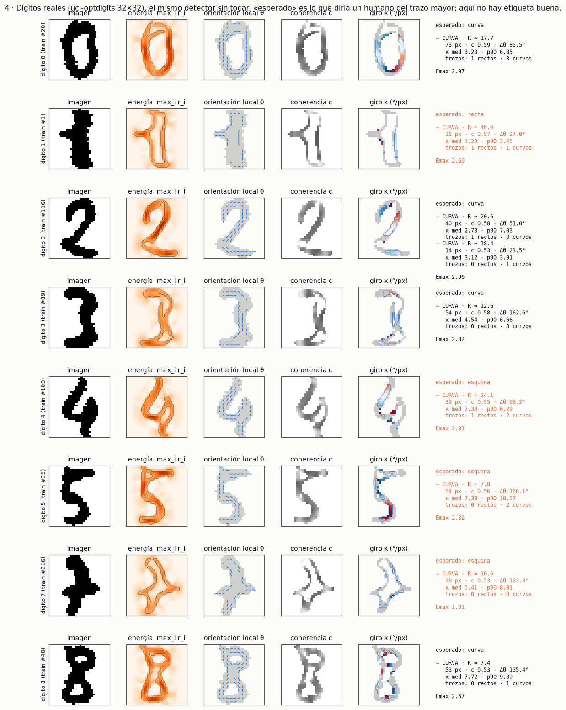

Un dígito es **una** componente, así que un veredicto por componente dice poco (0, 2, 3, 8 → curva; 4 → esquina;
1 → curva de R ≈ 47, por el pie; 5 y 7 → curva). Lo útil está en el **mapa de κ y en los trozos**: el 0 da 1 tramo
recto y 3 curvos, el 2 da 1 recto y 3 curvos, el 3 da 3 curvos. ⚠ Con trazos de 4–6 px la mayor parte del trazo
queda **gris (no medible)**: la coherencia cae dentro del trazo grueso. Para dígitos hace falta la segunda escala, o
el Gabor más ancho —el pendiente 4a de la línea—, y eso no está probado aquí.

### 5 · ¿El giro medido sigue a 1/R?

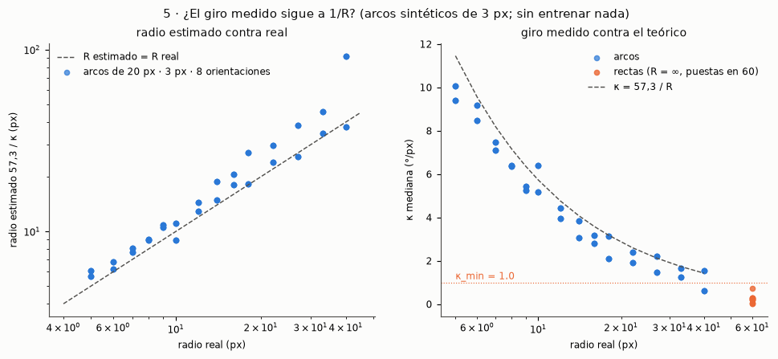

Arcos de 20 px y 3 px en 8 orientaciones, R = 5…40: el radio estimado sigue al real de **5 a ~30 px** (error
logarítmico mediano 0,12, o sea ±13 %) y por encima de 30 sobreestima; las rectas quedan en κ ≤ 0,27 (0,75 a 60°),
por debajo del 1 °/px que separa recta de curva. **El rango útil de radios con este kernel es 5–30 px.**

### Sobre el banco de prueba entero de `rect-lin` (2.040 figuras, sin entrenar nada)

De [`resultados-banco.txt`](resultados-banco.txt); el banco es `rect-lin-banco-r20261008` (rectas cada 3° de
grosor 2–14 y largo 10/16/22; arcos R 6–40 de grosor 2/4/8; punteadas; 900 negativos).

| | recta | curva | esquina | corto | mancha | nada |
|---|---:|---:|---:|---:|---:|---:|
| rectas finas (2–4 px), n = 1080 | **69 %** | **0 %** | 0 % | 31 % | 0 % | · |
| rectas de 6–8 px, n = 720 | 46 % | 2 % | 2 % | 20 % | 30 % | · |
| rectas de 10–14 px, n = 1080 | · | 12 % | 33 % | 49 % | 6 % | · |
| arcos R 6–27 (todos los grosores), n = 360 | 1 % | **99 %** | 0 % | 0 % | · | · |
| arcos R 40, n = 72 | 21 % | 72 % | 7 % | · | · | · |
| punteadas sep 2–3, n = 240 | 96 % | · | · | 4 % | · | · |
| punteadas sep ≥ 4, n = 600 | 1 % | · | · | 11 % | 0 % | 88 % |
| manchas, n = 300 | · | · | · | · | 99 % | 1 % |
| puntos sueltos, n = 300 | · | · | · | 9 % | 18 % | 73 % |
| ruido, n = 300 | · | · | · | · | · | 100 % |

Lo que importa de esa tabla: **ninguna recta fina se lee como curva, y el 99 % de los arcos de R ≤ 27 se leen como
curva**, sin un solo parámetro aprendido. Los dos agujeros son los de siempre en esta línea: el 31 % de rectas finas
«cortas» son las de 10 px (con 16 y 22 px, 92 % y 98 % recta), y el trazo grueso (≥ 10 px) no es un trazo para un
Gabor de λ = 6: es un rectángulo con bordes y esquinas.

## Lo que NO está hecho, y lo que sería el experimento

- **Grosor:** el Gabor de λ = 6 ve dos bordes en un trazo de 8 px y nada coherente en uno de 12. Probar la segunda
  escala (aquí sólo en dos figuras, y en el arco se quedó sin píxeles) o un Gabor más ancho, igual para todo
  (regla del dueño del 2026-10-07: un solo pre-proceso para todos).
- **Punteadas:** no las une ni a escala ½. Es la opción 3 del pendiente 2 (votación tipo Hough), no un ajuste de aquí.
- **Esquinas con brazos cortos y cruces:** necesitan otro detector; éste sólo ve que «gira de golpe» si hay brazos.
- **El signo del giro (S contra C) y unir trozos en una cadena ordenada:** la segunda etapa, pendiente 2 «segmentos».
- **Umbrales elegidos a ojo** sobre 32 figuras; nada está calibrado contra negativos como en `rect-lin` (5 % de FP).

**Si se monta el experimento** (criterio antes de mirar, R13), la pregunta que este boceto permite escribir es:
*¿un compositor que reciba, además de los 4 mapas Gabor de `rect-bor` § Tanteo, el mapa de κ (dónde gira y cuánto),
lee los dígitos mejor que 0,955?* Con la misma receta del tanteo (180/1617, 3 semillas, a ciegas 3823) y el mismo
compositor lineal, cuesta 0 $ y ~1 min en el dev. Y la predicción honesta, escrita ya: **poco**, porque en los dígitos
la mitad del trazo sale «no medible» por el grosor (figura 4); el grosor va antes.

## Cómo se repite

```bash
cd ~/src/experimentos-cnn && .venv/bin/python docs/bocetos/2026-10-09-curvas-gabor/curvas.py --banco
```

Necesita el `.venv` del repo con numpy, scipy, matplotlib y torch (cpu), y los datasets publicados
`uci-optdigits-orig-32px-r20261005` y `rect-lin-banco-r20261008` en `foveal-vision-data/experimentos-cnn/`.

## Tanteo (2026-10-09, pedido del dueño): un clasificador de dígitos con las curvas, contra el de rectas, y los dos juntos

> ⚠ **La variante «curvas» de este tanteo está REEMPLAZADA desde el 2026-10-10** por el compositor con el detector sobre
> BORDES (§ «El compositor de dígitos con el detector sobre BORDES», al final): el dueño lo da por revisado y con
> prioridad. Esto se conserva porque las figuras 7–9 se calcularon con él; `digitos.py` no se ha tocado.

`python digitos.py` (35 s en el dev; [`resultados-digitos.json`](resultados-digitos.json)). Mismo protocolo que el
tanteo de `rect-bor`: compositor **lineal** (Adam, 300 épocas, lr 1e-2, L2 1e-3), 180 train / 1617 val, 3 semillas
que sólo cambian la inicialización, y a ciegas los 3823 dígitos de otros escritores. Todas las características son
**fijas**; sólo se entrena el compositor. **La referencia de rectas se re-ejecutó aquí**, no se copió del documento.

| compositor | características | val (1617) | a ciegas (3823) |
|---|---:|---:|---:|
| **curvas** (recto · curvo |κ| · golpe, 8×8) | 192 | 0,867 [0,865–0,868] | 0,836 |
| **rectas** (la C de `rect-bor`: 4 Gabor, integrado, 2 escalas) | 512 | 0,955 [0,951–0,957] | 0,947 |
| **combinado** | 704 | **0,958** [0,954–0,960] | **0,954** |

La predicción escrita antes se cumplió en las tres: rectas ≈ 0,955 (sale 0,9546: **reproduce** el 0,955 del tanteo
de `rect-bor` y su 0,947 a ciegas), curvas < 0,93, y el combinado ≤ 0,96. Lo que suma el combinado es **+0,003 en val
y +0,007 a ciegas**, dentro del rango entre semillas en val y un poco por encima a ciegas. ⚠ Tanteo: 3 semillas de
compositor, un solo reparto, nada declara.

**En qué falla cada uno** (semilla 0; `imagenes/6-fallos-*.png`, los 60 primeros de cada lista):

| | fallos en val | confusiones más frecuentes |
|---|---:|---|
| [curvas](imagenes/6-fallos-curvas.png) | 215 | 7→4 (15), 8→0 (11), 3→9 (11), 9→3 (10), 8→5 (10) |
| [rectas](imagenes/6-fallos-rectas.png) | 70 | 8→9 (10), 5→9 (6), 7→9 (3), 9→3 (3), 1→6 (3) |
| [combinado](imagenes/6-fallos-combinado.png) | 68 | 8→9 (11), 5→9 (4), 1→9 (4), 7→9 (3) |

Solape (semilla 0): de los 70 fallos de rectas, **49 los falla también curvas** y sólo 21 son propios de rectas;
curvas tiene 166 fallos propios. El combinado arregla 8 fallos de rectas y estropea 6: **cambia casi nada, en los dos
sentidos**. Por dígito, lo que mueve el combinado es el 3 (0,941 → 0,958) y el 5 (0,949 → 0,963); el **8 sigue siendo el
peor en los tres** (0,857 · 0,850), y su confusión es 8→9: un 8 con el lazo de abajo cerrado a medias.

Lo que se ve en las imágenes de fallos, y es lo mismo que decía la figura 4: **las curvas solas confunden por
orientación global** (7→4, 3→9, 9→3: formas con los mismos tramos curvos en sitios parecidos, porque el mapa de κ no
lleva la orientación del trazo, sólo cuánto gira), y en trazos gruesos la mitad del trazo es «no medible». Las rectas
fallan en **lazos**: 8→9, 5→9, 8→6, 8→1, donde lo que distingue es si un lazo está cerrado, y eso no lo dice ni un Gabor
ni un κ. **Añadir κ no cierra ese hueco**, porque su información está contenida casi entera en los 4 mapas de rectas
integrados (49 de 70 fallos compartidos). El hueco es de vocabulario —lazo cerrado contra abierto, el mismo que señaló
`feat-cortas`—, no de curvatura.

## Por qué el combinado lee 9 en un 5 nítido (2026-10-09, pedido del dueño)

El dígito es el **1018 de val**, el fallo nº 37 (fila 4, columna 1) de
[`6-fallos-combinado.png`](imagenes/6-fallos-combinado.png). `python por_que_5.py` (≈ 40 s; `--k` elige otro fallo de la
lista) reproduce **el mismo compositor**: comprueba que salen los mismos 68 fallos y que las rejillas que dibuja son
exactamente las 704 características que recibió. Los números, en [`resultados-cinco.json`](resultados-cinco.json).

**No es mala suerte de una semilla.** Falla con las tres. El de rectas solo también dice 9 (tres de tres), y el de
curvas solo dice 6.

| | logit 5 | logit 9 | margen 9 − 5 |
|---|---:|---:|---:|
| dígito 1018 | 7,64 | **10,00** | +2,36 |

### Las cinco figuras

1. [**Lo que ve**](imagenes/7-cinco-1-entrada.png): la imagen, los 4 Gabor, la integración de 15 px y las 11 rejillas
   8×8 que llegan al compositor. No ve la imagen, sino dónde hay trazo de cada orientación.
2. [**Quién vota**](imagenes/7-cinco-2-votos.png): el compositor es lineal, así que logit 9 − logit 5 es la suma, celda a
   celda, de (W₉ − W₅) × z. Votan 9 los canales **horizontales** (+1,70 a escala 1 y +1,54 a escala ½) y la **vertical**
   a escala ½ (+1,09). Votan 5 las diagonales y el canal «recto» de curvas (−0,77, la barra de arriba). Las curvas apenas
   votan (+0,03). Más de la mitad del margen (+1,31 de +2,36) viene de lo que **falta**, no de lo que hay.
3. [**Qué tinta lo hace 9**](imagenes/7-cinco-3-borrar.png): borrando parches de 4×4, la barra media y el lado derecho
   empujan al 9; la barra de arriba y el trazo izquierdo empujan al 5. **Borrar UN solo parche** (filas 10–13,
   columnas 12–15, donde la barra media sale del trazo izquierdo) lo vuelve 5, con margen −2,34. La decisión era un
   casi-empate.
4. [**Con qué aprendió**](imagenes/7-cinco-4-ejemplos.png): 18 cincos y 18 nueves. De los 12 dígitos de entrenamiento más
   parecidos en las 704 características, **9 son nueves**. Los dos más cercanos son cincos, pero un compositor lineal no
   vota por vecinos.
5. [**Los dos rasgos, medidos**](imagenes/7-cinco-5-rasgos.png): contra la media de los 18 «5» y los 18 «9» de entrenamiento.

### Dos rasgos de 9 en un 5

⚠ **CORREGIDO el mismo día** (sección siguiente): aquí se dijo que los 18 «5» de entrenamiento no cubrían este
estilo. **Es falso**: hay dos casi idénticos (1524 y 1517), y los dos salen 5 con margen. Los rasgos de abajo están
medidos y siguen valiendo, pero no son «un estilo que no vio»: son **un desplazamiento de 1–1,5 px** que cruza una
frontera de celda.

El máximo por fila de celdas de cada canal, contra la media de entrenamiento:

| trazo HORIZONTAL (— 0°, escala 1) | px 8–11 | px 12–15 | px 16–19 |
|---|---:|---:|---:|
| este 5 | **1,38** | **1,84** | **0,14** |
| media de los 18 «5» | 0,22 | 0,96 | 0,93 |
| media de los 18 «9» | 0,42 | 1,16 | 0,38 |

| trazo VERTICAL a la derecha (\| 90°, escala ½) | px 12–15 | px 16–19 | px 20–23 | px 24–27 |
|---|---:|---:|---:|---:|
| este 5 | **1,21** | **1,29** | **1,29** | **1,29** |
| media de los 18 «5» | 0,58 | 0,57 | 0,52 | 0,49 |
| media de los 18 «9» | 1,52 | 1,54 | 1,43 | 1,27 |

1. **La barra media está alta.** En este 5 cae en px 8–15. En los 5 de entrenamiento cae en px 12–19, y casi nunca hay
   trazo horizontal en px 16–19 sin barra (aquí 0,14 contra 0,93). Una horizontal en px 12–15 **sin nada debajo** es lo
   que dibuja el fondo del lazo de un 9. Por eso vota 9 lo que hay y también lo que falta.
2. **El lado derecho del cuenco es una vertical recta y larga.** Mide 1,2–1,3 desde px 12 hasta abajo, contra 0,5 de los
   5 de entrenamiento, que lo tienen redondo. Es el perfil del palo de un 9.
3. **Lo que separa un 5 de un 9 no está en las características.** Esa diferencia es que el lazo de arriba está **abierto
   por la derecha**. El compositor sólo ve cuánta vertical hay en cada celda, no si el lazo cierra. La abertura sí se
   nota (0,36–0,98 arriba a la derecha, contra 0,88–1,36 de los 9), pero pesa menos que los dos rasgos de arriba.

**Hipótesis descartada: la integración de 15 px.** Estira la vertical derecha hacia arriba y rellena parte de la
abertura: el mapa vale 0,18–0,98 en filas sin tinta. Pero sin integrar (los mapas Gabor crudos más las curvas) el dígito
1018 **sigue saliendo 9** con las tres semillas, y el acierto en val es el mismo (0,957–0,960). No es la causa.

**Qué lo arreglaría, sin comprobar:** ver la sección siguiente. Lo primero no es vocabulario, es que el compositor
tolere 1–2 px de desplazamiento.

## Los gemelos de entrenamiento: el mismo 5, 1 px más abajo, sale 5 (2026-10-09, visto por el dueño)

El dueño vio en la figura 4 que algunos «5» de entrenamiento son, para un humano, idénticos al que falla. **Es verdad**,
y cambia la explicación. `python gemelos_5.py` (≈ 40 s; [`resultados-gemelos.json`](resultados-gemelos.json)).

1. [**Los 18 «5», ordenados por parecido**](imagenes/8-gemelos-1-parecidos.png) con el contorno del que falla encima.
   Dos comparten el 65 % de la tinta (IoU): **1524 y 1517**. Los dos salen 5 con margen 9 − 5 = −6,7. Los 18 salen 5:
   el compositor acierta el 100 % del entrenamiento.
2. [**Este contra cada gemelo**](imagenes/8-gemelos-2-diferencia.png). El compositor es lineal, así que la diferencia de
   margen es exacta: −6,7 (gemelo) + 9,1 = +2,4 (el que falla). Casi todo lo aportan los dos canales **horizontales**
   (+2,9 y +3,0 con el 1524). En píxeles, la diferencia es que la barra media del que falla ocupa las filas **10–13** y la
   del 1524 las **11–15**: está 1–1,5 px más alta. Con eso entra en la fila de celdas de px 8–11, donde el compositor
   aprendió que una horizontal es el fondo del lazo de un 9 (1,38 contra 0,35 en el gemelo).
3. [**El mismo dígito movido**](imagenes/8-gemelos-3-desplazar.png). Movido **1 px a la izquierda** dice 5 (−1,6); 2 px,
   5 con más margen (−4,8); 1 px a la derecha, 9 con más margen (+5,3). ⚠ Los desplazamientos verticales cortan tinta,
   porque los dígitos ocupan los 32 px de alto (1555 de 1617 en val); la prueba limpia es la horizontal.

**No es una rareza de este dígito.** En todo val:

| movido 1 px en horizontal | |
|---|---:|
| dígitos que cambian de lectura | 121 de 1617 (7,5 %) |
| acierto original | 0,958 |
| acierto movido a la izquierda / derecha | 0,945 / 0,936 |
| fallos que 1 px arregla | 27 de 68 |
| aciertos que 1 px estropea | 85 |

**La causa, entonces:** las características son el máximo en **celdas fijas de 4×4 px**, y el compositor lineal tiene
**un peso por celda**. Con 180 ejemplos y 704 pesos acierta todo el entrenamiento, y lo hace apoyándose en en qué celda
cae cada trazo. Un trazo que se mueve 1 px puede cruzar una frontera de celda, y entonces cambia de peso. El 5 que falla
no es de un estilo raro: es un gemelo del 1524 con la barra 1–1,5 px más alta.

**Qué lo arreglaría, sin comprobar:** cualquier cosa que haga a la lectura tolerante a 1–2 px. Por ejemplo, máximo en
celdas que se solapan, aumentar el entrenamiento con copias desplazadas ±1–2 px, o un compositor con menos pesos. Las
tres se miden con el mismo `gemelos_5.py`: el número a bajar es esos 121 de 1617.

## Primera curva de desplazamientos (2026-10-09; regla del dueño, `CLAUDE.md` del repo)

`python desplazamientos.py` (≈ 4 min; `--figura` redibuja desde
[`resultados-desplazamientos.json`](resultados-desplazamientos.json)). La misma entrada movida d px, sin re-entrenar,
en los dos niveles que pide la regla: [**la figura**](imagenes/9-desplazamientos.png).

**Dígito entero, horizontal** (la dirección casi limpia: se recorta algo de tinta al 1,5 / 3,4 / 6,3 / 11,8 % de los dígitos con d = +1 / +2 / +3 / +4, y al 1,1 % con −4):

| acierto en val | −4 | −3 | −2 | −1 | **0** | +1 | +2 | +3 | +4 |
|---|---:|---:|---:|---:|---:|---:|---:|---:|---:|
| curvas | 0,403 | 0,536 | 0,690 | 0,819 | **0,867** | 0,839 | 0,727 | 0,597 | 0,441 |
| rectas | 0,241 | 0,472 | 0,816 | 0,925 | **0,957** | 0,933 | 0,872 | 0,669 | 0,456 |
| combinado | 0,267 | 0,556 | 0,842 | 0,945 | **0,958** | 0,936 | 0,870 | 0,719 | 0,491 |

- **Los tres caen deprisa**: con 2 px el combinado pierde 0,09–0,12, y con 4 px queda entre 0,27 y 0,49. Es la rejilla
  fija de celdas 4×4 con un peso por celda, como se vio con el 5 y sus gemelos.
- **No es simétrica**: a la izquierda cae antes (−3 px: 0,556; +3 px: 0,719).
- **Las curvas solas caen menos en proporción**, pero parten de 0,867.
- **Vertical no vale con este dataset**: los dígitos ocupan los 32 px de alto y se recortan desde d = ±1 (97–100 %).
  Está en la figura, marcada.

**Feature individual** (el detector de curvas sobre el banco de `rect-lin`, con margen en el lienzo): **plana en
1,00**, en las dos direcciones y las 9 posiciones. Rectas finas leídas «recta» (n = 720), arcos de R 6–27 leídos
«curva» (n = 240), y 0 falsos positivos en 300 negativos. Es por construcción: convolución más estadísticas por
componente, sin rejilla fija, y una convolución es equivariante a desplazamientos enteros (κ idéntico en 194 de 200
figuras movidas 3 px; las 6 restantes tocan el borde). **El detector no pierde nada al moverse; lo pierde el
compositor**, que lee sus mapas en celdas fijas.

### Feature a feature: cuáles deciden (2026-10-09, pedido del dueño)

[**La figura**](imagenes/7-cinco-6-features.png). El compositor recibe 704 números y cada uno vota con **peso × valor
estandarizado**. Arriba, el voto a la diferencia 9 − 5 (lo que decide 9 contra 5); abajo, el voto al logit del 9 a
secas. A la derecha, cada feature dibujada en **su celda** sobre el dígito.

| # | feature (canal · celda fila,col) | voto 9 − 5 | peso | z |
|---:|---|---:|---:|---:|
| 1 | horizontal 0°, escala 1 · (2,4) | **+0,73** | +0,13 | 5,5 |
| 2 | curvas: recto · (0,4) | **−0,55** | −0,17 | 3,2 |
| 3 | horizontal 0°, escala 1 · (2,3) | +0,44 | +0,08 | 5,4 |
| 4 | horizontal 0°, escala 1 · (2,5) | +0,36 | +0,08 | 4,8 |
| 5 | curvas: golpe · (3,1) | −0,30 | −0,13 | 2,3 |
| 6 | curvas: golpe · (1,4) | +0,29 | +0,10 | 3,0 |
| 7 | horizontal 0°, escala 1 · (2,2) | +0,27 | +0,06 | 4,4 |

Lo que se lee:

- **La decisión la llevan cuatro celdas de la fila 2 del canal horizontal** (px 8–11, columnas 2–5): #1, #3, #4 y #7
  suman +1,80 de un margen de +2,36. Son la barra media, que en este 5 cae una fila de celdas más arriba que en sus
  gemelos. Su valor z es de 4,4 a 5,5 desviaciones: para el compositor es una horizontal **fuera de lo normal** en esa
  altura, y el peso de esa celda es positivo hacia el 9 (el fondo del lazo).
- **La que más tira hacia el 5 es del detector de curvas**: el canal «recto» en la celda (0,4), la barra de arriba
  leída como tramo recto. Vale −0,55. Y las dos de «golpe» (#5, #6) van en sentidos contrarios y casi se anulan.
- **El voto está muy repartido**: 642 de las 704 features votan algo, hacen falta **91** para sumar la mitad del voto
  absoluto y 238 para el 80 %. Las 20 de la figura explican +2,18 del margen porque el resto se cancela entre sí.
- **Lo que sube el logit del 9 es el mismo bloque**: 16 de las 20 primeras son del canal horizontal (filas 2 y 3 de
  celdas, las dos escalas). El 9 se reconoce casi sólo por horizontales en la mitad superior.

## Galería (2026-10-10, pedido del dueño): trazos característicos y lo que hace el detector

`python galeria.py` (~5 s; [`resultados-galeria.json`](resultados-galeria.json)). El detector de `curvas.py` **sin tocar**,
sobre trazos que varían **una** cosa cada vez. Cada columna: 1 la entrada · 2 lo que sale del filtro de rectas (energía
del banco y la orientación ganadora en cada píxel) · 3 el giro |κ| medido y el veredicto. Una curva cuenta como ✓ si su
radio queda dentro de ±25 % del real (**tolerancia elegida para la figura**, no calibrada).

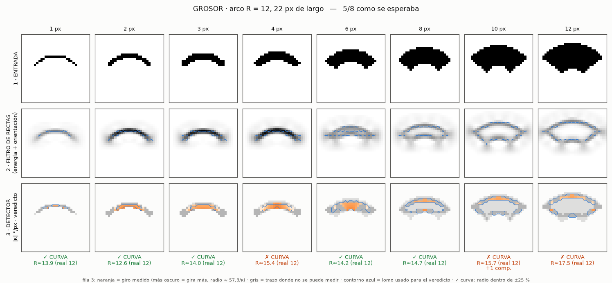
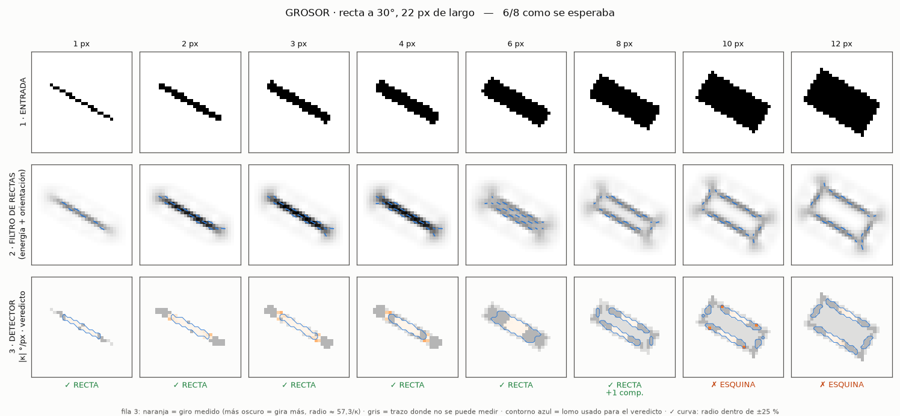
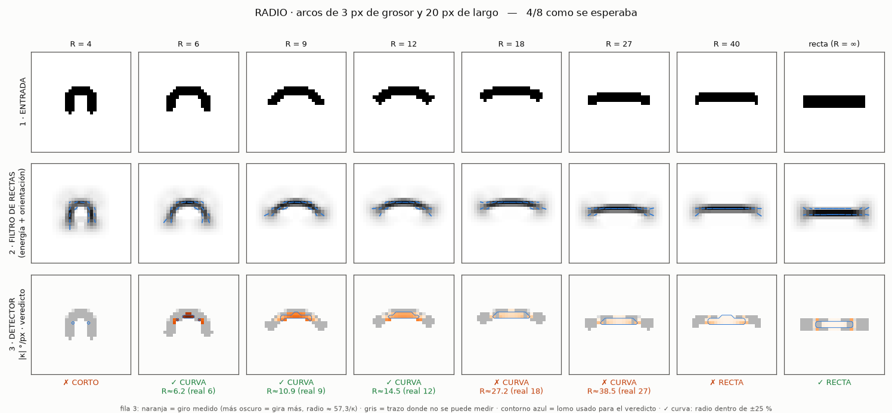
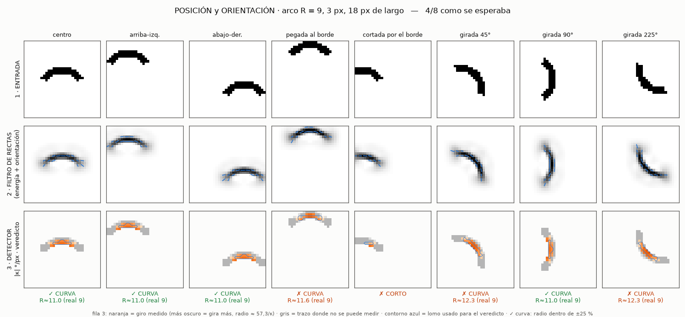

Lo que se ve (medido con esta galería):

- **Grosor.** De 1 a 8 px el arco R = 12 sale curva con R 12,6–15,4. Desde 6 px el filtro ve los **dos bordes** del
  trazo (fila 2) y el radio que da es el del borde **exterior**: con 12 px de grosor estima 17,5, y el borde exterior está
  en 18. Las rectas a 30° salen recta hasta 8 px; con 10 y 12 px el trazo es un rectángulo y sale **esquina**.
- **Radio.** R = 4 sale «corto» (por debajo del rango útil); 6, 9 y 12 bien; R = 40 sale recta (ya conocido). R = 18
  horizontal sale 27 ✗, pero **es la orientación peor**: el mismo arco girado da 17,5–22,5 (medido en 8 orientaciones;
  R = 9 da 9,1–10,9 en todas).
- **Posición.** Dentro del cuadro, la posición no cambia nada (convolución). Pegada al borde sobreestima un poco
  (R ≈ 12); **cortada** por el borde queda «corto»: le faltan píxeles para medir el giro.

### La misma galería con el Gabor ESTRECHADO al mínimo: λ = 2 (2026-10-10, pedido del dueño)

`python galeria.py --lam 2` → `imagenes/10-galeria-*-lam2.png` y [`resultados-galeria-lam2.json`](resultados-galeria-lam2.json).
Las de λ = 6 de arriba **no se tocan** (re-generadas, salen idénticas byte a byte).

**Qué es el «ancho».** El Gabor par de este boceto es `exp(−u²/2σu² − v²/2σv²)·cos(2πv/λ)` sobre 9×9: a lo largo de la
recta σu = k/3 = 3 px; de través, una franja central positiva de **λ/2 px** con dos negativas a los lados y envolvente
σv = λ/2. Con λ = 6 la franja central mide **3 px** (hecha para trazos de ~3 px) y el kernel entero, 9 px de través.
**λ = 2 es el mínimo de la rejilla** (Nyquist): franja central de 1 px. Sólo cambia λ; el kernel sigue siendo 9×9 y TAU
(1,2) y los demás umbrales no se tocan.

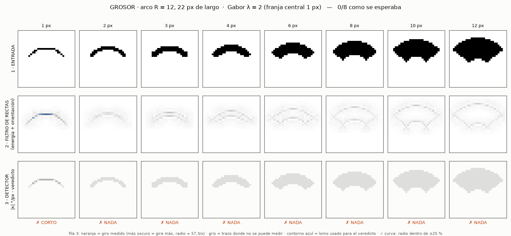
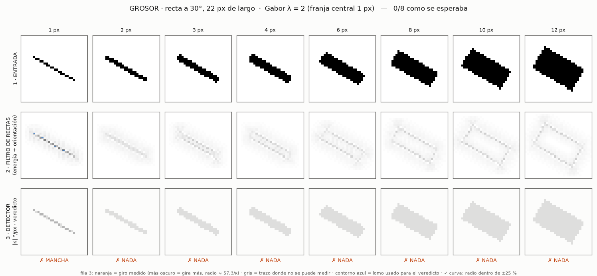
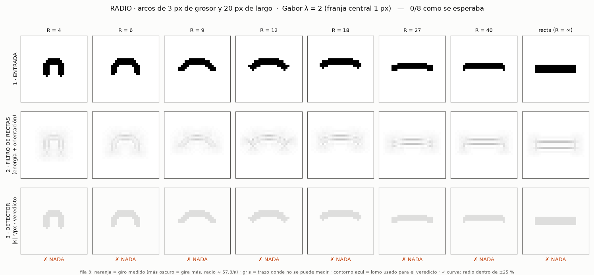
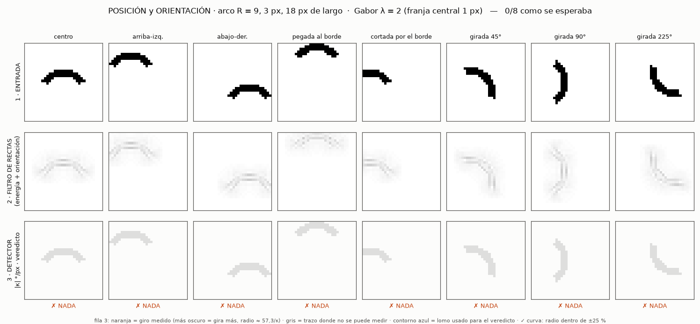

**0/32**, contra 19/32 con λ = 6. Un trazo de 2 px o más cubre la franja positiva **y** las negativas y se cancela: sólo
quedan sus bordes, con energía ≈ 1,0–1,1, por debajo de TAU. La recta de 1 px a 30° tampoco pasa: con franja de 1 px,
una recta oblicua cae entre píxeles (aliasing) y su energía baja a 0,83. **Y no es sólo el umbral:** el ruido del 1 % llega
a 0,97 con λ = 2, así que bajar TAU para recoger esos bordes metería el ruido.

Un barrido aparte, sin commitear, sobre **rectas de 1 px** en 36 orientaciones (cada 5°), 22 px de largo, sale recta en:
λ = 6 → 36/36 · λ = 4 → 32 · λ = 3,5 → 28 · λ = 3 → 20 · λ = 2,75 → 11 · λ = 2,5 → 2. O sea que estrechar empeora
**incluso el trazo fino**, para el que en principio estaría hecho. La causa probable (no aislada): el kernel sigue igual
de largo pero se hace más estrecho, así que se afina en orientación, y 12 orientaciones cada 15° dejan huecos entre ellas.

**Por qué no las detecta aunque en la fila 2 «se ven» curvas** (medido el 2026-10-10 con sondas sueltas sobre el arco
R = 12 de la galería, sin commitear):

1. **Lo que se ve son los BORDES, no el trazo.** De través, el Gabor λ = 2 vale `−0,2 · +0,33 · −0,2`: premia 1 px de
   tinta y castiga sus dos vecinos. Dentro de un trazo de 6 px los tres tienen tinta y se cancela (energía 0,09–0,12 en
   las filas interiores); sólo responde la fila del borde, a la que le falta un vecino negativo (0,94 arriba, 0,79 abajo).
   Por eso la fila 2 enseña dos contornos, el interior y el exterior.
2. **Esos bordes no llegan al umbral.** El detector decide primero dónde hay trazo con TAU = 1,2 (fijado para λ = 6,
   donde el arco de 3 px da 3,75). Con λ = 2 el máximo es 0,76–1,11 desde 2 px de grosor: **0 píxeles** pasan, y sin
   píxeles el veredicto es «nada». El ojo ve la curva porque la fila 2 se pinta en gris relativo y porque integra la forma
   entera; el detector mira ventanas de 9 px.
3. **Y bajar el umbral no basta.** Donde el borde se inclina es una escalera, y una franja de 1 px no encaja con ella: en
   el arco de 3 px la energía del borde cae de 0,99 en la parte plana de arriba a 0,55 en los lados. Con TAU = 0,6 y sin
   umbral de coherencia sigue saliendo «corto»/«nada»: la cadena se rompe y no quedan tramos para medir el giro a ±4 px.
4. **El de 1 px** sí pasa en la parte plana (2,15), pero los tramos oblicuos bajan a ~1,0 por el mismo motivo: 12 píxeles
   sueltos, «corto».

## Sobre los BORDES (2026-10-10, la idea del dueño): el filtro estrecho sí ve las curvas

*«Mi idea es que se usen sólo los bordes de la imagen real»* (el dueño, ese día). Es lo que el Gabor λ = 2 ya hacía por
su cuenta (§ anterior), sólo que ahora es la **entrada**: [`bordes.py`](bordes.py) extrae el contorno de 1 px
(`x AND NOT erosión 3×3`; el marco de la imagen no cuenta como borde) y le pasa el detector. Cuatro cambios respecto de
`curvas.py`, todos elegidos con un barrido, **no calibrados**; el detalle y de dónde sale cada número, en la cabecera del
script:

| | `curvas.py` (sobre el trazo) | `bordes.py` (sobre los bordes) |
|---|---|---|
| entrada | la imagen | su contorno de 1 px |
| ancho del filtro λ | 6 (franja de 3 px) | **3** (franja de 1,5 px) |
| energía antes del umbral | tal cual | suavizada σ = 1 px |
| umbral de trazo TAU | 1,2 | 0,5 |
| giro mínimo de un trozo curvo | 1 °/px (R < 57) | 2 °/px (R < 29) |
| veredicto | por componente | **por trozo**: cada curva del contorno, con su radio |

**El mínimo que funciona es λ = 3, no λ = 2.** Barrido sobre los 32 trazos de la galería, en bordes (λ ∈ {2; 2,5; 3; 4;
6}, kernel 5/7/9, 12/24 orientaciones, σ ∈ {0,7; 1; 1,5}, TAU 0,3–1,2): **λ = 2 no ve ningún arco en ninguna
combinación (0/22)**. Una franja de 1 px no encaja con un borde oblicuo de 1 px, que es una escalera: la respuesta cae a
cero cada medio píxel de desajuste. Con 1,5 px ya cabe la escalera.

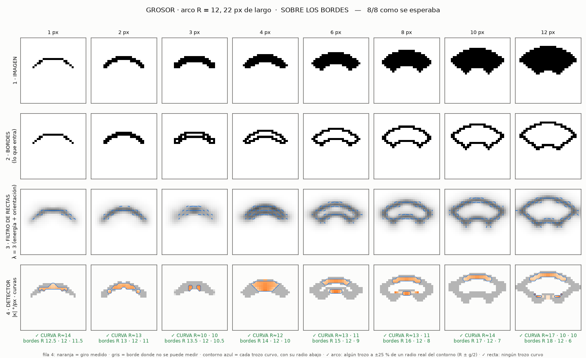
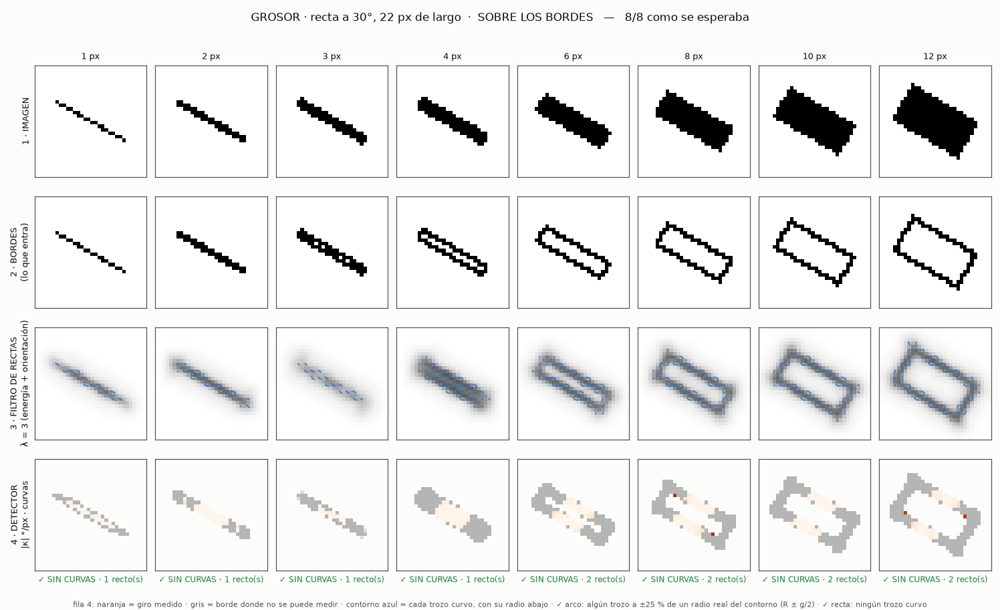
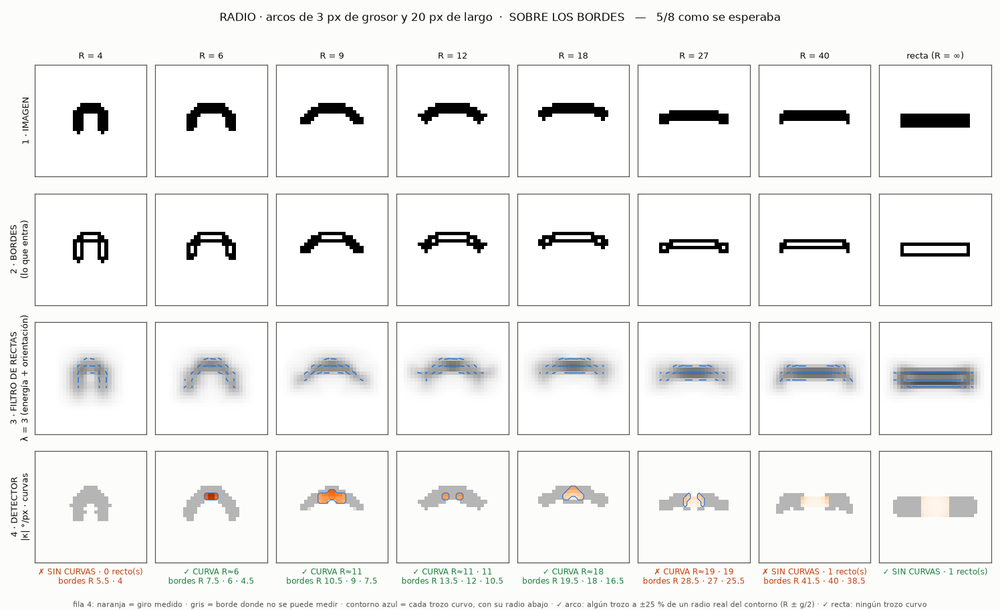
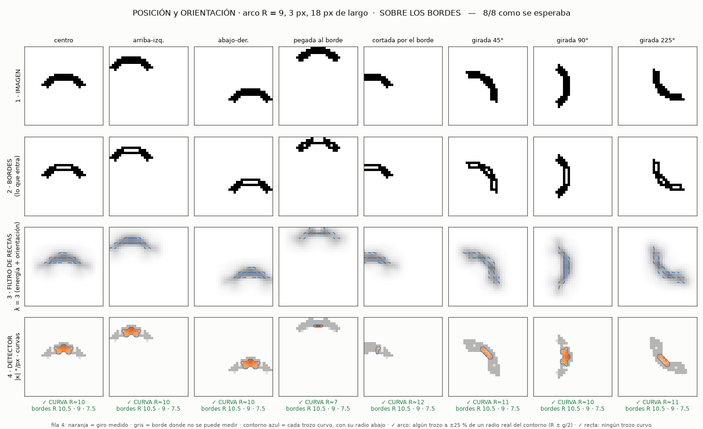

**29/32**, contra 19/32 sobre el trazo — ⚠ **con un criterio de acierto distinto**: aquí un arco acierta si **algún**
trozo curvo cae a ±25 % de **alguno** de los radios reales de su contorno (R + g/2, R, R − g/2), y una recta si no sale
**ningún** trozo curvo. Es más laxo que el de la galería anterior (veredicto de la componente y radio a ±25 % de R).
La comparación justa, con el **mismo** criterio para los dos, es la del banco:

[`resultados-bordes-banco.txt`](resultados-bordes-banco.txt) (`python bordes.py --banco`, 2.040 figuras de `rect-lin`):

| banco de rect-lin | n | acierto si… | sobre el trazo (λ 6) | sobre los bordes (λ 3) |
|---|---:|---|---:|---:|
| arcos R ≤ 27 | 360 | algún trozo a ±25 % de R, R ± g/2 | 86,9 % | **90,6 %** |
| arcos R 40 | 72 | ídem | 61,1 % | 0,0 % |
| rectas grosor 2–4 | 1080 | ningún trozo curvo | 94,8 % | **96,9 %** |
| rectas grosor 6–8 | 720 | ídem | 97,1 % | 93,3 % |
| rectas grosor 10–14 | 1080 | ídem | 97,4 % | 88,9 % |
| punteada · mancha · puntos · ruido | 1740 | ídem | 99,8–100 % | 99,4–100 % |

⚠ **El banco ya no es una prueba a ciegas para el giro mínimo**: el 2 °/px se eligió mirándolo (con 1 °/px, la escalera
de un borde recto oblicuo salía curva de R ≈ 24–45 en el 19 % de las rectas finas). Los otros tres números se eligieron
sólo con la galería, y en el banco lo aguantan.

Lo que se ve:

- **Trazo grueso → dos curvas**, como pide la idea: con 6 y 8 px salen la de fuera y la de dentro (R ≈ 13 y 11 en un
  arco de R 12 y 6 px, cuyo contorno real es 15 y 9). Con 10–12 px sólo sale bien la de fuera (R ≈ 14–17, real 17–18):
  la de dentro es corta y muy cerrada.
- **Trazo de 2–4 px**: los dos bordes quedan a 1–2 px y el filtro de 1,5 px casi los junta; se mide poco (en el de 3 px,
  dos trozos pequeños).
- **R = 4** (contorno 5,5 y 2,5): nada, como antes. **R = 27**: sale R ≈ 19, ✗. **R = 40**: recta. El tope de 29 px
  del giro mínimo hace que los arcos abiertos ya no salgan curva: el rango útil, en esta galería, es **5–20 px**, más corto que el de antes.
- **Rectas, cualquier grosor: nunca curva** (8/8). Las gruesas son ahora lo que son: un rectángulo, dos lados rectos.

**Qué no está hecho:** emparejar las dos curvas de un trazo (la de fuera con la de dentro → el grosor y el radio del
trazo); las esquinas del contorno (los extremos de un trazo grueso giran 90° de golpe, y eso hoy no se busca);
punteadas (sus bordes son puntos sueltos); y nada de esto está probado en dígitos.

### Qué pasa con la franja central de 1 px, calculado (2026-10-10, pedido del dueño)

`python franja1px.py` → tres figuras con los valores que salen de `curvas.py`/`bordes.py`, sin ajustar nada
([`resultados-franja1px.json`](resultados-franja1px.json)).

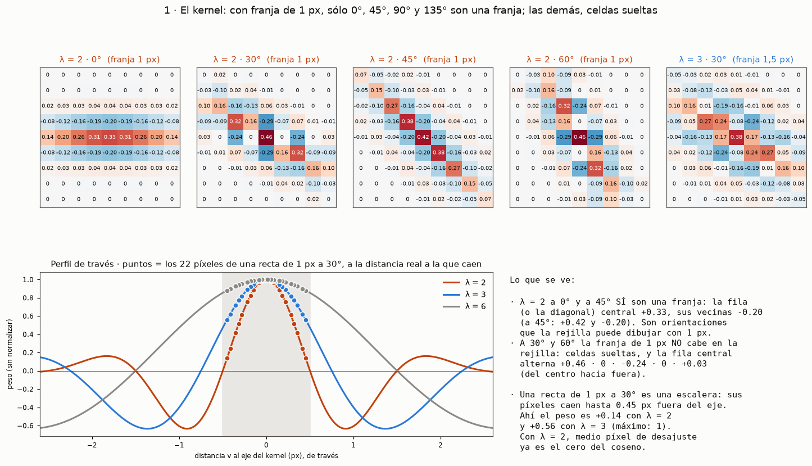
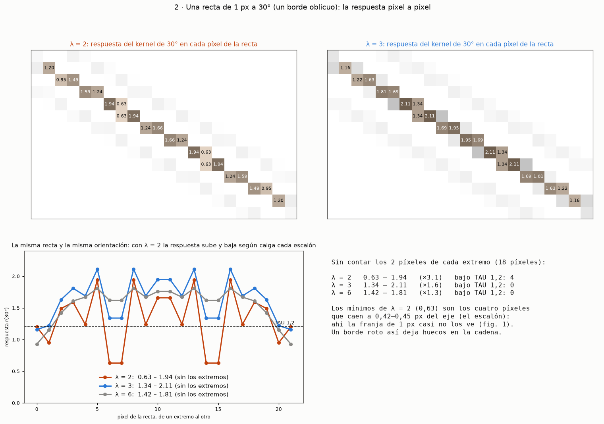
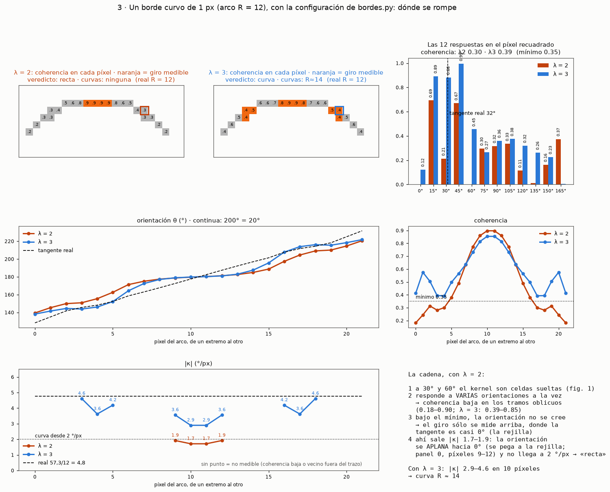

1. **El kernel.** Con λ = 2 sólo las orientaciones que la rejilla sabe dibujar con 1 px (0°, 45°, 90°, 135°) son una
   franja (a 0°: fila central +0,33, vecinas −0,20). A 30° y 60° son celdas sueltas: la fila central alterna
   +0,46 · 0 · −0,24 · 0. Una recta de 1 px a 30° tiene píxeles hasta 0,45 px fuera del eje, y ahí el peso es +0,14 con
   λ = 2 contra +0,56 con λ = 3: medio píxel de desajuste es el cero del coseno.
2. **Una recta de 1 px a 30°.** El kernel de 30° responde de 0,63 a 1,94 a lo largo de la misma recta (×3,1; con λ = 3,
   ×1,6; con λ = 6, ×1,3). Los cuatro mínimos son los píxeles del escalón.
3. **Un borde curvo de 1 px (R = 12).** En un tramo oblicuo, el kernel de la orientación correcta casi no responde
   (tangente real 32°: r(30°) = 0,21) y responden los vecinos (15°: 0,69; 45°: 0,67) y otros lejanos: la coherencia baja
   a 0,18–0,31 en los cinco píxeles de cada extremo, bajo el mínimo de 0,35, y el giro no se mide. Sólo se mide arriba, donde la tangente es casi 0° y la rejilla
   ayuda; pero ahí la orientación se aplana hacia 0° y el giro sale 1,7–1,9 °/px (real 4,8): «recta». Con λ = 3, el giro
   se mide en 10 píxeles (2,9–4,6 °/px) y sale curva R ≈ 14.

**El detector sobre bordes también detecta RECTAS, y es a propósito** (medido el 2026-10-10 con `bordes.py`, λ = 3, sobre
el banco de `rect-lin`, con sondas sueltas): cada trozo del contorno es recto (|κ| < 2 °/px) o curvo. Rectas de 16 y 22
px de largo: **sólo trozos rectos en el 86–87 %**, algún trozo curvo en el 8–10 %, nada en el 3–6 %. Rectas de 10 px:
**nada en el 93 %** (no caben ±4 px para medir el giro a lo largo de un borde tan corto). Arcos R ≤ 27: sólo curvos 73 %,
rectos y curvos 21 %, sólo rectos 6 %. Arcos R 40: sólo rectos 69 %.

## La ORIENTACIÓN de cada curva: hacia dónde está su centro (2026-10-10, pedido del dueño)

Hasta aquí cada trozo curvo traía su **radio** pero no su orientación. No hacía falta medir nada nuevo: en cada píxel ya
están la orientación local θ y el giro κ, y su combinación es el **vector de curvatura**

    k = κ · (−sin θ, cos θ)        (la derivada de la tangente u = (cos θ, sin θ) a lo largo de sí misma)

que apunta siempre al **centro** de la curva. ⚠ Esto corrige a medias la decisión 3 de arriba: el **signo de κ solo** no
sirve (se da la vuelta donde θ cruza 0°/180°), pero cuando se da la vuelta la tangente se da la vuelta también la normal,
así que el **producto** no cambia. `bordes.trozos(..., theta)` promedia los k del trozo y devuelve `direccion` (0° →,
90° ↓, 180° ←, 270° ↑, en coordenadas de imagen), `coherencia` (1 = todos los píxeles apuntan igual) y `centro`
(centroide del trozo + radio · dirección). Sin parámetros nuevos.

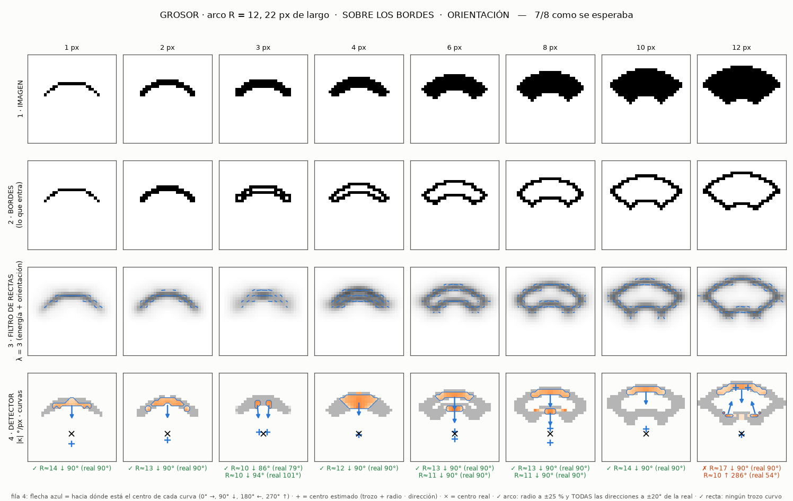
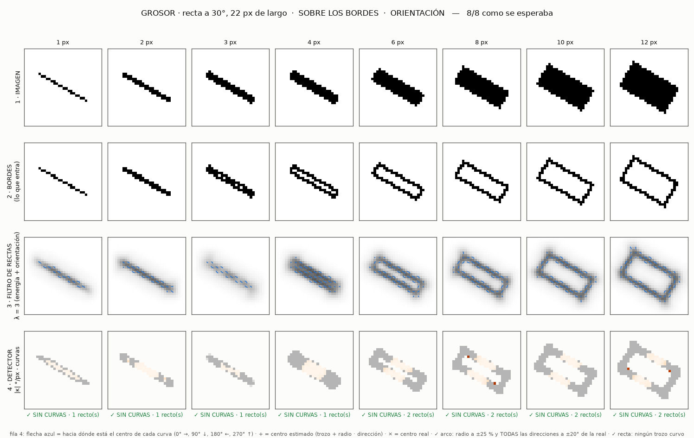
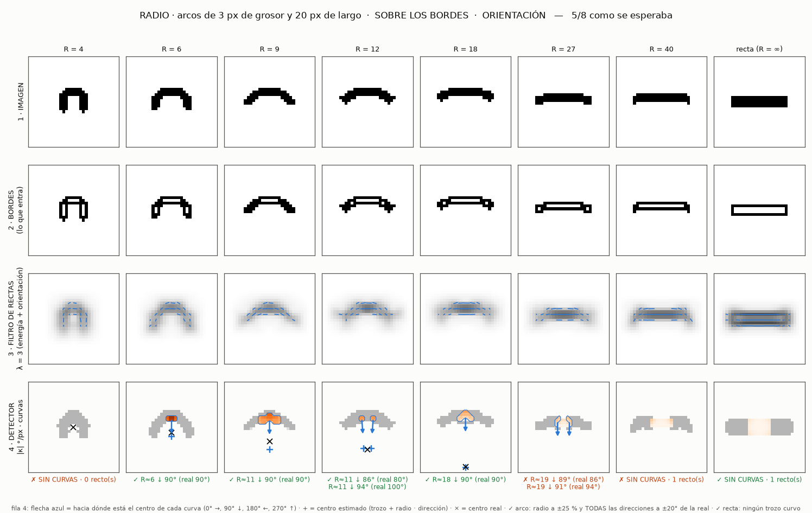
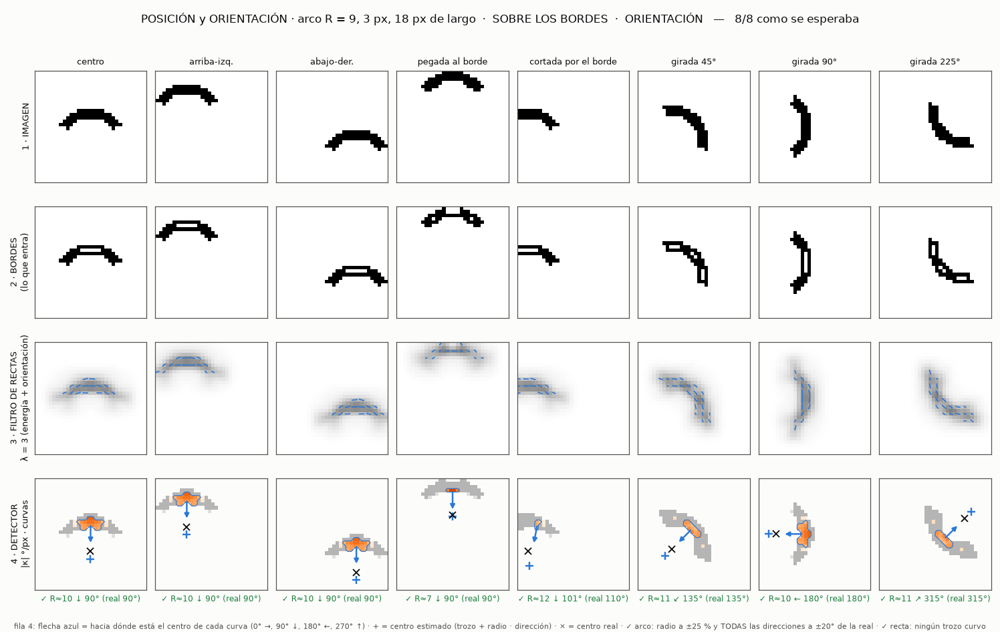

Medido sobre los 32 trazos de la galería ([`resultados-orientacion.json`](resultados-orientacion.json)): **28 trozos
curvos, error mediano 0°, p90 7,6°**; 26 de 28 a ≤ 20° de la dirección real, que se mide desde **cada trozo** hasta el
centro real (no desde el punto medio del arco: un trozo puede no estar ahí, como en el arco cortado por el borde). Los
dos que fallan (127°) son los dos trozos pequeños del arco de 12 px de grosor, en los «pies» del contorno: son las
**esquinas** donde el borde interior se junta con los extremos, no el arco, y su curvatura apunta hacia dentro del
trazo. La tolerancia de ±20° es **elegida para la figura**, no calibrada.

Lo que esto abre, **sin probar**: distinguir una S de una C (dos trozos con direcciones opuestas contra la misma
dirección), y emparejar el borde de fuera con el de dentro de un trazo grueso (los dos apuntan al **mismo** centro).

## El compositor de dígitos con el detector sobre BORDES (2026-10-10, pedido del dueño) — REEMPLAZA a «curvas»

*«Usando sólo este detector, entrena el compositor con dígitos; si hay uno anterior puedes reemplazarlo (este está
revisado, tiene prioridad)»*. [`digitos_bordes.py`](digitos_bordes.py) (~5 min en el dev, 0 $;
[`resultados-digitos-bordes.json`](resultados-digitos-bordes.json)). **El protocolo de `digitos.py` sin cambiar nada**
(compositor lineal, 180 / 1617, 3 semillas, 3823 a ciegas), y las características sólo del detector de `bordes.py`:
mapa de recto, el **vector de curvatura** partido en sus cuatro sentidos (→ ← ↓ ↑, con |κ|) y el de esquina, max en
celdas 8×8: 384 números. Las tres comparaciones, **re-ejecutadas aquí** (la vieja y rectas reproducen sus 0,867 y 0,955).

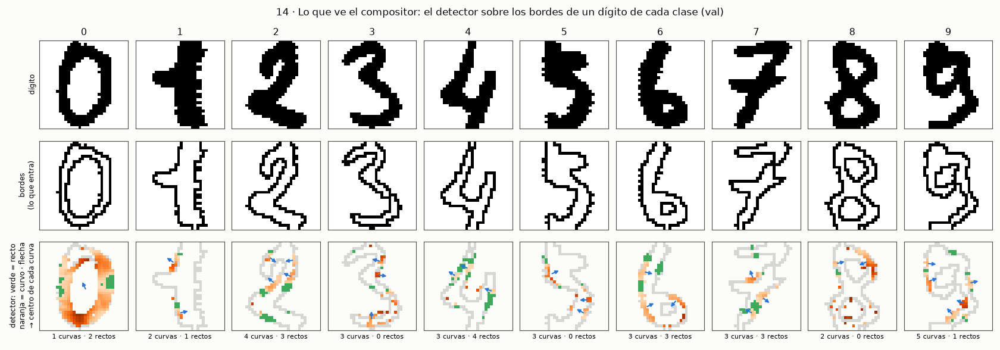
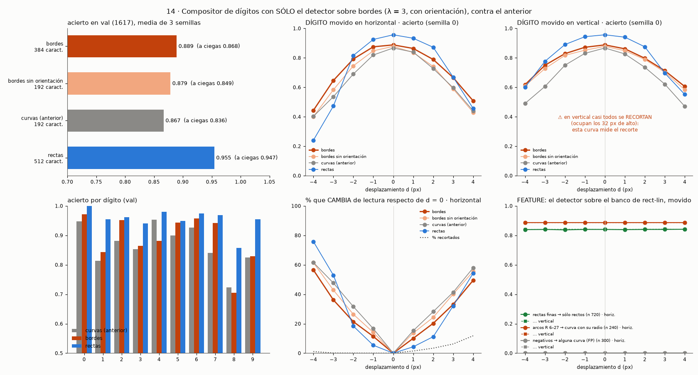

| compositor | características | val (1617) | a ciegas (3823) | predicción (antes de correr) |
|---|---:|---:|---:|---|
| **bordes** (con orientación) | 384 | **0,889** [0,888–0,891] | **0,868** | 0,90–0,93 ✗ (por debajo) |
| bordes sin orientación (recto · \|κ\| · esquina) | 192 | 0,879 [0,878–0,880] | 0,849 | 0,86–0,89 ✓ |
| curvas (anterior, sobre el trazo) | 192 | 0,867 [0,865–0,868] | 0,836 | — |
| rectas (rect-bor, variante C) | 512 | 0,955 [0,951–0,957] | 0,947 | por encima ✓ |

- **El nuevo gana al anterior: +0,022 en val y +0,032 a ciegas.** Medir sobre los bordes aporta +0,012 (sin orientación
  contra la vieja) y la **orientación** otro +0,011 (y +0,019 a ciegas). Me equivoqué por exceso: predije 0,90–0,93.
- **Sigue lejos de rectas (−0,065).** Por dígito, el nuevo pierde sobre todo en el **8** (0,705), el **9** (0,829), el
  **1** (0,843) y el **4** (0,881; la variante vieja daba 0,953). Confusiones más frecuentes (semilla 0): 8→3 y 8→9
  (13 cada una), 4→1 (12), 1→8 (9).
- **Por qué no más** (figura 1, visto, no medido aparte): los bordes de los dígitos de UCI son **escaleras ruidosas**
  (están escalados desde 8×8), y buena parte del contorno sale gris, sin giro medible. Lo que queda son trozos sueltos.

**Desplazamientos** (regla del 2026-10-09; semilla 0, val movido, sin re-entrenar):

| movido en horizontal | −4 | −2 | −1 | 0 | +1 | +2 | +4 |
|---|---:|---:|---:|---:|---:|---:|---:|
| bordes · acierto | 0,443 | 0,792 | 0,875 | 0,888 | 0,864 | 0,789 | 0,508 |
| bordes · % que cambia | 57 | 21 | 11 | 0 | 10 | 20 | 49 |
| rectas · acierto | 0,241 | 0,816 | 0,925 | 0,957 | 0,933 | 0,872 | 0,456 |
| rectas · % que cambia | 76 | 18 | 5 | 0 | 4 | 11 | 54 |
| % recortados | 1,1 | 0,1 | 0 | 0 | 1,5 | 3,4 | 11,8 |

Con ±1 px el nuevo cambia **más del doble** de lecturas que rectas (10–11 % contra 4–5 %); a ±3–4 px aguanta algo mejor.
La forma es la de siempre: la pérdida la pone la **rejilla de celdas de 4 px** del compositor, no el detector. ⚠ La
curva **vertical no vale**: del 97 al 100 % de los dígitos se recortan desde d = ±1 (ocupan los 32 px de alto).
**Feature** (el detector sobre el banco de `rect-lin` movido ±4 px en las dos direcciones): **plana** — rectas finas
leídas «sólo rectos» 0,84, arcos R 6–27 con su radio 0,89, falsos positivos 0,00 en las 9 posiciones. Es plana **por
construcción** (convolución + lectura por trozo, sin rejilla fija; regla 6), y el banco no recorta nada.

**Lo que no está hecho:** combinarlo con rectas (el combinado de antes sumaba +0,003); limpiar la escalera de los bordes
de UCI antes del detector; y la curva vertical con un dataset que deje margen.

### Los fallos, en una imagen (2026-10-10, pedido del dueño)

`python fallos_bordes.py` → [`imagenes/15-fallos-bordes.png`](imagenes/15-fallos-bordes.png) y
[`resultados-fallos-bordes.json`](resultados-fallos-bordes.json): los **181** dígitos de val que falla el compositor
sobre bordes (semilla 0, acierto 0,888), ordenados por dígito real, con lo que vio el detector encima.

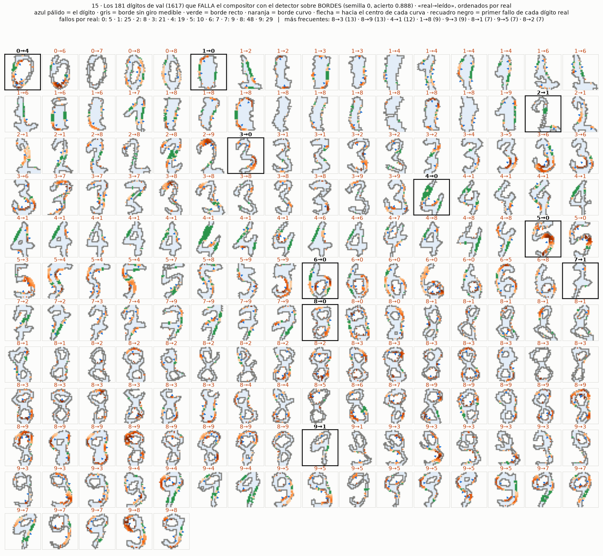

Fallos por dígito real: 0: 5 · 1: 25 · 2: 8 · 3: 21 · 4: 19 · 5: 10 · 6: 7 · 7: 9 · **8: 48** · 9: 29. Lo que se ve, y
lo que se midió con una sonda suelta (sin commitear) sobre la fracción del borde con giro medible:

- **En general el detector mide poco borde: el 25 % en los aciertos y el 18 % en los fallos** (medias). Los fallos
  tienen menos borde legible, pero los aciertos tampoco tienen mucho: la escalera de los dígitos de UCI deja la mayor
  parte del contorno en gris.
- **El 8 no falla por eso**: mide el **12 %** del borde, igual en sus fallos que en sus aciertos. Es la clase con menos
  borde legible de todas, y lo que queda (trozos curvos sueltos en los dos lazos) se parece al 3, al 9 y al 2.
- **4→1 (12):** del 4 sale sobre todo el trazo diagonal largo, en verde (recto); las curvas son pocas y pequeñas.
- **1→8, 1→6 (17 juntos):** los 1 de UCI son **gruesos**, casi un bloque, y su contorno cerrado tiene curvas en los
  extremos que se leen como lazos.

### Suavizar el dígito ANTES de sacarle el borde (2026-10-10, pedido del dueño)

*«¿Los dígitos pasan por el Gabor primero? Prueba a suavizar los dígitos antes; varios niveles; sólo los de error.»*
No: el Gabor ve el **borde**, y el borde hereda la escalera del dígito. [`suavizado.py`](suavizado.py) (2 min, 0 $;
[`resultados-suavizado.json`](resultados-suavizado.json)) suaviza el dígito con una gaussiana σ, lo re-binariza en 0,5
y sigue igual que `digitos_bordes.py`. El compositor se **re-entrena** para cada σ (train suavizado igual). Se enseñan
los 181 fallos de σ = 0, pero se da también el val entero y cuántos aciertos se rompen: mirar sólo los fallos sesga a
favor de cualquier cambio.

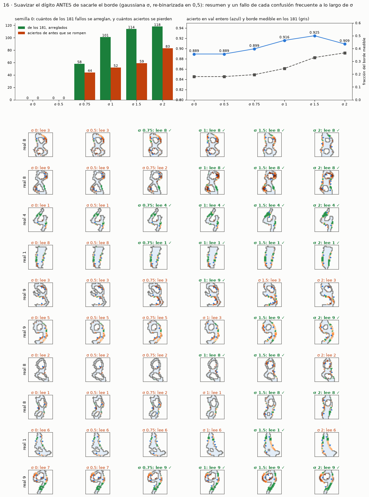
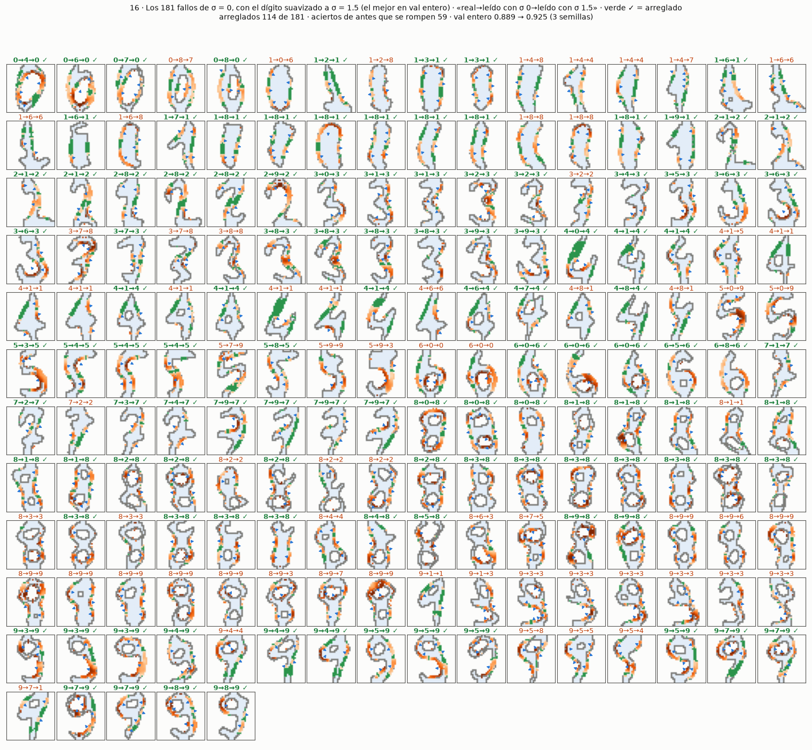

| σ | val entero (3 semillas) | de los 181, arreglados | aciertos que se rompen | borde medible (los 181) |
|---|---:|---:|---:|---:|
| 0 | 0,889 | — | — | 0,181 |
| 0,5 | 0,889 | 0 | 0 | 0,181 |
| 0,75 | 0,899 | 58 | 44 | 0,196 |
| 1 | 0,916 | 101 | 52 | 0,244 |
| **1,5** | **0,925** [0,922–0,927] | **114** | 59 | 0,330 |
| 2 | 0,909 | 118 | 83 | 0,366 |

- **σ = 1,5 sube el val entero de 0,889 a 0,925 (+0,036)**: arregla 114 de los 181 y rompe 59 aciertos (neto +55 en
  la semilla 0). Predicción: se cumplió la forma (sube y luego baja), no el sitio: esperaba el óptimo en 0,5–1.
- **σ = 0,5 no cambia nada**: una gaussiana tan estrecha sobre una imagen binaria, re-binarizada en 0,5, devuelve la
  misma imagen.
- **El borde medible sube con σ** (0,18 → 0,33 en σ 1,5), pero el acierto cae en σ 2 aunque siga subiendo: el
  suavizado ya cambia la forma (cierra el ojo de algunos 9 y 8; figura 1).
- ⚠ **σ se eligió mirando val**, así que 0,925 es optimista; no se ha medido a ciegas ni con desplazamientos. Si se
  adopta, va con su curva de desplazamientos y el número a ciegas.

## El borde con GABOR, no con morfología (2026-10-10, regla del dueño)

*«No hagas más la obtención de bordes que haces, anota eso. Reemplázalo con filtro Gabor, prueba varios si es
necesario. Prueba sin suavizar y luego suavizado, aunque sospecho que con Gabor podría no hacer falta el suavizado.»*

El Gabor del detector es **par** (coseno) y responde a **líneas**; el que responde a **bordes** es el **impar** (seno).
[`bordes_gabor.py`](bordes_gabor.py) (6 min, 0 $; [`resultados-bordes-gabor.json`](resultados-bordes-gabor.json)):
dígito → banco de Gabor impar (5×5, 8 orientaciones, λ_b) → borde = max |respuesta|, normalizado por la de un escalón
ideal → gris o binarizado en 0,5 → el detector de curvas sin tocar. El suavizado va sobre el dígito, sin re-binarizar.
El compositor, el de siempre (3 semillas, 180 / 1617, 3823 a ciegas).

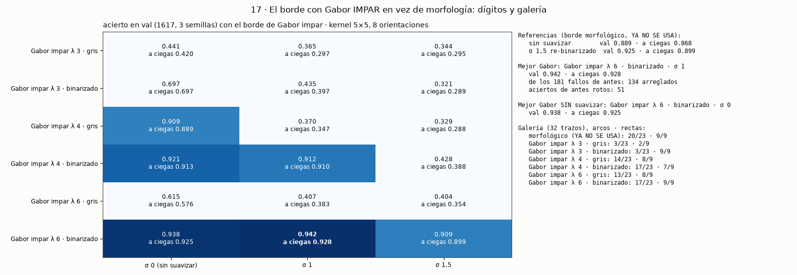
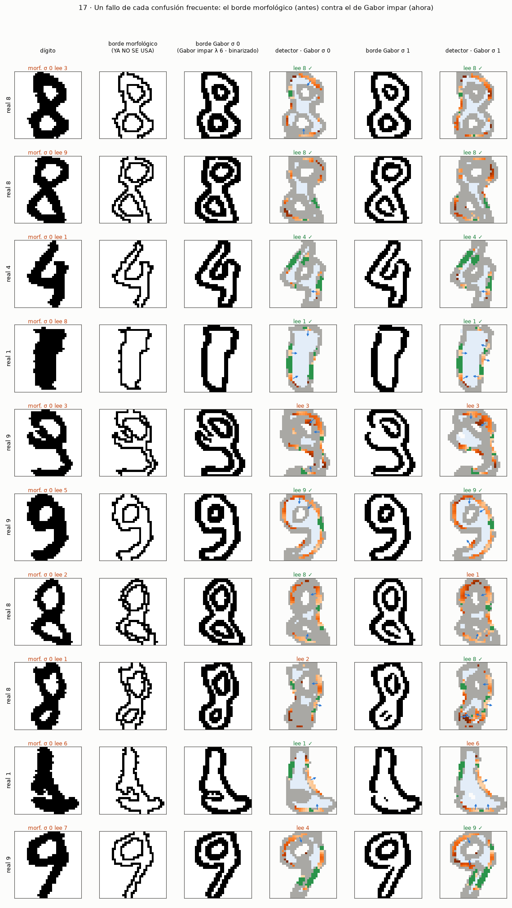

| borde | σ 0 (sin suavizar) | σ 1 | σ 1,5 |
|---|---:|---:|---:|
| morfológico (retirado) | 0,889 · a ciegas 0,868 | — | 0,925 · 0,899 (re-binarizado) |
| **Gabor impar λ 6 · binarizado** | **0,938 · a ciegas 0,925** | 0,942 · 0,928 | 0,909 · 0,899 |
| Gabor impar λ 4 · binarizado | 0,921 · 0,913 | 0,912 · 0,910 | 0,428 · 0,388 |
| Gabor impar λ 4 · gris | 0,909 · 0,889 | 0,370 | 0,329 |
| Gabor impar λ 6 · gris | 0,615 · 0,576 | 0,407 | 0,404 |
| Gabor impar λ 3 (gris o binarizado) | 0,441 / 0,697 | ≤ 0,435 | ≤ 0,344 |

- **El Gabor impar λ 6 binarizado, sin suavizar, es el mejor borde que se ha probado: 0,938 en val y 0,925 a ciegas**
  (+0,049 y +0,057 sobre el morfológico sin suavizar; también por encima del morfológico suavizado, 0,925 / 0,899). De
  los 181 fallos de antes arregla 131 y rompe 49 aciertos. El borde sale liso (figura 2): el Gabor integra sobre su
  ventana, y la escalera de los dígitos de UCI ya no llega al detector.
- **La sospecha del dueño se confirma: con Gabor no hace falta suavizar.** σ 1 da +0,004 (0,942), dentro de lo que se
  mueve entre semillas (0,936–0,939 contra 0,939–0,947); σ 1,5 empeora. Se adopta **sin suavizar**.
- **Lo que falla, y por qué** (medido con una sonda suelta sobre 300 dígitos, sin commitear): las configuraciones que se
  hunden a 0,33–0,44 dejan al detector **sin borde medible** — 3 a 17 píxeles medibles por dígito, contra 73–94 en las
  que funcionan. El borde **gris** es una banda de 2–3 px que se desvanece, y el detector (Gabor par λ 3, calibrado sobre
  un contorno binario de 1 px) apenas la ve; con λ 4 y σ 1,5 el escalón difuminado ya no pasa de 0,5 y el borde
  desaparece (1,7 % de píxeles contra 20 %); con λ 3 el borde sale grueso e irregular. **No es un fallo del Gabor de
  bordes: es el detector, calibrado para otra entrada.** Si se quiere el borde gris (sin umbral), hay que recalibrar el
  detector para él.
- **Galería** (32 trazos): el Gabor λ 6 binarizado ve 17/23 arcos con su radio (el morfológico, 20/23) y 9/9 rectas. En
  trazos finos los dos bordes del trazo se juntan en una banda y el radio sale sobrestimado (arco R 9 → 13,6).
- ⚠ **λ 6 y el binarizado se eligieron mirando val** (6 bordes × 3 σ); el número a ciegas no se usó para elegir y lo
  confirma (0,925). **Falta** la curva de desplazamientos con este borde (regla del 2026-10-09).

### El borde GRIS, con el detector re-calibrado para él (2026-10-10, pedido del dueño)

*«Prueba re-calibrar para no binarizar, varios Gabor (por si algo cambia).»* [`gris_recalibrado.py`](gris_recalibrado.py)
(13 min en el dev, 0 $; [`resultados-gris-recalibrado.json`](resultados-gris-recalibrado.json)). Para cada Gabor impar de borde
(λ_b 3–12 × kernel 5/7/9, sin binarizar ni suavizar) se re-calibran los cuatro números del detector que dependen del
formato de la entrada —umbral de trazo TAU (0,1–0,5), suavizado de la energía σE (0,5/1), coherencia mínima (0,25/0,35)
y el λ del Gabor PAR que lee las líneas (3/4)— **eligiendo sólo con la galería de 32 trazos**, nunca con los dígitos.

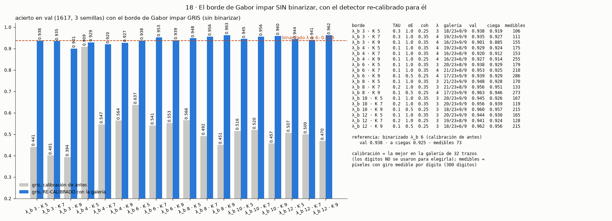

| borde gris (Gabor impar) | calibración (TAU · σE · coh · λ par) | val (3 semillas) | a ciegas | px medibles |
|---|---|---:|---:|---:|
| λ_b 3 · K 5 | 0,3 · 1 · 0,25 · 3 | 0,938 | 0,919 | 106 |
| λ_b 6 · K 5 | 0,1 · 1 · 0,35 · 3 | 0,938 | 0,929 | 179 |
| λ_b 8 · K 7 | 0,2 · 1 · 0,35 · 3 | 0,956 | 0,951 | 133 |
| **λ_b 8 · K 9** | 0,1 · 0,5 · 0,25 · **4** | **0,963** | 0,946 | 273 |
| **λ_b 10 · K 9** | 0,1 · 0,5 · 0,25 · 3 | 0,960 | **0,957** | 215 |
| λ_b 12 · K 9 | 0,1 · 0,5 · 0,25 · 3 | 0,962 | 0,956 | 215 |
| *referencia: binarizado λ_b 6 · K 5 (calibración de antes)* | *0,5 · 1 · 0,35 · 3* | *0,938* | *0,925* | *73* |
| *referencia: rectas (rect-bor, variante C)* | | *0,955* | *0,947* | |

(las 18, en la figura y en el JSON)

- **Re-calibrar arregla el borde gris en las 18 configuraciones**: de 0,39–0,64 (0,909 sólo en λ_b 4 · K 5) a
  0,900–0,963. La causa era la que se midió: los píxeles con giro medible pasan de 4–12 (46 en λ_b 4 · K 5) a 106–286
  por dígito.
- **Y el gris re-calibrado supera al binarizado**: con kernel 9 y λ_b 8–12, **0,960–0,963 en val y 0,946–0,957 a
  ciegas**, contra 0,938 / 0,925. Es la primera vez que el compositor **sólo con curvas** alcanza al de **rectas**
  (0,955 / 0,947): en val, los tres; a ciegas, sólo λ_b 10 y 12 (0,957 y 0,956) — λ_b 8 · K 9 se queda en 0,946.
  Me equivoqué en la predicción: esperaba que el gris no superase al binarizado.
- ⚠ **Selección**: la calibración se eligió con la galería, pero el borde (λ_b, K) se elige entre 18 mirando val. Por
  val gana λ_b 8 · K 9 (0,963), y su número a ciegas es **0,946**; λ_b 10 · K 9 da el mejor a ciegas (0,957). La meseta
  K 9 · λ_b 8–12 es lo robusto, no un punto.
- ⚠ **Dos bordes del rango**: K 9 es el mayor kernel probado y TAU 0,1 el menor umbral de la rejilla, y los mejores están
  en los dos. Puede haber más arriba (K 11) y más abajo (TAU < 0,1); no se ha mirado.
- Con λ_b ≥ 8 en un kernel de 9×9 no cabe medio periodo del seno por lado: el Gabor impar se comporta como una
  **derivada suavizada** (un detector de escalón), más que como una onda.
- En λ_b 8 · K 9 la galería eligió **λ 4** para el Gabor par que lee las líneas, no el λ 3 acordado: el borde gris es
  una banda más ancha que el contorno de 1 px para el que se eligió λ 3. En λ_b 10–12 · K 9 se queda en 3.
- **Falta**: la curva de desplazamientos con este borde, y mirar K 11 y TAU < 0,1.

#### Los fallos con el borde gris re-calibrado (2026-10-10, pedido del dueño)

[`fallos_gris.py`](fallos_gris.py) → [`imagenes/19-fallos-gris.png`](imagenes/19-fallos-gris.png) y
[`resultados-fallos-gris.json`](resultados-fallos-gris.json). λ_b 10 · kernel 9 (el mejor a ciegas, y el que conserva el
λ 3 del Gabor par), semilla 0: **64 fallos** en val (acierto 0,960), contra 181 con el borde morfológico; **30 ya
fallaban antes** y 34 son nuevos. Cada fallo en dos celdas: el borde gris que entra y lo que ve el detector.

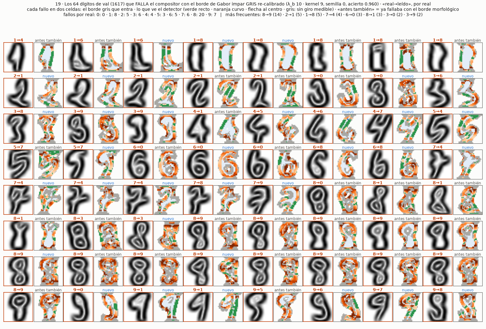

Fallos por real: 0: 0 · 1: 8 · 2: 5 · 3: 6 · 4: 4 · 5: 3 · 6: 5 · 7: 6 · **8: 20** · 9: 7. Más frecuentes: **8→9 (14)**,
2→1 (5), 1→8 (5), 7→4 (4), 6→0 (3), 8→1 (3).

## El detector con la entrada SIEMPRE DELGADA: esqueleto morfológico antes (2026-10-10, pedido del dueño)

*«El esqueleto morfológico se ve bien. Ahora en el experimento detector de curvas, entrena el detector de curvas con esa
entrada siempre delgada (para las curvas definidas de ese detector, previamente adelgazadas por el morfológico).»* La
morfología se usa aquí **para adelgazar, por orden del dueño**; la regla del mismo día la prohíbe para sacar el borde.

[`esqueleto.py`](esqueleto.py) (6,5 min, 0 $; [`resultados-esqueleto.json`](resultados-esqueleto.json)): imagen →
`skimage.skeletonize` → el detector (sin paso de borde). «Entrenar» este detector es **calibrarlo** (no tiene pesos): λ del
Gabor par, TAU, σE y coherencia, 48 combinaciones, elegidas con **la mitad del banco de `rect-lin` esqueletizado**
(rectas de todos los grosores, arcos R ≤ 27, negativos; tres tasas por igual) y comprobadas en la otra mitad.

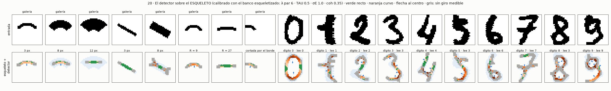
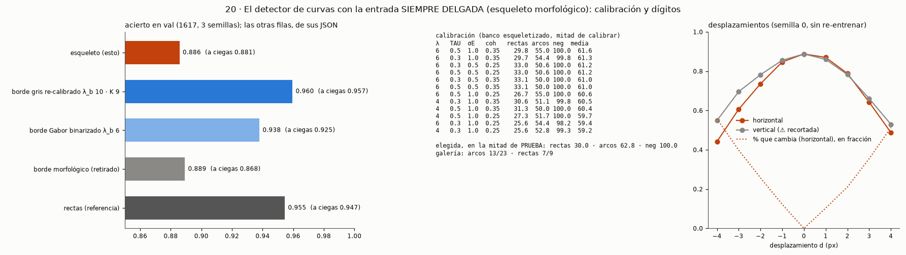

| | rectas → sólo rectos | arcos → curva con su radio | negativos → nada | dígitos val · a ciegas |
|---|---:|---:|---:|---:|
| **esqueleto + detector calibrado** (λ par 6 · TAU 0,5 · σE 1 · coh 0,35) | **30,0** | **62,8** | 100 | **0,886 · 0,881** |
| borde gris re-calibrado (λ_b 10 · K 9), lo mejor hasta hoy | — | — | — | 0,960 · 0,957 |

(banco: la mitad de prueba; la de calibrar da lo mismo, 29,8 / 55,0 / 100. Galería: arcos 13/23 · rectas 7/9.)

**No funciona tan bien como el borde gris: 0,886 contra 0,960.** Y el motivo se ve en el banco, desglosado (sonda suelta
con la calibración elegida, sin commitear):

- **Los arcos salen bien** (casi todos con trozo curvo, de R 6 a 27 y grosor 2 a 8): lo que falla en ellos es sobre todo
  el radio a ±25 %.
- **Las rectas son el problema, y por el esqueleto, no por el detector.** Una recta de 10 px queda en un esqueleto de
  ~8 px: no da para medir el giro a ±4 px («sin trozos» en 41–53 de 60). Y una recta gruesa (6–14 px) se esqueletiza como
  una línea con **ramitas en Y en las esquinas**, que el detector lee como curvas (28–38 de 60 en las de 16 px). Las finas
  y largas sí salen rectas (L 16 · g 2: 60/60).
- **En los dígitos** pasa lo mismo: el esqueleto de un trazo grueso trae ramitas en los extremos y en los cruces
  (figura 1), y el arco grueso de 12 px se queda en una línea corta y recta.
- **Predicción**: acerté el λ par mayor que 3 (salió 6) y que no superaría al borde gris; fallé por mucho en el banco
  (esperaba ≥ 90 % de arcos y de rectas) y en dígitos (esperaba 0,94–0,96).

⚠ **Medido una sola vez y sin pasar por el `verificador`**; los números salen del JSON de esta corrida.

**Lo que lo arreglaría, sin probar**: (1) **podar las ramitas** del esqueleto (quitar ramas de menos de ~3 px desde un
extremo), que es lo que convierte las rectas gruesas en curvas; (2) **calibrar con figuras que de verdad sean líneas**
tras esqueletizar (las del banco de 10 × 14 px son bloques, el pendiente 6 de la línea); (3) bajar la distancia de giro
(±4 px) para esqueletos cortos.

### Las curvas que definen al detector, esqueletizadas (2026-10-10, pedido del dueño)

[`curvas_esqueleto.py`](curvas_esqueleto.py): sólo la forma que entra al detector en `esqueleto.py`, sin detector.

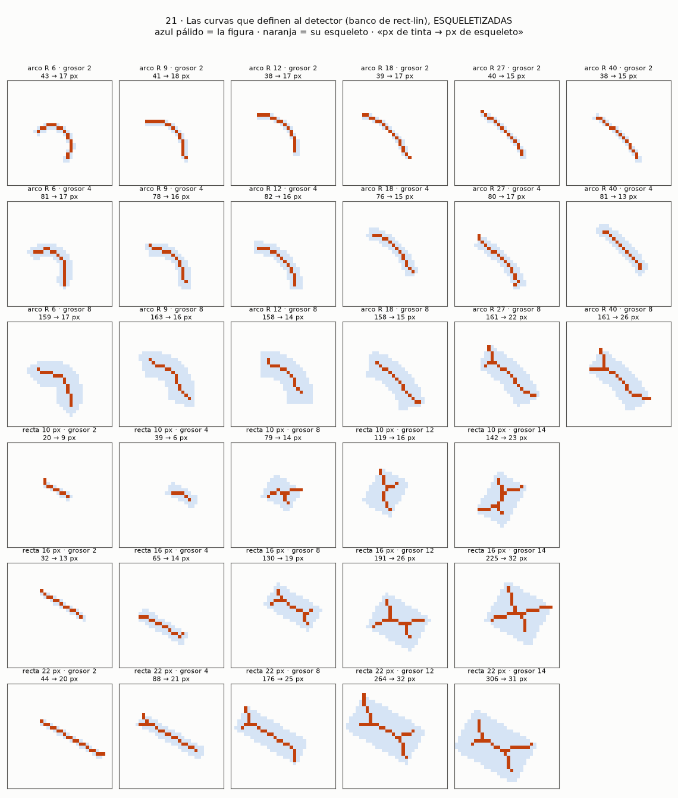
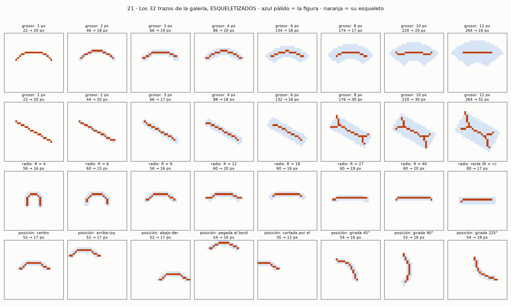

Lo que se ve (mirado, no medido): los arcos **finos y medios** (grosor 2–4) dan un esqueleto limpio que conserva la
curva; las figuras **gruesas** (grosor ≥ 8) dan esqueletos con **ramitas en Y o en cruz** en las esquinas; las «rectas»
de 10 px con grosor 12–14 son bloques y su esqueleto es una cruz; y los arcos **muy gruesos de la galería** (8–12 px
sobre R 12) se esqueletizan como una **recta**: la figura es más ancha que curvada y el esqueleto sigue su eje largo.

## El detector para trazos DELGADOS (≤ 3 px), sobre la imagen, sin esqueleto (2026-10-10, pedido del dueño)

*«El esqueletizado no funciona con estas curvas gruesas. Vamos a cambiar la estrategia. Vamos a ajustar Gabor para
rectas delgadas solamente. Delgadas ≤ 3 px. Debe reconocer rectas, curvas y posición del centro aproximada. No apliques
esqueletización a nada.»*

[`delgadas.py`](delgadas.py) (3 min, 0 $; [`resultados-delgadas.json`](resultados-delgadas.json)). **Cómo queda el
detector:**

    imagen (trazo de 1–3 px) ─► 12 Gabor PAR 9×9 (cada 15°), λ 6 ─► orientación θ y coherencia por píxel ─► giro κ a ±4 px a lo
    largo de la tangente ─► TROZOS (≥ 4 px), cada uno:
        · RECTO si |κ| < 2 °/px, CURVO si no
        · centro: el centroide del trozo
        · si es curvo: radio = 57,3 / mediana |κ| · dirección al centro de curvatura (vector κ·(−sin θ, cos θ)) · ese centro

Sin esqueleto, sin paso de borde. Calibración elegida entre 128 (λ 3–6 · TAU · σE · coherencia · giro mínimo) con 150
rectas, 150 arcos y 150 negativos **sintéticos de 1–3 px con su verdad** (posición, radio, centro de curvatura): **λ 6 ·
TAU 0,3 · σE 0,5 · coherencia 0,25 · giro mínimo 2 °/px** (empata exacto con TAU 0,6: el umbral apenas importa entre
esos dos). Comprobada con otros 300 por tipo, de otra semilla:

| prueba (sintéticas, 300 por tipo) | |
|---|---:|
| rectas → sólo trozos rectos | **99,7 %** |
| arcos (R 5–25) → algún trozo curvo | **97,7 %** |
| … con el radio a ±25 % | 81,0 % |
| negativos (ruido, puntos) → nada | 100 % |
| centro del trozo, error mediano | **0,21 px** (rectas) · **1,15 px** (arcos; p90 2,0) |
| centro de curvatura, error mediano | 2,25 px |

Y en lo que no se usó para calibrar: el banco de `rect-lin` (grosor ≤ 3) — rectas de 16–22 px **100 %**, arcos R ≤ 27
**94,2 %**, negativos 99,3 % —; la galería (sus 22 trazos de ≤ 3 px) — rectas 4/4, arcos 15/18 (radio a ±25 % en 9).

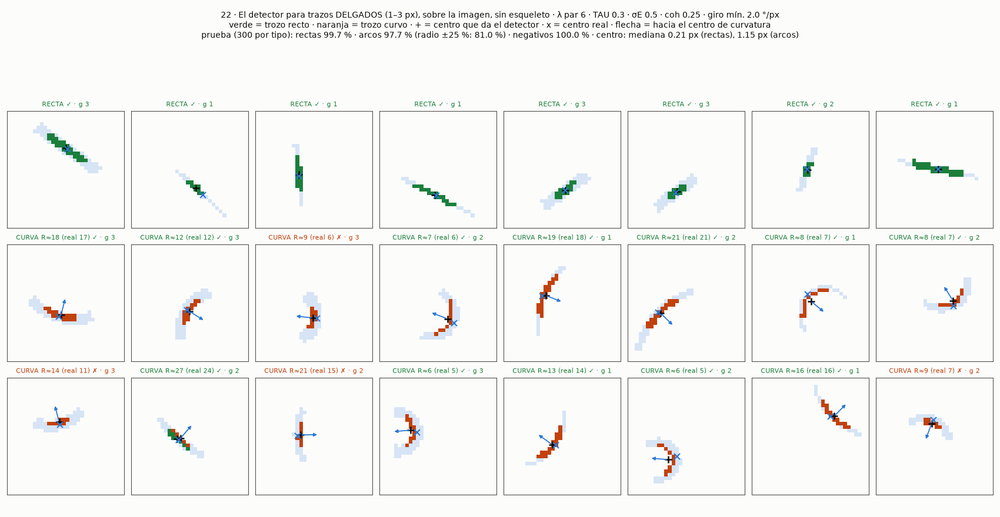

**Los límites, medidos:** rectas de **10 px**, sólo 19 % (no caben ±4 px de giro más un trozo de 4); arcos de **R 40**,
8 % (giran menos de 2 °/px: se leen rectos, que es lo que son a 32×32). El centro de un arco es el de su **trozo curvo**,
que puede no ser el punto medio del arco (p. ej. si un extremo sale recto). **Predicción:** acerté λ 4–6 (salió 6) y la
clasificación ≥ 90 %; el radio salió como esperaba (81 %); el centro, mejor en rectas (0,21 px) y en el límite en arcos
(1,15 px contra ≤ 1,5).

**Verificado ejecutando** (agente `verificador`): las cifras de prueba se reproducen exactas, las dos semillas no comparten
ninguna figura, y en la cadena no hay esqueleto ni paso de borde. La predicción del docstring se escribió antes de
correrlo, pero no se commiteó antes: eso no se puede probar.

⚠ **Sólo para trazos delgados**: no se ha probado en dígitos, cuyos trazos son de 4 px típicos y hasta 14 px.

### El detector DELGADO sobre todos los dígitos (2026-10-10, pedido del dueño)

*«Prueba ahora con todos los dígitos. Dame las estadísticas, gráficamente, y muéstrame los casos de error. Si el dígito
es visiblemente muy grueso no lo incluyas en los errores.»* [`digitos_delgadas.py`](digitos_delgadas.py) (1 min, 0 $;
[`resultados-digitos-delgadas.json`](resultados-digitos-delgadas.json)): el dígito tal cual (sin esqueleto ni borde) →
el detector de `delgadas.py` con su calibración → mapas recto · vector de curvatura · golpe → el compositor lineal de
siempre (180 / 1617 / 3823 a ciegas, 3 semillas).

«Muy grueso», objetivo: **grosor típico** = 2 × mediana de la distancia de la tinta al borde. Sale en escalones
(medido en los 5620): ≈ 2,8 px 1848 · 4 px 3581 · 4,5 px 1 · **≥ 5,7 px 155 (muy gruesos)**. ⚠ Sólo un tercio de los
dígitos cumple el «≤ 3 px» para el que se calibró el detector.

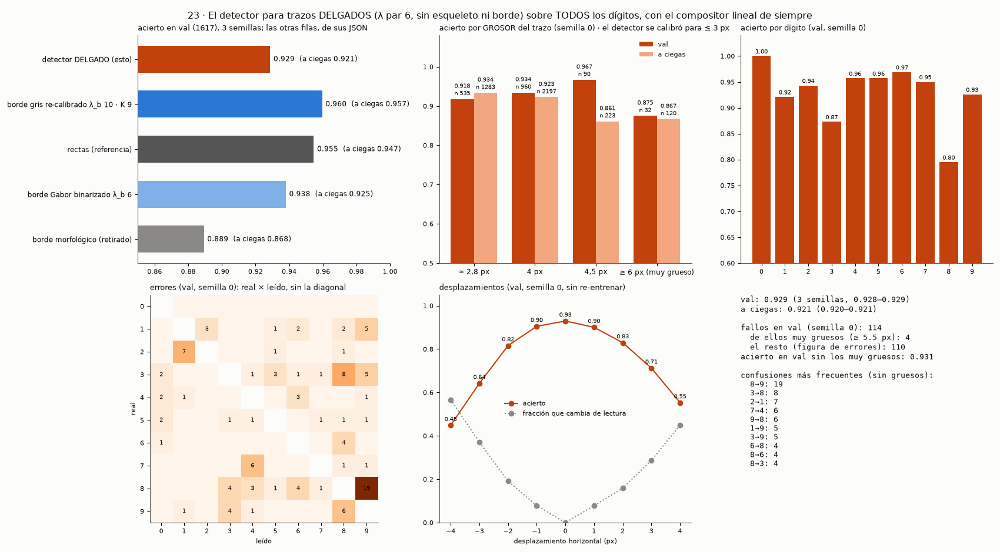
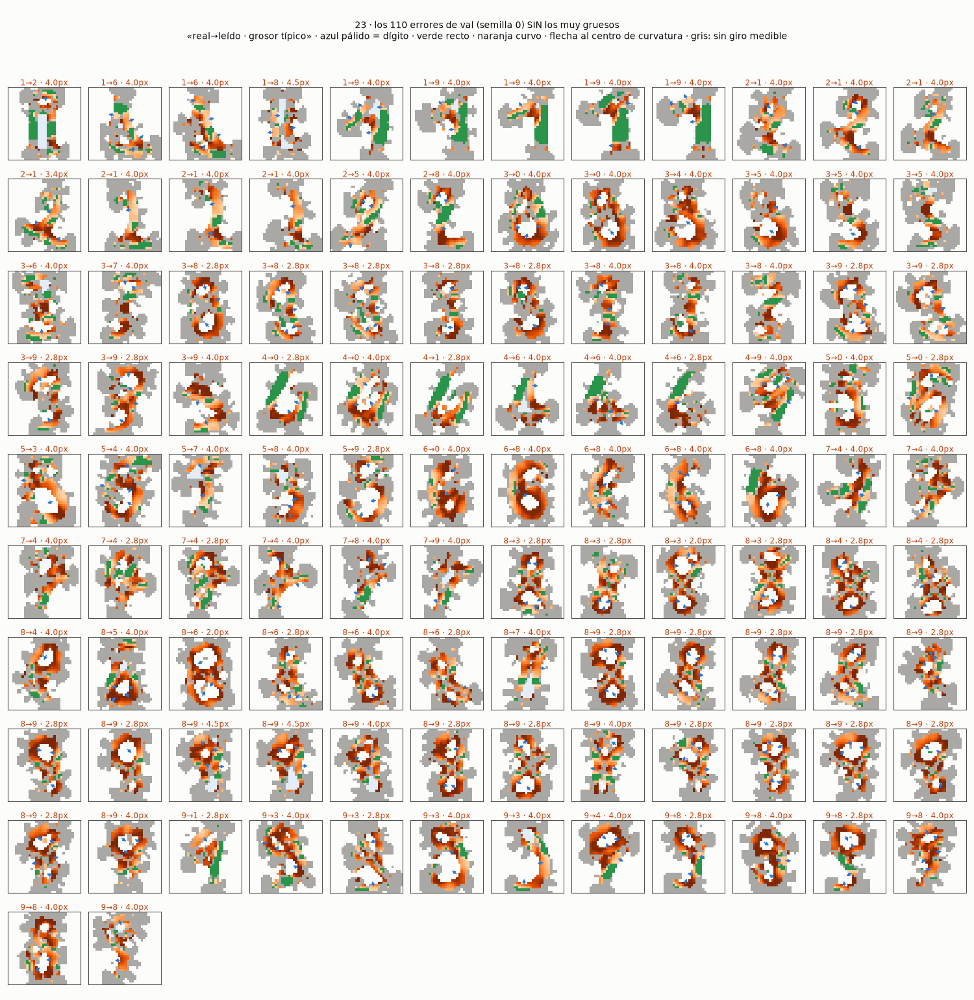
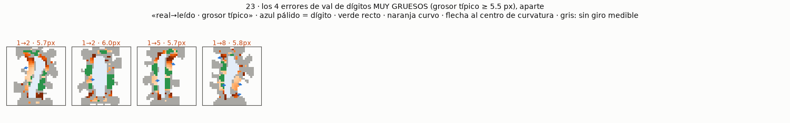

- **Val 0,929 · a ciegas 0,921** (3 semillas). Por debajo del borde gris re-calibrado (0,960 / 0,957) y por encima del
  borde morfológico (0,889).
- **Por grosor** (semilla 0, val · a ciegas): ≈ 2,8 px 0,918 · 0,934 — 4 px 0,934 · 0,923 — 4,5 px 0,967 · 0,861 —
  muy gruesos 0,875 · 0,867. **Los finos no salen mejor que los de 4 px**: el límite no es sólo el grosor.
- **114 errores en val** (semilla 0): 4 de muy gruesos (los cuatro, unos 1 casi bloque), **110 en la figura de errores**.
  Sin los muy gruesos, 0,931. Los más frecuentes: **8→9 (19)**, 3→8 (8), 2→1 (7), 7→4 (6), 9→8 (6).
- Por dígito: el **8** (0,80) y el **3** (0,87) son los peores; el 0, perfecto.
- **Desplazamientos** (horizontal): ±1 px 0,90 · ±2 px 0,82–0,83; cambia el 8 % de las lecturas con 1 px.
- **Predicción**: acerté el rango (0,92–0,95) y que no superaría al borde gris; **fallé en que los finos irían mejor**.
- Lo que se ve en los errores (mirado, no medido): alrededor de los trazos de 4 px el detector deja una **banda ancha
  sin giro medible** (gris) y mucho naranja disperso: con TAU 0,3 y λ 6, la energía del Gabor se extiende más allá del
  trazo.

⚠ No pasado por el `verificador`; los números salen del JSON de esta corrida.
