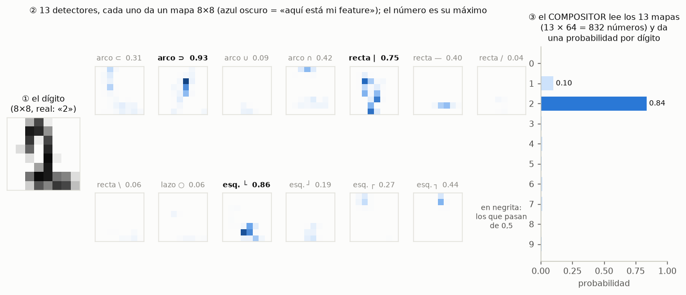
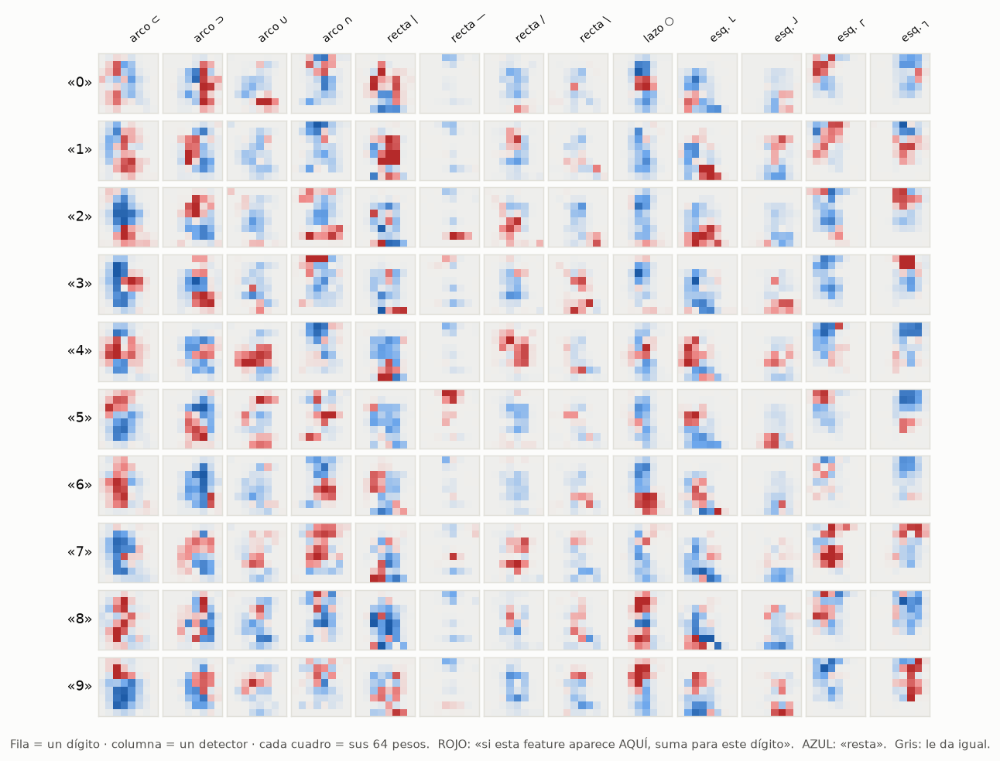
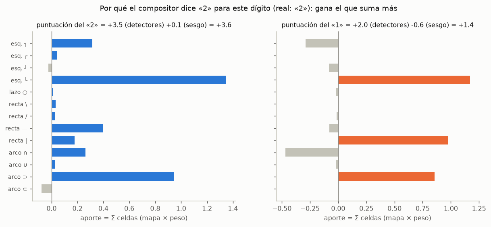
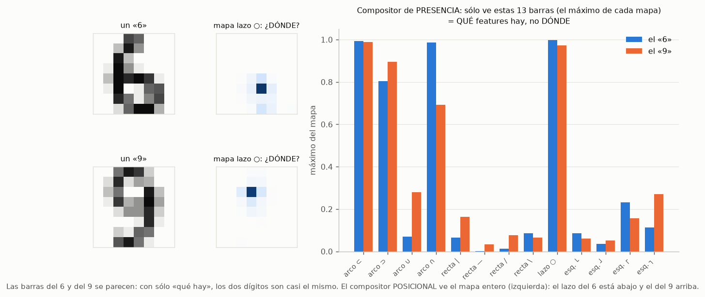
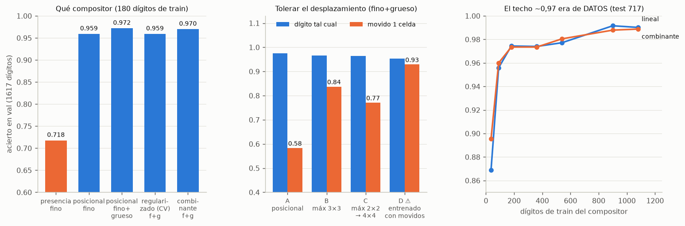
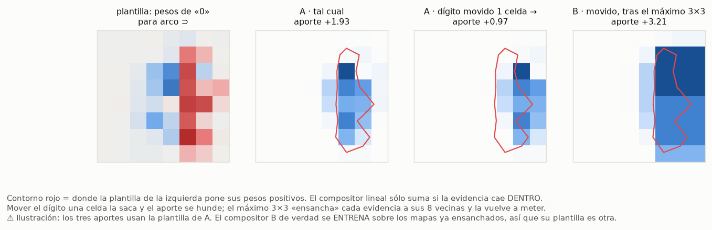

# Los compositores: qué son y cómo funcionan

Pedido por el dueño el 2026-10-08: *«En los últimos experimentos hemos empleado compositores. Necesito que me expliques
cómo funcionan, si es posible con imágenes.»*

Esto es una **explicación**, no un experimento: no cambia ningún veredicto. Las figuras las dibuja
[`figuras.py`](figuras.py) con los detectores reales de `feat-ind` (corrida 2) y un compositor entrenado exactamente
como el suyo. Ese compositor reproduce el acierto publicado: **0,9598** en val, el mismo que `compositores.json` de
`feat-ind` para la semilla 1 (comprobado al generar las figuras, 2026-10-08). Las cifras de resultados se leen de los
JSON ya commiteados de cada experimento; ninguna se ha recalculado para este documento.

## 1. La idea en una frase

El sistema de `feat-ind`, `feat-ind32`, `feat-bor` y `feat-1lado` tiene **dos pisos**:

1. **Detectores**: 13 redes pequeñas, cada una entrenada **sólo con dibujos sintéticos** para reconocer **una**
   forma (un arco ⊂, una recta |, un lazo ○, una esquina └…). Cada una mira el dígito y devuelve un **mapa 8×8** que
   dice *dónde* ve su forma. Nunca han visto un dígito ni una etiqueta.
2. **Compositor**: lo único que se entrena **con dígitos etiquetados**. Recibe los 13 mapas y decide qué dígito es.

O sea: los detectores dicen **qué piezas hay y dónde**; el compositor **las combina** para dar un dígito. De ahí el
nombre: *compone* las piezas.



En la figura, un «2» real. Se encienden (negrita, máximo ≥ 0,5) el **arco ⊃** de la panza, la **recta |** y la
**esquina └** de abajo. El compositor lee los 13 mapas y da 0,84 al «2» y 0,10 al «1».

## 2. Por dentro: el compositor posicional es una suma ponderada

El compositor de casi todos los experimentos es **lineal** (una regresión logística: `Linear(832 → 10)` y un
softmax). Funciona así:

- Los 13 mapas de 8×8 se ponen en fila: **13 × 64 = 832 números**.
- Para cada dígito `c` (0…9) tiene **832 pesos**, uno por celda de cada mapa, y un sesgo.
- La **puntuación** del dígito `c` es: para cada detector y cada celda, *valor del mapa × peso*, todo sumado, más
  el sesgo.
- El softmax convierte las 10 puntuaciones en probabilidades; **gana la que más suma**.

Esos pesos se aprenden con los 180 dígitos de train (Adam, 300 épocas, L2 0,001), y se pueden **dibujar**: los
832 pesos de cada dígito son 13 cuadros de 8×8. Es la mejor forma de entender qué ha aprendido:



Cada fila es una **plantilla**: *«para que esto sea un 6, quiero ver un lazo ○ ABAJO (rojo), y no lo quiero arriba
(azul)»*. Compara las filas «6» y «9» en la columna **lazo ○**: el rojo del 6 está en la mitad de abajo y el del 9
en la de arriba. Es exactamente lo que distingue a esos dos dígitos.

Y así se ve la suma para el «2» de la figura 1, detector a detector:



La esquina └ y el arco ⊃ son los que más suman al «2». Al «1» le suman la recta |, la esquina └ y el arco ⊃, pero el
arco ∩ y la esquina ┐ le restan, y su sesgo es negativo: 1,4 contra 3,6. **No hay reglas escritas a mano**: todo
sale de los pesos aprendidos con 180 dígitos.

## 3. Presencia contra posicional: ¿basta con saber QUÉ hay?

La primera pregunta de `feat-ind` fue si hacía falta el *dónde*. Hay dos compositores:

| compositor | qué recibe | entradas | contesta |
|---|---|---:|---|
| **de presencia** | el **máximo** de cada mapa (un número por detector) | 13 | ¿QUÉ formas hay? |
| **posicional** | los mapas **enteros** | 832 | …¿y DÓNDE? |



Un «6» y un «9» elegidos porque sus 13 barras se parecen mucho: los dos tienen arcos y un lazo. Para el compositor de
presencia, que sólo ve las barras, son casi el mismo dígito. El posicional ve el mapa del lazo: abajo en el 6, arriba
en el 9.

**Medido** (`feat-ind`, `resultados/compositores.json`, 180 de train, 1617 de val, 3 semillas): presencia
**0,718**, posicional **0,959**. La posición aporta **+0,24**.

## 4. Las variantes que se probaron, y qué cambia cada una

Todas reciben los mismos mapas de los detectores; lo que cambia es **cómo los lee** el compositor.

| variante | qué hace | dónde | resultado (medido) |
|---|---|---|---|
| **presencia** | lineal sobre el máximo de cada mapa | `feat-ind` corrida 2 | 0,718 |
| **posicional** | lineal sobre los mapas enteros. **El de siempre** | `feat-ind` corrida 2 | 0,959 (fino) · **0,972** (fino+grueso, 26 mapas) |
| **regularizado** | el posicional con L2 y resolución (8×8 o 4×4) elegidos por validación cruzada | `feat-ind` corrida 9 | 0,959 con fino+grueso: **más regularizar es peor** |
| **combinante** | una convolución 3×3 sobre los mapas apilados (13 → 16 canales) + ReLU, y después el lineal. Puede aprender «Y» y «pero no» entre detectores vecinos, que un lineal no puede | `feat-ind` corrida 10 | 0,970: **no supera al lineal** |
| **B · máximo 3×3** | antes del lineal, cada celda toma el máximo de sus 8 vecinas: una evidencia vale también una celda al lado | `feat-ind` corrida 13 | con el dígito movido 1 celda: **0,58 → 0,84** |
| **C · máximo 2×2 → 4×4** | reduce cada mapa a 4×4 por máximo: posición más gruesa | `feat-ind` corrida 13 | movido: 0,77 |
| **D · entrenado con movidos** | el posicional, entrenado con los 180 dígitos y sus 8 desplazamientos de 1 celda | `feat-ind` corrida 13 | movido: 0,93, pero **lo ha visto**: es invariancia aprendida, no generalización |
| **entrenado con desplazamientos en píxeles** | el posicional, entrenado con la **imagen** movida 0–2 px (que vuelve a pasar por los detectores). Es el **elegido** hoy | `feat-1lado` (C2) y el boceto del borde de un lado | tinta: 0,949 → **0,959** |
| **por lado** | un compositor por cada uno de los 8 bordes de un lado, o con 1, 2 … 8 lados | `feat-1lado`, `nn/lados.py` | añadir lados siempre suma; 8 lados = 0,929, por debajo de la tinta |
| **compositor de compositores** | un compositor por vista y otro encima que combina sus salidas | boceto del borde de un lado, tercera parte | 0,964 contra 0,973 del que ve todo junto; aguanta algo mejor el engrosado |



*(Paneles, de izquierda a derecha: `compositores.json`, `compositor-comb.json` y `compositor-reg.json`;
`desplazamiento.json`; `curva.json`. Todos de `feat-ind/resultados/`.)*

## 5. Su punto débil: el desplazamiento, y por qué el máximo 3×3 lo arregla

El posicional ata cada evidencia a **su celda**: el peso que dice «quiero un arco ⊃ aquí» sólo cobra si el arco cae
justo ahí. Si el dígito se mueve una celda (4 píxeles del original), la evidencia sale de la plantilla y la suma se
hunde, aunque los detectores lo sigan viendo todo (son convolucionales: si se mueve el dígito, su mapa se mueve con
él).



Un «0» y su detector de arco ⊃. El contorno rojo es donde la plantilla del «0» pone sus pesos positivos. Tal cual,
el arco cae dentro (aporta +1,9). Movido una celda, la mitad queda fuera (+1,0). Con el máximo 3×3 cada evidencia se
ensancha a sus vecinas y vuelve a caer dentro.

⚠ **La figura es una ilustración**: los tres aportes usan la plantilla del compositor A. El compositor B de verdad se
**entrena** sobre los mapas ya ensanchados, así que su plantilla es otra. Lo medido es el panel central de la figura 6:
**0,58 → 0,84** con el dígito movido, y **−0,007** con el dígito tal cual.

**El precio** (medido en la corrida 13): el máximo 3×3 empeora el **engrosado** (0,755 → 0,659). Engrosar un dígito ya
ensancha sus evidencias, y el máximo las vuelve a ensanchar. Tolerar posición y tolerar grosor tiran en direcciones
opuestas con este compositor.

Por eso en `feat-1lado` se eligió otra vía: no tocar los mapas, sino **entrenar el compositor con la imagen movida
0–2 píxeles**. Cuanto más lejos se entrena, más lejos aguanta (curva del dueño: con 0–4 px no pierde nada sin mover,
0,960, y a 4 px acierta 0,84 contra 0,63 del compositor sin desplazar). La figura está en
`feat-1lado/resultados/g3-curva-gradual.png`.

## 6. Lo que se aprendió de los compositores (lo medido)

1. **El *dónde* importa**: posicional 0,959 contra presencia 0,718.
2. **Un lineal basta.** Ni regularizar más (corrida 9) ni combinar detectores con una convolución (corrida 10)
   superan al lineal de siempre. Con 180 dígitos, su acierto de 1,000 en train era **sobreajuste benigno**.
3. **El techo de ~0,97 era de datos del compositor, no de su forma** (corrida 11): con más dígitos de train el mismo
   lineal llega a **0,992** (900 dígitos, test de 717). El combinante sólo ayuda con muy pocos (36 dígitos: +0,026).
4. **Juntar bancos de detectores sólo ayuda si llevan información distinta**: fino + grueso (26 mapas) da 0,972 contra
   0,959 y 0,957 por separado. Añadir los obtenidos de dígitos sin etiquetas (`dig`, `cae3`, `cae5`) no suma con el
   posicional; con el máximo 3×3 el banco de 65 sí pasa por delante (0,971 contra 0,967).
5. **El punto débil es el desplazamiento**, y es del compositor, no de los detectores. Se arregla con el máximo 3×3
   (pagando en grosor) o entrenándolo con la imagen movida, que es lo vigente.
6. ⚠ **Un compositor sólo puede componer lo que los detectores le dan.** La auditoría de `feat-1lado` (2026-10-08)
   midió que **ningún detector de recta ve el 52 %** de las rectas reales de los dígitos. Los aciertos del compositor
   salen de lo que *sí* se enciende, no de una descripción completa del trazo. Ése es el pendiente para mañana de
   `feat-1lado`, y es de los detectores, no del compositor.

## 7. Dónde está el código de cada uno

| qué | experimento (`id`) | fichero |
|---|---|---|
| presencia y posicional | `feat-ind` | `nn/compositor.py` |
| regularizado | `feat-ind` | `nn/compositor_reg.py` |
| combinante | `feat-ind` | `nn/compositor_comb.py` |
| A/B/C/D frente al desplazamiento | `feat-ind` | `nn/desplazamiento.py` |
| curva por nº de dígitos de train | `feat-ind` | `nn/curva.py` |
| entrenado con desplazamientos, curva del dueño | `feat-1lado` | `nn/componer.py` |
| por lado | `feat-1lado` | `nn/lados.py` |
| de compositores, max5, px≤k | boceto `docs/bocetos/2026-10-07-borde-de-un-lado/` | `prueba_vistas.py`, `prueba_compositores.py` |

Cada experimento tiene su propia copia del compositor (Regla 0 del repo): los hiperparámetros coinciden porque se
copiaron a propósito para que los números sean comparables, no porque se compartan.

## Cómo regenerar las figuras

```bash
python3 -m venv /tmp/vizenv && /tmp/vizenv/bin/pip install matplotlib
echo ~/src/experimentos-cnn/.venv/lib/python3.12/site-packages > /tmp/vizenv/lib/python3.12/site-packages/torchenv.pth
/tmp/vizenv/bin/python docs/compositores/figuras.py      # ~25 s en CPU → docs/compositores/img/*.png
```

Necesita el dataset `uci-optdigits-8px-r20261002` en `foveal-vision-data` (lo resuelve `feat-ind/nn/datos.py`).
